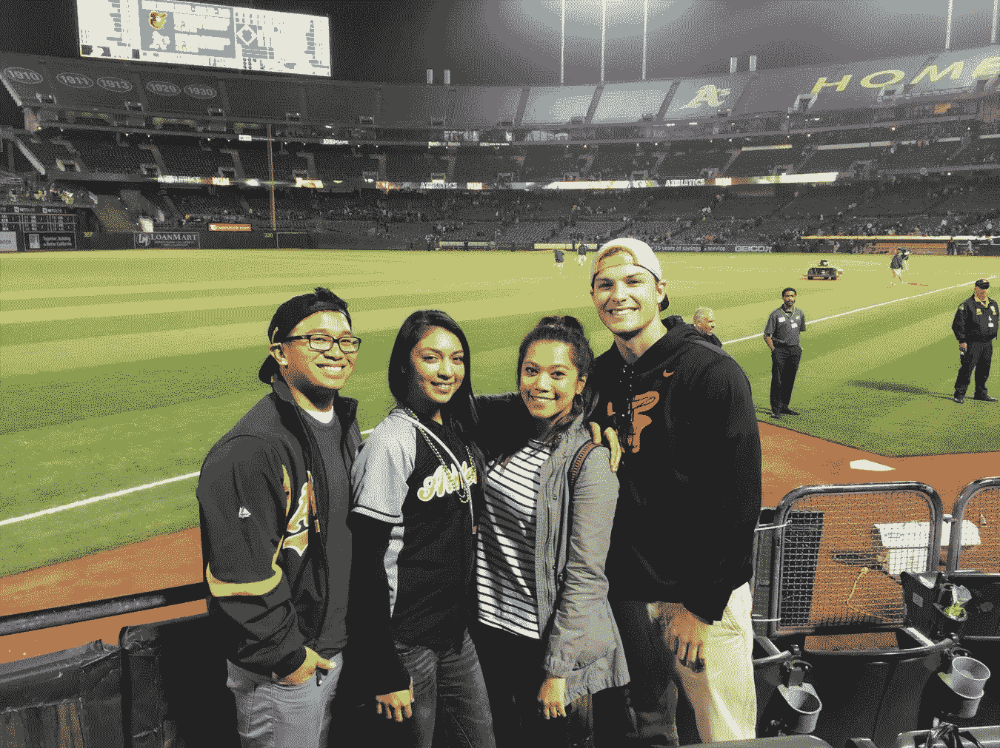

# 我牺牲金钱去任何我想去的地方工作的 11 个理由

> 原文：<https://medium.com/swlh/11-reasons-i-sacrifice-money-to-work-wherever-i-want-5157034abe3f>

Image via [Pexels](https://www.pexels.com/photo/adult-book-business-cactus-297755/)

> "一个好的旅行者没有固定的计划，也不急于到达目的地."
> 
> -老子

这不是另一个“辞掉你的工作，做一个数字流浪者！”文章。这是一篇关于我个人选择的文章，以及我做出这个选择的一些原因。

> 两年前，我成了一名数字流浪者。一年前，我驱车 4000 英里穿越美国，在旧金山住了几个月。我秋天开车回来的。

这些天我在计划我的下一个目的地。会是秘鲁吗？阿根廷？泰国？

> 无论如何，你开始明白我当初选择这种生活方式的原因了。是啊，我挣的钱不多。
> 
> 事实上，在 2018 年之前，我的年收入从未超过 3 万美元(自由职业者的生活)，但当你摆脱了物理位置时，它为你的世界打开了无数的可能性。

以下是我选择数字游牧生活方式的原因，尽管我没有赚很多钱。

# 1.我的收入远远不止这些

> 在《每周 4 小时工作制》一书中，Tim Ferriss 说，金钱的实际价值会成倍增加，这取决于你在生活中控制的 W 的数量:你做什么，什么时候做，在哪里做，和谁一起做。

当你是一个普通的数字流浪者时，你至少掌握了这四个标准中的两个，但是当你是一个优秀的数字流浪者时，你掌握了所有四个标准。

在旧金山，我能够控制这四栋房子中的三栋，那里的房地产价格是世界上最高的。

> 我控制着和谁在一起(我最好的朋友)，在哪里工作(在他的房子里，不收租金)，以及何时工作。

这让我在 7 月、8 月和 9 月期间每周靠 600 美元生活。

> 现在，我是这里难以置信的慷慨的受益者，但是原则保持不变。如果我不能控制这三个变量中的两个，我就不会去旧金山。因为我可以，我做到了。

想想吧。如果你在纽约工作，你必须支付那里的房租。你的工资很高，但是在它到达你手中之前，房租价格几乎拿走了一半。

想象一下，在泰国的公寓里为纽约的办公室远程工作。

现在你在想。

# 2.反正钱对我来说不是一切

> 我的许多朋友从事销售工作，住在巴尔的摩港口附近的市中心，通常在周五和周六会去费尔斯角，过着相当奢华的生活。

太酷了，我为他们高兴。

我认识他们。驱使他们做出决定的主要是金钱。你能责怪他们吗？我们有账单要付！

我知道大约 50%的等式是支付账单，但他们的灵魂中也有很大一部分想要尽可能多的钱。

> 见鬼，我也想要钱，但这不是我的终极目标。我的最终目标是去泰国——我不在乎是年薪 300 美元还是 30 万美元。

这就是为什么我选择这种生活方式，而不是巴尔的摩市中心的生活方式。

# 3.冒险是我的货币

> “不要试图让生活完美，给自己自由，让它成为一次冒险，永远向上。”
> 
> 德鲁·休斯顿

你不可能在办公桌上有那么多的冒险经历。

# 4.因为义务不存在

我不知道五个月后我会在哪里。见鬼，我甚至不知道明天我会在哪里。

> 我生命中的最后一年都在我长大的家里工作。我从没想过我会再回来，但在这里，我和妈妈在一起的时间比我真正的朋友还多。

如果我有一份传统的工作，我会在一个有公寓和义务的城市。

因为我没有走那条路，对我来说已经没有义务了。

我完全可以自由去秘鲁，阿根廷，菲律宾，法国，或者任何地方(只要那个地方有 wi-fi)。

# 5.我开始享受和家人在一起的额外时间

> 我是一个 24 岁的数字流浪者，在过去的三年里，我花了大量的时间远离家乡。相信我，现在能和家人在一起真好。

许多人大学毕业后直接回家生活。他们从未离开。

我做到了。我一有机会就离开了。在周游全国之前，我在奥兰多住了一年。

> 因为我花了很多时间离开，现在和他们在一起感觉很好。我可以来去自由。我知道我姐姐可能想和我们呆一段时间，但是她不能，因为她在南方有工作。

因为我选择了我可以工作的地方，我可以花时间和我想念的家人在一起。这是一种不可思议的感觉。

# 6.我可以和我的朋友重新联系

> 三年前，当我从迪士尼为期 8 个月的实习中毕业时，我以为我再也见不到我最好的朋友了。

令我惊讶的是，从那以后我已经多次见到他们了。

太不真实了。

> 你读过的每本书和交谈过的每个人都说友谊会随着你的成长而瓦解，但我的友谊却欣欣向荣！

我喜欢这个隐喻的乌托邦，似乎只有我知道它的位置。

人们说大学毕业后的生活糟透了，但对我来说并非如此。我最好的朋友一直是最好的朋友，语言无法描述这是多么大的祝福。

# 7.我真的很喜欢独处

> “写作是你一个人做的事情。这是一个为内向的人准备的职业，他们想给你讲故事，但不想在讲的时候和你有眼神接触。”
> 
> 约翰·格林

我是你能想到的最内向的人。我喜欢独处。我不喜欢办公室的喧闹，也无法在那种环境中茁壮成长。

> 一天中离开每个人 9 个多小时是如此的平静。它实际上让我期待当我的兄弟和爸爸回家的时候。我已经做好了社交的准备，不会因为和那些我可能讨厌也可能不讨厌的人在一起呆了 8 个多小时而疲惫不堪。

# 8.因为我可以随心所欲地工作

> 老实说，我每天都戴着笨重的耳机听 ASMR 的视频(当然，声音很轻)。

除了 ASMR 是有史以来发明的最伟大的东西之外，能够做到这一点而不被经理质疑也是非常棒的。

对我来说，这本身就值 10，000 美元的减薪，而且没有健康福利。

# 9.因为我喜欢鼓舞人心

> “如果你的行动激励其他人多做梦、多学习、多做事、多成才，你就是一个领导者。”
> 
> 约翰·昆西·亚当斯

我并不是说我喜欢冒险，凯特，或者别的什么，但是已经有很多人联系我，说他们也想过我的生活方式。

我不是第一个这样做的人。我向别人学习，也受到别人的启发。我写这个的原因是因为我知道有更多的人只是讨厌他们现在的生活，想要更多的冒险。

我在这里让他们知道，如果他们真的想要，他们可以得到它。

坦白地说，这让人上瘾。

# 10.因为我真的很喜欢周五中午下班

这个不言自明。我是说，拜托。

# 11.因为我不会真的活着

> “人类存在的奥秘不在于仅仅活着，而在于找到活着的目的。”
> 
> 陀思妥耶夫斯基

我记得两年前，我在 Panera Bread 工作，时薪 8.5 美元。这是我毕业后的三个月。

> 我知道如果我退出，我自己就没有有保证的收入来源。我知道我有大约 800 美元的存款，只够支付下个月的学生贷款。

大家都说我知道这将是一个糟糕的财务决策。

但是我也知道如果我继续做我讨厌的事情，我会背叛我自己和我的目标。

> 这意味着牺牲真正的我——那个拼命想摆脱我为自己创造的生活的人。

对我来说，这比你可能遇到的任何不利的财务状况都要糟糕。

幸运的是，我确实决定坚持到底。

我意识到忠于自己比追求一时的经济利益更重要。

**说到底，这就是我牺牲金钱去任何我想去的地方工作的真正原因。**

> 想在媒体上建立自己的观众群吗？我有一个名为“**你的第一批 1000 名追随者**”的 5 天免费电子邮件课程，它将教你我是如何做到的！[在这里注册](https://app.convertkit.com/landing_pages/290945)。

## 这篇文章发表在 [The Startup](https://medium.com/swlh) 上，这是 Medium 最大的创业刊物，有 343，876 人关注。

## 在这里订阅接收[我们的头条新闻](http://growthsupply.com/the-startup-newsletter/)。

