# 11 个心理学支持的 SaaS 定价技巧

> 原文：<https://medium.com/swlh/11-saas-pricing-hacks-backed-by-psychology-b0789c333944>

有没有想过一个小小的调整是否能让你的 SaaS 初创公司增长 10 倍？这里有 11 种方法可以让你达到目的。

# 使用整数→整数定价偏好

使用整数，如果可能的话，填入数字 9。

**为什么？** [证据](http://coglode.com/gems/round-pricing-preference)最近建立了一个案例，证明人们更愿意花更多的钱在四舍五入的美元价格上，这与“99c”商店的直觉相反。还有关于数字 9 的[魔力的传言。](https://en.wikipedia.org/wiki/Psychological_pricing)

**举例** : [Cloud9](https://c9.io/web/site/pricing) ，[亚硝酸](https://www.nitrous.io/pricing/)，[对讲机](https://www.intercom.io/pricing)。

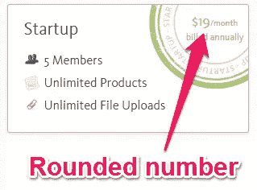

# 使用分层定价→锚定偏差

把你最贵的计划放在左边，最便宜的放在右边。

**为什么？**习惯从左向右阅读的人会看到他们相对于你最大计划的价值。最贵的产品将起到价格锚的作用，这将影响你的客户对你其他计划的决定。

**举例** : [开花](https://www.blossom.co/pricing)，[助侦察](https://www.helpscout.net/pricing/)，[裸量](https://baremetrics.com/#pricing)。

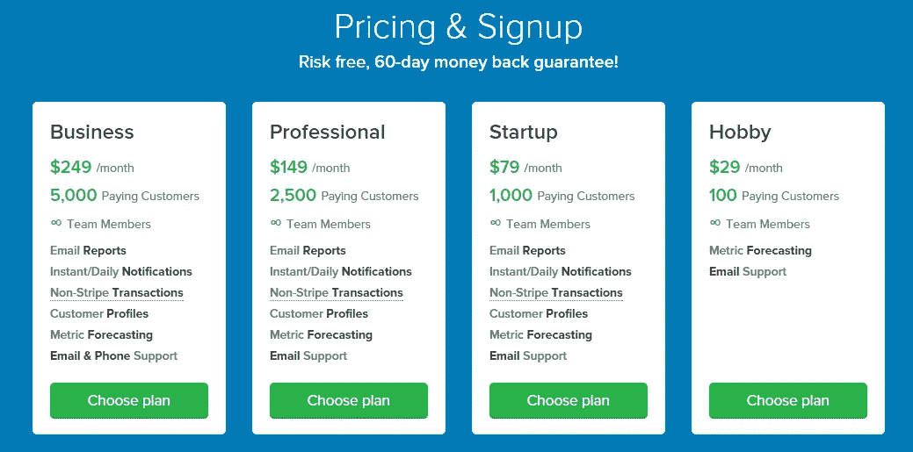

# 限制选择数量→选择悖论

限制您的客户可以选择的订阅数量及其差异。

**为什么？不得不选择的人可以毫不夸张地[瘫痪。通过采取最低限度的定价方法来消除摩擦。](http://coglode.com/gems/choice-paradox)**

**举例** : [缓冲](https://buffer.com/awesome)，[帮助侦察](https://www.helpscout.net/pricing/)，[坡口](https://www.groovehq.com/pricing)。

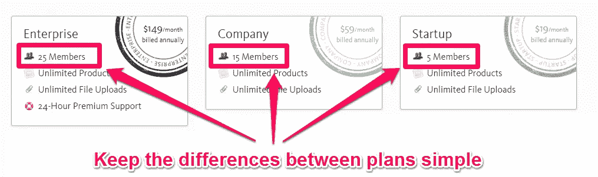

# 将您的最佳计划放在中间→舞台中央效果

把你最好的计划放在中间。

**为什么？**人们[倾向于在一堆同类产品中挑选](http://coglode.com/gems/centre-stage-effect)的产品。在您的定价页面中间，放置您希望执行得最好并且您认为您的客户最喜欢的计划。

**举例** : [Kissmetrics](https://www.kissmetrics.com/pricing) ， [Baremetrics](https://baremetrics.com/#pricing) ， [Briefmetrics](https://briefmetrics.com/pricing) 。

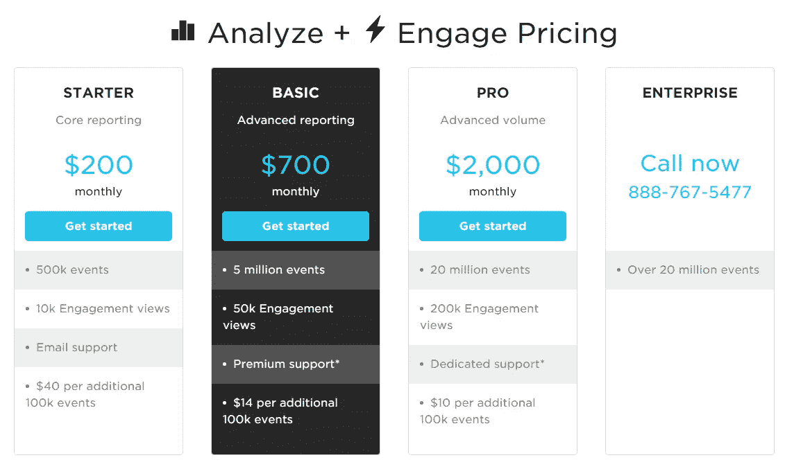

# 通过稀缺→稀缺效应灌输紧迫感

提供限时优惠，帮助转变观望的客户。

**为什么？**简单来说，“人类对稀缺的东西赋予更高的价值，对丰富的东西赋予更低的价值”。你的客户通过以折扣价购买你的产品而赢得了胜利。你赢得了那些以微弱优势选择竞争对手的客户。

**举例**:早期用户更便宜的计划，年度计划一次性折扣，限时优惠。

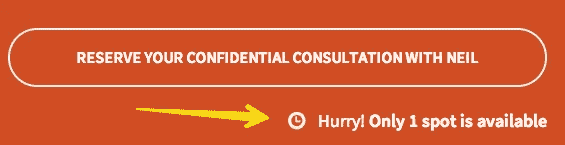

# 在乎多过其余→贵族边缘效应

加入你的社区，成为把你的顾客从其他组织的贪婪手中拯救出来的白衣骑士。

**为什么？**要做到这一点，你可以在你的行业中发展社区(例如，管理一个媒体出版物，经营一个论坛，等等)，写博客介绍行业的现状和未来发展方向，等等。

**例子** : [成长黑客](http://growthhackers.com/)，[Inbound.org](http://inbound.org/)，[媒体刊物](/help-center/publications-d23372baede0)。

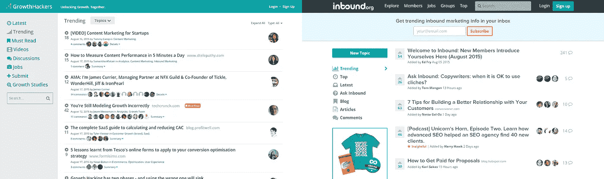

# 提前提供小额折扣→双曲线折扣

从一开始就提供小折扣。

**为什么？比起长期的更大收益，人们更倾向于选择前期的小收益(并更看重它)。**

**示例**:年度计划的预付折扣，您的“最佳”计划的 50%折扣。

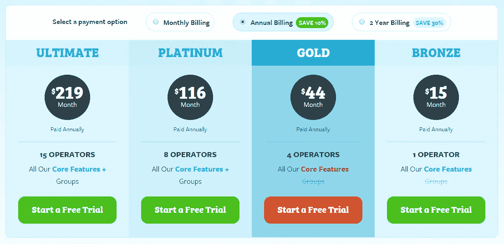

# 结账尽量简单→目标渐变效果

通过在表格中预填客户已经提供的信息，最大限度地减少购买产品的工作量。

**为什么？**有很多因素会让用户远离你的付款方式:

*   需要刷新页面
*   当帐单和送货地址相同时，必须重复输入
*   重新输入您之前在页面上提供的电子邮件地址

**范例** : [结账页面最佳实践](https://copyhackers.com/optimize-your-business-online-training/best-checkout-pages/)。

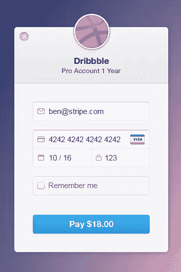

# 与众不同→冯·雷斯托夫效应

创造独一无二的产品，拓展你的领域。

**为什么？** [一个“像拇指一样突出”的项目比其他项目更容易被记住](http://coglode.com/gems/von-restorff-effect)。

**举例** : [懈怠](https://slack.com/)，[苹果](http://www.apple.com/)，[特斯拉](http://www.teslamotors.com/)。

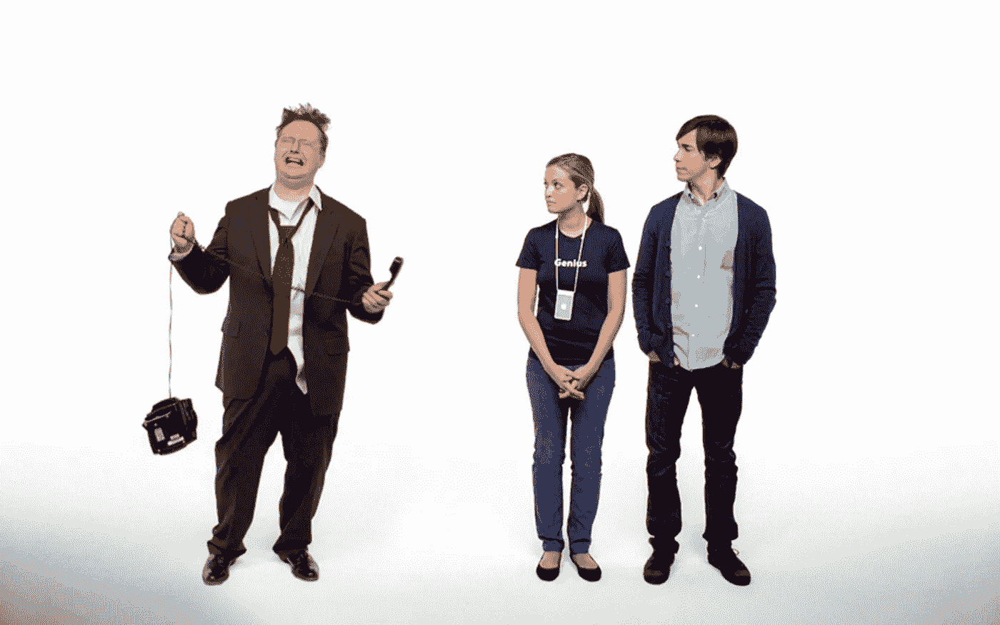

# 使用社会证明→社会默认偏差

在你的登陆和/或定价页面上突出显示使用你的产品的公司、案例研究和推荐。

**为什么？**如果令人惊叹的公司正在使用你的产品，[人们会本能地](http://coglode.com/gems/social-default-bias)认为你的产品在其中发挥了作用，并希望为自己获得利益。

**举例** : [开花客户](https://www.blossom.co/customers)，[对讲客户](https://www.intercom.io/customers)， [Salesforce 客户](http://www.salesforce.com/au/customers/)。

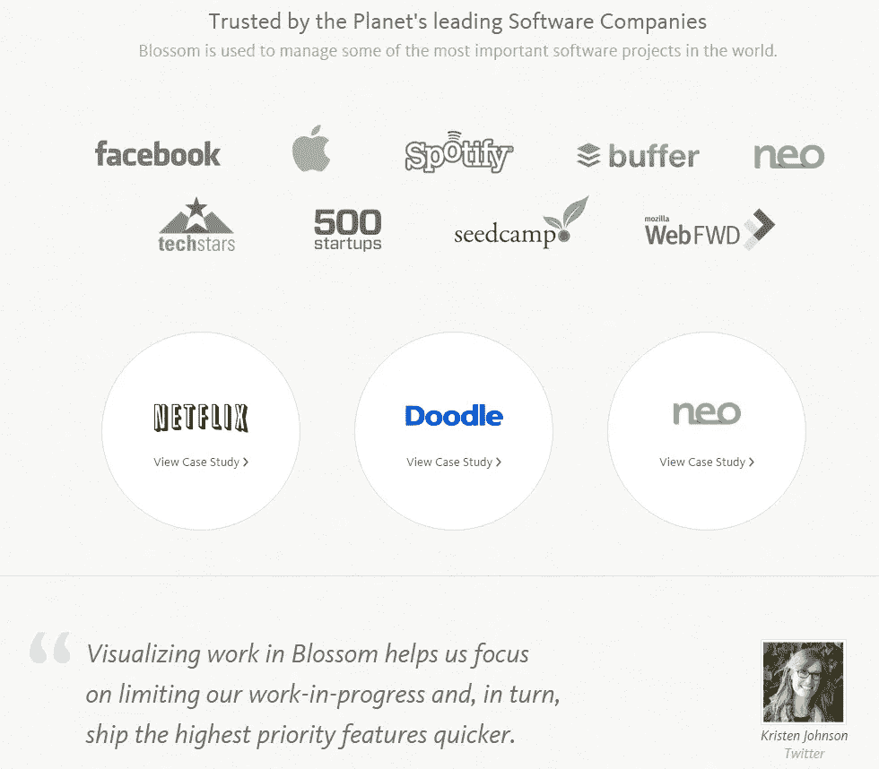

# 使用简单的语言→说话-轻松效果

用简单易懂的单词写你的文章，大声读出来，不会在句子中间难倒读者。

**为什么？我们对我们已经熟悉的事物有一种天生的渴望。这包括单词。**

**举例** : [Slack](https://slack.com/) ， [Mailchimp](http://mailchimp.com/about/style-guide/) ， [Snapchat](https://www.snapchat.com/) 。

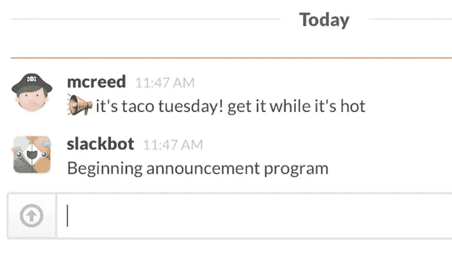

这不是火箭科学，但它确实导致了火箭飞船的发展。试试这些 SaaS 创业定价策略，让我们知道什么有效，什么可以改进！

> 如果你喜欢这个帖子，**点击这里** 把它 [**推给**！](https://twitter.com/home?status=11%20SaaS%20Pricing%20Hacks%20backed%20by%20Psychology%20via%20%40gclaps%20http%3A//bit.ly/saas-price-hacks)

*发表于* **创业、旅游癖和生活黑客**

-