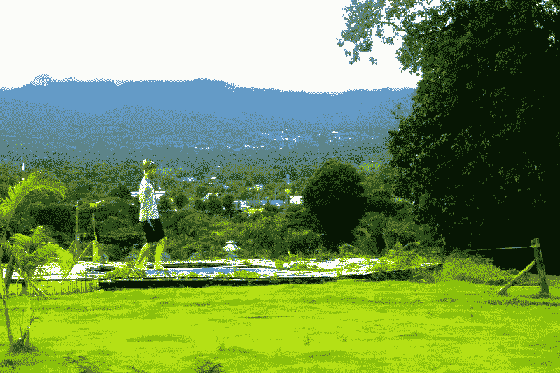

# 11 共享经济资源，让数字游牧生活变得负担得起

> 原文：<https://medium.com/swlh/11-sharing-economy-resources-for-making-digital-nomad-life-affordable-7d981a460a0a>

*本帖原载于* [*CloudPeeps 博客*](http://blog.cloudpeeps.com/how-the-sharing-economy-makes-digital-nomad-life-affordable-with-11-resources/) *。*

自由职业的好处之一就是你可以在任何时间任何地点工作。在最能激发你创造力的地方，你在最有效率的时间工作。借助当今的技术，越来越多的人过着数字游牧生活，一边做着有意义的工作，一边周游世界。

我们受到了 CloudPeeps 自由职业者社区中许多采用这种生活方式的成员的启发。这些人已经掌握了游牧生活方式，在合理的范围内自由生活和旅行。他们知道所有的技巧和提示，工具和服务，让游牧风格为任何愿意尝试的人服务。

来自纽约的营销和社区战略家 Briana Green 就是这些流浪者中的一员，她目前生活在风吹来的任何地方。我们和布里亚娜坐在一起，了解她的游牧秘密和资源。

## 1)在开始游牧生活之前，你已经开始远程工作了吗？

当我辞去曼哈顿的全职工作去为[众包周](http://crowdsourcingweek.com/)工作时，我已经在纽约生活了七年，这是一家年轻的新加坡公司，它正在建立一个分布式团队，这意味着我们可以在任何地方远程工作。

## 2)决策过程是什么样的？

对我来说，这是一个权衡风险与回报的问题。我知道我想要什么:一个大的改变，一次国际冒险，一次职业挑战。

我也害怕失败。

如果需要的话，我有足够的积蓄来缓冲六个月，所以我告诉自己，如果在这段时间内事情没有解决，我可以回到纽约重新开始——但要有六个月的冒险、东南亚旅行和职业发展。对我来说，这是一个双赢的局面——足以迈出这一步——幸运的是，我再也不用回头看了。那是两年前的事了，从那以后我一直没有家，在过去的 24 个月里，我在 20 多个国家旅行和工作。

这也有助于我在做决定的过程中想到那些生活方式更激进或者比我进步更大的人。一个从阿拉斯加骑自行车到阿根廷的熟人。一个从布鲁克林搬到阿布扎比的老室友。如果我仔细想想，我知道有相当多的人过着与众不同的生活，并在非常规的机会中获得成功。如果他们能做到，我至少可以试试。

## 3)你是如何决定要去哪里的？每次冒险需要多少计划？

我很幸运，在众包周，我们的部分工作是每年在亚洲和欧洲组织为期一周的会议，这让我有机会每年在会议结束后探索和工作在这些地区。我用我的工作时间表作为我需要去哪里和什么时候的路标，然后计划在那附近旅行。

现在做计划比过去花的时间少。随着时间的推移，你会了解自己最喜欢的城市，并选择临时的家(对我来说——亚洲的曼谷、欧洲的布达佩斯、美国的新奥尔良)，有时我每次去都会在那里预订同一个房间。

有一个明确的学习曲线，比如知道什么时候最好使用 Airbnb(竞争激烈的大城市)与 Agoda(竞争激烈且 Airbnb 尚未普及的偏远地区)和当地平台(比如在柏林，当地“Craigslist”网站 WG-Gesucht.de 提供最好的交易)来寻找住处。

每一步都需要大量的计划和研究，尤其是如果你想经济高效地完成它的话。对于大多数人来说，这可能被认为是一个消极或乏味的方面，但我个人喜欢“研究和发现”部分，就像我喜欢旅行部分一样。

 [## 大胡子和短发穿着#气流，因为#波特兰。

### "大胡子和短发穿着#气流，因为#波特兰."

instagram.com](https://instagram.com/p/58G_uHBxDH/?taken-by=brianapudding) 

## 4)规划时你求助于哪些资源？

去年，我在北京住了一个月，这是一个我从未想过会去的地方，更不用说 2013 年了。这个机会是在浏览 TrustedHousesitter.com 的[上的列表时产生的，这是一个类似 Airbnb 的网站，人们可以用免费的宠物托管服务换取一个免费的住处。](http://www.trustedhousesitters.com/)

一个居住在中国的外籍家庭要去意大利度假，他们在北京需要一个住家保姆来照看他们的猫。我首先想到，我做不了北京，那太疯狂了。然后我想，为什么不呢？

这种经历太棒了。公寓配有一个可爱的办公环境，有猫在身边是一种享受，甚至一个来自纽约的朋友也和我一起呆了一段时间。我们看了长城，吃了美味的食物，和家乡朋友介绍给我们的外国人联系，甚至和我们在地铁上遇到的一个当地人一起逛了一天美术馆。

这只是一个例子，说明了共享经济平台如何结合远程工作的能力，实现一生一次的体验。这一切的花费还不到在纽约住上一个月的零头，也不到去中国真正度假的费用。

从经济和社会角度来看，其他提供了令人难以置信的机会的共享经济平台是 [BlablaCar](https://www.blablacar.com/) (从克拉科夫到布达佩斯的共享乘车花费了我€15 美元)[接力乘车](https://relayrides.com/)(在三藩市租一辆邻居的车一日游需要 66 美元)和 [Couchsurfing](https://www.couchsurfing.com/) ，这是一个连接你和世界各地思想开放的人的精彩社区。

## 5)有没有其他降低成本或提高旅行效率的方法？

我认为一个普遍的误解是旅行，尤其是长期旅行，是非常昂贵的。然而，事实上，作为一名数字流浪者，我每月的花费比作为纽约永久居民要少得多！

> “事实上，作为一名数字流浪者，我每月的花费比作为纽约永久居民要少得多！”

如果你像度假一样花钱，那么旅行当然会很贵。负担能力的公式是，像当地人一样过正常的日常生活，同时利用共享经济平台来促进住宿和交通等最大的支出。

对我来说，最令人震惊的发现之一是，在亚洲或欧洲这样的地区，由于现在有太多的廉价航空公司和公共汽车，流动性是多么便宜。我花了 50 美元订了从泰国曼谷到缅甸仰光的往返机票——比在纽约吃一顿晚餐还便宜。一辆从伦敦到格拉斯哥的大客车花费€9 英镑——还不到一顿午餐！

通过拥抱公共交通、共享经济平台和你拥有的资源(时间)而不是你没有的资源(金钱)，通常任何旅行都可以触手可及。“我不能做那样的事情”并不是排除这种可能性的有效借口。

## 6)您是如何在旅途中保持高效工作的？

坚持去城市——那里有更好的无线网络，更多的共同工作空间，总体的喧嚣让我有精力去工作，这是偏远的山区或岛屿环境所没有的。

制定常规——你的工作地点可能会经常改变，但你的工作常规却不必改变。每天早上开始工作前，设定一天的日程，并坚持下去。

**设定最后期限** —我在压力下工作得更好，所以我会给自己设定最后期限。如果你想去看浮动市场，你需要先完成 X，Y 和 Z。

**要灵活** —有时候你的日常工作已经过时了，你唯一需要工作的时间是在机场的几个小时，或者是在早上 5 点醒来工作的时候，wifi 连接仍然很强，还没有超载。当你离开电脑时，能够从这些(有时是尴尬的，不规则的)时间窗口中挤出生产力是享受生活的关键。

## 7)在一个不认识任何人的新地方，你是如何防止孤独的？

通常，人们做出的第一个假设是，移动肯定是孤独的，但事实上，由于我们生活在数字信息时代，进入一个看不见的城市并结识他人从未如此容易。无论您身在何处，与朋友的朋友、兴趣相投的人联系，或发现共同的职业联系比以往任何时候都更容易。

 [## 为明天#csweurope 激动。睡不着。吃了所有的零食。

### “为明天的#csweurope 而激动。睡不着。把零食都吃了。”

instagram.com](https://instagram.com/p/uHEGz1BxFq/) 

我总是首先查看我所在的城市是否举办了[创意早晨](http://creativemornings.com/)、 [Pecha Kucha](http://www.pechakucha.org/) 或任何其他全球聚会，并研究当地可供参观的共同工作空间，以及参与当地 Couchsurfing 社区举办的活动。

***编者按:****Check out*[*LiquidSpace*](https://liquidspace.com/)*在全球范围内按需预订共同工作空间！*

作为数字游牧者旅行的另一个优势是，你是带着目的旅行的:你不会像背包客一样漫无目的地游荡，你在那里有一份工作和一系列可能与一些当地人重叠的职业兴趣。这给了你一个借口，无论你在哪里，你都可以进入一个平行的职业社区——联系你的同事，安排会议或合作，或者建立一些关系网。

> “作为数字流浪者旅行的一个优势是，你的旅行是有目的的:你不会像背包客一样漫无目的地游荡，你会有一份工作和一系列可能与一些当地人重叠的职业兴趣。”

此外，数字游牧民正在成长为一个有凝聚力的国际群体，形成自己的社区、应用程序，并在世界各地举行聚会。[NomadList.com](https://nomadlist.com/)和[炸药圈](http://www.dynamitecircle.com/main/authorization/signIn?target=http%3A%2F%2Fwww.dynamitecircle.com%2F)就是两个这样的数字游牧社区，确保你无论去哪里都有一群朋友和专业关系可以利用。

## 8)对于正在考虑数字游牧生活方式的人来说，还有什么其他的建议或至理名言吗？

这并不适合所有人。这不是新的、普遍更好的生活和工作方式。但对于许多热爱旅行、渴望自由创造自己的道路、能够拥抱不确定性的人来说，这为你打开了整个世界。

如果这是你曾经认为你可能喜欢或者想要尝试的事情，你绝对应该去做。试用一个月，不用承诺一辈子。这就是这种生活方式的美妙之处——你可以随时调整旅行频率、长度、地理位置或四肢，以适应或重新适应你(去年我每 3-4 周换一次地方，今年每 3-4 个月换一次，明年……谁知道呢？).这是你自己的生活，随心所欲。

# 资源

这里有一个共享经济服务和工具的列表，可以帮助你在不破产的情况下实现向数字游牧的飞跃！

**住房和住宿**

1) [Airbnb](https://www.airbnb.com/)

2) [Agoda](http://www.agoda.com/)

3)[TrustedHousesitter.com](http://www.trustedhousesitters.com/)

4) [沙发冲浪](https://www.couchsurfing.com/)

**运输(本地)**

5) [BlablaCar](https://www.blablacar.com/)

6) [接力赛](https://relayrides.com/)

**工作区**

7) [液体空间](https://liquidspace.com/)

**联网**

8) [创意早晨](http://creativemornings.com/)

9) [Pecha Kucha](http://www.pechakucha.org/)

**知识共享资源**

10)[NomadList.com](https://nomadlist.com/)

11) [炸药圈](http://www.dynamitecircle.com/main/authorization/signIn?target=http%3A%2F%2Fwww.dynamitecircle.com%2F)

***准备好向数字游牧进军了吗？通过*** [***试驾自由职业者成为一个窥视者***](https://www.cloudpeeps.com/?utm_source=blog&utm_medium=blog%20post&utm_campaign=briana%20green%20post) ***！***

*发表于* **创业、旅游癖和生活黑客**

-