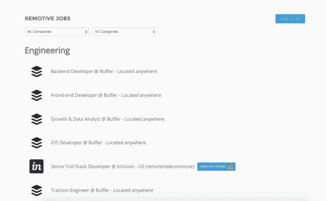

# 想加入创业公司？这 11 个网站将帮助你找到一份创业工作！

> 原文：<https://medium.com/swlh/11-sites-to-find-a-new-startup-remote-job-with-15fb66e0f3f0>

创业公司是我们父辈的乐队，几乎任何人都可以创业，但只有少数人有足够的天赋取得成功。一头扎进一个新领域也需要某种疯狂。这就是为什么对于一些人来说，加入一家相对成熟的初创公司更有吸引力，因为在那里可以获得固定的薪水。

加入创业公司也是在追求激情的同时获得一些不可思议的生活和专业技能的好方法。另外，你要么在一个不可思议的建筑里工作，要么穿着睡衣。但是在一个网站工作并不像听起来那么容易，这就是为什么我们决定列出一个寻找创业工作的最佳网站列表！也一定要看看[ListHunt.co](http://listhunt.co)并关注我们 [@ListHunt](https://twitter.com/ListHunt) ！

# [午餐套餐](http://lunchcruit.com/)

Lunchcruit 是一家了不起的公司提供的零承诺免费午餐。搜索 Lunchcruit，根据他们的接近程度、你想认识的人以及这些公司有多有趣来筛选午餐。

一旦你找到了一家让你感兴趣的公司，只要填写申请表就可以去吃午餐了！公司的人会很快回复你，安排和某人共进午餐！现在去吃午饭，告诉我们进展如何！这是一个零承诺的午餐，这只是他们分享一些他们正在做的很酷的事情的机会，如果他们有任何可能很适合的机会。

[**在此了解更多**](http://lunchcruit.com/)

# [移除](http://jobs.remotive.io/)

Remotive 为你找到顶级创业公司的最佳远程工作。此外，它还会告诉你如何找到一份远程工作，以及如何在远程工作时保持清醒。

[**在此了解更多**](http://remotive.io/)

# [JobHero](https://gojobhero.com/)

您的整个工作搜索在一个仪表板上！搜索工作，跟踪你的申请，在一个地方找到你的下一份工作。

在仪表板上，您可以保存来自网络的工作，跟踪您的申请进度，并设置后续提醒，截止日期或截止日期！另外，上传简历和标记文档，笔记和联系信息！

[**在此了解更多**](https://gojobhero.com/)

# [落地。乔布斯](https://landing.jobs/)

在 Landing.jobs，我们认为技术领域的招聘从根本上被打破了。令人厌倦的上市，贪婪的中间人试图赚快钱，低质量的工作机会和缺乏透明度。有没有觉得你只是招聘过程中的一个数字？我们已经厌倦了。

所以，我们不只是抱怨，而是尝试用不同的方式做事。我们希望将最好的技术候选人与最好的工作联系起来，我们希望奖励您和您的同行，因为他们互相帮助找到了这些机会。

[**在此了解更多**](https://landing.jobs/)

# [乔尔](http://www.jopwell.com/candidates)

我们帮助顶级少数族裔候选人与美国最受欢迎的公司联系和沟通。Jopwell 正面应对多元化招聘的挑战，为公司提供一个有效的平台来识别、招聘和雇用高技能的少数族裔候选人。

[**在此了解更多**](http://www.jopwell.com/candidates)

# [远程|正常](http://remoteok.io/)

从 Nomad 列表的幕后人员中，Remote | OK 每天汇总远程和合同工作。它从 AngelList，正宗的工作，运球和更多的工作！从营销人员到开发人员的工作机会将会为每个人提供一些东西，而且它是以一种熟悉的每日馈送格式设置的！

[**在此了解更多**](http://remoteok.io/)

# [工作定位](https://jobspotting.com/en/)

英国 it 和营销专业人员的个性化工作匹配！Jobspotting 是您寻找工作机会的个性化搜索引擎。关注你感兴趣的工作主题，该应用程序将推荐与你期望的位置最相关的匹配。

你使用 Jobspotting 越多，你的推荐就越准确。不要在无聊的求职中浪费时间，让工作自己找上门来。

[**在这里了解更多**](https://jobspotting.com/en/)|[**iOS 版下载**](https://itunes.apple.com/gb/app/jobspotting-job-search-matching/id933233982?mt=8&ign-mpt=uo%3D4)

# [失败者](https://underdog.io/)

在 60 秒内应用于顶级启动作业！在风投支持的初创公司找工作的候选人会向 Underdog.io 发送简历和其他基本信息。Underdog.io 结合人类智能和技术，对候选人进行审查和排名，并每周向我们平台上的公司发送精选批次。创始人和招聘经理直接联系候选人，带他们走正常的招聘流程。

[**在此了解更多**](https://underdog.io/)

# [栽了](https://www.planted.com/)

在那些你肯定会有所作为的公司里，每天找一份策划好的工作。我们会努力寻找你。

我们直接与数百家高增长的创业公司和品牌合作，建立他们的团队。如果你非常适合，我们将作为你的个人推荐人，快速将你的简历发送给招聘经理。

[**在此了解更多**](https://www.planted.com/)

# [录用](https://hired.com/)

Hired 是第一个专门为被工作机会淹没的工程师、数据科学家、设计师和产品经理创建的双边市场。

我们认为寻找职业应该是透明的，公正的，由人才控制的。我们的 marketplace 提供经过审查和资助的公司，延长面试请求，专门的人才倡导者，以及 2000 美元的签约奖金。

[**在此了解更多**](https://hired.com/)

# [JobCV](http://www.jobcv.me/)

创建一份原创的、非凡的简历，增加你从理想工作开始职业生涯的机会。制作好你独特的简历后，你可以将它导出为高质量的 PDF 打印件，不需要额外的步骤。你的简历不仅仅是一个 PDF 页面，而是你自己的个人简历网站，可以与你的雇主、合作伙伴或任何你想要的人分享。

[**在此了解更多**](http://www.jobcv.me/)

*原载于 2015 年 8 月 24 日*[*www.listhunt.co*](http://www.listhunt.co/11-new-sites-to-find-a-startup-job-on/)*。*

*发表于* **创业、旅游癖、生活黑客**

-