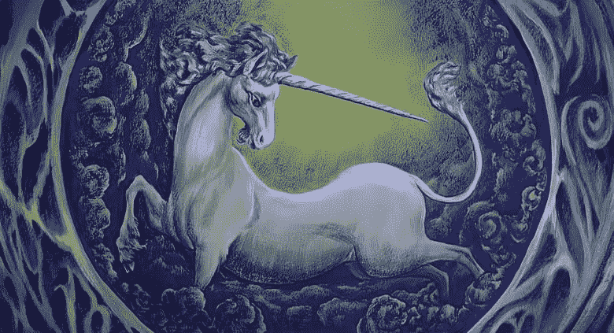
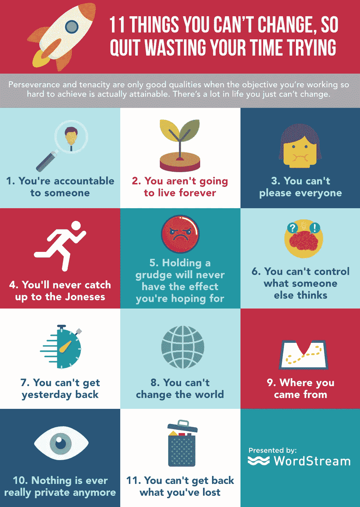

# 生活中永远不会改变的 11 件事(无论你多么努力)

> 原文：<https://medium.com/swlh/11-things-that-will-never-change-in-life-no-matter-how-hard-you-try-1942dfdfb053>

“如果你足够关心，你真的可以改变世界。”~儿童权利活动家玛丽安赖特埃德尔曼

这就是所需要的——非常非常努力的关心？还是一周工作 70 个小时，排除所有其他活动？还是说[更聪明地工作，而不是更努力地工作，](https://www.inc.com/larry-kim/adopt-these-24-daily-habits-to-make-yourself-smarter-infographic.html)才是真正引发巨大变化的原因？

所有这些都是有人在某个时间点推荐的，但事实是，有些事情你就是改变不了，不管你怎么努力。

事实上，继续用头撞墙是……嗯，不是很有效，而且相当痛苦。所以别说了，好吗？

[只有当你努力实现的目标确实可以实现时，毅力和坚韧才是好品质。生活中有很多事情你无法改变。](https://www.inc.com/larry-kim/5-entrepreneurs-who-ignored-their-advisors-and-became-wildly-rich.html)

**1。你要对某人负责。**

可能有很多人，这取决于你在生活中的位置。在追求你认为的理想结果时，走捷径、变通规则或延伸你的道德界限可能很有诱惑力，但我们都在某个时候对某人负责(也就是说，如果对自己负责还不够可怕的话)。

**2。你不会永远活着。**

即使在所有的疯狂中，记得[照顾好自己](https://www.inc.com/larry-kim/12-ways-to-stop-being-so-hard-on-yourself.html)。我们如此努力地鞭策自己；我们一直“在线”，一直保持联系，跳过假期，等等。美国人(我认为尤其是企业家)非常擅长让自己进入坟墓。如果你今天对自己太苛刻，你就不会享受明天，所以放轻松点。

**3。你不可能取悦所有人。**

说真的，别说了。试图让每个人都快乐是一种吃力不讨好、耗费精力的努力，只会让你筋疲力尽、痛苦不堪。

**4。你永远也赶不上邻居。**

你总会认识一些人，他们有更好的车，更大的房子，更好的工作，更性感的伴侣，等等。不要浪费你的时间去成为另一个人。生活不是一场竞赛。

**5。心怀怨恨永远不会有你想要的效果。**

除非你真正追求的是延长你自己的痛苦和不快。如果那是你所追求的，那就坚持下去！

**6。同样，你也无法控制别人的想法。**

你可以建议、要求、恳求——你可以声嘶力竭地呼喊，但你不能总是改变另一个人的想法。你不能让任何人喜欢你，爱你，原谅你。如果他们不愿意给予尊重，你就无法赢得他们的尊重。你就是不能。

**7。昨天已经过去了。你拿不回来了。**

没有重来的机会。停止沉湎于过去；你不能改变它。拉起你的袜子，继续前进。

**8。世界…不，你不能改变它。**

一个人真的可以改变世界，这很好，也很鼓舞人心，但有些事情比我们所有人都重要。你肯定可以改变你周围的世界——这不是问题。只要注意你在控制你对实际影响的期望。

**9。你从哪里来。**

特权是真实存在的，不可否认。你无法改变你的出身和你出生的环境或处境，但你可以控制你的去向。你可能不得不比别人更加努力地战斗，这很糟糕，但这取决于你如何利用你可能认为的弱点或不利之处，并让它为你服务。

**10。再也没有什么是真正的隐私了。**

这是不会改变的。事实上，在未来的岁月里，我们的隐私将继续被侵蚀。你的电子邮件、手机使用、照片、在线足迹等等都用数据讲述了自己的故事。人们出于邪恶的原因互相做些糟糕的事情。如果你不想有一天你衣柜里的骷髅泄露出去，你只需要假设没有什么是真正的隐私，并据此行事。

**11。失去的东西是找不回来的。**

你可以弥补失去的投资，或者找到一个新的伴侣，但试图改变事实是没有意义的，有时，失去的已经一去不复返了。这对关系来说尤其如此——他们可能会重燃爱火，但他们永远不会完全一样。

停止打击自己，专注于培养能在你的日常生活中产生切实影响的技能和品质。YOLO！

# 做驴海里的独角兽

获取我的最佳独角兽营销和创业成长秘诀:

1.  [**报名直接发到你邮箱**](https://mobilemonkey.com/blog-subscription)

**2。** [**通过 Facebook Messenger 注册偶尔的 Facebook Messenger 营销新闻&提示。**](http://m.me/447438332063924?ref=e58448cdd16367419b279793544e132f5388067506f92c92e6)

最初发表于[Inc.com](https://www.inc.com/larry-kim/11-things-you-cant-change-so-quit-wasting-your-time-trying.html)