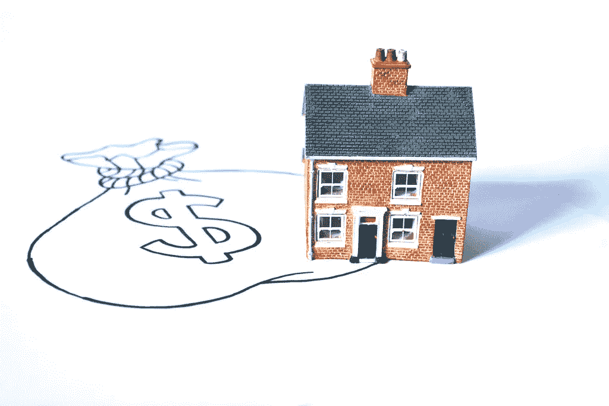
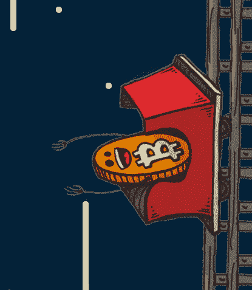

# 2018 年 12 月 4 日:神秘领域最大的故事

> 原文：<https://medium.com/swlh/12-04-2018-biggest-stories-in-the-cryptosphere-d4f4296557f9>

**1。桑坦德银行推出区块链跨国支付系统**

桑坦德银行准备[推出一个总部位于区块链的跨国支付系统](https://www.ft.com/content/1e47733e-3e2a-11e8-b9f9-de94fa33a81e)，成为第一家这样做的国际银行。它现在代表着 TransferWise 等金融科技公司的竞争。这项名为 One Pay FX 的服务将于明日在英国、西班牙、巴西和波兰推出。这四个国家占该行外汇转账总额的一半。进一步扩张的计划已摆在桌面上。执行主席 Ana Botín 表示，从长远来看，其他银行的客户也可以利用这个花了两年时间开发的平台。参与项目的区块链平台由 Ripple 提供。

**2。穆迪**表示，房地产行业可以节省多达 10 亿美元

投资服务公司穆迪发布了一份关于区块链的报告。它表示，这种创新技术可以通过降低成本和节省时间来改善抵押贷款过程。讨论的话题之一是美国房地产业如何进行改革。人们还注意到，到目前为止，技术创新还没有特别影响到这一行业，但随着区块链的出现，情况可能会发生变化。可以从中受益的方面的例子是跟踪贷款业绩和抵押贷款的透明度。风险管理也将变得更加有效。然而，产权交易将是受益最大的领域。员工和佣金支出的减少将导致 10/20%的节约，这相当于每年 8.4 亿美元到 17 亿美元。尽管是积极的，但也强调了目前只能处理有限的数据。

**3。比特币暴涨 10%**

[比特币已飙升 10%](https://www.reuters.com/article/us-crypto-currencies-bitcoin/bitcoin-jumps-10-percent-to-two-week-high-leads-broad-crypto-surge-idUSKBN1HJ1YL) 至两周高点，略高于 7000 美元。在卢森堡的比特币交易所 BTC=BTSP，这一比例更高，达到 14%的峰值。这一增长期似乎也有利于其他加密货币，如以太坊。MVETH 和 Ripple。MVXR 也涨了。然而，分析师似乎无法确定是什么导致了这种增长。一些人认为，一篇宣称比特币合法的研究论文可能是原因之一。尽管如此，两名行业专家确认，飙升最初发生在 Bitfinex 交易所，然后蔓延到其他交易所。这挤压了那些做空比特币的人。对比特币的普遍情绪正在改善，而价格正在巩固。

**4。摩根大通对购买密码收取意外费用，被起诉**

继[停止信用卡交易](https://hackernoon.com/06-02-2018-biggest-stories-in-the-cryptosphere-be42171cbed4)后，投资银行巨头[摩根大通被起诉](https://www.reuters.com/article/us-jpmorgan-crypto-currencies/jpmorgan-sued-over-fees-for-cryptocurrency-purchases-idUSKBN1HI2T4)对购买加密货币收取意外费用。额外费用是由于购买被视为现金预付款。根据诉讼，它不仅收取额外的费用，还收取更高的利息，然后拒绝出具任何退款。原告是美国人布雷迪·塔克。然而，诉讼是代表一个全国性的阶级。这一指控违反了美国《真实借贷法》。

> 本新闻综合报道由 [BlockEx](http://bit.ly/BlockEx_) 为您带来。

> *要想在你的邮箱里收到我们的每日新闻综述，请在这里注册:*[*http://bit.ly/BlockExNewsRoundup-Updates*](http://bit.ly/BlockExNewsRoundup-Updates)

## 这个故事发表在 [The Startup](https://medium.com/swlh) 上，这是 Medium 最大的创业刊物，拥有 316，028+人关注。

## 在这里订阅接收[我们的头条新闻](http://growthsupply.com/the-startup-newsletter/)。

