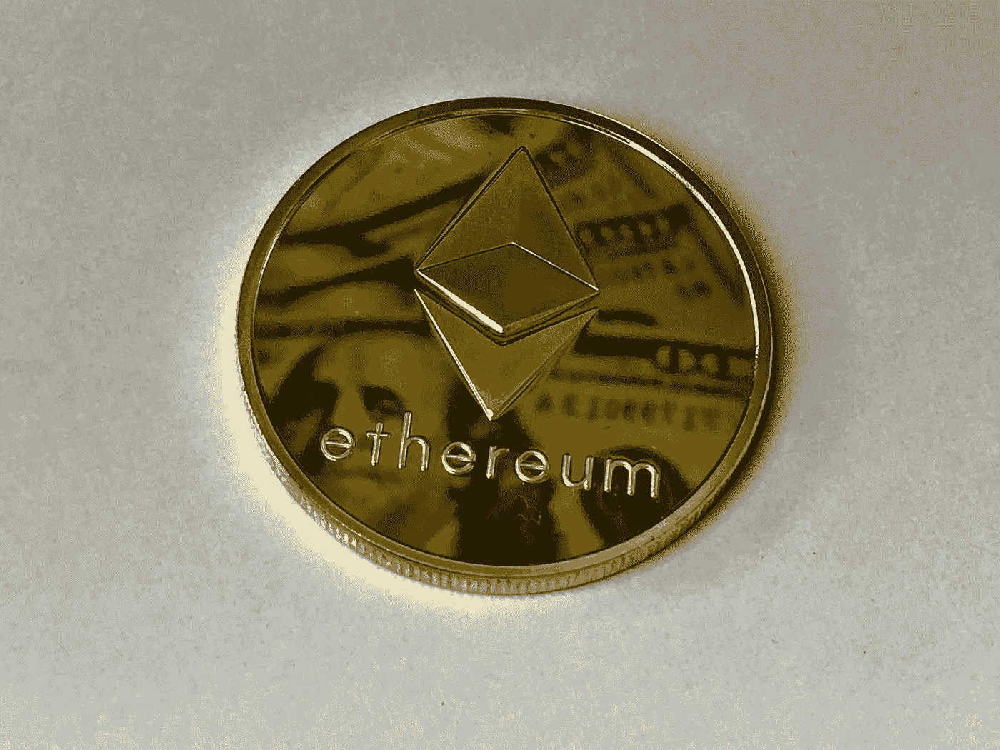

# 2018 年 12 月 6 日:神秘领域最大的故事

> 原文：<https://medium.com/swlh/12-06-2018-biggest-stories-in-the-cryptosphere-70184a96614f>

通过 BlockEx

**1。日本官方声称国际任务小组将在本月晚些时候讨论实施加密规则**

我们之前[报道过](https://hackernoon.com/02-02-2018-biggest-stories-in-the-cryptosphere-ae7caeaa6c45)许多 G20 国家呼吁共同努力监管加密货币。日本政府的一名官员现在[表示](https://www.reuters.com/article/us-cryptocurrency-regulations-fatf/financial-crime-task-force-eyeing-binding-crypto-exchange-rules-japan-official-idUSKBN1J80UZ)一个名为金融行动特别工作组(FATF)的国际金融犯罪特别工作组将于 6 月 24 日开始讨论一套针对加密交换的强制性法规。目前，可选的法规已经到位。加密交易所应识别其客户，报告可疑交易，并注册许可证。工作组现在将决定当前的监管框架是否仍然适用于新的交易所，或者是否需要更新。FATF 总部设在巴黎，代表 37 个国家，尽管它是由 G7 建立的。

**2。韩国银行将使用区块链验证客户身份**

一家韩国银行集团准备推出一个基于区块链的名为 BankSign 的身份验证系统。当地商业银行将能够利用这一新技术为其在线和移动银行服务提供便利。目前，银行使用公共认证系统。然而，这个想法是在区块链的帮助下使建筑现代化。这个消息是由 KFB 银行联合会在本周早些时候发布的。三星的私人区块链 Nexledger 正在该项目中使用。此外，去年 11 月，其成员银行加入了 KFB，并成立了一个财团。

**3。前 100 个区块链项目中有 94 个是基于以太坊的**

在基于区块链的前 100 个项目中，有 94 个是基于以太坊的。加密货币研究员兼 YouTube Kevin Rooke[指出](https://www.youtube.com/watch?v=0vyVZd8bQzw)以太坊目前有 250 名开发者在网络上工作。考虑到整个行业的规模，这是一个值得注意的数字。甚至它的开发框架 Truffle 也已经有 500 次下载。大多数可用的加密货币都遵循 ERC20 令牌标准。专注于支付的区块链网络是个例外。尽管以太坊的替代品数量有所增加，但该网络仍占据市场的大部分。

**4。欧盟组织希望听取公众对区块链的看法**

我们之前[报道过](https://hackernoon.com/09-03-2018-biggest-stories-in-the-cryptosphere-fa068a3b2ad7)欧盟成为全球金融科技中心的行动计划。其中一个要点是创建了欧盟区块链观察站&论坛。欧洲委员会拥有的组织现在[希望听到公众](https://www.coindesk.com/the-eu-wants-to-hear-your-questions-about-blockchain/)关于区块链的问题。推特[宣布了一场持续 90 分钟的 AMA 将于 6 月 18 日举行。在讨论期间，公众将有机会更多地了解区块链，以及该组织的计划是什么。](https://twitter.com/EUBlockchain/status/1006113165128687616?ref_src=twsrc%5Etfw&ref_url=https%3A%2F%2Fthenextweb.com%2Fhardfork%2F2018%2F06%2F11%2Feu-ama-cryptocurrency-blockchain%2F)

> 这是由 BlockEx 为您带来的新闻综述。

> *要想在你的邮箱里收到我们的每日新闻综述，请在这里注册:*[*http://bit.ly/BlockExNewsAndUpdates*](http://bit.ly/BlockExNewsAndUpdates)

## 这篇文章发表在 [The Startup](https://medium.com/swlh) 上，这是 Medium 最大的创业刊物，拥有 333，853+读者。

## 在这里订阅接收[我们的头条新闻](http://growthsupply.com/the-startup-newsletter/)。

