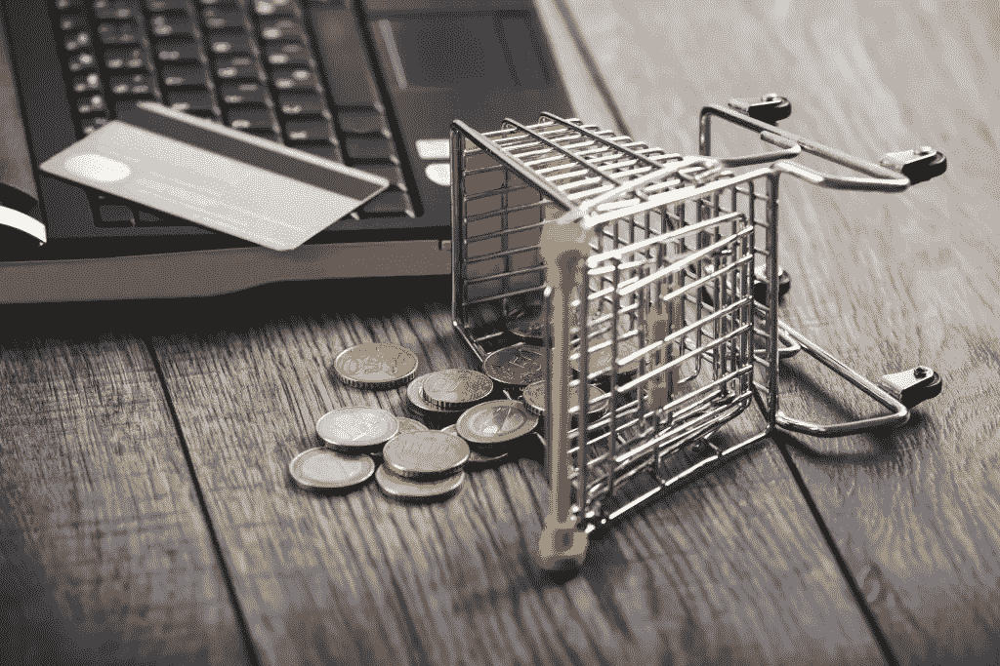

# 12 项最佳实践创造积极的购买体验，让顾客的购买之旅更加顺畅。

> 原文：<https://medium.com/swlh/12-best-practices-create-a-positive-purchase-experience-to-smooth-customer-buying-journey-eef05661f929>

如何鼓励顾客在准备购买时采取行动？

当你在这种情况下已经让你的销售线索通过了流程，**现在他们准备好购买**。

> 创造积极的购买体验至关重要。

有两个关键词我们需要记住:**清晰**和**简单！**

今天的商业可以很简单，你坐在家里，在网上搜索，比较不同的产品，然后购买。**听起来很简单吧？**

这并不总是那么容易。在购买过程中，有时你会遇到困惑的步骤。

> 平均购物车放弃率是一个令人难以置信的数字:71%

当你建立你的网站时。确保考虑客户的观点。**对顾客来说，什么样的购物体验最棒？**

# 简化购买流程

## 允许通过或不通过在线注册进行购买。

如果顾客**不想填写登记表，让他们作为客人**结账。一些人认为登记表延长了过程，侵犯了他们的个人隐私。

## 计费前请求运输信息

当顾客在网上购物时，运输对他们来说非常重要，他们想在购买前多久能收到包裹。

## 提供多种支付方式

24%的放弃购物车是因为他们发现他们的支付方式不被接受。通过提供多种支付选择，使顾客在购物时感到方便。

## 让结帐链接容易找到

以便客户不需要通过搜索来找到它们。它应该很容易找到，清晰，不被大量的杂物包围。

## 一致的品牌。

将你的结账界面与你网站的其他部分整合在一起。你的客户已经习惯了你网站的某种颜色和设计。通过使用相同的背景颜色、字体和字体大小、图像、按钮、复制色调等，确保过渡到结帐是无缝的。

Photo by [Fernanda Rodríguez](https://unsplash.com/@ferrgc112?utm_source=medium&utm_medium=referral) on [Unsplash](https://unsplash.com?utm_source=medium&utm_medium=referral)

## 清除可用性

要清楚什么是库存，不要隐瞒商品的可用性。如果某些商品缺货，马上让顾客知道。

如果它将在未来推出，请提供预订或向客户发送电子邮件提醒何时推出。

## 购物车修改

让购物车的修改变得快速简单，比如在最终确定购买之前添加商品或改变质量。

## 画面

在购物车审核期间，在订单摘要屏幕上显示视觉效果和链接。

## 运输选项

提供多种运输选择。让顾客选择他们想要使用的运送方式。报价范围从标准到快速。这样顾客就可以在需要的时候拿到他们的物品。

## 交货估计

提供详细的交货估计，以便客户知道何时收到他们的商品。

## 清除退货政策

对退货政策透明。研究表明，86%的顾客在最终决定购买前会查看退货政策。

## 说谢谢

记得永远说谢谢。发送一封包含确认、订单摘要和运输信息的电子邮件。

> 通过创建清晰简单的流程，您将创造积极的客户体验，避免放弃购物车，从而推动销售。

# 在这里找到更多我的故事！

# 顺便说一下，👏🏻*鼓掌*👏🏻如果你喜欢这篇文章，请举手(高达 50 倍)。它鼓励我坚持每天写作，并帮助其他人找到它:)

## 这个故事发表在[的创业](https://medium.com/swlh)上，这是 Medium 最大的创业刊物，有 316，638+人关注。

## 订阅接收[我们的头条新闻](http://growthsupply.com/the-startup-newsletter/)。

