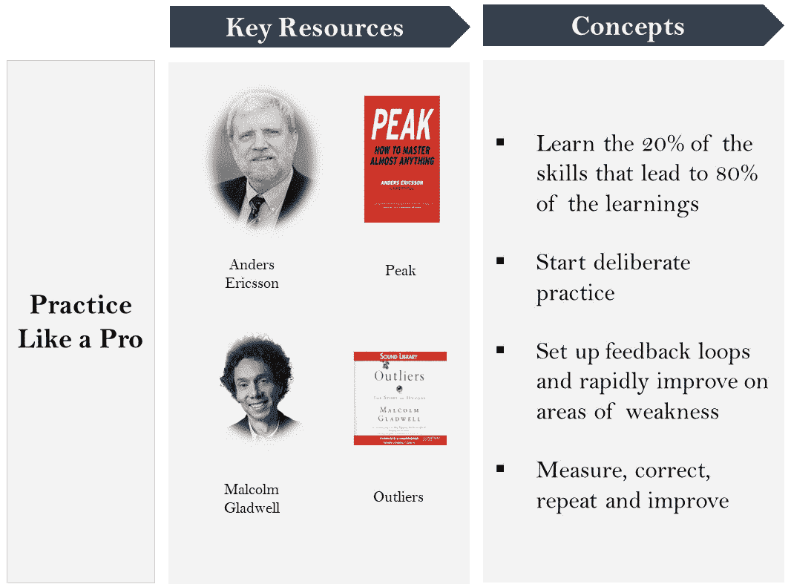

# 重新定义成功和高绩效的 12 本书

> 原文：<https://medium.com/swlh/12-books-that-redefined-success-and-high-performance-897cf2c5d262>

你知道那是什么感觉。因为你去过那里。你只是个财务人员。你对编码了解多少？你是管理顾问。你怎么能成为一名演员？

愚蠢！

他们是对的。让我们现实一点。

现实是这样的。意识到这一点。内化这个。

“你可以实现你想要的一切；然后一些。”

这篇文章将告诉你如何做。

# 阶段 1:知道真正的问题是什么

一般来说，大多数人害怕扣动扳机、推动自己实现目标有两个原因。一个是外部的，一个是内部的。

一方面，学校和社会为我们的目标设定了人为的界限(还记得你的“我想成为飞行员”的梦想吗？)，但另一方面，我们这些想要获得更大的东西的人往往不知道如何去做。

让我们更详细地了解每一项。

## 周围的环境说不

很多时候，我们坚持自己正在做的事情，是因为我们圈子里的社会支持。其中，最主要的是，

1.  学校:学校教我们要坚持程序。我们的殖民历史遗迹为我们选择的主题的结构化列表。我们上当了。因为我们的朋友也是。我们的父母也是。还有他们的父母。诸如此类。
2.  父母:我们的父母理所当然地对我们有他们自己的梦想。但是他们无意中把我们困在他们自己的范式中，他们有限的思维定势成为我们自我实现的预言。
3.  同伴:在任何地方，从学校到我们的社区到我们的工作，我们的同伴在我们心中播下怀疑的种子，这些种子会集体实现，以阻止我们推动自己实现我们的愿望。

## 不知道怎么做

我们这些设法冲破疑云的人面临着另一个挑战。

1.  你如何以最有效的方式实现你的目标？
2.  你从哪里开始？
3.  你打电话给谁？
4.  你如何设计你的计划？
5.  你如何获得反馈？
6.  你是如何衡量的？
7.  你什么时候辞职？

还有许许多多没有正确答案的问题。

所以，即使我们冲破了怀疑的引力，渴望一些伟大的东西，失败还是会袭击我们。

# 第二阶段:意识到别人已经做到了

[**本杰明·富兰克林**](https://en.wikipedia.org/wiki/Benjamin_Franklin)10 岁离开学校，之后成为美国开国元勋之一，避雷针的发明者。 [**历史上最富有的人约翰·洛克菲勒**](https://en.wikipedia.org/wiki/John_D._Rockefeller) 是一个廉价骗子的儿子，理查德·布兰森 在创办数十亿美元的公司之前患有诵读困难症。

这样的故事数不胜数，人们与不利条件作斗争，挑战生活赋予他们的可能性。他们和你我没什么不同。他们身上流着同样炽热的红色血液，对机会的渴望和对发展的贪婪。

罗伯特·A·海因莱因总结得很好，他说:

****

***专精是为了昆虫。***

# 第三阶段:知道你如何也能做到

## 概观

现在你们都兴奋起来了，让我们看看过去 100 年的表演文献，并从中汲取教训…

在综合这一时期的文献后，我们看到教义的精髓可以归结为以下几点。第一个，相信它，处理我们讨论的第一个问题，学校和社会阻止我们实现我们的梦想。接下来的问题(观察最好的，像专业人士一样练习，坚持)是对第二个问题的直接回应，即不知道如何实现你为自己设定的目标。

下图总结了问题和后续解决方案。

## 深潜

# 第四阶段:行动

最后，因为没有行动的知识是没有价值的，这是你执行目标的步骤。这里有一个快速有效的问题列表，可以帮助你开始实现你的目标，不管这些目标是什么。

现在你知道如何实现你的梦想，是时候开始行动了。当海豹突击队的表演教练 [**乔科·威林克**](https://www.youtube.com/watch?v=GqqrTLwxE_Y) 会说，“别读了，做吧”。

# 接下来你可以去哪里

## 书

*   [**人对意义的追寻**](https://www.goodreads.com/book/show/4069.Man_s_Search_for_Meaning) **:** *一本关于维克多·弗兰克尔(Viktor Frankl)如何行使自己的意志，赤身裸体躺在纳粹集中营里的书。所以如果他能做到，你也能*
*   [**高效能人士的 7 个习惯**](https://www.goodreads.com/book/show/36072.The_7_Habits_of_Highly_Effective_People?from_search=true) **:** *是一本关于个人成长和成就的精华书籍。内化这一点，你就不需要其他任何东西了*
*   [**如何赢得朋友&影响他人**](https://www.goodreads.com/book/show/4865.How_to_Win_Friends_and_Influence_People?from_search=true) **:** *写于 1936 年，带你导航周围的人，走向成功*
*   [**思考致富**](https://www.goodreads.com/book/show/30186948-think-and-grow-rich?from_search=true) **:** *写于 1937 年，向你展示了历史上最成功人士的 13 个关键习惯*
*   [**无限力量**](https://www.goodreads.com/book/show/8676.Unlimited_Power?from_search=true) **:** *托尼·罗宾斯起步的那本书。阅读它会点燃你心中的火，推动你走向成功*
*   ****:***采访从体育到商业各个领域的顶尖高手的书，讲述他们的技巧和诀窍***
*   ******:***一本解释高绩效科学以及如何通过训练你的大脑和身体来实现高绩效的书*****
*   ****[**巅峰:来自新科学的秘笈**](https://www.goodreads.com/book/show/26312997-peak?from_search=true) **:** *由圣父精心练习而成，它向你展示了融会贯通的正确方法*****
*   ****[**《离群者:成功的故事》**](https://www.goodreads.com/book/show/3228917-outliers?from_search=true) **:** *本书讲述了高等表演者使用的习惯和方法来达到非凡的结果*****
*   ****[**勇气:激情和毅力的力量**](https://www.goodreads.com/book/show/26720236-grit?from_search=true) **:** *向您展示从幼儿园学生到运动员，勇气是成功的最佳预测因素*****
*   ****[**习惯的力量**](https://www.goodreads.com/book/show/12609433-the-power-of-habit?from_search=true) **:** *一本书，讲述如何养成习惯，让伟大的表演者变成非凡的表演者；并教你如何得到它*****
*   ********:***这本书教你实现自己的梦想，像百万富翁一样生活——但实际上并不是百万富翁*******
*   ****[**纪律等于自由:野外手册**](https://www.goodreads.com/book/show/34431560-discipline-equals-freedom?from_search=true) **:** *向你展示如何像老板一样把纪律灌输到生活中并达成目标的书*****

******奖励:播客******

*   ****[**蒂姆·费里斯秀**](https://tim.blog/category/the-tim-ferriss-show/) **:** *著名表演教练和《4 小时工作周》作者对顶级表演者的采访*****
*   ****[**《詹姆斯·阿尔特彻秀》**](https://jamesaltucher.com/category/the-james-altucher-show/) **:** *一档采访各自领域顶尖人物的节目，梳理出他们取得成功的诀窍和习惯*****
*   ****[**自由浪子**](https://freedomfastlane.com/podcasts/) **:** *展示如何通过打造自己、创办成功的企业和投资利润来享受自由生活*****
*   ****[**乔科播客**](http://jockopodcast.com/) **:** *自律的人。一位前美国海军陆战队员向你展示如何像战士一样实现目标*****
*   ****[**【100 美元】MBA**](https://100mba.net/show/) **:** *一个播客，努力取代 MBA 学位，教你所有关于个人提升和商业的知识*****

*****本文原载于*[***Techonomics***](http://techonomics.io/)*。一个关于职业和商业策略的博客。更多战略利好，* [***订阅***](http://techonomics.io/the-strategy-pill/) *我们即将发布的简讯，* ***战略药丸。*******

********

## ****这篇文章发表在 [The Startup](https://medium.com/swlh) 上，这是 Medium 最大的创业刊物，拥有+404，714 名读者。****

## ****在这里订阅接收[我们的头条新闻](http://growthsupply.com/the-startup-newsletter/)。****

********