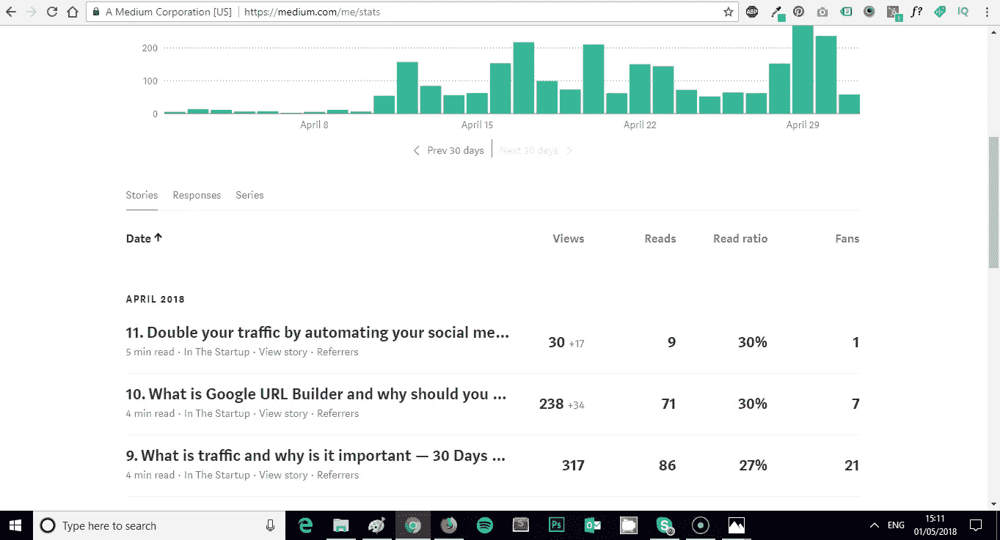

# 12.如何辨别什么好卖——30 天中等

> 原文：<https://medium.com/swlh/12-how-to-tell-what-sells-30-days-of-medium-ba3291d029d2>

欢迎回到 **30 天中等。**

今天的主题是**如何辨别销售。具体来说，如何弄清楚内容卖什么，以及如何写更多的内容。**

如果你错过了下面的**我的媒体挑战**的前 11 天，你可以补上:

## [0。30 天的培养基](/swlh/30-days-of-medium-c7ab34953c6c)

## [1。建立自己的网站需要什么？— 30 天的培养基](/swlh/1-what-do-you-need-to-build-your-own-website-30-days-of-medium-1ed1ad4e505c)

## [2。如何找到你热爱的事业— 30 天的媒介](/swlh/2-how-to-find-a-business-you-love-30-days-of-medium-cb7a4a702d1b)

## [3。如何建立自己的网站—媒体 30 天](/swlh/3-how-to-build-your-own-website-30-days-of-medium-587f994672ec)

## [4。如何衡量你网站的表现——30 天媒体](/swlh/4-how-to-measure-your-websites-performance-30-days-of-medium-75e650969695)

## [5。如何通过回答他们的问题获得更多的客户——30 天介质](/swlh/5-how-to-get-more-customers-by-answering-their-questions-30-days-of-medium-b462d237533e)

## [6。成功的商业网站备忘单——媒体 30 天](/swlh/6-the-successful-business-website-cheat-sheet-30-days-of-medium-42f89eb43e67)

## 7。如何衡量成功——媒体 30 天

## 8。了解在线销售漏斗— 30 天媒介

## 9。什么是流量，为什么流量很重要？— 30 天的培养基

## 10。什么是 Google URL Builder，为什么要使用它？— 30 天的培养基

## 11。通过自动化你的社交媒体日程，让你的流量翻倍——30 天的媒体

## [12。如何辨别什么好卖— 30 天介质](/swlh/12-how-to-tell-what-sells-30-days-of-medium-ba3291d029d2)

## [13。我如何在 6，500% — 30 天的培养基中培养我的培养基](/swlh/13-how-i-grew-my-medium-following-6500-30-days-of-medium-c9d2d6f80b51)

## [14。你如何看待事情很重要——30 天中期](/swlh/14-how-you-look-at-things-matters-30-days-of-medium-f641b9733b90)

## [15。如何向小型企业销售服务— 30 天中等](/swlh/15-how-to-sell-services-to-small-businesses-30-days-of-medium-d6604c63b3b7)

## [16。如何通过有效的提案赢得更多交易— 30 天的媒介](/swlh/16-how-to-win-more-deals-with-effective-proposals-30-days-of-medium-481f16bbc86f)

## 17。如何在 10 分钟内建立一个网上商店——30 天的媒介

## [18。如何在任何地方工作— 30 天介质](/swlh/18-how-to-work-from-anywhere-30-days-of-medium-1c9cfa2d662f)

## [19。为什么你的网站会破坏你的销售——30 天媒体](/swlh/19-is-your-website-sabotaging-your-sales-30-days-of-medium-f63bdbdb350)

## [二十。你的流量从哪里来？— 30 天中值](/swlh/20-where-does-your-traffic-come-from-30-days-of-medium-a9b2d2c088bb)

## [21。如何真正识别倦怠——30 天中等水平](/swlh/21-how-to-actually-recognise-burnout-30-days-of-medium-7972a7a7a89e)

## [22。如何修改你的时间表并完成两倍的工作——30 天中等时间](/swlh/how-to-hack-your-schedule-and-get-twice-as-much-done-30-days-of-medium-441a509dc9be)

## [23。不要模仿你的竞争对手——30 天的媒介](/swlh/23-dont-copy-your-competitors-30-days-of-medium-56382b7ba8ed)

## 24。如何 SEO 优化一篇博文——30 天的媒介

## 25。独特或被遗忘——30 天的媒介

## 26。跟着感觉走——30 天中等水平

## 27。人们不支付平均 30 天的中等费用

## 28。如何做关键词研究— 30 天介质

## [29。为什么帕累托原则是世界上最大的诀窍——30 天中期](/swlh/29-why-the-pareto-principle-is-the-worlds-biggest-hack-30-days-of-medium-1c225f5c8aa1)

## 三十岁。你的内容比你的电话更有利可图——30 天的媒介

# 12 天了

到目前为止，我的 **30 天中级**挑战已经进行了 12 天，我热爱它的每一分钟。

我不仅觉得我在一点一点地提高我的写作水平，而且在这个过程中我也**学到了很多东西。**

昨天我学了两个有价值的课程。

# **Medium 是一个不可思议的博客平台**

自从我在 3 月 17 日加入这个平台以来，我已经在 Medium 上对自己的表现进行了仔细的评估。

直到昨天，我才开始充分意识到这个平台有多棒，它可以衡量你的表现，让找出有效方法变得如此简单。

昨天我在 [**11 写了一篇帖子。通过自动化你的社交媒体日程，让你的流量翻倍——30 天的媒体**](/swlh/11-double-your-traffic-by-automating-your-social-media-schedule-30-days-of-medium-ac9aa74f7927)

原来，**这个标题烂透了。**

我怎么知道这个？统计数据不会说谎。

我在这篇文章上只得到 **30 次浏览**，**相比之下，我前两篇文章得到了 238 次和 317 次浏览。**

这篇文章和之前的文章没有什么不同。这篇文章与前两篇文章发表的时间大致相同。

我的阅读率甚至和我昨天发表的文章一样。

**但基本没人看，为什么？肯定是头条。没有人点击我的帖子，因为标题太烂了。**

# 如何辨别什么好卖

这告诉我一件事。**头条卖内容观点。**

上面那篇文章，基本上没有观点，实际上非常非常有用，我把我在网上的成功很大程度上归功于其中讨论的原则。**一致性和自动化。**

但是没人来参加派对，因为我的标题很烂。

# 标题驱动浏览

您的**标题**推动**查看**您的内容。

你的标题是你内容销售漏斗的顶端。

你认为脸书为什么多年来充斥着点击诱饵？点击诱饵标题驱动浏览。

我能够使用我的中等统计仪表板计算出:

**吸引人的标题+无人阅读=标题畅销，内容不畅销**

# 内容驱动阅读

你内容的**质量**驱动你内容的**阅读**。

如果你的标题**吸引了**用户阅读你的内容，那么内容的好坏决定了有多少人真正**通读了**内容。

然后，我能够使用我的中等统计仪表板计算出:

**弱标题+好阅读=内容畅销，标题不畅销**

# 连接驱动风扇

粉丝和掌声仍然是我正在琢磨的事情。

我甚至可以说，你和你的观众的联系是你吸引粉丝和掌声的原因。

如果与你的观众交流变成了掌声，那么从逻辑上来说，赢得更多掌声的最好方法就是找出什么能引起你的观众和平台的共鸣。

我发表了一些我认为会与我的观众产生深刻联系的帖子，这些帖子没有得到**的好评**，还有一些我惊讶地发现在掌声和粉丝方面表现最好的**。**

使用从我的中型仪表板收集的上述统计数据，我能够计算出:

**吸引人的标题+良好的阅读量+良好的掌声和粉丝=销售内容**

# 我是如何在 30 天内将我的媒体读者增长了 6000%

在接下来的几天里，我将发表一篇详细的分析文章，介绍自从 45 天前开始在媒体平台上工作以来，我是如何从零开始发展我的媒体读者群的。

我将谈谈我的观点、阅读、掌声和追随者是如何增长的，以及我学到了什么。我还会用简单的术语向你解释哪些最佳实践技巧对我有用，对你从头开始也有用。

## 如果你觉得这个系列很有趣，一定要关注我，这样你就能在这个帖子发布后第一时间得到更新。

## 你可能也喜欢这个:

## [为什么 WordPress 是在](/swlh/why-wordpress-is-the-best-platform-to-build-your-business-or-startup-website-on-df3fe932fad7)上建立业务或创业网站的最佳平台

## 如果你喜欢这个故事，请点击👏按钮并分享，帮助其他人找到它！欢迎在下方留言评论。

## 这篇文章发表在 [The Startup](https://medium.com/swlh) 上，这是 Medium 最大的创业刊物，有 320，924+人关注。

## 在这里订阅接收[我们的头条新闻](http://growthsupply.com/the-startup-newsletter/)。

