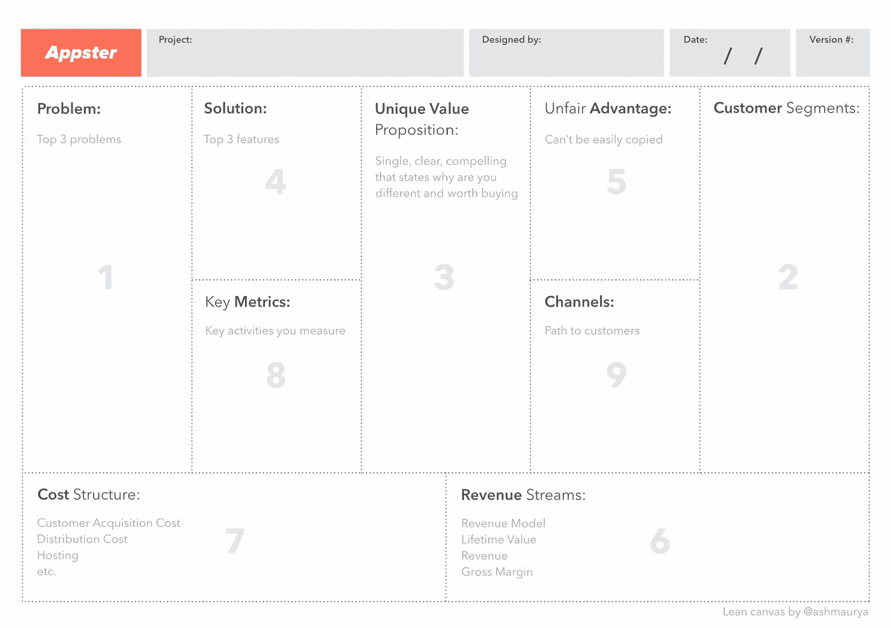

# 12 分钟的倾斜画布和枢轴指南

> 原文：<https://medium.com/swlh/12-min-guide-to-lean-canvases-and-pivots-e7bd80764fd5>

Originally published on [http://www.appsterhq.com](http://www.appsterhq.com/?utm_source=CP&utm_medium=Medium)

# 以及为什么它们对成功创业至关重要

随着“精益创业”越来越受欢迎，“支点”和“精益画布”的概念已经成为创业界的热门话题。

然而，围绕着这两个概念的意义和效用，似乎存在着广泛的混淆。

在这篇文章中，我将试图通过解释来理清这种困惑:

*   为什么精益画布取代了传统的商业计划，
*   旋转到底包括什么，
*   以及为什么精益画布和旋转对于建立成功的初创企业至关重要。

# “精益创业”的到来

从本质上讲，创业公司从根本上关注的是识别特定的[消费者痛点](http://www.appsterhq.com/blog/early-stage-entrepreneurs-launch-profitable-startup)，并在*大型和/或快速扩张的市场*内提供*可盈利*和*可扩展*的解决方案。

除此之外，大多数企业家可能都熟悉保罗·格拉厄姆和史蒂夫·布兰克等行业领袖对“创业”的一个或多个标准或常用定义:

*   “初创公司是一家旨在快速增长的公司……我们与初创公司相关的一切都源于增长的需要。”([保罗·格拉厄姆](http://www.paulgraham.com/growth.html))
*   "创业公司是为了寻找可重复和可扩展的商业模式而成立的组织."([史蒂夫·布兰克](https://steveblank.com/2010/01/25/whats-a-startup-first-principles/)

格雷厄姆通过[指出](http://paulgraham.com/start.html)创业公司通过“向人们提供比现在更好的技术”和在过程中“尽可能少花钱”来寻求“制造顾客真正想要的东西”,从而扩展了他的定义。

对布兰克来说，[强调了](https://steveblank.com/2010/01/25/whats-a-startup-first-principles/)可重复和可扩展的商业模式的功能和意义:

> “商业模式描述了你的公司如何创造、传递和获取价值……商业模式是一张图纸，显示了你公司不同部分之间的所有流程，包括产品如何分配给你的客户，以及资金如何回流到你的公司。它还显示了贵公司的成本结构、各部门之间的互动方式，以及贵公司与其他公司或合作伙伴的契合点。”

创建可重复、可扩展的商业模式是初创企业生命周期中的一个阶段，在这个阶段，一家新企业找到了以低于预期收入的价格持续获得新客户的方法，从而创造利润。

当然，这发生在一个产品已经为一个充满了愿意并有能力支付的用户的饥渴市场而制造出来之后。

从几年前开始， [Eric Ries](https://leanstartup.co/team/eric-ries/) 开始普及**精益**的概念，进一步完善了大众对创业公司的目的和运营的理解。

基于[早期的博客文章](http://www.startuplessonslearned.com/2008/09/lean-startup.html)，Ries [在 2011 年正式引入了](http://theleanstartup.com/book)精益创业方法的概念。

简而言之，Ries 的方法是关于创业公司可以智能和有效地减少浪费的时间和资源的各种方式，通过有效地创建、测试和改进实际上符合市场需求的产品，因为它们是基于真实客户的实验(即数据支持的)需求和愿望。

里斯使用术语“**”(即基于持续客户反馈的持续开发)和“**”(即多轮基于分析和度量的假设测试，旨在进一步完善假设，从而逐步构建可持续产品)来描述他的[方法](http://theleanstartup.com/principles)。****

****精益创业公司的到来已经给 21 世纪创业公司的各种以前想当然的方面带来了严峻的挑战。****

****在这篇文章中，我想看看精益游说如何取代传统的商业计划，以及中枢如何改变初创企业在当今快节奏的世界中适应和发展的方式。****

# ****传统的商业计划基本没用****

********

****对于传统企业来说，制定一份正式的商业计划通常是个好主意(更不用说标准做法了)。****

****商业计划是一份非常详细的文件，它:****

*   ****回顾一个人的行业、以前的收入、当前的产品和服务****
*   ****并预测未来收入、将自己与竞争对手区分开来的手段、市场即将发生的变化等。****

****然而，对于初创企业来说，情况完全不同:传统的商业计划用处很小，如果有的话。****

****越来越多的人认识到(例如: [1](https://www.forbes.com/sites/ryanblair/2013/05/23/why-business-plans-are-worthless/#704fff413eee) 、 [2](https://www.entrepreneur.com/article/223837) 、 [3](http://onstartups.com/tabid/3339/bid/80497/Fall-In-Love-With-Your-Business-Not-Your-Business-Plan.aspx) 、 [4](https://www.inc.com/geoffrey-james/5-reasons-to-avoid-writing-a-business-plan.html) )，由于以下一个或多个因素，初创企业应该避免浪费时间、精力和金钱来制定商业计划:****

*   ******制定一份正式的商业计划**是一个耗费时间和金钱的过程，这个过程必然会让初创公司远离创造、发布和调整其业务所必须依赖的产品。****
*   ****许多初创公司的投资者/出资人对阅读 50-100 页的商业计划没有兴趣。****
*   ******商业计划实际上总是包含至少一些虚构，即不可靠的猜测或预测，威胁到计划中一个或多个核心组成部分的完整性。******
*   ******商业计划**必然局限于一个特定的时间快照，从而质疑其持续的相关性和实用性。****
*   ******绝大多数初创公司在他们的历史中会一次或多次转向(稍后会有更多的介绍)，一旦他们这样做了，就会立即取消任何之前制定的商业计划。******

****从创业的角度来看，*传统商业计划的基本问题是* ***它承担了过多的*** 。****

****它假设你可以制定一个可靠的营销策略*和*明确定义你的客户*和*概述你的产品规格*和*仔细划分和分配你的财务*和*将所有这些数据写在纸上——然后你只需不折不扣地遵循计划，等待成功的到来。****

****说白了，整个过程相当可笑。****

****例如，如果你没有首先获得任何客户，你如何计划你的营销费用？****

****或者考虑“财务预测”。****

****这种做法包括从竞争对手那里找到一组或多组市场采用率，然后根据这些数字预测你的销售额。****

****但作为一名企业家，我可以很容易地使用现有的指标创建几十个甚至几百个不同的预测，预测一年的收入从 1000 美元到 10 亿美元不等。****

****史蒂夫·布兰克[说得好](https://steveblank.com/2010/11/01/no-business-plan-survives-first-contact-with-a-customer-%E2%80%93-the-5-2-billion-dollar-mistake/):说到创业，“没有一个商业计划能在与客户的第一次接触中存活下来”。****

****为什么？因为创业公司在推出*创新*产品的同时，还会推出*尚待验证的*商业模式，通常是在*利基*和不断发展的市场。****

****在初创企业的世界里，根本没有现成的、可靠的基准。****

****传统的商业计划适合大公司和特定类型的高层员工(如公司经理)。****

****例如，可口可乐公司的营销经理准备推出一个新的可乐饮料系列，他将根据一系列以前使用过的熟悉的程序和数据点来遵循商业计划，例如创建 *x* 个广告牌，以吸引 *y* 个客户，从而产生 *z* 个收入。****

****但是当你启动一个移动应用程序时会发生什么呢？您可以调用哪些以前使用过的和熟悉的数据？****

****事实是，很难预测用户是否会采用你的应用程序，应用程序是否会以你想要的方式解决一个或多个客户问题，你的收入是否主要来自广告或其他来源，等等。****

# ****精益画布是新的商业计划****

********

****因此，传统的商业计划已经过时，而我在上面提到的“商业模式”正在进入初创企业的世界。****

****几年前，Ash Maurya 修改了 Alex Osterwalder 著名的[商业模型画布](https://strategyzer.com/canvas)，并推出了现在被广泛使用的[精益画布](https://leanstack.com/is-one-page-business-model)。****

****Ash [将](https://leanstack.com/is-one-page-business-model)精益画布描述为“一页长的商业计划模板，使用 9 个基本构件帮助你将你的主要商业想法解构为关键假设。”****

****精益画布取代了传统的商业计划——事实上，可以说，它打破了传统的商业计划。****

****因为创业是商业世界前所未见的完全独特的现象，企业家需要一种革命性的工具来帮助他们想象、解释和互动创业中涉及的每一个独特的变量。****

****这就是精益画布的用武之地。****

****我们 [Appster](http://www.appsterhq.com/?utm_source=CP&utm_medium=Medium) 的已经创建了一个精益画布的版本，它将帮助您智能、高效地绘制出业务不同部分之间的核心联系，从而让您能够确定和规划您为客户创造、获取和传播价值的关联方式:****

********

****创业是一个动态的过程，经常需要应对不确定性和不可预测性。****

****创业公司创始人根本无法预测未来；因此，遵循一份 50-100 页的文件是完全愚蠢的，这份文件最好的情况下包含有根据的猜测，最坏的情况下包含幻想和不相关的数据。****

****我们的精益画布包含 9 个变量，初创企业创始人必须定义*并进行测试。*****

****这基本上是创业与科学的结合:****

*   ****你从一个给定的假设开始，****
*   ****创建一个包含真实世界市场研究的受控实验，****
*   ****收集结果，****
*   ****最后，使用这些结果产生新的假设，更新你的精益画布，然后重新开始整个过程。****

****正如 Eric Ries [所强调的](http://theleanstartup.com/principles)，在当今世界创建一个成功的创业公司需要一个*迭代*——即不断进化、往复的过程，一个必须高效*和科学*完成的过程。****

# ****关于测试和适应的快速说明****

********

****作为一名创业企业家，你绝对必须致力于测试、提炼和再测试关于你的企业、你的产品、你的客户和你的市场的基本假设。****

****F 例如，你不是在发布前完善你的应用程序的每一个细节，而是通过创建一个包含核心功能的最小可行产品[来持续测试你的应用程序，并将其推广到你的市场的小部分，以便收集反馈并在必要时进行调整。](/swlh/why-you-need-to-build-an-mvp-app-and-5-tips-on-how-to-do-it-937d7040ee19)****

****类似地，你可以将营销预算分成几部分，投资于几个广告策略，并对每个策略进行分析，以确定哪一个能带来最好的投资回报，而不是投入大量资金购买广告空间。****

# ****“支点”:不仅仅是最新的热门词汇****

********

****初创公司不断变化:它们成长、改变方向、适应、转移焦点、重新调整目标、进化——也就是说，**它们转向**。****

****可以说，21 世纪初创公司最具定义性的特征之一是，它们持续快速地变化/适应。****

****这对“大鲨鱼”(即当今最具优势的企业)和新生的“孔雀鱼”(即刚刚起步的初创企业)都是如此。****

****正如我最近[提到的](http://www.appsterhq.com/blog/4-startup-myths-entrepreneurs-success):****

> *****“insta gram 最初是一个名为 Burbn 的 Foursquare 山寨版；Pinterest 被称为 Tote，开始是一家电子商务初创公司；Paypal 在选择目前的在线支付服务之前，经历了 5 次不同的转变。如果这些庞大公司的创始人中有任何一个仍然坚定不移地执行他们最初的愿景，那么他们很可能早就失败了。”*****

****这里有另一个例子:YouTube 开始时是视频约会网站 Tune In Hook Up，但即使这家初创公司被执行了，它也没有获得任何牵引力。****

****当创始人意识到另一个问题的存在，即试图在网上找到热门视频的困难时，他们做出了明智的决定，通过建立我们现在所知的 YouTube 来改变方向。****

****关键是，这些大公司并不是通过顽固地拒绝改变他们最初的目的或目标，而是通过测试他们的假设并根据他们收到的结果转移他们的重点，从而上升到十亿美元风险企业的行列。****

****新创公司也一样，要么接受改变，要么冒着失去一切的风险。****

****事实上，彻底改变方向是新奇冒险的常态。****

****Y Combinator 的创始人保罗·格拉厄姆[报告](http://paulgraham.com/notnot.html)称，70%到 100%的 YC 投资的初创公司在他们 YC 经历的前三个月结束时，开始为他们的业务构思一个不同的核心创意。****

****但“支点”，即创业公司目标和/或运营的重大变化，仅仅是创业者在意识到自己的想法很糟糕，需要想出新的创收方式时使用的时髦词汇吗？这是不是一张被过度使用的、新企业的“免罪卡”？或者它真的有价值吗？****

******如果理解并正确应用，旋转可能是一个非常有用的概念和实践。******

****创造了“支点”一词的埃里克·里斯(Eric Ries)以如下方式解释了这一点:****

> ****创业最难的部分是培养判断力，知道什么时候该改变方向，什么时候该坚持到底。支点的概念认为 ***成功的创业公司会改变方向，但会停留在他们所学的*** *。他们一只脚停留在过去，一只脚放在新的可能的未来。随着时间的推移，这种旋转可能会使他们远离最初的愿景，但如果你仔细观察，你将能够发现连接每个迭代的共同线索。相比之下，许多不成功的创业公司只是简单地从一个愿景跳到完全不同的东西。这些跳跃是极其危险的* *，因为它们没有利用之前对客户的有效了解。”*****

****简而言之，旋转指的是意识到你的一个或多个关键假设是错误的时，一种经过计算的、明智的反应。****

****例如，假设关于你的客户的一个基本假设是，如果他们使用一个帮助他们提高组织技能和习惯的产品，他们会在一个特定的任务中变得更有效率。****

****为了测试这一假设，您邀请特定市场的客户使用您的[最低可行产品](http://www.appsterhq.com/blog/mvp-app)，并记录他们如何与产品互动的各种分析，以及他们的生产力是否有任何变化。****

****数据显示生产率水平没有受到影响(或者更糟，有所下降)。****

****使用这些数据，你产生了一个新的假设，表明客户的生产力水平不是取决于组织，而是取决于无法有效地管理分心。****

****在这一点上，你可以开始设计某种互联网屏蔽工具，限制对某些分散注意力的网站和/或小工具的访问。****

****然后，您将重复这个过程，以测试这个新的假设，并收集新的数据，作为您下一步调整的基础。****

****这个假设场景包含了马丁·双立人(Martin Zwilling)在 Ries 工作的基础上[称之为](https://www.forbes.com/sites/martinzwilling/2012/01/21/a-smart-business-knows-8-ways-to-pivot-their-vision/#4f82e3f97f96)的“产品功能支点”的例子。****

****创业公司可以参与各种其他类型的支点，包括收入模式支点、客户问题支点和细分市场支点。****

****创业公司至少在生命中的某个时刻必须面对一个事实，那就是枢轴转动。****

# ****旋转不是放弃****

********

****随着企业朝九晚五的工作岗位继续减少，初创企业变得越来越有吸引力，我预计我会看到越来越多的“想要创业的人”半心半意地创建初创企业，然后在遇到第一个障碍时就随意改变他们“公司”的重点。****

****然后，他们说服自己，他们的新想法更大、更好，显然更有可能获得巨大成功。****

****他们不会按照自己最初的想法去执行。他们不*测试*他们的假设。他们不会创新地回应，而*会从*那里学习他们(不)收集的数据。****

****相反，他们放弃了创业的基础，转而“跳槽”到当下最热门的领域。****

******这不是旋转；这就是心理学家所说的“逃避现实”。******

****一有困难就放弃与从一个愿景转向另一个愿景的*慎重*、*深思熟虑*和*科学*决定无关。****

****它们都需要快速决策，但后者基于数据、洞察力和计划，而前者基于短视、毫无准备和缺乏理解。****

****听起来不是自我夸大或过于戏剧化，但事实是真正的企业家从不放弃。****

****我们这一代最伟大的企业家都清楚这一点:****

*   ****[**埃隆马斯克**](https://youtu.be/Kp_wZVWNLdI) **:** “不，我从不放弃。我的意思是，在这发生之前，我必须已经死了或者完全丧失行为能力。”****
*   ****[**乔布斯**](http://www.telegraph.co.uk/technology/0/steve-jobs-his-10-most-inspirational-quotes/) **:** “有时候生活会用砖头砸你的脑袋。不要失去信心。”****
*   ****[**理查德·布兰森**](https://www.amazon.com/Screw-It-Lets-Do-Lessons/dp/0753510995) **:** “做好准备，对自己有信心，互相帮助，永不放弃。”****

****当一个企业家被赶出家门，但又从窗户回来时，她会做旋转运动。****

****这是初创公司创始人在前 51 次被拒绝后，走进第 52 次投资者会议时所做的事情。****

****当应用程序创建者热情地放弃他最喜欢的应用程序功能时，这就是他所做的，因为他的用户已经清楚地表明他们不在乎它。****

****真正的企业家[不认输](/the-mission/i-want-to-quit-right-now-beadc6f971b9)；他们总能找到成功的方法。****

****最后一点:创建一家创业公司并不是以反射式的危险方式承担大量风险；相反，它是关于拥有信心、分析支持的数据和远见，通过在必要时智能地改变来有效地管理风险。****

****在这种程度上，所有当代的创业公司都应该将精益画布融入他们的哲学和实践中。****

> ****最初发表于 http://www.appsterhq.com/[的](http://www.appsterhq.com/?utm_source=CP&utm_medium=Medium)****

************************