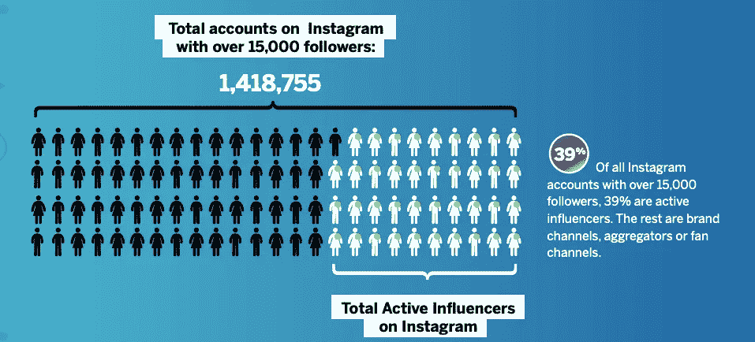
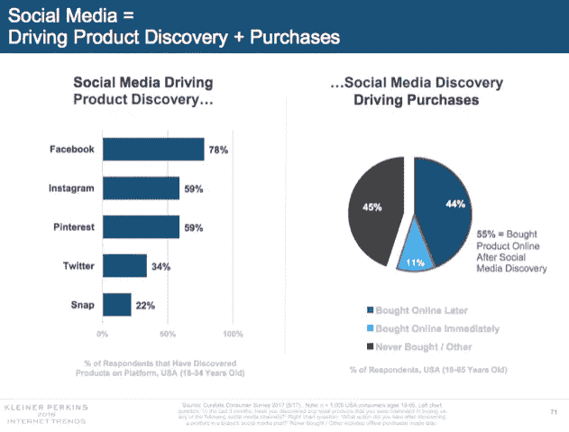
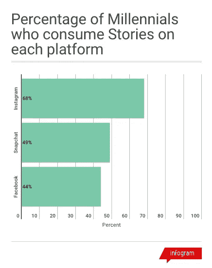
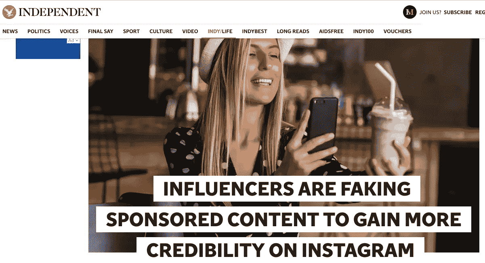
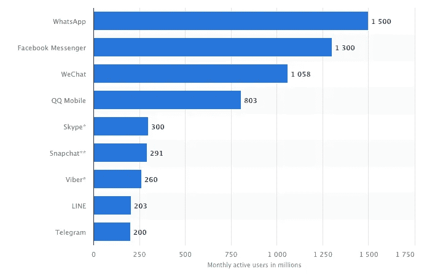
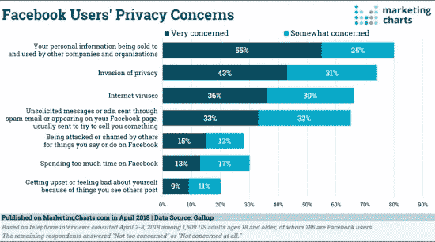
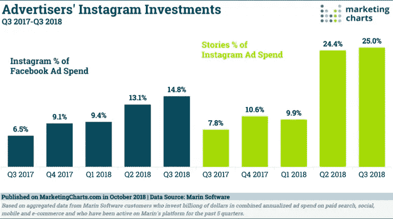
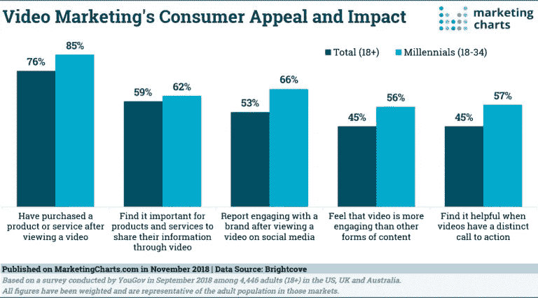
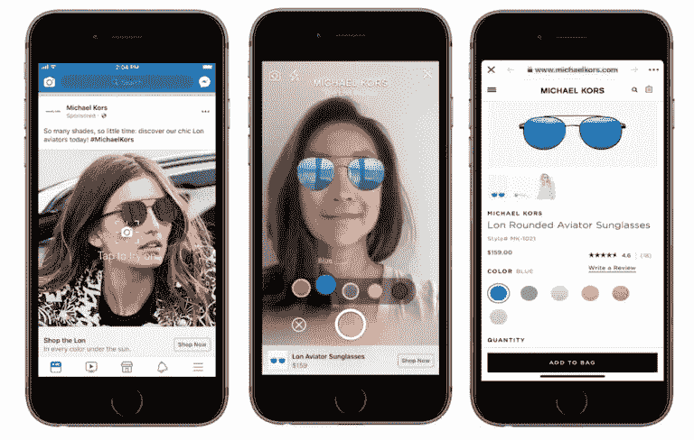

# 2019 年将遵循的 12 个社交媒体营销趋势

> 原文：<https://medium.com/swlh/12-social-media-marketing-trends-to-follow-in-2019-af2749d8019e>

## 这些是贵公司又一个成功的社交媒体营销年要遵循的主要趋势。

随着社交媒体格局快速变化，每年跟上最新趋势以确保您的战略仍然成功是非常重要的。

这是一个绝佳的时机来审视你现有的社交媒体营销策略，找出哪些有效，哪些可以改进。

2018 年对所有社交媒体平台来说都是忙碌的一年。有很多正面和负面的故事与它们的使用有关，现在是时候回顾我们的社会营销策略了。

下面让我们仔细看看今年的主要趋势，以及它们将如何影响 2019 年，以帮助你对你的策略进行必要的改变。

# **订婚比以往任何时候都重要**

脸书在 2018 年初宣布将重点放在有意义的互动上，作为他们更新算法的一部分。

这意味着他们的算法开始倾向于引发真正对话的内容，这启发了许多页面经理创建更多引人入胜的内容。

随着有机接触变得越来越困难，唯一的生存之道就是瞄准这样的内容:

*   有趣的
*   吸引人的
*   迷人的

算法正变得越来越智能，因此没有捷径可走。仅仅鼓励人们喜欢、评论、分享你的帖子已经不够了。社交平台正试图减少参与诱饵技术，因此从长远来看，你可能会因这些技术而失去现有的影响力。

因此，是时候停止“欺骗”来赢得参与，并开始为每个渠道思考改进的参与策略，以继续接触您的追随者。

# **影响者营销和微影响者的崛起**

影响者营销正在成为你营销组合中的一个既定元素。影响者可以通过付费赞助赚取数千美元，而品牌则不断为其活动寻找最佳影响者。

随着影响者营销的增长，对于中小型品牌来说，大影响者变得越来越昂贵。这时，微影响者就出现了，以弥补对影响者营销感兴趣和有合适的预算来尝试之间的差距。

微影响者可能没有名人的影响力，但他们可能对自己的追随者有更大的影响。即使是 4 万名追随者作为一个受众，对一个品牌来说也可能是完美的，只要他们与目标受众的正确影响者合作。

例如，一个食品品牌与一个拥有 3 万名粉丝的新兴食品博主合作，可能会比一个可能要求 20 倍预算的知名厨师获得更好的结果。

Source: Influencer DB

正如微型影响者不断赢得地盘一样，还有纳米影响者的趋势，或者拥有多达 1 万名追随者的影响者。他们可能没有大量的观众追随他们，但他们仍然可以对他们产生巨大的影响，无论是通过他们的工作，他们迷人的社会形象还是他们对特定行业/主题的热情。

纳米影响者不需要很大的预算来与他们合作，但你可能需要花更多的时间在研究上，以找到最适合你的品牌。

由于他们可能对影响者营销世界仍是陌生的，他们可能会寻求符合其价值观的合作伙伴关系，并可能持续更长时间。他们也更容易联系到，因为他们不必每天处理成千上万的信息。

# **促进销售的社交媒体**

社交媒体已经在产品发现阶段帮助客户。品牌能够通过社交渠道推广他们的产品，顾客在购买之前会先了解他们。

社交媒体不再仅仅是关于认知和参与，而是更倾向于商业漏斗中的考虑和销售支持。

根据玛丽·米克尔 2018 年互联网趋势报告，55%通过社交媒体发现产品的受访者后来继续购买。脸书似乎是人们发现新产品的第一个渠道，Instagram 和 Pinterest 紧随其后。

这些对于 2019 年意味着什么？品牌有很大的机会从这一趋势中受益，以改善他们的社会战略。你不需要总是在你所有的信息中进行推销来说服人们信任你。社交媒体可以帮助你讲述你的故事，提高考虑。当有人在网上发现你的产品后，你有责任提供流畅的体验，让销售变得更容易。

# **人工智能与客服**

机器人和自动消息已经出现在许多品牌的客户服务中。社交媒体让客户更容易接触到品牌，这意味着对响应时间的期望越来越高。

当品牌意识到这是一种添加额外客户支持的简单方法时，聊天机器人通过脸书的 Messenger 开始变得流行。

并非所有的客户都相信这是达成品牌的最佳方式，但由于最新机器人体验的智能和编程增强，采用率正在提高。越来越多的品牌开始花时间给机器人编程，让它们看起来尽可能真实。无论是赋予他们自己的个性，还是简单地预测尽可能多的客户问题，他们的工作方式肯定有了很大的进步。

人工智能还可以为那些希望得到一个常见问题答案的客户提供自动化的消息传递。品牌可以建立让顾客满意的信息，同时也节省了重复回答相同问题的时间。

2019 年，人工智能将成为社交客户服务的一部分，现在是更多品牌尝试确保客户尽快找到问题答案的时候了。

# **故事，故事，故事**

故事无处不在！通常持续 24 小时的垂直格式的视觉内容从 Snapchat 开始流行，并很快被 Instagram 复制，成为所有年龄段人群的全球趋势。

自那以后，Snapchat 可能一直在努力保持相关性，至少是以它为人所知的方式，但我们已经看到了 Instagram、脸书、Youtube 以及最近 LinkedIn 的故事。

目前每天有超过 4 亿人在 Instagram 上阅读故事，而脸书正试图将故事融入我们的日常生活。

广告商已经意识到 Instagram Stories 广告可能非常有效，Snapchat 和脸书跟进了他们目前的宣传和需求。

*Source: VidMob*

## *是什么让故事成功？*

*   它们很容易被创造出来
*   他们很迷人
*   在上传之前，它们不需要编辑或进一步思考
*   他们依赖真实性
*   他们很有趣
*   它们不一定会持续很久(这是它们接管 Snapchat 的主要原因之一)

# **假追随者的终结**

Instagram 是目前社交媒体领域最受欢迎的应用之一。有影响力的人受益于这款应用的成功，通过不断增长的受众而声名鹊起。

然而，众所周知，一些 Instagram 账户人为增加了粉丝数量，以提高人气。许多服务收费提供虚假粉丝，Instagram 知道这种情况迟早要停止。

就在上个月，Instagram 宣布，他们已经开始删除使用第三方应用程序来增加人气的账户的不真实的喜欢、关注和评论。他们实际上已经建立了机器学习工具来识别这种活动，以便在未来防止这种事情发生。

对于 Instagram 来说，这是保持其作为一个受欢迎的社交网络的声誉的一大步，在这里，人们(和品牌)可以通过真正的兴趣和参与来发展他们的社区。

由于变化刚刚开始，2019 年将证明，与你在社区中的实际影响力和参与度相比，追随者的数量不再重要。

作为一个品牌，如果你还没有接触到现有的追随者，就没有必要再去增加你的追随者。花更多的时间有机地发展你的社区，以避免看到(虚假的)关注者和喜欢者的突然减少。

# 消息传递将会增长更多

消息应用的使用量已经超过了社交媒体应用，这似乎是一种将主导 2019 年的趋势。人们正在从社交媒体上的公开帖子转向私人信息，无论是简单地联系朋友，还是与他们最喜欢的品牌保持联系。

消息传递之所以有趣，是因为品牌可以通过了解人们如何使用消息传递应用程序来找到他们渴望的参与。

Image: Statista

从 2017 年开始，营销人员认为消息传递是影响他们社交策略的第一个趋势。

WhatsApp、Messenger、Viber 和微信占据了通讯市场的很大一部分，它们已经推出了超越通讯的附加功能，从故事和新闻更新到客户服务和电子商务功能的自动化机器人。

作为一个品牌，有一个全新的世界可以尝试，我们已经看到大品牌和出版商进入信息趋势。

我曾问过乐天市场(Rakuten Viber)B2B 营销和传播主管黛比·多尔蒂(Debbi Dougherty)，品牌如何利用即时通讯应用成为一种增长趋势，以下是她的回答:

> "*进入 2019 年，媒体将继续寻求在年轻一代中找到自己的位置。如果没有一个用户可以方便地与内容交互的集中位置，就不可能接触到这些受众。消息应用程序提供了实现这一目标的最理想平台，提供了传统渠道无法实现的易用性和个性化体验。*

# 数据泄露使得信任比以往任何时候都更加重要

消息应用变得更加流行的原因是对社交网络越来越缺乏信任。

例如，对脸书来说，这是动荡的一年，这使得许多用户不愿分享他们的数据。

隐私问题日益严重，这让所有社交媒体平台意识到信任至关重要。脸书正在艰难地吸取教训，你需要更加注意数据的使用。

作为一个品牌，关于社交数据和隐私问题的讨论越来越多，这凸显了与受众建立信任的重要性。

对于一个品牌来说，对其受众透明是很有用的，无论是承认他们的错误，还是向受众更新最近的变化。这些因素可以帮助他们的客户信任他们，甚至在未来的活动中更愿意听取他们的意见。

# 缩小对特定渠道的关注

社交媒体营销正变得越来越有竞争力，最成功的专业人士意识到，你需要专注于你的业务中表现最好的渠道。

仅仅因为“每个人都在那里”而不得不加入脸书的日子已经一去不复返了如今，更重要的是去寻找与你的业务相关的利基受众。如果你没有看到一个成功的结果，没有必要向所有的平台传播同样的信息。

不要害怕把你的工作限制在两个渠道，例如，如果你注意到这两个渠道会给你带来最好的投资回报。

我们都可以通过充分利用时间，把时间花在只值得我们关注的频道上，来开始新的一年。

我们受到的干扰越多，就越有可能失去注意力。首先分析你的受众在哪里，哪些渠道更适合你的商业目标。

回顾你目前的表现，并设定目标，朝着你希望的正确方向提高。

# 广告支出正在增加，但你需要考虑广告饱和

社交媒体广告在过去几年一直呈上升趋势。我们现在能够在多个渠道创建社交广告，由我们来决定我们想要使用的广告的目标和类型。

许多在营销组合中使用付费社交的品牌越来越成功。毫无疑问，营销人员的广告支出在不断增长。

例如，Instagram 的参与度吸引了更多的营销人员增加他们在频道上的广告支出，包括提要和故事。

随着脸书的现有竞争变得更加饱和，Instagram 开始成为推广你的品牌的一个很好的选择。

广告支出的增长表明人们对一个平台的兴趣越来越大，但这也标志着推广你的业务的成本开始增加。

Instagram Feed 和 Stories 似乎为许多品牌带来了良好的投资回报，但如果更多的营销人员为特定平台创建广告怎么办？

随着 Instagram 越来越受欢迎，2019 年营销人员的社交广告支出可能会进一步增加。

然而，考虑到过度依赖一个平台不是一个好主意，无论是有机增长还是付费增长，这都是好的。

每个平台只有固定的广告空间，因此竞争可能会推动成本增加。

# 视频、播客和直播

博文在 2019 年依然可以有效。长篇文章仍然可以吸引读者，只要它们有吸引力，格式恰当，能够促进所有设备上的阅读体验。

然而，内容消费远不止文字，视频和播客取得了巨大成功。

从 Youtube 的兴起到 IGTV 的引入，社交媒体平台总是对突出视频内容感兴趣。

脸书甚至调整了他们的算法，以确保视频帖子更频繁地出现在我们的订阅源上。

视频营销正变得越来越有吸引力，不仅对品牌来说如此，对注意到突出内容的用户来说也是如此。

视频占领整个社交媒体世界只是时间问题。2019 年将有更多品牌在不同渠道尝试不同类型的视频:

*   带字幕的短视频对移动用户很有吸引力，每个人都可以观看。他们可以在任何社交媒体平台上找到，脸书在他们的算法中偏爱他们。他们可以制作非常有效的广告，并且已经在广告中广泛使用。
*   **Snapchat 和 Instagram Stories 上的垂直视频**越来越受欢迎，我们已经看到许多垂直格式的广告。由于移动屏幕上观看体验的改善，这种格式将更像是一种趋势。
*   **讲述有力故事的长视频仍然能吸引观众。无论是 Youtube、脸书，甚至是 IGTV，人们越来越需要有趣到足以说服观众看几秒钟以上的视频故事。**
*   **流媒体直播**也是另一个大趋势，现在可以在许多不同的平台上使用。用户变成了广播公司，品牌变成了出版商，以拉近与受众的距离。有很多机会可以从直播策略中获益。这

除了视频，播客也取得了越来越大的成功。音频内容将收音机时代带了回来，成为您在旅途中了解最喜爱的故事和品牌的绝佳方式。

更多的营销人员正在尝试播客，要么是为了建立自己的个人品牌，要么是为了推广他们的业务。播客的特别之处在于他们仍然关注内容而不是推广。人们订阅播客是因为他们对内容感兴趣，无论它来自一个品牌还是另一个人。

# 增强现实将变得更加主流

社交媒体和 AR 在过去几年中进行了很好的结合，我们看到更多渠道的应用只是时间问题。

我们已经看到品牌如何利用 AR 来促进客户体验。增强现实可以让品牌信息更吸引人、更有趣、更具可操作性。例如，在购买前可以选择试戴一副眼镜，可以增加销售量。

脸书正在大力投资 AR，试图主导该领域，这意味着他们了解这项投资可能带来的潜力。

他们已经宣布引入 AR 广告，以使社交商务更具吸引力。此外，在 Messenger 中还提供了 AR 相机效果，以确保消息传递和客户体验不断改善。

我们的目标是将用户留在平台上，而品牌可以通过提高客户满意度来利用这一趋势。

# **概述**

所有这些趋势意味着什么？

2018 年对于社交网络来说是重要的一年，这可能会比我们现在所能预测的更多地影响他们的未来。

社交媒体营销正走向一个更加关注投资回报率、新技术以及品牌和客户之间信任关系的阶段。

在数据泄露、新兴技术和新平台之间生存的唯一方法是确保您:

*   了解你的观众
*   回顾你的社交媒体营销策略
*   为新工具和技术分配时间和预算
*   把你的注意力放在有效的事情上
*   在每次活动中，尽最大努力与用户建立信任

# Tereza Litsa 是 Lightful 的社交媒体经理。关注她@terezalitsa

## 这篇文章发表在 [The Startup](https://medium.com/swlh) 上，这是 Medium 最大的创业刊物，拥有+405，714 名读者。

## 订阅接收[我们的头条](http://growthsupply.com/the-startup-newsletter/)。

