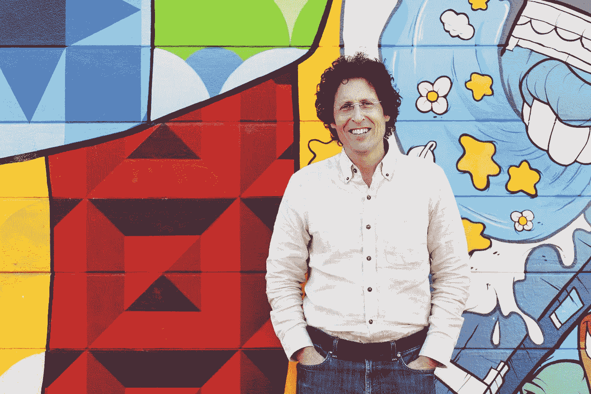

# 1 . 2 亿美元的剁碎蔬菜基金

> 原文：<https://medium.com/swlh/120m-for-chopped-veggies-338d644e821c>

这是道格·埃文斯。他做了一些你没做过的事。

本周彭博社科技称之为“骗局！”在 Juicero 上，冷榨果汁领域的创业公司(没错，就是这个东西)。Juicero 已经筹集了 1.2 亿美元的风险投资，向你出售 400 美元的冷榨榨汁机和 7 美元的蔬菜袋，这些蔬菜袋可以(部分)以 0 美元的价格做你手工做的事情。

你可以在这里观看视频:

 [## 硅谷售价 400 美元的榨汁机可能感受到了压力

### 去年硅谷资金最雄厚的小工具初创公司之一是 Juicero Inc .它生产一种果汁机…

www.bloomberg.com](https://www.bloomberg.com/news/features/2017-04-19/silicon-valley-s-400-juicer-may-be-feeling-the-squeeze) 

TechCrunch、《赫芬顿邮报》和其他渴望报道的媒体机构立即拿起了这篇文章，并用引人注目的短语作为自己的头条新闻，比如:“ [Juicero 正在枯竭？](https://techcrunch.com/2017/04/19/crunch-report-juicero-running-dry/)、[400 美元的 Juicero 榨汁机是硅谷永远失败的最搞笑的](http://www.huffingtonpost.com/entry/juicero_us_58f793abe4b0de5bac43242f)。

可笑吧？但是等等，还有呢！

在我们陷入目瞪口呆和相互指责之前，让我们想想以下几点:我从未筹集过 1.2 亿美元。很有可能你也没有。

在“最有趣的硅谷永远失败”的中心，有一位非常能干、非常娴熟的企业家，他已经完成了大多数创始人梦寐以求的事情:有一个愿景，销售故事，获得资金，让它成为现实。

就这么简单。

关于这个特殊的愿景，我仍然不能 100%确定是对创始人的推销术留下可笑的印象，还是对相当于更多消费者浪费的过度投资感到彻底厌恶。

想想这个:Juicero 用一次性包装出售 8 盎司的水果和蔬菜。水果和蔬菜不是有自己的一次性包装吗？

所以，两个故事。一个是关于硅谷的过剩，另一个是关于一个有远见卓识的杰出企业家。

这两个故事哪一个最相关？

自己决定！点击下面的视频，观看 Juicero 创始人道格·埃文斯(Doug Evans)以 700 澳元(现在只需 400 澳元)筹集 1.2 亿美元的销售宣传。)冷榨榨汁机和 7 美元的蔬菜袋，做你手工做的事情，0 美元:

04/21/17-快速更新:Juicero 的首席执行官杰夫·邓恩刚刚发布了一篇[媒体](https://medium.com/u/504c7870fdb6?source=post_page-----338d644e821c--------------------------------)帖子，为 Juicero 的技术辩护，并为任何不满意的客户提供全额退款。干得好。如果你从未读过安迪·格罗夫的《只有偏执狂才能生存》，你现在应该读一读了，杰夫似乎读过。

以下是这篇文章的链接:

 [## Juicero 新任首席执行官的笔记

### 嗨，我是杰夫·邓恩。你可能不知道我担任 Juicero 首席执行官的新职务，因为我从 11 月份才来到这里。但是我已经…

medium.com](/@Juicero/a-note-from-juiceros-new-ceo-cb23a1462b03)