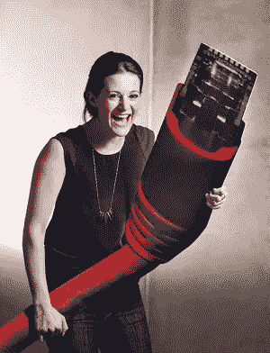
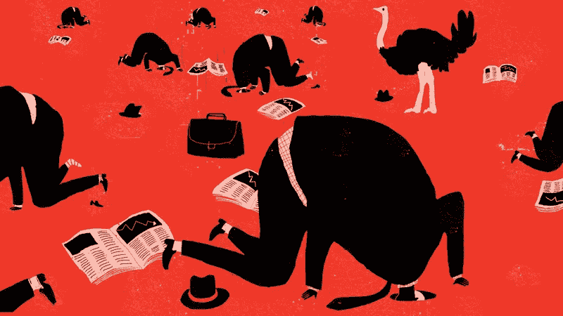

# 13 个混蛋阻碍了你的职业生涯

> 原文：<https://medium.com/swlh/13-fucks-that-are-holding-you-back-from-the-career-you-wish-you-could-have-2c5e366d90d1>

Image Credit: [Timothy A. Clary](https://www.instagram.com/timothyclary/?hl=en)/AFP via Getty Images

你想象你的职业是某种方式。然后你意识到你离你脑海中那个可笑的形象已经很远了。

你经历了你的职业生涯，就像我努力追逐彩虹一样。然后有一天，你被一场你从未预料到的职业戏剧狠狠打了一拳。打在脸上的那一拳让你大吃一惊，突然间你可以看清事情了。

你现在知道为什么你的职业不是你想象的那样了。

你关心的太多了。你想要的职业生涯中所有的小事都堵塞了你的头脑。你需要采取的重要行动永远不会发生。

你会像看到羊排的狗一样分心。

> 分散注意力的方式是你在职业生涯中放弃的东西，就像免费的钱一样。

一旦有人想让你关心一些与你无关的无意义的问题，你就像坐在第一排的怪人一样举起手，他知道所有的答案，并希望每个人都知道。

你希望拥有的职业生涯每天都在被那些你为了无关紧要的事情而放弃的混蛋毁掉。

## 这是阻碍你职业发展的 13 个混蛋:

# 1.试图取悦每个人

如果你现在要做一个演讲，大概的数据会是这样的:

*   50%的人不了解你，还没有对你做出评价
*   25%的人对你恨之入骨，他们甚至不知道为什么
*   25%的人欣喜若狂，认为你是自花生酱切片面包以来最棒的东西

现在，这些数字是粗略的，但你明白我的意思。虽然不是你自己的错，但人们会讨厌你。事实上，你越是得到你梦寐以求的职业，就越有可能招致更多的憎恨。

> “不要试图取悦每一个人。胜算对你不利

Image Credit: [The Ann Arbor News](https://aadl.org/N129_0296_012)

# 2.对经验的需求

你不需要。零。没有。纳达。

我下周开始从事数字营销工作。自 2011 年以来，整个行业都在向前发展，当时我对数字营销的危险性有了足够的认识。尽管每次面试都说我需要经验，我还是从零开始。

如果你相信经验说教者，你的职业生涯将一事无成。你永远都在等着有人告诉你，你知道得够多了，或者你值得拥有。那只是别人把他们的谎言投射到你身上。

> 雇主通常要求大学经历，因为招聘人员在刚开始工作时必须有大学经历，所以他们觉得如果你没有大学经历，这是不公平的。
> 
> 现在已经不是 1989 年了。我们有互联网。你可以关着门在你的卧室里获得经验。

选择资源丰富性。
选择展示现实世界的成就。
选择看到一切都是相互关联的。

如果你在咖啡馆工作，那么你可能对服务有足够的了解，可以在亚马逊的服务团队工作。

如果你经营了一家创业公司并破产了，那么你可能对管理人员、预算和产品略知一二。一切都和一切有关。

# 3.没有尝试

*“去吧儿子！”小时候，我最好的朋友爸爸会在健身房对我说。通过每周四次的训练，我的体重一度从 60 公斤增加到 100 多公斤。谁会想到呢。*

我做了一次演讲。最终进入了州冠军赛。
我约会过一次。找了个超级酷的女朋友。

**我答应了一次领人的机会。现在，我为一家上市公司管理一个营销团队。**

试一试，你会发现以下几点:

*   你想要什么
*   你的优势和劣势
*   你是否是一个领导者

试一试。

# 4.专注于过去

已经写好了，完成了。

*也许某个公司对你不好。
也许你的联合创始人带着公司跑路了。也许你在工作中被欺负了。*

这都是过去的事了。不要让这些阻碍你，或者让你相信你的职业生涯永远不会如你所愿。

外面有好人。不是每个机会都会在你眼前化为灰烬。

Image credit: Shutterstock

# 5.运气

没有运气。你自己做。

*   成为一个优秀的问题解决者。
*   做正确的事。

这就是你赢得好运和随之而来的机会的方式。

# 6.和团队一起喝酒

只是因为有工作饮料，并不意味着你必须参加。

因为太忙了，我已经错过了两年的工作饮料。做你要求的事？为你们所有人写下这些怪异的文字，并试图留下一份遗产，类似于不仅是我，而且是我未来的孩子都会为之骄傲的东西。

这是个不去上班喝酒的好理由，你不觉得吗？

人们会理解的。

去喝酒或者不去。你不会因为啤酒肚而死。

# 7.担心失败

我在公司的高层领导面前做了一次演讲。我谈了很多我最近失败的事情。

事实上，他们因此而尊重我，因为他们可以看到那些失败导致了我即将向他们展示的巨大成功。

诚实是性感的。

不要担心失败——谈论它，就像它是常态一样，因为它就是常态。

# 8.不得不朝某个方向看

> 我最近在一次会议上见过这个女孩。她假扮成卖螺丝钉的男商人赚了数百万美元。她穿着匡威运动鞋，一些宽松的牛仔裤，有几个纹身。
> 
> 你不需要看起来很特别。看起来像你想要的样子。

Image Credit: [Nicole Kersh](http://nicolekersh.com.au/)

当你的外表是你想要的样子时，你不仅感觉更好，而且表现更好。如果你不喜欢像我一样穿西装，就把西装留在家里。

如果你喜欢短发，那就剪吧。如果你穿紧身牛仔裤好看(不像我)，那就穿吧。

拜托，拜托，别他妈的在乎别人想让你长什么样。那是他们的愿景，不是你的。

# 9.八卦的要求。

现在，你职业生涯中认识的某个人正在犯错误、转行或失败。

你对此说三道四——最糟糕的是对此进行猜测——将一事无成。关注你自己，如果你想要你一直想要的职业，你如何变得有价值。

# 10.拆除沙堡的美梦。

离开一家公司让你有机会毁掉它。

如果你愿意，你可以建造沙堡，然后拆除它。拆除沙堡需要努力、思考和现实，你会被发现并毁掉你的名声。

真的有必要像四岁小孩一样拆掉沙堡吗？

# 11.报复糟糕的老板

不要太在意对你不公平的坏老板。

Image Credit: [Shutterstock](http://www.shutterstock.com/)

告诉你所有的老客户离开或者散布关于他们的谎言并不能弥补他们作为一个领导糟糕透顶的事实，甚至可能没有意识到这个事实。

你试图报复会毁了你自己的职业生涯。报复的最好方法就是走出去，粉碎你的目标！

# 12.来自所谓“专家”的验证

在我们的职业生涯中，需要被告知做什么是非常真实的。

每个人都自称是专家。有影响力的人、导师、同事都声称比你更了解你的职业。你误以为自己需要他们的支持或认可。你不知道。

Image Credit: Olvind Hovland/[Getty](https://www.gettyimages.com.au/illustrations/ignorance?sort=mostpopular&mediatype=illustration&phrase=ignorance)

很有可能没人会看到你想象中的职业生涯。对许多人来说，你如何想象你的职业生涯似乎是不可能的或愚蠢的。

不是那样的。你需要的认可来自于你自己。

> “如果你把你的职业想象成某种方式，那么实现它是你力所能及的”

这种强烈的意识让我不再是“一个普通的销售人员”，并让我在互联网上的博客上发表了很多作品。没有专家能告诉我会发生这种情况。

我先看到的。

# 13.当我们这么做的时候，从所谓的“专家”那里接受训练

这个女孩前几天对我说，我应该参加她的研讨会。

她是一个生活教练，可以帮助我改变我的生活。我问她:“你是怎么进入那一行的？”

*“哦，在我参加了他的研讨会后，这家伙让我陷入其中。”*

这是真正让我震惊的东西。另一个人走过来说:

*“在过去的六个月里，我参加了十次研讨会。我也应该去你家吗？”*

好吧，我也喜欢研讨会，但是我们都训练过度了。我们都需要减少对知识、大师和专家的关注，实际上采取一些行动。

# 行动呼吁

如果你想提高你的工作效率，学习一些有价值的生活窍门，那就订阅我的私人邮件列表吧。你还将获得我的免费电子书，它将帮助你成为改变游戏规则的在线影响者。

[**点击这里立即订阅！**](http://timdenning.net/free-ebook)

## 这篇文章发表在 [The Startup](https://medium.com/swlh) 上，这是 Medium 最大的创业刊物，有+ 378，529 人关注。

## 订阅接收[我们的头条](http://growthsupply.com/the-startup-newsletter/)。

