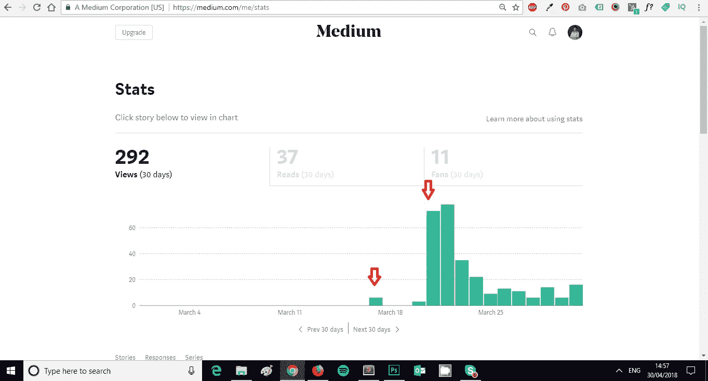
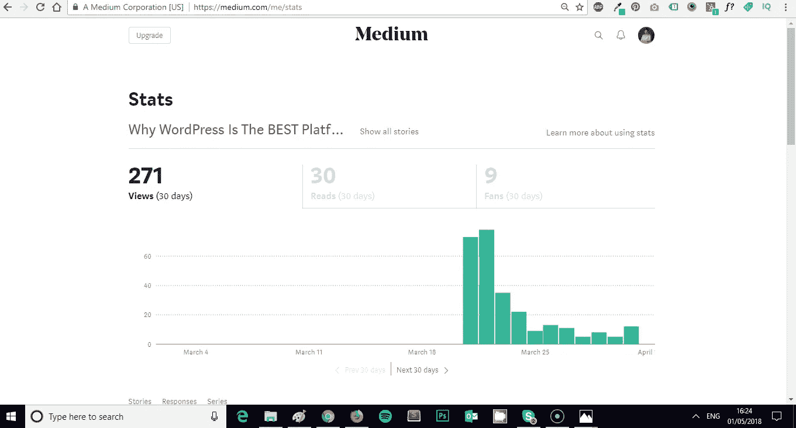
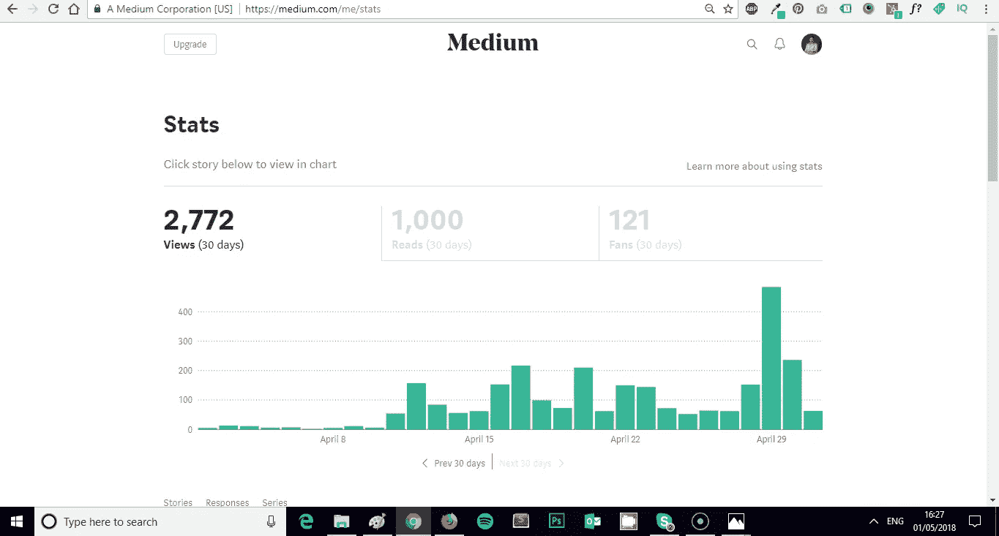

# 13.我如何在 6500%— 30 天的培养基中培养我的培养基

> 原文：<https://medium.com/swlh/13-how-i-grew-my-medium-following-6500-30-days-of-medium-c9d2d6f80b51>

欢迎回到 **30 天介质。**

今天我将向你展示**我是如何在 30 天内增长我的媒体关注度 6500%的，并在这个过程中证明我上一篇文章的观点。**

如果你错过了下面的**我的媒体挑战**的前 12 天，你可以补上:

## [0。30 天的培养基](/swlh/30-days-of-medium-c7ab34953c6c)

## [1。建立自己的网站需要什么？— 30 天的培养基](/swlh/1-what-do-you-need-to-build-your-own-website-30-days-of-medium-1ed1ad4e505c)

## [2。如何找到你热爱的事业— 30 天的媒介](/swlh/2-how-to-find-a-business-you-love-30-days-of-medium-cb7a4a702d1b)

## [3。如何建立自己的网站—媒体 30 天](/swlh/3-how-to-build-your-own-website-30-days-of-medium-587f994672ec)

## [4。如何衡量你网站的表现——30 天媒体](/swlh/4-how-to-measure-your-websites-performance-30-days-of-medium-75e650969695)

## [5。如何通过回答他们的问题获得更多的客户——30 天介质](/swlh/5-how-to-get-more-customers-by-answering-their-questions-30-days-of-medium-b462d237533e)

## [6。成功的商业网站备忘单——媒体 30 天](/swlh/6-the-successful-business-website-cheat-sheet-30-days-of-medium-42f89eb43e67)

## 7。如何衡量成功——媒体 30 天

## 8。了解在线销售漏斗— 30 天媒介

## 9。什么是流量，为什么流量很重要？— 30 天的培养基

## 10。什么是 Google URL Builder，为什么要使用它？— 30 天的培养基

## 11。通过自动化你的社交媒体日程，让你的流量翻倍——30 天的媒体

## [12。如何辨别什么好卖— 30 天介质](/swlh/12-how-to-tell-what-sells-30-days-of-medium-ba3291d029d2)

## [13。我如何在 6，500% — 30 天的培养基中培养我的培养基](/swlh/13-how-i-grew-my-medium-following-6500-30-days-of-medium-c9d2d6f80b51)

## [14。你如何看待事情很重要——30 天中期](/swlh/14-how-you-look-at-things-matters-30-days-of-medium-f641b9733b90)

## [15。如何向小型企业销售服务— 30 天中等](/swlh/15-how-to-sell-services-to-small-businesses-30-days-of-medium-d6604c63b3b7)

## [16。如何通过有效的提案赢得更多交易— 30 天的媒介](/swlh/16-how-to-win-more-deals-with-effective-proposals-30-days-of-medium-481f16bbc86f)

## 17。如何在 10 分钟内建立一个网上商店——30 天的媒介

## [18。如何在任何地方工作— 30 天介质](/swlh/18-how-to-work-from-anywhere-30-days-of-medium-1c9cfa2d662f)

## [19。为什么你的网站会破坏你的销售——30 天媒体](/swlh/19-is-your-website-sabotaging-your-sales-30-days-of-medium-f63bdbdb350)

## [二十。你的流量从哪里来？— 30 天中值](/swlh/20-where-does-your-traffic-come-from-30-days-of-medium-a9b2d2c088bb)

## [21。如何真正识别倦怠——30 天中等水平](/swlh/21-how-to-actually-recognise-burnout-30-days-of-medium-7972a7a7a89e)

## [22。如何修改你的时间表并完成两倍的工作——30 天中等时间](/swlh/how-to-hack-your-schedule-and-get-twice-as-much-done-30-days-of-medium-441a509dc9be)

## [23。不要模仿你的竞争对手——30 天的媒介](/swlh/23-dont-copy-your-competitors-30-days-of-medium-56382b7ba8ed)

## 24。如何 SEO 优化一篇博文——30 天的媒介

## 25。独特或被遗忘——30 天的媒介

## 26。跟着感觉走——30 天中等水平

## 27。人们不支付平均 30 天的中等费用

## 28。如何做关键词研究— 30 天介质

## [29。为什么帕累托原则是世界上最大的诀窍——30 天中期](/swlh/29-why-the-pareto-principle-is-the-worlds-biggest-hack-30-days-of-medium-1c225f5c8aa1)

## 三十岁。你的内容比你的电话更有利可图——30 天的媒介

# 从零开始

46 天前的 3 月 17 日，我加入了 Medium 平台。

在之前，我**从未使用过 Medium，正如我在《Medium 30 天》的第一篇文章中所写的那样，**我真希望我能早点注册**。**

涉世不深，又不熟悉**媒体，我决定写一篇经过充分研究的长篇文章。**

## 那篇文章是[为什么 WordPress 是在](/swlh/why-wordpress-is-the-best-platform-to-build-your-business-or-startup-website-on-df3fe932fad7)上建立你的商业或创业网站的最佳平台

# 嗯，那没用

我发表了我的帖子，它立刻就被否定了。

这对我没有意义，因为我花了很长时间**研究它**和**用值**包装它。

我决定做一些调查，找出我做错了什么。

# 发现出版物

我在之后阅读了很多关于**如何发展你的媒体的文章，并很快发现了**媒体出版物。****

我已经爱上了 Medium 的想法和它的出版系统，出版物为我敲定了这笔交易。

我可以为现有的出版物撰写内容，并拥有自己的目标读者，这个想法让我惊叹不已。

这就像能够在一个大网站上发表客座博文一样，但是更好。

# 加入创业公司

我真的很喜欢这家初创公司的外观，所以我联系了他们，提交了我的帖子，让他们知道这是刚刚出版的，我很乐意通过他们独家发布。

他们显然也喜欢它的样子，因为**他们接受了我的帖子**，并允许我成为他们**的优秀出版物**的作者(再次感谢！).就我而言，它至今仍是最好的媒体出版物。

# 发射

显然成功了。看看下面的数据。第一个红色箭头显示了我的帖子在我自己发表时得到的糟糕的反响。第二张显示了它在初创公司上线的第一天。

The Startup Publication

我决定只专注于为初创公司写作，因为他们的观众就是我的观众，随着时间的推移，我的成长将有助于他们的成长。

# 我的前 15 天

当我开始使用**媒体时，我的浏览量为 0，阅读量为 0，关注者为 0。**

在我上**平台的前 15 天，我设法爬上了:**

**292 次浏览**

**37 读数为**

**11 粉丝**

**0 追随者**

所有这些实际上都来自一篇文章，我的**为什么 WordPress 是在**上建立你的商业或创业网站的最佳平台。

我在月底前自己发表了另一个**小型 WordPress 帖子**，但是得到的**基本上没有再对其进行牵引。**

# 我的未来 30 天

在我的**第一个 15 天**中**接近尾声的时候**我决定**开始这个挑战，我将每天写一篇帖子，持续 30 天，讲述如何在网上建立、发展和扩大业务。**

30 天过去了，这是我的统计数据。

**2772 次浏览(增长 849%)**

**1000 次读取(增加了 2602)**

**121 粉丝(1000%增长)**

**65 名追随者(增长了 6，500%】T27**

如果你问我的话，我觉得相当不错。我对自己的**成长**超级开心**。**

**我绝不是拉里·金**，但从一个没有关注者的**起点开始，并且没有预先存在的关注者**，我认为这是惊人的，这都归功于 Medium 平台。

# 证明我的观点

在我的上一篇文章中，我谈到了吸引人的标题的重要性，我给这篇文章起了一个**故意的超级吸引人的**标题是有原因的，看看我是否能在一篇帖子上达到我的最高**浏览量。**

# 到目前为止我学到了什么？

首先，我离**还有很长的路要走。**

就观点和读者来说，我的很小。我计划在接下来的几个月里改变这一点，因为我喜欢媒体。

我还了解到:

## -标题推动浏览

## -精彩的内容推动阅读

## -与你的观众交流能赢得掌声

## -定期发帖有助于增加我看到的浏览量，并最终提高我的读者增长速度

## -相对于长篇内容，中型读者更喜欢更短、更快的帖子

## -正确使用标签有助于提升浏览量

## -如果你没有现有的作者身份，为出版物写作是一个很好的选择。这有助于增加你的读者群，也有助于出版物以与读者相关的新鲜内容繁荣发展。

## -中型统计仪表板太棒了

# 下一步是什么？

我刚刚加入了**中等合伙人**计划，并将很快尝试一些**带薪职位。**

我想看看在媒体上写作和每天分享有用的、有价值的内容能挣多少钱。

# 还有 17 天

我的 30 天中级挑战只进行了 13 天，所以我还有**超过一半的挑战要进行**。

我很想知道**接下来的 30 天会怎样**，以及我是否能保持同样的**读者数量和指标增长**。

我会在我的挑战的**结束时再写一篇这样的文章，让你知道**进展如何。****

## 关于这个话题有什么问题吗？请在评论中告诉我。

## 你可能也喜欢这个:

## [为什么 WordPress 是在](/swlh/why-wordpress-is-the-best-platform-to-build-your-business-or-startup-website-on-df3fe932fad7)上建立业务或创业网站的最佳平台

## 如果你喜欢这个故事，请点击👏按钮，并跟随我的其他 30 天的媒介。

## 这个故事发表在 [The Startup](https://medium.com/swlh) 上，这是 Medium 最大的创业刊物，拥有 321，672+人关注。

## 在此订阅接收[我们的头条新闻](http://growthsupply.com/the-startup-newsletter/)。

