# 为你的初创公司 iPhone 应用程序拍摄 13 个鼓舞人心的应用程序商店产品创意

> 原文：<https://medium.com/swlh/13-inspiring-app-store-product-shot-ideas-for-your-startups-iphone-app-826e512e0285>

App store 优化不仅限于在标题中填入关键词，并希望 app store 将你排在竞争对手之上。远不止这些。

App store 优化包括增加你的应用从 app store 下载的可能性的所有因素。是的，你可以使用关键词来提高你的排名，但你也需要确保人们一旦发现你的应用程序，就会想下载它。

应用程序开发者可能会将所有的时间和精力都花在应用程序的外观和感觉上，而忽略了应用程序商店中的产品照片——他们只是简单地对应用程序进行截图，并希望人们能明白他们在看什么。

那太不理想了！

相反，你需要为你的应用商店列表创造视觉效果，鼓励人们下载。

不幸的是，我们已经看到太多应用程序商店形象不佳的应用程序。为了防止你犯同样的错误，我们分析了 50 多个 app store 产品照片——好的、坏的和丑的——并确定了 13 个明确的例子，以帮助你为你的应用选择正确的照片。

如果你想创作注重转化的产品照片，这篇博文是值得收藏的。

如果您希望有一份 PDF 格式的指南与您的团队分享，我们也为您准备了— [**点击此处下载 13 张产品照片(外加两张)**](http://content.mindsea.com/15-app-shots) 。完全免费。

所以让我们开始吧！以下是 13 个 app store 产品照片，可以给你一些启发:

# 展示优先功能

# 例子:亚当帮忙

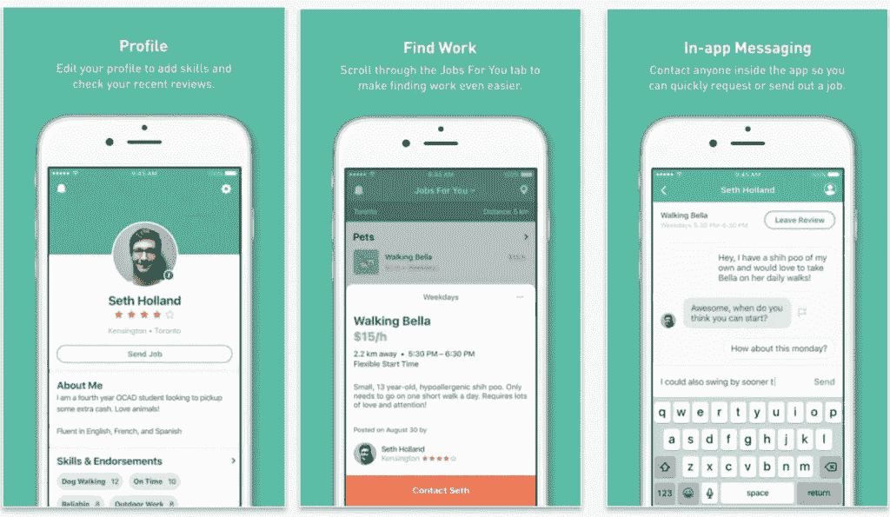

无论你的应用是一个家喻户晓的名字还是一个全新的产品，你都需要确保潜在的用户能够看到你的应用到底是做什么的。Adam Helps 应用程序商店列表是一个很好的例子——截图显示了应用程序的运行情况，并清楚地传达了用户可以使用该应用程序做什么。它向人们展示，在几秒钟内，他们可以在应用程序上发布一份工作或找到一份工作清单，并直接与雇用他们或他们决定雇用的人沟通。

# 和潜在用户一起玩得开心

# 例如:Bitmoji

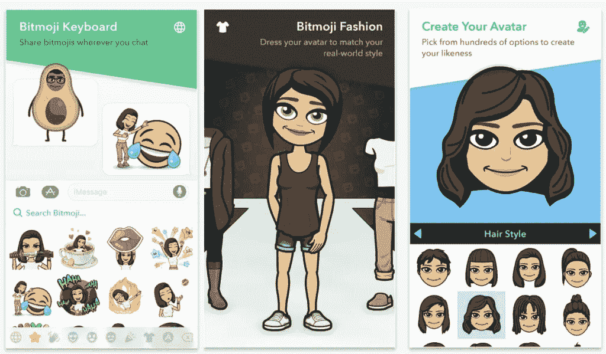

Bitmoji 的团队知道，笑是人类最强大的情感之一。在第一个屏幕上，一个穿着鳄梨西装的人和一个哭着笑着的表情符号会立即产生联系。然后，应用程序的优势和个性化功能在其余的框架中进行了说明。

# 展示真实生活经历

# 例如:脸书

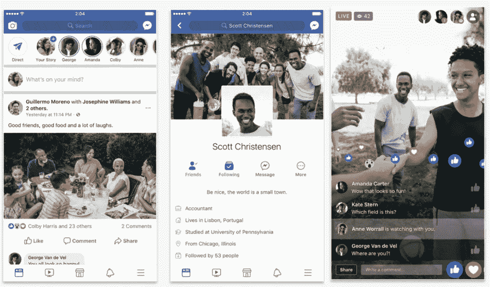

成为知名 app 的一个好处是，你其实不需要解释自己。人们知道脸书。每天都有数百万人使用脸书。脸书没有在每个镜头中解释它的功能，而是简单地展示了发生的经历，并通过他们的应用程序分享。对体验和“好朋友、美食和欢笑”的关注是他们展示脸书在现实世界中拉近人们距离的方式。

# 了解你的目标受众

# 例如:Instagram

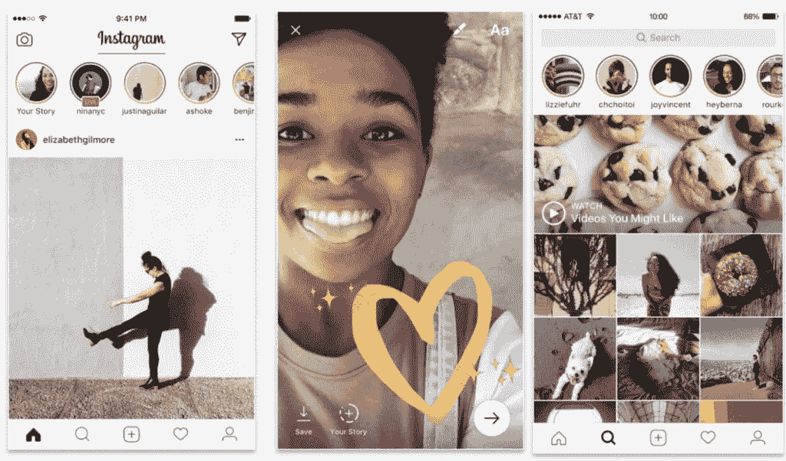

comScore 的最新研究显示，Instagram 的受众中有近 60%是女性。因此，只有在第一、第二和第三帧中，你看到女性使用该应用程序才有意义。如果你想让你的观众下载你的应用，重要的是你的视觉效果能引起共鸣。

# 不要降低你产品的价值

# 例子:冷静

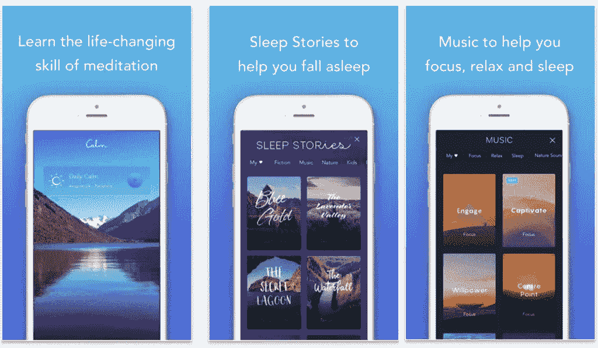

我们是冷静应用的超级粉丝。它的产品照片不仅让你感到放松，还传达了应用的价值主张。在第一个屏幕上，你读到冥想可以“改变生活”从这一点来看,《冷静》杂志并不羞于宣扬睡眠故事等关键特征，以及冥想可以改善生活的情况。

# 放大关键特征

# 示例:Flipp & Lyft

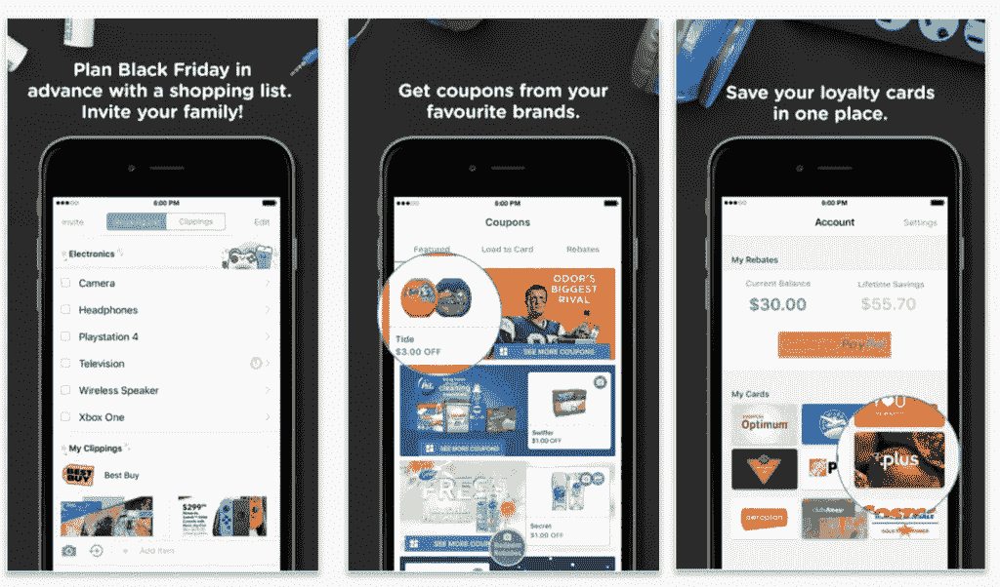

一些手机应用设计者错误地认为他们的产品照片必须是产品的截图。事实上，你可以从你的截图中获得一些乐趣，展示一些特定的功能，就像 Flipp 的人对这些产品照片所做的那样。他们使用放大技术来突出折扣和他们的忠诚度计划。

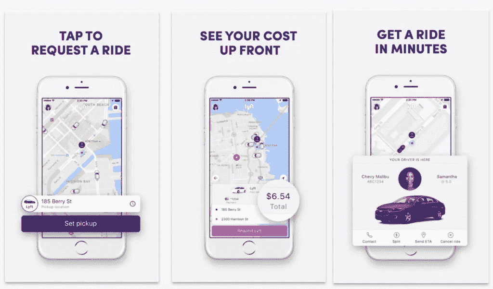

Lyft 做了一些类似的事情，放大了通过 Lyft 请求搭车的三个主要步骤。作为奖励，放大的部分足够大，人们可以看到应用程序的附加功能，超出了每张图片顶部的描述。

# 帮助人们想象使用你的应用是什么样的

# 例如:新书

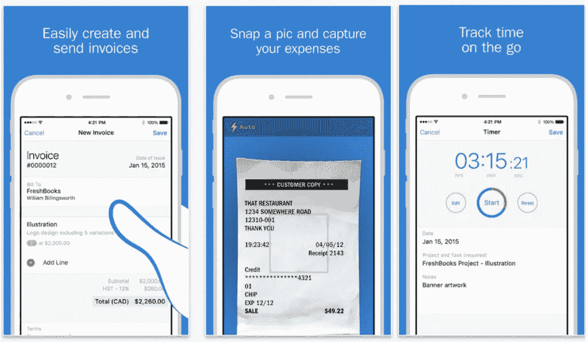

FreshBooks 的工作人员让用户很容易就能感受到这款应用。首先，使用应用程序的手的插图有助于潜在客户将应用程序可视化在他们自己的手中。然后，第二张图片通过显示应用程序扫描实际收据，将现实世界与数字世界结合起来，使人们很容易理解应用程序的功能。

# 利用你的优势

# 例如:网飞

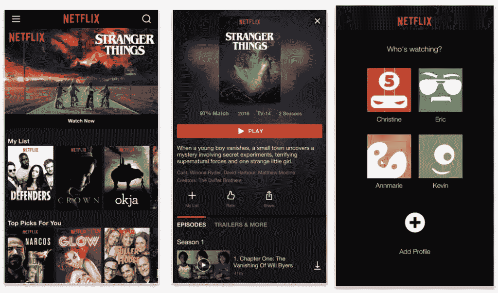

《奇异事物》是网飞最受欢迎的节目之一。它获得了无数奖项，并在全球范围内拥有大量追随者。如果你的品牌因某件事而出名，那就利用它。把熟悉的东西放在前面和中心，与潜在客户建立联系，吸引他们下载。

# 用面部表情吸引注意力

# 例如:Facebook Messenger

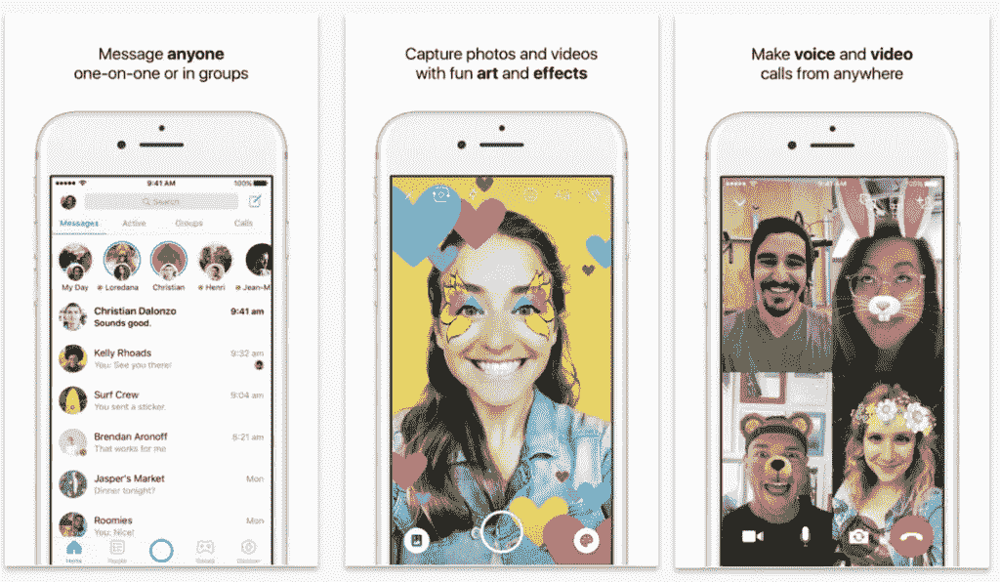

当你看上面的产品照片时，你看到的第一件事是什么？如果你和大多数人一样，你的目光会立刻转向中间的人或者右边截图中的人。人们爱人们。我们在云端寻找面孔。我们在泡泡中寻找面孔。我们在吐司里寻找面孔。如果你在销售一款包含照片、视频或聊天功能的应用，从脸书那里获得灵感，使用真实的面孔来产生积极的回应。

# 重要的大胆的话

# 例如:Wattpad 的浣熊

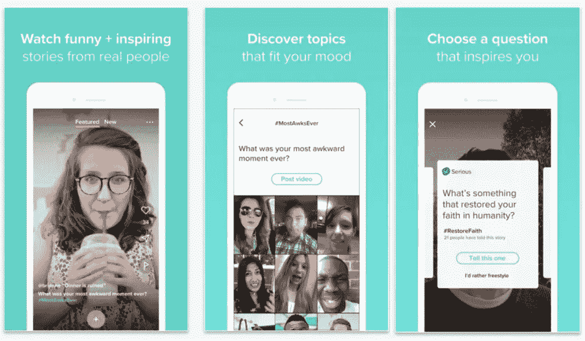

像脸书一样，Wattpad 的浣熊知道脸的价值。和脸书一样，他们也认识到强调重要词汇的价值。这个应用程序的目标是创建一个鼓舞人心和积极的地方来与其他人互动，所以“有趣+鼓舞人心”在第一帧中被加粗。在第二帧和第三帧中，粗体文本简要介绍了如何使用该应用程序。

# 不要觉得受限于应用商店的框架

# 例如:Shazam

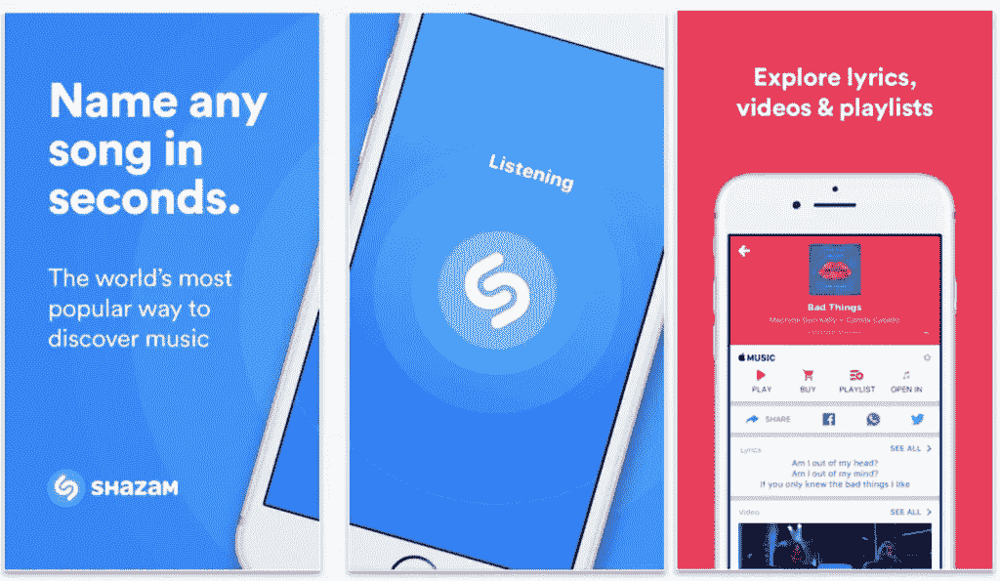

规则就是用来打破的。许多应用程序制造商认为，应用程序商店中的每个框架都应该用于单独的产品屏幕。但一些设计师，比如 Shazam(被苹果以 4 亿美元收购)的人和我们在 MindSea 的团队并不坚持这一假设。结果尤其引人注目。

# 利用心理学来吸引潜在客户

# 例如:TBH

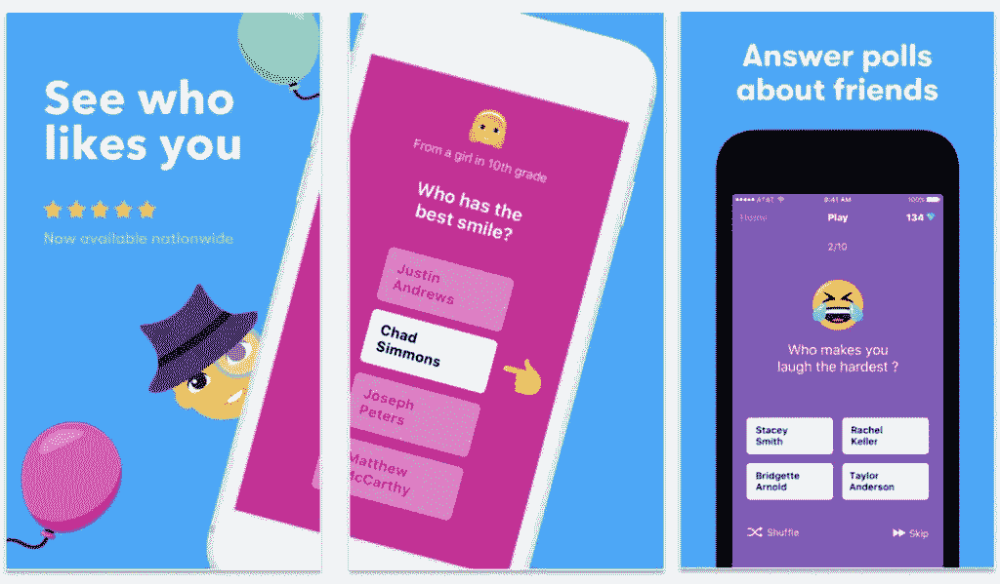

利用心理学来影响潜在客户无疑是一个敏感的话题——但它确实有效。在这个例子中，你可以看到 TBH 用文字**“看谁喜欢你**”明显是在利用人们的不安全感

# 包装东西

无论你设计的是 iPhone 应用还是 Android 应用，你用来推广产品的产品照片都很重要。

你知道求职面试时第一印象很重要。嗯，它对应用程序下载的工作方式是一样的。人们手机上的空间是有限的，所以你需要向他们展示为什么*你的*应用值得下载。

如果你正在寻找更多设计更好的应用程序产品图像的技巧， [**在这里下载完整的指南。**](http://content.mindsea.com/15-app-shots)

*原载于 2018 年 1 月 31 日*[*www.mindsea.com*](https://www.mindsea.com/app-product-shots/)*。*

## 这个故事发表在 [The Startup](https://medium.com/swlh) 上，这是 Medium 最大的企业家出版物，拥有 296，127+人。

## 在这里订阅接收[我们的头条新闻](http://growthsupply.com/the-startup-newsletter/)。

