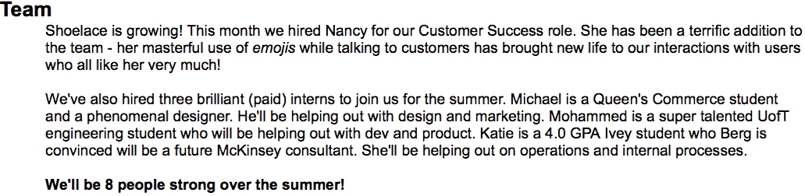
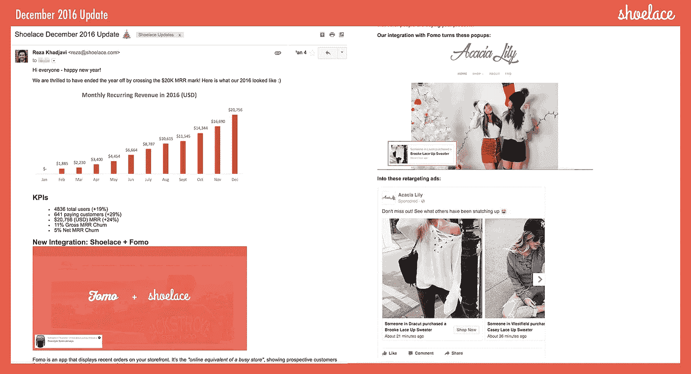

# 13 封投资者更新邮件把我们的点变成了线

> 原文：<https://medium.com/swlh/13-investor-update-emails-that-turned-our-dots-into-a-line-67505b4f5e41>

在过去的一年里，我们每个月都会向朋友、顾问和投资者发送电子邮件，更新我们在鞋带公司的进展。我们经常得到这样的赞美:“这是我得到的最好的投资者最新消息！”或者*“你的更新应该成为其他创始人的模板！”。*我很想认为我们的更新有一些特别之处，但是在与其他创始人交谈并了解到许多人不像我们一样定期更新后，我认为我们的突出之处在于我们发送更新的一致性。

几天前，我遇到了我们的一位投资者，在接近月底的时候，她急切地说“*我很高兴能在几天后看到你的邮件更新！*”。她只知道我们会寄出一本，而且我们会努力让它读起来更有趣。

我们偶尔会与其他创始人分享我们的更新，并被告知他们是非常有用的参考范例。所以今天，我们公开分享我们所有过去的电子邮件更新，希望它能帮助其他早期阶段的创始人更好地制作他们的每月更新。

> 向下滚动阅读我们从 2016 年 3 月到 2017 年 3 月的所有 13 封电子邮件更新。

马克·苏斯特有一个传奇的帖子，他说投资者 [*投资的是线而不是点*](https://bothsidesofthetable.com/invest-in-lines-not-dots-611f36491d73#.jpbhgnmsn)*——*这些更新帮助我们将 13 个月的点连成线。如果你是一个早期的创始人，你不发送每月更新，你会错过一个改善你的业务和加强与你的网络关系的巨大机会！

以下是为什么写每月更新会非常有价值的几个原因:

1.  **让你负责任** 想象一下当你承诺每月更新，却没有任何有意义的东西可以分享时的恐惧。对尴尬的恐惧会让你有动力去做好工作。
2.  **保持节奏**
    时间过得真快！如果你不小心的话，几个月过去了，你的生意还是没有任何进展。写每月更新提供了一个很好的节奏来持续跟踪你的工作成果。
3.  **执行能力** 没有人能仅仅从一次相遇就知道你有多优秀。不要在第一次见面时就试图说服别人你是一个伟大的创始人，而是冷静地对待，让他们出现在你的更新列表中，并向他们展示你的实力。让你的行动来说话。
4.  保持头脑清醒持续更新是让你的社交网络中的人记住你的存在的好方法。这会让你的名字在谈话中更频繁地出现，并带来意外的介绍。

养成每月更新的习惯不仅对你的利益相关者有价值，对你的整个团队也有好处。我们将它们视为一种方法，帮助我们专注于改善我们的业务，并随着时间的推移跟踪我们自己的进展。

当我们点击更新的发送按钮时，我们为上个月所做的工作感到自豪，并为下个月做好工作而充满活力。

# 需要记住的几件事

当你写这些更新的时候，有一些事情需要考虑。

1.  **讲故事** 让你的更新变得有趣。在邮件的结尾，你想让读者思考*“我迫不及待地想知道下个月会发生什么！”。*在写作本身上下点功夫。
2.  **包含大量视觉效果** 通过包含大量视觉效果来保持更新的吸引力。嵌入截图、图表、视频、客户评价和其他有趣的东西。
3.  保持一致——不要跳过一个月
    即使你不喜欢或者你不认为你有什么令人印象深刻的东西要报告，无论如何还是要发送更新。一致性至关重要。
4.  **做伟大的工作** 即使是写得最好的投资者更新也无法弥补执行力的缺失。专注于做你引以为豪的真正伟大的工作。这将使你的更新变得轻而易举；)

> 简而言之……每个月做一些令人惊奇的工作，然后写下来！

# 我们如何组织更新

我们在更新中不遵循严格的模板。相反，我们试图根据那个月发生的事情来改变事情。但是这里有一个关于我们在邮件中包含的内容的粗略指南。

# 1.开始段落

在这里，我们将简要总结本月最大的胜利或亮点。我们尽量让这部分最多包含 3 到 4 个短句。

# 2.KPI 部分

在每一次更新中，我们将包括一个 KPI 部分，在那里我们分享一些关键指标以及它们自上个月以来的进展情况。

# 3.要求

如果我们在寻找介绍或有任何其他问题，我们会在这里提到。当我们在更新中包含这一部分时，我们希望它非常靠近电子邮件的顶部。

# 4.重大公告

这是我们谈论一个主要新功能的发布或任何令人兴奋的事情的地方。

# 5.麻烦

如果出了问题，我们就在这里提出来。我们会分享对发生的事情的分析，我们正在做什么，如果我们需要任何帮助。

# 6.团队更新

这个月我们招人了吗？团队士气如何？我们有必要解雇任何人吗？任何与团队相关的更新都在这里。

# 7.截屏

我喜欢截图。无论是来自社交媒体帖子的片段，还是展示新的重新设计，包括截图总是能增加美感。

# 8.你的公司是做什么的？

这是我最喜欢的部分。我们总是喜欢在邮件的最后提醒人们我们公司实际上是做什么的。我们在每次更新中都包含了这一点。

# 这是我们所有过去的更新

同样，我不认为我们的每月更新有什么特别突破性的东西。我们每个月都在不断学习并努力改进它们。如果您注意到我们可以做得更好的地方，或者尝试了适合您的不同方法，[请联系](https://twitter.com/rezakhadjavi)。我很想听听。

下面是我们从 2016 年 3 月到 2017 年 3 月的 13 封邮件更新。它包括当月更新的简短摘要和原始电子邮件的 PDF 文件链接。

尽情享受吧！

# 鞋带 2016 年 3 月更新

2016 年 3 月是我们发出的第一次更新。我们参加了在旧金山举行的一次会议，展示了我们鲜艳的红色连帽衫，我们自动化了产品的一个关键部分，并建立了一个很酷的图像大小调整功能。

MRR 增长了 18%，达到 2230 美元。

[*在此阅读完整更新。*](https://docsend.com/view/i6ej5v5)

# 鞋带 2016 年 4 月更新

2016 年 4 月，我们得知我们的一个产品集成合作伙伴被收购，我们为团队招募了一些新员工，并围绕我们的定价层尝试了一个聪明的(理解为:短命的)实验。

MRR 增长了 53%，达到 3400 美元。

[*在这里阅读完整更新。*](https://docsend.com/view/bpmv856)

# 鞋带 2016 年 5 月更新

2016 年 5 月，我们将一个受欢迎的功能分拆成一个免费应用程序，以推动增长，我们重新设计了产品的几个部分，并开始为我们的博客编写内容。

MRR 增长了 33%，达到 4454 美元。

[*在这里阅读完整更新。*](https://docsend.com/view/j84in5m)

# 鞋带 2016 年 6 月更新

2016 年 6 月，我们发布了一个精彩的视频，重点介绍了最近的产品集成，我们将免费和白金级别添加到我们的定价计划中，并分享了深入的客户流失分析。

MRR 增长了 50%，达到 6664 美元。

[*在这里阅读完整更新。*](https://docsend.com/view/nzuxig8)

# 鞋带 2016 年 7 月更新

2016 年 7 月，我们经历了疯狂的用户增长(当月总用户数增长了 59%)。我们开始注意到在线社区中关于鞋带的聊天，并开始在 Shopify 应用商店上获得更多的 5 星评论。

MRR 增长了 32%，达到 8787 美元。

[*在这里阅读完整更新。*](https://docsend.com/view/wtz7ahx)

# 鞋带 2016 年 8 月更新

2016 年 8 月是激动人心的一年，我们在 MRR 跨过了 10K 美元大关。我们筹集了更多的资金，在我们的团队中增加了一个人，并开始尝试机器学习。

MRR 增长了 21%，达到 10615 美元。

[*在这里阅读完整更新。*](https://docsend.com/view/e6x99wq)

# 鞋带 2016 年 9 月更新

2016 年 9 月，我们收到了一封来自脸书的电子邮件，邀请我们开始申请成为营销合作伙伴。我们做了一个很大的转变，使用[我们的客户自己的广告账户](https://blog.shoelace.com/shoelace-now-uses-your-facebook-pixel-fb368c02a862),并在我们的产品中添加了活动优化信息。

MRR 增长了 9%，达到 11545 美元。

[*在此阅读完整更新。*](https://docsend.com/view/rwxdewd)

# 鞋带 2016 年 10 月更新

2016 年 10 月，我们是少数几个与 Shopify 合作开发新产品的应用之一，我们参加了脸书在旧金山举行的全球合作伙伴峰会，并分享了一些关于我们用户增长来源的细节。

MRR 增长了 24%，达到 14344 美元。

[*在这里阅读完整更新。*](https://docsend.com/view/b9jhtqq)

# 鞋带 2016 年 11 月更新

2016 年 11 月，我们发布了一个非常酷的与 MailChimp 的集成，通过鞋带重定向来加速 MailChimp 电子邮件。我们还经历了第一次黑色星期五/网络星期一狂潮——太疯狂了！

MRR 增长了 16%，达到 16690 美元。

[*在这里阅读完整更新。*](https://docsend.com/view/av9rwcn)

# 鞋带 2016 年 12 月更新

2016 年 12 月，我们在 MRR 跨过 20K 美元大关，结束了这一年，我们宣布与另一个流行的应用程序集成，并分享了一些截图，以显示鞋带的口碑有多好。

MRR 增长了 24%，达到 20756 美元。

[*在这里阅读完整更新。*](https://docsend.com/view/79hg82f)

# 鞋带 2017 年 1 月更新

2017 年 1 月，我们做了[肖恩·埃利斯产品市场适合度调查](https://www.slideshare.net/hiten1/measuring-understanding-productmarket-fit-qualitatively/3-Sean_Ellis_productmarket_fit_surveysurveyio)，了解到如果鞋带不在了，35%的顾客会“非常失望”。在同一调查中，我们了解到超过 50%的顾客向至少一个人推荐鞋带。我们还宣布了与另一款流行应用的集成。

MRR 增长了 15%，达到 23964 美元。

[*在此阅读完整更新。*](https://docsend.com/view/e5u9sjs)

# 鞋带 2017 年 2 月更新

2017 年 2 月，我们推出了一款名为[旅程](https://blog.shoelace.com/introducing-journeys-a-new-way-to-retarget-your-website-visitors-6652aca81cf2)的重要**新产品。我们分享了截图，并详细解释了旅程现在如何在核心产品体验中发挥重要作用。**

我们还宣布，我们将参与旧金山 500 家创业公司种子计划的第 20 批！

MRR 增长了 15%，达到 27597 美元。

[*在这里阅读完整更新。*](https://docsend.com/view/2qdv72m)

# 鞋带 2017 年 3 月更新

2017 年 3 月，我们宣布了一个名为[轻推](https://blog.shoelace.com/introducing-nudges-and-cold-warm-hot-audiences-d600bfb82a4b)的新产品功能，我们将冷、暖、热受众的概念引入到我们的活动中，并完成了与另一个应用程序的产品集成。

我们还对我们的定价进行了重大更新，并分享了对我们的 ARPU 增长情况的分析。

MRR 增长了 19%，达到 32726 美元。

[*在这里阅读完整更新。*](https://shoelace.docsend.com/view/rk8aayc)