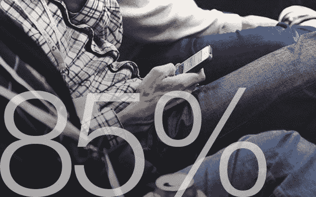
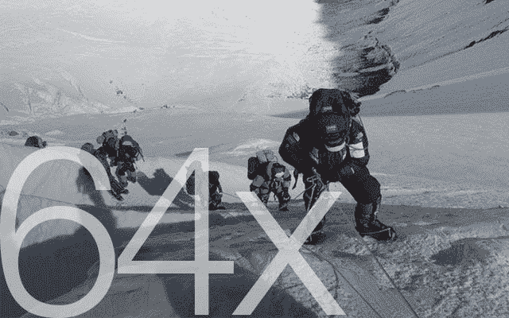

# 13 个令人震惊的用户体验统计数据

> 原文：<https://medium.com/swlh/13-mind-blowing-statistics-on-user-experience-48c1e1ede755>

无限滚动会降低你的跳出率。自从采用连续滚动以来，Time.com 的**跳出率下降了 15 个百分点**

[*来源*](http://www.poynter.org/news/mediawire/257466/time-coms-bounce-rate-down-15-percentage-points-since-adopting-continuous-scroll/)

10 年后，对以设计为中心的公司投资 10，000 美元，其回报将比在标准普尔投资相同金额高出 228%。

[*来源*](http://www.dmi.org/?DesignValue)

在真正听取了他们的社区意见并将建议纳入他们的主页重新设计后，ESPN.com 的收入猛增了 35%

[*来源*](http://www.mindtouch.com/blog/2009/11/10/5-internet-marketing-must-dos-in-2010)

选择一种特定的蓝色，而不是其他色调，为必应增加了 8000 万美元的年收入

[*来源*](http://www.cnet.com/au/news/behind-bings-blue-links/)

**5)** 在电子邮件营销上每花 1 美元，平均回报是 44.25 美元

[*来源*](http://emailexpert.org/infographic-10-must-know-email-marketing-stats-2014/)

88% 的在线消费者在经历了**的糟糕经历后不太可能再回到网站**

[*来源*](https://econsultancy.com/blog/10936-site-speed-case-studies-tips-and-tools-for-improving-your-conversion-rate)

慢速下载网站每年让零售商损失 17.3 亿英镑的销售额

[*来源*](https://econsultancy.com/blog/9790-slow-loading-websites-cost-retailers-1-73bn-in-lost-sales-each-year)

**8)** 对**网站可信度的判断是 75%** 基于一个网站的整体**审美**

[*来源*](http://www.bcs.org/upload/pdf/ewic_hci09_paper66.pdf)

**9)** 第一印象 **94%与设计相关**

[*来源*](http://www.researchgate.net/publication/221516871_Trust_and_mistrust_of_online_health_sites)

85%的成年人认为公司的移动网站应该和桌面网站一样好或者更好

[*来源*](http://visual.ly/why-responsive-design-important-10-key-statistics)

**11) 70%** (在评估的 200 个小型企业网站中)**在其主页上不显示任何清晰的行动号召**，例如特价商品、电子邮件简讯、操作指南、演示和互动工具

[*来源*](http://onlinemarketingcoach.com/small/small-business-b2b-study-2013.pdf)

**12)**90%的人**依次使用多个屏幕**

[*来源*](http://i0.wp.com/icebreakerconsulting.com/wp-content/uploads/2013/04/infographic-2013-the-year-of-responsive-design_50d21f8c55c93_w587.png)

你登上珠穆朗玛峰的可能性是点击横幅广告的 64 倍

[*来源*](http://www.businessinsider.com/its-more-likely-you-will-survive-a-plane-crash-or-win-the-lottery-than-click-a-banner-ad-2011-6?op=1)

*注:本文原为* [*卡梅隆&威尔丁*](http://cameronandwilding.com) 撰写

*发表在* **创业、旅游癖和生活黑客**

-