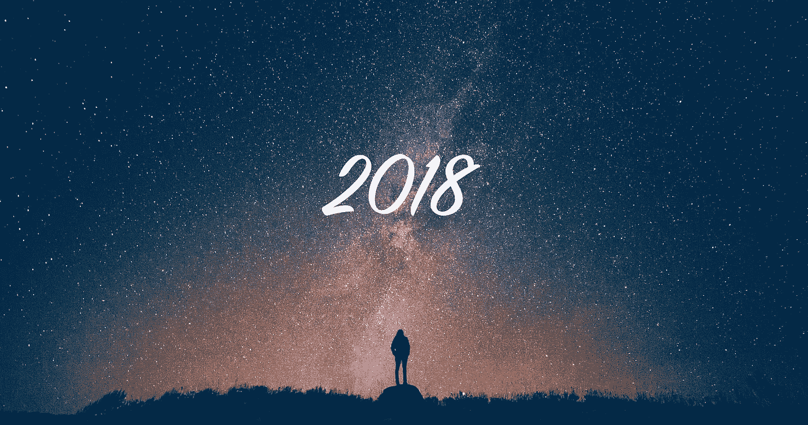

# 我从 2018 年学到的关于生活、爱情和职业的 13 件事

> 原文：<https://medium.com/swlh/13-things-i-learned-about-life-love-and-career-from-2018-3bac0de31074>

2018 年对我来说是学习和尝试的一年。我改变了我的职业道路，从一个个体贡献者变成了一个管理角色。我开始读比我一生中读过的书都多的书。我犯了很多错误。遇到了很多牛逼的人。创建了一个副业项目，以及许多其他项目。

我想说，在 2018 年，我学到了很多东西，这些东西真的帮助我在个人和职业生活中保持动力和进步。由于我从这次学习中受益匪浅，我不想让它就此止步。这些是我到目前为止在 2018 年学到的东西

# **1。树立“习惯”比树立“目标”重要得多**

***目标:*** 今年我要有六块腹肌！！

***习惯:*** 我会在一周内至少去两次健身房，每个工作日早上做 10-15 分钟的腹肌锻炼

拥有一个小而持续的习惯会比拥有一个远大的目标给你带来更多的好处。从 [FarnamStreet](https://fs.blog/2017/06/habits-vs-goals/) 这篇文章中了解习惯与目标

# **2。生活中的问题是不可避免的**

你在生活中的地位越高，你就会面临一个更复杂的问题。这是意料之中的，也是正常的。把你的人生想象成一个电子游戏，你的级别越高，你就要面对一个更强更狠的老板。

与其浪费你的时间去抱怨你的问题有多大多复杂，不如投入你的精力和时间去思考我该如何解决这个问题？我能从这个问题中学到什么。把所有的问题都看成是对你走向人生下一阶段的挑战。

嘿，安德鲁，但是专注于解决问题真的很难，尤其是当你处于这种情况下。100%同意！

> **艰难的选择，轻松的生活。容易的选择，艰难的生活**

# 3.有一个一致的早晨惯例真的有助于征服一天

在过去的三个月里，我一直在努力坚持每天早上的作息时间。包括每天在同一时间醒来，整理床铺，直接喝矿泉水，10-15 分钟的锻炼，以及在通勤时学点东西(读/听/看)。

不同的人会有不同的偏好，但是每天早上有一个一致的作息真的可以帮助我们准备好我们的心理模型来处理一个更复杂的问题。因为今天早些时候我们取得了一些成就。

你可以在这里了解更多关于晨间作息的内容:[如何创造更好的晨间作息](https://www.youtube.com/watch?v=LHAyE0UC5I4)

# **4。职场对你的生活影响巨大。要挑剔！**

不仅仅是经济上，还有你生活的方方面面。我们几乎不知道大多数人一生中的大部分时间都在办公室度过(每天 9-10 个小时。我们一天时间的 40%)。糟糕的工作环境真的会影响我们思考、行为、说话和感受的方式。

对你想加入的下一家公司非常挑剔是非常重要的。更多地研究这些人(团队成员、经理、高级管理人员等)，了解他们的成长，检查投资者，了解商业模式，询问目前在那里工作的人，阅读 Glassdoor 的评论。长话短说，在接受提议之前先做好功课。

# 5.这个时代你想学什么都可以

如果你能读到这篇文章，这意味着你至少有一部可以上网的智能手机/笔记本电脑。这意味着你可以得到任何你想要的信息。有成千上万的网站、免费课程、视频，你可以学到任何东西。

如果你真的想学点什么，你可以。你只需要投入更多的时间和精力去了解它。

# 6.阅读(书和文章)真的很重要

如前所述，2018 年，我读的书和文章比我一生中读过的都多。我真的感受到了这些习惯的好处。我希望我能早点开始，但是没关系。

我这里的意思是读一些能给你的人生带来价值的东西。阅读一些东西来提高你的知识。我建议你阅读不那么传统的新闻。

如果你想开始，我有一些建议给你:

书:不要为小事流汗(理查德·卡尔森)，工作中不要为小事流汗(理查德·卡尔森)。新的一分钟经理(肯·布兰查德)。彻底的坦白(金·斯科特)。清晰思考的艺术(罗尔夫·多贝利)，富爸爸穷爸爸(罗伯特·清崎)。如何赢得朋友和影响他人(戴尔·卡内基)。

**网站:** [首轮评审](http://firstround.com/review/)，[法纳姆斯特里特](https://fs.blog/)，[蒂姆·费里斯博客](http://tim.blog)，[哈佛商业评论](https://hbr.org/)，[快公司](https://fastcompany.com)

**跟随的人:** [亚当·格兰特](https://twitter.com/AdamMGrant)，[蒂姆·费里斯](https://twitter.com/tferriss)，[谢恩·帕里什](https://twitter.com/farnamstreet)，[海军](https://twitter.com/naval)，[大卫·佩雷尔](https://twitter.com/david_perell)

# 7.在一本实体书上写下你想学或想做的事情

我的记忆力不是很好，我意识到了这一点。所以每当我想从书上、文章上、播客上、视频上做什么或学什么的时候，我都会把它写在书上。

我从大量的研究中了解到，写作真的可以帮助你提高记忆能力。

# 8.你要对生活中发生的一切负责

所以如果事情出了差错，除了你自己，你没有人可以责怪。永远记住这都是我们的选择！

无论是你的工作、关系、财务、教育等等

# 9.金融知识真的很重要

作为千禧一代，我们面临的最大问题是我们不知道我们的钱去了哪里。大多数时候，我们只是意识到我们在发薪日之前就花完了钱。

在过去的 7 个月里，我所做的就是在每个月的第一个周末监控收入，并列出潜在的结果。在过去的两个月里，我尝试了一件新的事情，那就是提前计划好结果的每一个细节(每月和每天),并努力做到这一点。我也有一个非常简单的谷歌表单来记录我每天的开销。也许我会考虑很快转移到一个应用程序。

# 10.成为一名伟大的经理真的很难..

对我来说，从个人贡献者转变为管理者是一个巨大的转变。作为一个内向的人，我喜欢独立完成工作，我不喜欢与人打交道，我很难读懂别人的感受和情绪状态。

但我真的很幸运能在 iPrice 集团工作，因为我得到了许多坦诚的反馈、支持、建议，还有提高管理技能的培训。如果我没记错的话，我的长期目标是拥有自己的公司，所以拥有出色的管理技能对我来说真的很关键。

# 11.不要对自己太苛刻

作为一名经理，我在新的岗位上面临着很多挑战，并且倾向于指责发生的一切都是我的错。这对我真的很不好，因为它给了我很多负面的感觉，让我没有效率。

在与不同的更有管理经验的人讨论后，我意识到我刚刚开始这个角色一年。要成为一名伟大的经理还有很长的路要走。因此，挑战是正常的，也是意料之中的。

我明白了我们不需要对自己太苛刻。我们犯错误，从中吸取教训，然后改进。

# **12。我们偶尔会有糟糕的一天，没关系**

总有一天，我们会认为这是我们一生中最美好的一天。项目进行得很顺利，得到了老板的称赞，我们的汽车或火车准时到达，人们真的很友好，搭车回家的价格很便宜。但也有一段时间，我们认为我们的生活真的很艰难，很糟糕。需要等 1 小时公交或火车工作中有很多问题和抱怨，没有午餐伴侣，抢车需要额外付费(激增时间)。

我明白了好的和坏的一天都会发生，没关系。越来越意识到我们将面临糟糕的一天真的帮助我做好心理准备。当我过了糟糕的一天，我可以说“好吧，它又发生了，让我为我今天遇到的每一个挑战找到解决办法，吃好，喝很多矿泉水，然后好好休息”

# **13。善良一点**

人们有一个我们不知道的不同的问题和挣扎。善待你遇到的每一个人。

怎么会？例如，微笑，说嗨和谢谢，多听，问问题，赞美，扶着门，给你的座位和许多其他事情

# **行动号召:**

如果你也从这里学到了一些东西，请帮我与你的连接分享这篇文章！

## 这篇文章发表在 [The Startup](https://medium.com/swlh) 上，这是 Medium 最大的创业刊物，拥有+402，714 名读者。

## 订阅接收[我们的头条新闻](http://growthsupply.com/the-startup-newsletter/)。

