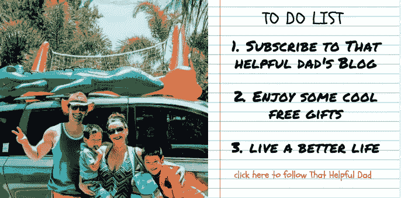

# 提高客户邮件回复率的 13 个技巧

> 原文：<https://medium.com/swlh/13-tips-to-increase-email-response-rates-from-your-customers-1e3dd385d9c6>

Email Marketing. Source: Pixabay CCO

总结:电子邮件是与客户沟通的一种很好的方式，电子邮件营销作为一种策略仍然是吸引、保留和建立长期客户关系的最有效的方式之一，但不幸的是，电子邮件的回复率往往令人不满意。在这篇文章中，我将分享我多年来收集的帮助我大幅提高邮件回复率的 13 个技巧。

> 如果你使用这些技巧，你会变得 10 倍的自信，当你发送电子邮件时，你会得到回复！

**电子邮件超载——主要问题**
就像你一样，你的客户也非常忙，就像你一样，你的客户会收到大量电子邮件(远远超过他们的阅读量)，就像你一样，你的客户会使用电子邮件工具来预过滤“促销”邮件。因此，你的邮件回复率很有可能很低，因为…

1.  你花了这么长时间构思的“完美”电子邮件可能永远不会被你的客户看到。
2.  如果你的客户碰巧看到了这封邮件，他们可能没有意识到它的价值，反而会忽略它。
3.  他们可能会看，但懒得回复。

如果你想和你的客户建立商业关系，所有这些都不是好的选择。

那么，你能做些什么来增加你的客户打开并回复你邮件的几率呢？谢天谢地，是的。

这篇文章中的 13 条建议可以显著提高你的邮件回复率。我已经亲自测试了每一个，我可以向你保证他们的工作。这些想法有各种各样的来源，我并没有发明它们，但我多年来一直在策划它们，你在这里读到的是一个对我一直有效的最佳实践的精简列表。你自己测试一下，然后让我知道你的结果。

# 第一步——打开你的电子邮件

1.  **避免客户收件箱中的“促销”过滤器。**要做到这一点，试着发送“纯文本”电子邮件。是的，它们不那么花哨(最少的文本格式，没有图片，等等)，但是它们也不像 HTML 邮件那样被过滤。过滤的邮件=未看到的邮件。没看到邮件=游戏还没开始就结束了。
2.  **在可能的情况下，避免群发电子邮件，一次将每封电子邮件直接发送给一位客户。如果你必须发送给多人，尽量保持小组规模较小(比如 2-4 人)。一般来说，我只给单个客户发邮件(因为下面的第 4 条建议)，但是如果我发组合邮件，我会确保是给同一家公司的客户。你加的组越多，你的电子邮件被打开的可能性就越大，因为当人们看到分发列表上的其他名字时，他们通常会“推迟行动”给其他人，以节省时间。**
3.  **避免公司内部网过滤器**——如果可能的话(尤其是对新客户的介绍邮件),尽量避免发送附件。企业 IT 服务器似乎经常过滤掉带有附件的电子邮件，以此来防止病毒感染他们的网络。不要冒你的电子邮件被隔离到未知领域的风险。如果你必须发送附件，首先与客户建立联系，让他们认同他们确实想要附件，然后询问发送给他们的最佳方式(是否允许发送附件，如果允许，你如何避开过滤器，Dropbox 或 google drive share 是否是更好的选择，等等？).
4.  **利用主题的力量:**这实际上是*我的第一条，也是最重要的，如果你什么也不做，就做这件事的建议*。这一条提示增加了我自己的邮件回复率，比所有其他人加起来还多！很简单:不要写一般的、容易忽略的主题行，而是写一个引人注目的、面向行动的主题(这是非常重要的部分)**以客户的名字**开头。这在纸面上听起来很明显，但是 99%写电子邮件的人不会这样做。让我给你举个例子…

*   电子邮件 1 —废话主题行:“供您审阅的合同选项”
*   电子邮件 2 —更好的主题:“注意:新的[产品 X]合同选择(需要行动)”
*   **电子邮件 3 —最佳主题:**“Jim:新的[产品 X]合同选项(要求在周五前反馈)”

你认为这些邮件中的哪一封会被打开？我在我的职业生涯中使用过所有的邮件，我可以告诉你，第三封邮件比其他两封邮件打开的次数还要多。

让我们来分析一下第三封邮件。

*   首先，这是“吉姆”特有的，所以**吉姆知道这是为他准备的**——仅此一点就可能打开它(顺便说一句，我喜欢尽可能使用名字来建立长期的友好关系，因为(正如戴尔·卡内基所说)“某人的名字对那个人来说是最美妙的音乐”，但如果出于某种原因你不能这样做，那么全名/正式名称也可以)。
*   第二，这封邮件还使用了**单词“New ”,这是一个产生兴趣并导致打开的钩子**。
*   第三，它**清楚地标识了产品**(在这种情况下,“产品 x”将被替换为您的任何产品)并且假设 Jim 对产品 x 感兴趣，他可能会打开该电子邮件。
*   它简要地**详述了主要内容**(在本例中为“合同选项”)，再次假设 Jim 对其产品 x 的新定价选项感兴趣，他可能会打开该电子邮件。
*   最后，它让 Jim 知道，不仅他的“反馈”被请求(让他觉得自己很重要)，而且他的**反馈在特定的日期**(星期五)之前也是需要的。
*   所有这些意味着什么？当 Jim 浏览当天的大量电子邮件时，您让他很容易地锁定了一封特定于他的电子邮件，该电子邮件具有清晰可辨的内容(大概)让他感兴趣，并要求他在某天之前采取行动(确保在同一周内采取行动，以产生紧迫感)。
*   结果——更多的电子邮件被打开。

> 那么，现在你打开了你的电子邮件，你如何得到回复呢？

Get more tips like this

# 第二步——获得更多的电子邮件回复

**5。简短，精彩，消失** 电子邮件不是写你下一本书的地方(自从我喜欢写作以来，这是我经常犯的错误)。有一个叫做“TLDR”的概念，代表“太长时间，没有阅读”

记住，你的顾客很忙。把它们想象成一只小松鼠——你有一个坚果，你已经说服松鼠向你靠近一步，他很感兴趣，当他靠近时，不要用满满一桶坚果淹死他，给他他想要的那个小的就行了。

同样的道理也适用于你的电子邮件——你让客户打开它，不要用 10 段、单倍行距的宣言淹没他们。就给他们一口大小的版本。容易消化，简短，容易看出他们需要什么行动。

**6。BLUF** 这代表“底线先行”——记住你的客户很忙，通过把你希望他们采取的行动放在你邮件的第一行来帮助他们节省时间(并提高你的回复率)。

尽管你可能不想听到这些，但要意识到，如果你的客户打开了你的邮件，他们可能只会读第一行，然后就会删除它或“保存”起来以备后用。了解这一点后，确保他们在第一行读到你需要他们做/知道的最重要的事情。希望第一行能促使他们多读一些，但是万一他们没有，你至少会让他们明白你要求是什么，然后你就把球踢给他们了。

**7。别指望你的客户会阅读你的整封邮件。**

*   认识到他们可能只是扫描它。
*   把你的要点用项目符号的形式表达出来，以引起别人的注意。
*   这对于邮件正文尤其重要(这是你的客户最不可能阅读的部分——有点像我文章的这一部分)。

**8。建立信誉** 这对于你不太了解的客户来说非常重要，对于初次介绍，或者当你试图在一个你们都要参加的会议上安排一次会面时。

让他们知道你是怎么认识他们的(“X 先生介绍我来的”，然后在电子邮件的“抄送”一行写上“X 先生”——当然，你已经和 X 先生确认过你可以推荐他们)——当你试图联系的客户看到他们认识的某个人的名字(X 先生)*并看到 X 先生在抄送一行*时，这将使你的可信度飙升——这也大大提高了你的回复率，因为客户也会对 X 先生有一种“义务回复”的感觉。这是一个强大的工具。

与此同时，如果你们两个都要参加会议，参考那个活动来验证自己，并把它作为现场会议的一个聪明的目标机会——另一个赢家。

**9。记住“智能手机”视图** 大多数人(首先)在他们的移动设备上阅读电子邮件。手机上的电子邮件看起来与台式机/笔记本电脑上的有很大不同。缩小空间，长邮件会变得超级长，被拒绝。如果你真的想让客户方便，尽量让你的邮件正文便于移动浏览。

**10。设定明确的回复预期** 如果你已经和客户建立了良好的关系，而你的邮件需要回复，礼貌地“提醒”他们你正在给他们发邮件，并期待回复。

> 再说一次，人们很忙——这并不意味着他们不想帮助你，只是他们可能没有意识到你想要/需要一个回复。

让他们轻松点。给你的客户发一条短信，给他们的管理员打个电话，或者用其他方式(LinkedIn，走廊聊天等)确保他们明白你在等回复。

还没有很好的关系？在 LinkedIn 上与他们联系(在联系中加入个人信息),一旦他们接受了你的联系邀请，就通过 LinkedIn 短信向他们发送一封简短的通知，告诉他们你联系他们的原因，并告诉他们你正在向他们发送一封双赢的电子邮件，让他们有机会回复。

这些建议会让你的邮件更容易回复，但是你如何让它更上一层楼呢？

# 第 3 步—下一级电子邮件回复

**11。轻松见面**
你想约个时间聊聊？无论你是想通过电话聊天，做一个 Webex，还是现场见面，你能做的最糟糕的事情就是以一个无聊的提议结束，比如“如果你感兴趣，让我知道你什么时候可以谈”或类似的话。

相反，(我要再敲一次鼓)记住你的客户很忙，所以给他们提供日期/时间建议，让他们容易些。

*   这里有一个例子，“什么时候适合[聊天/见面/等]？美国东部时间 5 月 1 日星期一下午 4 点或 5 点可以吗？美国东部时间 5 月 3 日星期三上午 10 点或 11 点怎么样？如果没有，建议一个适合你的日子/时间。”
*   使用这种策略可以加快过程，因为它消除了猜测，而不是让客户去找时间见面，他们需要做的只是查看他们的日历，看看你建议的时间是否可行。

**12。何时发送电子邮件** 时间是电子邮件超载世界中的一切。如果你想摆脱混乱的电子邮件，在你的客户最有空阅读的时候发送你的电子邮件。

*   他们什么时候出现在社交媒体上，处于“工作模式”在我的生意中，周日晚上是他们为工作周做准备的时候，所以在这个时候发送一封简短的、面向行动的电子邮件会得到很高的回复率。
*   一周中其他工作良好的时间是上午 10 点左右(在他们有机会适应一天之后)或下午 3 点左右(在午餐之后，但还没有进入“回家”模式)——这两个时间都是人们查看电子邮件的好时机。
*   我也尽量避免周一(人们通常太忙)和周五(人们只想清理办公桌，专注于周末)。

**13。更新主题行** 让你的邮件迷失在邮件过滤工具的混乱中的一个好方法是不要更新主题行——不要让这种事情发生在你身上。相反…

*   删除那些“RE”和“FW”标识符——它们只会造成混乱，而且肯定会成为捆绑包的目标。确保以某种方式修改主题行，使其突出，而不是被捆绑，因为捆绑的电子邮件=丢失的电子邮件。
*   随着对话需求的变化改变主题——把新的行动放在第一位，记录重要的日期，或者更好的是写一封全新的邮件(当然，使用这些伟大的邮件技巧！).

# 电子邮件回复——底线是什么

使用这些技巧，你就能保证提高你的邮件打开率和回复率。它对我有效，对你也有效。如果成功了，一定要让我知道。现在前进，开始点击“发送”,更有信心有人真的在听！

# 想要更多这样的提示吗？

如果你觉得这很有帮助，请在 Medium 上关注我，或者逛逛我的博客([ThatHelpfulDad.com](https://thathelpfuldad.com/start-here/))，在那里我定期为现实生活中的问题提供“实用解决方案”。

Let’s connect at ThatHelpfulDad.com

我们很快再聊。

~迈克尔

**参考文献:**

1.  [https://optin monster . com/is-email-marketing-dead-heres-what-the-statistics-show/](https://optinmonster.com/is-email-marketing-dead-heres-what-the-statistics-show/)
2.  https://www . martech advisor . com/articles/marketing-automation-2/re thinking-email-marketing-effectiveness/
3.  https://digitalagency network . com/email-marketing-still-effective-strategy-2018/
4.  DreamIt“破解电子邮件的艺术”——YouTube

*原载于 2018 年 3 月 22 日*[*thathelpfuldad.com*](https://thathelpfuldad.com/increase-email-response-rates/)*。*

## 这篇文章发表在《创业公司》杂志上，这是 Medium 最大的创业刊物，拥有 309，732 名读者。

## 订阅接收[我们的头条](http://growthsupply.com/the-startup-newsletter/)。

