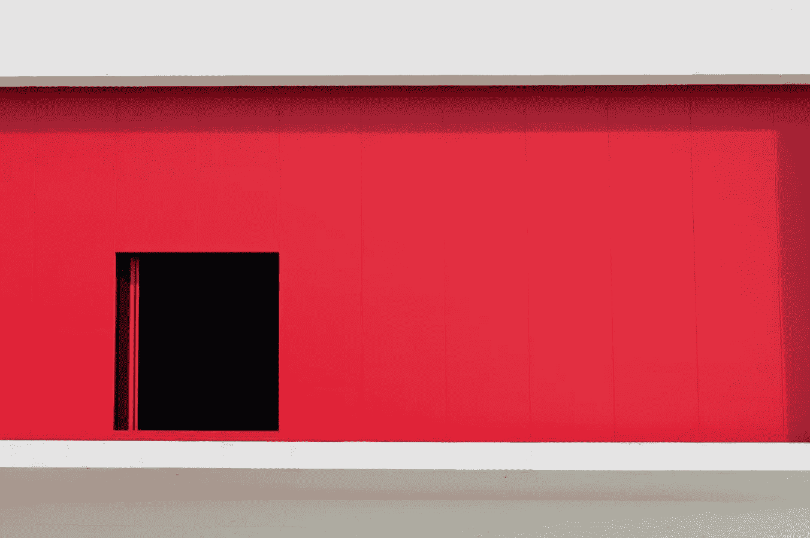

# 2018 年 8 月 14 日:神秘领域最大的故事

> 原文：<https://medium.com/swlh/14-08-2018-biggest-stories-in-the-cryptosphere-95c0ec712005>

通过 BlockEx

**1。支付公司 Square 在美国增加比特币服务**

回到去年 11 月，我们[报道了](/@BlockEx/17-11-2017-biggest-stories-in-the-cryptosphere-75ca306d2137) Square 的比特币支持测试以及随后股价超过 5%的上涨。这家支付公司由 Twitter 创始人杰克·多西联合创立，现已推出比特币服务。美国用户现在将可以通过其现金应用购买和出售加密货币[，这是通过 Twitter](https://www.coindesk.com/square-expands-cash-app-bitcoin-purchases-to-all-50-us-states/) 宣布的[。这项服务于 1 月份推出，但当时某些州被排除在外。这四个州是纽约、佐治亚、夏威夷和怀俄明。然而，美国所有 50 个州现在都将能够从这项服务中受益。最后，Square 最近获得了纽约州监管机构颁发的“比特许可证”。](https://twitter.com/CashApp/status/1029050009147203584)

**2。牙买加证券交易所将交易加密货币**

根据与区块链初创公司 Blockstation 签署的谅解备忘录(MoU)，加密货币将成为牙买加证券交易所(JSE)的可交易资产。这两家公司希望在今年年底推出一个数字资产交易平台。他们已经合作了大约六个月。JSE 董事总经理 Marlene Street Forrest 表示，加密货币“适合”当前提供的产品。此外，感兴趣的目标受众已经存在，JSE 希望帮助他们以“安全的方式”在市场上交易。该交易所的基础设施将通过 Blockstation 的技术与新平台联网。

**3。欧盟立法者暗示 ico 受新众筹规则管辖**

欧洲议会经济和货币事务委员会发布了一份涵盖众筹法规的报告草案。我有可能会落入这些新规则的管辖范围。此举是由欧洲议会(MEP)英国议员阿什利·福克斯(Ashley Fox)提出的。同样值得一提的是，报告中承认这不会导致一个明确的监管体系。然而，这将是一个良好的开端。该委员会认为 ICOs 是科技初创公司的一种很好的融资方式，但由于其中涉及的风险，监管是根本。然而，将会实行某些豁免；包括“私募”ico 或那些旨在筹集超过 800 万€的 ico。

> 这是由 [BlockEx](http://bit.ly/BlockEx_) 为您带来的新闻综述。

> 要想在你的邮箱里收到我们的每日新闻综述，请在这里注册:[*http://bit.ly/BlockExNewsAndUpdates*](http://bit.ly/BlockExNewsAndUpdates)

## 这个故事发表在 [The Startup](https://medium.com/swlh) 上，这是 Medium 最大的创业刊物，拥有 358，974+人关注。

## 在此订阅接收[我们的头条新闻](http://growthsupply.com/the-startup-newsletter/)。

