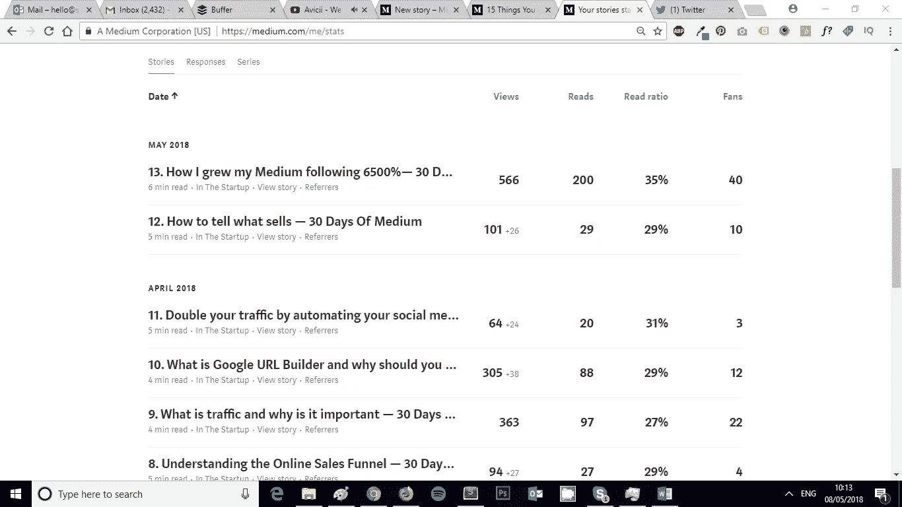

# 14.你如何看待事物很重要——30 天中等

> 原文：<https://medium.com/swlh/14-how-you-look-at-things-matters-30-days-of-medium-f641b9733b90>

欢迎回到 **30 天中等。**

感谢迄今为止**一直在阅读、鼓掌和评论**的每一个人！

如果你错过了下面的**我的 30 天中等挑战**的前 13 天，你可以补上:

## [0。30 天的培养基](/swlh/30-days-of-medium-c7ab34953c6c)

## [1。建立自己的网站需要什么？— 30 天的培养基](/swlh/1-what-do-you-need-to-build-your-own-website-30-days-of-medium-1ed1ad4e505c)

## [2。如何找到你热爱的事业— 30 天的媒介](/swlh/2-how-to-find-a-business-you-love-30-days-of-medium-cb7a4a702d1b)

## [3。如何建立自己的网站—媒体 30 天](/swlh/3-how-to-build-your-own-website-30-days-of-medium-587f994672ec)

## [4。如何衡量你网站的表现——30 天媒体](/swlh/4-how-to-measure-your-websites-performance-30-days-of-medium-75e650969695)

## [5。如何通过回答他们的问题获得更多的客户——30 天介质](/swlh/5-how-to-get-more-customers-by-answering-their-questions-30-days-of-medium-b462d237533e)

## [6。成功的商业网站备忘单——媒体 30 天](/swlh/6-the-successful-business-website-cheat-sheet-30-days-of-medium-42f89eb43e67)

## 7。如何衡量成功——媒体 30 天

## 8。了解在线销售漏斗— 30 天媒介

## 9。什么是流量，为什么流量很重要？— 30 天的培养基

## 10。什么是 Google URL Builder，为什么要使用它？— 30 天的培养基

## 11。通过自动化你的社交媒体日程，让你的流量翻倍——30 天的媒体

## [12。如何辨别什么好卖— 30 天介质](/swlh/12-how-to-tell-what-sells-30-days-of-medium-ba3291d029d2)

## [13。我如何在 6，500% — 30 天的培养基中培养我的培养基](/swlh/13-how-i-grew-my-medium-following-6500-30-days-of-medium-c9d2d6f80b51)

## [14。你如何看待事情很重要——30 天中期](/swlh/14-how-you-look-at-things-matters-30-days-of-medium-f641b9733b90)

## [15。如何向小型企业销售服务— 30 天中等](/swlh/15-how-to-sell-services-to-small-businesses-30-days-of-medium-d6604c63b3b7)

## [16。如何通过有效的提案赢得更多交易— 30 天的媒介](/swlh/16-how-to-win-more-deals-with-effective-proposals-30-days-of-medium-481f16bbc86f)

## 17。如何在 10 分钟内建立一个网上商店——30 天的媒介

## [18。如何在任何地方工作— 30 天介质](/swlh/18-how-to-work-from-anywhere-30-days-of-medium-1c9cfa2d662f)

## [19。为什么你的网站会破坏你的销售——30 天媒体](/swlh/19-is-your-website-sabotaging-your-sales-30-days-of-medium-f63bdbdb350)

## [二十。你的流量从哪里来？— 30 天中值](/swlh/20-where-does-your-traffic-come-from-30-days-of-medium-a9b2d2c088bb)

## [21。如何真正识别倦怠——30 天中等水平](/swlh/21-how-to-actually-recognise-burnout-30-days-of-medium-7972a7a7a89e)

## [22。如何修改你的时间表并完成两倍的工作——30 天中等时间](/swlh/how-to-hack-your-schedule-and-get-twice-as-much-done-30-days-of-medium-441a509dc9be)

## [23。不要模仿你的竞争对手——30 天的媒介](/swlh/23-dont-copy-your-competitors-30-days-of-medium-56382b7ba8ed)

## 24。如何 SEO 优化一篇博文——30 天的媒介

## 25。独特或被遗忘——30 天的媒介

## 26。跟着感觉走——30 天中等水平

## 27。人们不支付平均 30 天的中等费用

## 28。如何做关键词研究— 30 天介质

## [29。为什么帕累托原则是世界上最大的诀窍——30 天中期](/swlh/29-why-the-pareto-principle-is-the-worlds-biggest-hack-30-days-of-medium-1c225f5c8aa1)

## 三十岁。你的内容比你的电话更有利可图——30 天的媒介

# 快速回顾一下

在最后一篇文章中，我写了关于**我如何在 6，500%之后发展我的媒体。**

那篇文章看起来**很成功**，实际上它是我迄今为止表现最好的文章**。**

这在某种程度上证明了我关于标题的力量以及标题如何推动浏览的观点。

这是一个相当吸引人的标题，而且点击量非常小，但是，你需要找到平衡来推动浏览。

我确保在引擎盖下包含了许多关于我的 **30 天媒体**挑战的**信息**，反馈是积极的，感谢所有看过并喜欢这篇文章的人！

# 回到正轨

今天我想谈一个不同的话题…

你如何看待事情很重要。

# 感知就是一切

我很少称自己为“企业家”。

老实说，这听起来有点自我夸大，但这只是我的看法。如果这让你感觉良好，那就去做吧。

在我看来，我只是一个追求我的梦想的人，在经济上独立，做自己的老板，建立我热爱的事业。

在这样做了 7 年后，我学到了很多，但还有很多要学。

在过去的一年里，我越来越意识到一件事，那就是我看待事情的方式。

具体来说，我对周围发生的事情的看法会影响我的感受。

# 积极思考的力量

当你在经营一家企业时，会有很多压力和不确定性。

我发现有两件事最能帮我解决这个问题。

1.  锻炼
2.  积极思考

实际上，我写了一篇关于**重要的锻炼是如何提高效率的文章，如果你想看的话，你可以在这里找到——这一个简单的方法将会使你的效率提高 10 倍**

**积极思考**也一样强大。

你不可能每周 7 天每天 24 小时都工作，在你的生活中会有这样的时候，你需要**处理压力**并做出高压力的决定，却没有能够跑一个小时的舒适。

你可能正在经历一段个人生活的艰难时期，或者正在处理一个损失。你可能不确定下个月如何支付费用。

有时候锻炼可能不仅仅是减肥。

这就是积极的思维可以拯救你的地方。

# 你的杯子是半满的，还是半空的？

我一直相当乐观，充满**能量**，但有时在艰难时期很难保持乐观。

最近几年我过得相当艰难，我发现**改变我的想法**帮助我度过了难关，并帮助我成为**更有成效的**和更全面的人。

你听过这样一句话吗- **你的杯子是半满的，还是半空的？**

这基本上是在问，你是乐观主义者，还是悲观主义者？

乐观者看到的杯子是半满的。

悲观者认为杯子里只有一半是空的。

他们俩都在看着一模一样的杯子，里面有同样多的水。

在现实生活中，悲观主义者关注消极的一面，乐观主义者关注积极的一面。

# 试着重新设想一下这种情况

乐观主义者和悲观主义者没有什么不同，他们只是看待世界的方式不同。

不要把注意力放在任何特定情况下的消极方面，而要试着去思考情况之外的积极方面。

我发现诀窍在于不要关注压力的来源。

关注压力之外的积极方面。

在所有的压力中，什么是好的？

想想你即将到来的假期，或者周末你将要做的有趣的事情。想想刚刚结束的大交易，或者说**进展顺利的工作。**

**你必须克服压力，找到好东西。**

让消极看起来小而可克服，而不是大而无法克服。

# 最坏的情况会是什么？

这是我喜欢的另一个策略。

运行“最坏可能会发生什么”场景。

压力和焦虑的最大问题之一是对未知的恐惧和把事情夸大。

如果某件事真的让你在工作中倍感压力，想想可能发生的最坏情况。

“好吧，那么这个人把我扔下了，然后呢？”。

"好吧，那么他们不高兴了，留下了一个差评，然后呢？"。

“好吧，那么我们这个月没有完成那些我们需要的交易，然后呢？”。

在你的头脑中思考每个场景**和**，想出解决方案和**积极的方面。**

“如果他放弃我们，我们会得到另一个客户”。

“如果他们留下差评，我们会尽力改正，但你不可能让 100%的人都满意，这是不可能的。下一次我们会从中吸取教训。”

“如果我们得不到这笔交易，那又怎么样。下个月，我们会更加努力，找出交易失败的原因，并确保我们不会再犯同样的错误。”

总有积极的一面潜伏在某处。

**我不是说表现得好像你不在乎，我是说尽你最大的努力去做正确的事情，但不要因为别人的行为或假设而生或死。**

我们从压力中获得的许多焦虑来自于对可能发生的**的过度担心。**嗯，花很多时间彻底思考所有这些情景将有助于消除压力和焦虑，因为十有八九你会意识到事情其实并没有那么糟糕，而且你也有很多积极的方面。

不要忘记，你经历的每一点压力和艰难都会让你变得更强大。

你认为为什么亿万富翁能够在晚上睡觉时不从窗户跳出去，同时还要应付数十亿美元、诉讼、数千名员工和他们的个人生活？

他们的大脑和对压力的承受能力已经得到锻炼，以至于他们在自动驾驶仪上以积极的方式生活。

# 积极思考需要实践

这不会是你一夜之间就能掌握的事情。

下一次你感到不知所措或心情特别不好时，试着重新设想一下情况，想想积极的一面。

如果失败了，无论你感觉多糟糕，都要强迫自己做些运动。

坚持练习，它会随着时间而到来。就像任何值得拥有的东西一样，它不会一蹴而就。

## 关于这个话题有什么问题吗？请在评论中告诉我。

## 你可能也喜欢这个:

## [为什么 WordPress 是在](/swlh/why-wordpress-is-the-best-platform-to-build-your-business-or-startup-website-on-df3fe932fad7)上建立业务或创业网站的最佳平台

## 如果你喜欢这个故事，请点击👏按钮，并跟随我的其他 30 天的媒介。

## 这篇文章发表在 [The Startup](https://medium.com/swlh) 上，这是 Medium 最大的创业刊物，有 322，555+人关注。

## 在这里订阅接收[我们的头条新闻](http://growthsupply.com/the-startup-newsletter/)。

