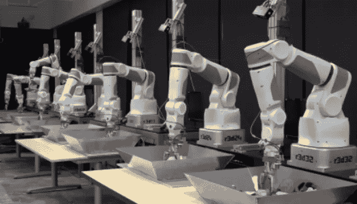

# 14 个机器人自学走进酒吧

> 原文：<https://medium.com/swlh/14-robots-teach-themselves-to-walk-into-a-bar-c34babf03a13>

© Google

***机器人能被训练捡起从未见过的物体吗？***

最近的研究表明，最好的方法可能是让机器人自己进行实验，然后与其他机器人分享知识。

# 如何训练你的机器人

到目前为止，机器人被编程为识别特定的对象，并以预编程的方式与这些对象相关联。这是一个很好的方法，可以在计划好的地点，使用以前体验过的对象来完成可预测的任务。在现实世界中，生活就是你在制定其他计划时发生的事情。

在 ***谷歌*** 上，Sergey Levine 和他的团队将 14 个机械臂联网在一起，并使用( ***CNN*** )卷积神经网络让这些机器人自己学习如何拿起小物体，包括杯子、胶带分配器和玩具海豚。

随着时间的推移，经过近一百万次的练习， ***机器人能够自我修正并优化它们的动作。他们学会了更快、更频繁地捡起物体，采用了自学的策略——比如推开一个物体以便够到另一个物体，并开发了不同的技术来捡起软的和硬的物体。***

机器人从实践中学习并相互分享知识，无需人类互动或预先编程。一旦实验开始，人类唯一的贡献就是更换托盘中的物品。

在研究过程中，机器人被放置在托盘前，托盘上随机放置不同形状、大小、重量和硬度的物体。14 个机器人手臂中的每一个都有摄像头、抓取装置和传感器，设计相似但不完全相同，以增加知识的多样性。

每个机器人的成功和失败都被输入到一个共享的错综复杂的神经网络中，这是一个 14 个机器人可以访问的共享知识的*“机器人维基”*。

> “我们的实验评估表明，我们的方法实现了有效的实时控制，可以成功地抓取新的对象，并通过连续的机器人手眼协调来纠正错误……”

谷歌的项目建立在这样一个概念上，即 ***机器人可以教会其他机器人如何执行特定的任务——或者更准确地说，一个人工智能如何帮助另一个人工智能改进，而无需人类干预。***

这里有一个谷歌研究的链接:[通过深度学习和大规模数据收集学习机器人抓取的手眼协调](http://arxiv.org/pdf/1603.02199v1.pdf)——Sergey Levine，Peter Pastor，Alex Krizhevsky 和 Deirdre Quillen。

# 这些机器人在没有人类指导的情况下，互相教对方用不同的方式捡起硬的和软的物体。

对于一个被认为是刚性的物体，机器人会抓住它的外边缘，并紧紧地抓住它。但是对于一个*软的*物体，像海绵或海豚，机器人“学会”更容易将一个抓握的“手指”放在中间，一个放在边缘，然后挤压。

***好消息是机器人仍然需要人类将物品放入托盘中。***

布朗大学的一个名为“机器人大脑”的项目计划将所有机器学习的行为存储到一个知识库中，其他机器人可以利用这个知识库。[项目](https://www.technologyreview.com/s/533471/robobrain-the-worlds-first-knowledge-engine-for-robots/)被戏称为*世界上第一个机器人知识引擎*。有人称之为，“*天网*”

> Robo Brain 是一个大规模计算系统，它从公共可用的互联网资源、计算机模拟和现实生活中的机器人试验中学习。
> 
> 它将所有机器人技术积累成一个全面的、相互关联的知识库。应用包括机器人研究、家用机器人和自动驾驶汽车的原型制作。

***爪子是我们的主人*** *:他选择谁去谁留。*

© Pixar/Disney

关于走进酒吧的机器人…你会认为 14 个使用卷积神经网络的机器人会很擅长讲笑话。他们不是。

我发现的最好的机器人写的幽默是人类笑话的衍生物。例如，被称为 Data 的 CMU 机器人在最近的一次机器人站立会议中开始说，“一位医生对他的病人说，‘我有一个坏消息和更坏的消息。坏消息是你只有 24 小时可活了。"病人想知道这个消息怎么可能变得更糟。"从昨天开始，我就一直在自动给你打电话……”

更多关于机器人，人工智能和幽默，这里:[*搞笑很难——尤其是对机器人来说。*](http://fusion.net/story/251798/funny-robots/)

点击此链接了解更多关于[*深度学习和复杂神经网络*](http://deeplearning.net/tutorial/lenet.html) *的信息。*

*大卫·j·卡茨，纽约市*

在[Linkedin](http://www.linkedin.com/in/davidjkatz/):【www.linkedin.com/in/davidjkatz/】T2
上关注我在 Twitter 上关注我:@davidjkatz

David J. Katz 是行业领先的跨国消费品公司 Randa Accessories 的首席营销官，该公司也是世界上最大的男士配饰公司。

他的专长是与零售商、品牌和供应商合作，在不断发展的市场中创新并取得成功。

大卫被 *LinkedIn* 选为 2017 年“[顶级声音。](https://www.linkedin.com/pulse/linkedin-top-voices-2017-must-know-people-inspiring-todays-roth)“他被*女装日报*评为[引领时尚产业](https://www.google.com/url?sa=i&rct=j&q=&esrc=s&source=images&cd=&ved=0ahUKEwjO-M2y7ITYAhUHKiYKHcheAlkQjRwIBw&url=http%3A%2F%2Fwwd.com%2Fwwd-publications%2Fdigital-daily%2Fmondays-digital-daily-april-3-2017%2F&psig=AOvVaw1UUxt9X_VP2djw_y76zFzB&ust=1513180933315355)，被*先生杂志*评为[男装推动者](http://www.mr-mag.com/menswear-movers-of-2016/)。

他是一名公共演说家，也是畅销书《设计应对:有效的创意直接营销》的合著者。此外，他还登上了*《纽约时报》、《华尔街日报》、《纽约杂志》、《赫芬顿邮报》、《先生杂志》、《T22》和 *WWD。**

大卫毕业于塔夫茨大学和哈佛商学院。

他是神经生物学、消费者行为和“刺激与反应”的学生巴甫洛夫这个名字听起来很耳熟。

— — — — — — — — — — — — —

## 这个故事发表在 [The Startup](https://medium.com/swlh) 上，这是 Medium 最大的创业刊物，拥有 295，232+人关注。

## 订阅接收[我们的头条新闻](http://growthsupply.com/the-startup-newsletter/)。

