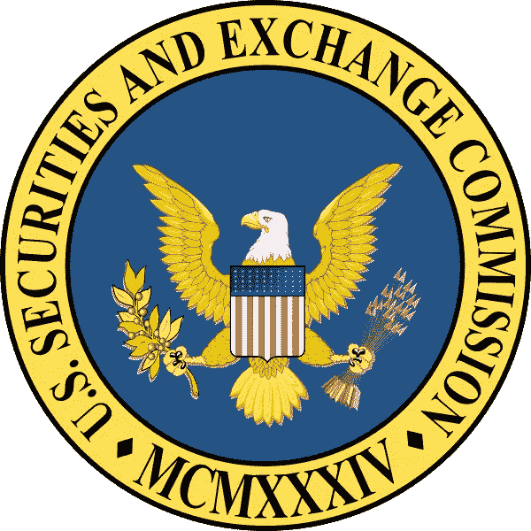

# 2018 年 5 月 15 日:神秘领域最大的故事

> 原文：<https://medium.com/swlh/15-05-2018-biggest-stories-in-the-cryptosphere-fb2122ae7fd3>

## 通过 BlockEx

1.  **欧盟和美国立法者鼓励区块链监管的“沙盒”方法**

区块链监管问题一直是 2018 年共识的热门话题。欧盟和美国议员就此事进行了专题讨论。美国众议院议员 David Schweikert 表示，美国缺乏监管清晰度，他将其描述为“[迷雾](https://www.coindesk.com/us-eu-lawmakers-tout-sandbox-approach-for-blockchain-development/)”，实际上可能是有益的，因为过早的监管可能会扼杀创新。与此同时，欧洲议会议员伊娃·凯丽(Eva Kaili)谴责许多欧洲议会成员对区块链缺乏了解，并讨论了教育他们所有人有多难。他们一致认为，在当前的环境下，监管沙盒可能是区块链创新的最佳途径。Kaili 保持乐观，“在未来几年，我们将有协调，沙盒和监管。”

**2。自我治理会收拾监管“烂摊子”吗？**

针对区块链创新公司所处的监管灰色地带，另一个解决方案是自我管理。专注于金融服务的法律专家 Gary DeWaal 将当前的监管状况称为“一塌糊涂”。他还对像 CTFC 这样的监管机构监管这一领域表示怀疑，并提到了预算削减。他表示，自律组织(SRO)可以制定有效的法规，然后由监管机构采纳。通过鼓励遵守自律组织的规则，它可以帮助保护行业免于触犯法律。

3.**美国必须监管区块链企业，否则可能会失去它们**

与此同时，Consensus 2018 的另一个小组表示，美国缺乏监管透明度，可能会导致区块链初创公司寻求更友好的海岸。像马耳他这样的国家已经尝试建立有利于加密的法规来吸引公司这样做。ARK Invest 的首席执行官兼首席信息官凯瑟琳·伍德(Catherine Wood)抱怨道，“[我们将看到监管主要通过起诉来进行。然而，Future/Perfect Ventures 创始人兼管理合伙人贾拉克·乔班普特拉(Jalak Jobanputra)表示，SEC 和 CTFC 这样的机构只能做这么多，还需要技术解决方案。](https://www.coindesk.com/us-regulators-need-move-faster-crypto-consensus-panelists-say/)

> 这是由 BlockEx 为您带来的新闻综述。

> *在您的邮箱里接收我们每日新闻综述，请在这里注册:*[*http://bit.ly/BlockExNewsRoundup-Updates*](http://bit.ly/BlockExNewsRoundup-Updates)

## 这个故事发表在 [The Startup](https://medium.com/swlh) 上，这是 Medium 最大的创业出版物，有 324，834 多人关注。

## 订阅以在此处接收[我们的热门故事](http://growthsupply.com/the-startup-newsletter/)。

