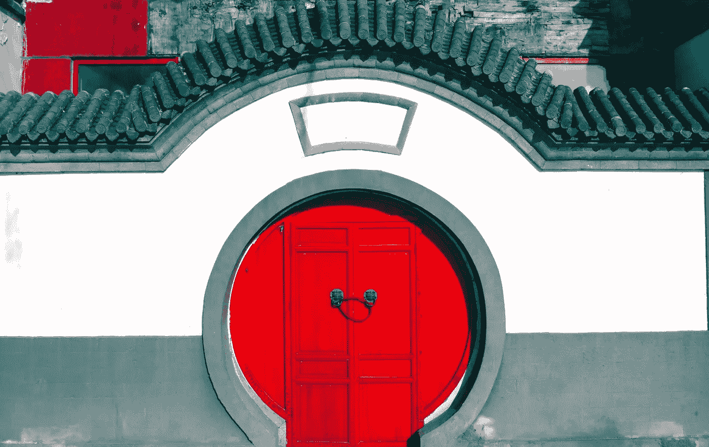

# 2018 年 8 月 15 日:神秘领域最大的故事

> 原文：<https://medium.com/swlh/15-08-2018-biggest-stories-in-the-cryptosphere-441296804dff>

通过 BlockEx

**1。瑞波想到了中国**

欧盟战略客户副总裁 Jeremy Light】透露 Ripple 想要进入中国。它将通过提供分布式账本技术(DLT)服务来加速跨境支付。然而，这并不是第一次接触这个国家。事实上，该公司此前与总部位于香港的金融服务公司连连国际(LianLian International)签约，后者从事中国、欧洲和美国之间的交易。中国也将遵循类似的策略，因为 Ripple 将避免提供其加密货币 XRP 服务。该国此前禁止加密货币，以及该国的加密交易和 ico。此外，考虑到这个国家的面积，Ripple 想要立足，需要的不仅仅是一个客户。

**2。LINE 推出 1000 万美元代币风险基金**

总部位于日本的信息公司 LINE】推出了一个象征性的风险投资基金,资本承诺为 1000 万美元，名为 Unblock Ventures Ltd .这笔钱将用于投资区块链的初创企业。该公司希望这将有助于创建一个区块链创业生态系统。Unblock Ventures 将担任基金经理，而 LINE 的子公司 LVC Corporation 将提供资金。此外，根据区块链工业的发展情况，总额预计将逐年增长。“LINE 是首批通过公司基金正式进行象征性投资的上市公司之一”。消息公司今天通过一份新闻稿宣布了这一计划。

**3。委内瑞拉正在考虑为加密货币创建一家中央银行**

委内瑞拉正在计划成立一家加密货币中央银行。该国的全国制宪会议甚至已经在安排将其纳入委内瑞拉宪法，并在其最高法院之上设立一个法院。一份草案将在 35 天后提交给制宪会议委员会。变化还包括石油支持的加密货币 Petro 和一个“宪法保障法院”，它将被置于最高法院之上。大会中最有影响力的人物之一 Hermann Escarrá宣布了这个项目。他还补充说，委内瑞拉公司将获得更多的外国投资。

> 这是由 [BlockEx](http://bit.ly/BlockEx_) 为您带来的新闻综述。

> 【http://bit.ly/BlockExNewsAndUpdates】[*要想在你的邮箱里收到我们的每日新闻综述，请在这里注册*](http://bit.ly/BlockExNewsAndUpdates)

## 这篇文章发表在 [The Startup](https://medium.com/swlh) 上，这是 Medium 最大的创业刊物，拥有 358，974+人关注。

## 在此订阅接收[我们的头条新闻](http://growthsupply.com/the-startup-newsletter/)。

