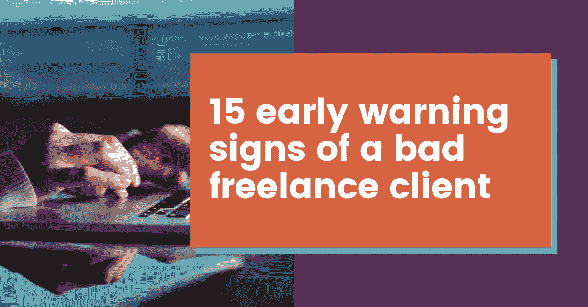

# 糟糕自由职业客户的 15 个预警信号

> 原文：<https://medium.com/swlh/15-early-warning-signs-of-a-bad-freelance-client-1cfbcd217d40>

如何在第一天发现问题客户

作为一名自由职业者，没有什么比发现自己陷入一个糟糕的自由职业客户的关系中更糟糕的了。结束客户关系可能很难，尤其是如果你依赖他们给你的收入，但继续与他们合作并不总是一个选择。