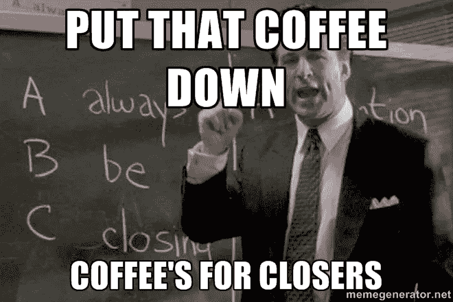

# 15.如何向小型企业销售服务— 30 天中等

> 原文：<https://medium.com/swlh/15-how-to-sell-services-to-small-businesses-30-days-of-medium-d6604c63b3b7>

欢迎回到 **30 天中等。**

感谢迄今为止**一直在阅读、鼓掌和评论**的每一个人！今天的话题是**如何向小企业销售服务。**

如果你错过了下面的我的 30 天中等挑战的前 14 天，你可以补上:

## [0。30 天的培养基](/swlh/30-days-of-medium-c7ab34953c6c)

## [1。建立自己的网站需要什么？— 30 天中值](/swlh/1-what-do-you-need-to-build-your-own-website-30-days-of-medium-1ed1ad4e505c)

## [2。如何找到你热爱的事业——30 天的媒介](/swlh/2-how-to-find-a-business-you-love-30-days-of-medium-cb7a4a702d1b)

## [3。如何建立自己的网站—媒体 30 天](/swlh/3-how-to-build-your-own-website-30-days-of-medium-587f994672ec)

## [4。如何衡量你网站的表现——30 天媒体](/swlh/4-how-to-measure-your-websites-performance-30-days-of-medium-75e650969695)

## [5。如何通过回答他们的问题获得更多的客户-30 天的媒介](/swlh/5-how-to-get-more-customers-by-answering-their-questions-30-days-of-medium-b462d237533e)

## 6。成功的商业网站备忘单——30 天的媒介

## 7。如何衡量成功——30 天介质

## 8。了解在线销售漏斗——30 天媒介

## 9。什么是流量，为什么流量很重要？— 30 天的培养基

## 10。什么是 Google URL Builder，为什么要使用它？— 30 天的培养基

## [11。通过自动化您的社交媒体日程，让您的流量翻倍——30 天中等](/swlh/11-double-your-traffic-by-automating-your-social-media-schedule-30-days-of-medium-ac9aa74f7927)

## [12。如何辨别什么好卖— 30 天介质](/swlh/12-how-to-tell-what-sells-30-days-of-medium-ba3291d029d2)

## [13。我如何在 6，500% — 30 天的培养基中培养我的培养基](/swlh/13-how-i-grew-my-medium-following-6500-30-days-of-medium-c9d2d6f80b51)

## [14。你如何看待事情很重要——30 天中期](/swlh/14-how-you-look-at-things-matters-30-days-of-medium-f641b9733b90)

## [15。如何向小型企业销售服务— 30 天中等](/swlh/15-how-to-sell-services-to-small-businesses-30-days-of-medium-d6604c63b3b7)

## [16。如何通过有效的提案赢得更多交易— 30 天的媒介](/swlh/16-how-to-win-more-deals-with-effective-proposals-30-days-of-medium-481f16bbc86f)

## 17。如何在 10 分钟内建立一个网上商店——30 天的媒介

## [18。如何在任何地方工作— 30 天介质](/swlh/18-how-to-work-from-anywhere-30-days-of-medium-1c9cfa2d662f)

## [19。为什么你的网站会破坏你的销售——30 天媒体](/swlh/19-is-your-website-sabotaging-your-sales-30-days-of-medium-f63bdbdb350)

## [二十。你的流量从哪里来？— 30 天中值](/swlh/20-where-does-your-traffic-come-from-30-days-of-medium-a9b2d2c088bb)

## [21。如何真正识别倦怠——30 天中等水平](/swlh/21-how-to-actually-recognise-burnout-30-days-of-medium-7972a7a7a89e)

## [22。如何修改你的时间表并完成两倍的工作——30 天中等时间](/swlh/how-to-hack-your-schedule-and-get-twice-as-much-done-30-days-of-medium-441a509dc9be)

## [23。不要模仿你的竞争对手——30 天的媒介](/swlh/23-dont-copy-your-competitors-30-days-of-medium-56382b7ba8ed)

## 24。如何 SEO 优化一篇博文——30 天的媒介

## 25。独特或被遗忘——30 天的媒介

## 26。跟着感觉走——30 天中等水平

## 27。人们不支付平均 30 天的中等费用

## 28。如何做关键词研究— 30 天介质

## [29。为什么帕累托原则是世界上最大的诀窍——30 天中期](/swlh/29-why-the-pareto-principle-is-the-worlds-biggest-hack-30-days-of-medium-1c225f5c8aa1)

## 三十岁。你的内容比你的电话更有利可图——30 天的媒介

# 你如何销售服务？

我说的是**卖**不是接单。销售是一种热情的**转移**，在此期间，你要让潜在客户相信，你有解决他们的**问题或需求的**解决方案**。**

向小型企业销售服务需要做好以下三件事:

*   **娱乐城**
*   **价格**
*   **感知**

# 提供

报价指的是你正在**销售的**。我在诺里奇经营一家网页设计公司，所以我向当地企业出售网页设计服务。

你是否以**正确的方式**销售**正确的产品或服务**。

例如，如果你是一名网络开发人员，你的目标市场是拥有 1-5 名员工的小型企业，你销售适合这个市场的软件包吗？

这种规模的小企业不会对那些华而不实的东西感兴趣。

他们通常不会关心你是如何完成工作的，他们优先考虑的是一个简单、干净的网站。

如果你把重点放在技术规格上，并试着根据你的代码与竞争对手的代码相比的质量来销售，这种争论可能会失败。

讨论需要围绕**他们需要什么、时间表、预算和提供优质客户服务。**

虽然你的代码质量当然很重要，但它不是这个市场的驱动因素。这就是为什么 WordPress 网站非常适合小企业的原因，小企业关注的是可用性和构建简单干净的东西。

# 价格

如果你的提议是正确的，你需要做的第二件事就是**价格。**

在这里有两种可能会摔倒。

报价**太便宜。你可能会找到工作，但他们可能会成为噩梦般的顾客，向全世界索要微薄的报酬。你也可能被认为是“低价值”或“低质量的供应商”。**

报价**太高。你想要有利可图的工作和愿意支付合理价格的客户。但是，你需要弄清楚这个公平价格是多少，并且真正理解**你所提供的东西的市场价格**。**

查看你的竞争对手的网站，询问客户他们愿意支付多少，总是询问他们是否有预算(低付费客户总是说他们没有预算)。

这需要反复试验，你可能会在过程中丢掉工作，但最重要的是你每次都要看看这三样东西，并找出你为什么会丢掉工作。

Image credit — [https://2020buzz.org/2011/11/16/2020-resource-library-just-right/](https://2020buzz.org/2011/11/16/2020-resource-library-just-right/)

# 感觉

感知和品牌是一回事。

我用感知这个词是因为**品牌是通用的**，为什么仅仅为了它而给一个东西命名呢？打倒行话！

你的客户如何**看待你****是销售服务的第三个驱动因素。**

**苹果公司可以销售与其竞争对手相对相同的产品，并获得巨大的溢价，这是有原因的。他们被视为市场领导者、酷品牌和“必备品”。**

**这就是为什么有些小企业兴旺发达，而另一些小企业靠介绍人和榨取同样的客户勉强度日的原因。**

**我给你简单说一下。**

**你需要被认为是适合这份工作的公司。做到这一点的方法是通过**专业化。****

**创办小企业并从零开始成长的唯一方法是作为专家建立一些权威。**

**随着业务的增长，他们倾向于向新的领域扩展。**

**他们这样做是为了继续增加收入，也是因为他们在平行领域有着悠久的交易历史。**

**例如，一家**营销机构开始向现有客户销售网站，这样他们就可以向新客户销售网站。****

**新企业没有这种奢侈。**

**当在一个**拥挤的环境**中竞争时，**成功**的最佳方式是**降低利基。****

**选择你所在领域的一个领域并专攻它。**

****

**我选了 **WordPress。****

**一是因为我喜欢 WordPress，二是因为它让我比我的竞争对手更有优势，他们是更大的网络开发机构，迎合多种 CMS 系统和所有类型的网络开发项目。**

**如果一个小企业想要一个 WordPress 网站，他们通常想要一个 WordPress 专家，而不是一个多面手。**

**如果你有足够的现金流支持你度过 3-6 个月，**很难找到合适的工作。****

**不要犯过于小众的错误，就像狗舍的 WordPress 提供商那样愚蠢。**

**因为你的市场很小。**

**成为足够专业的人，将会有好的工作供应，你将会在竞争中获得竞争优势。**

**在我选择的市场上，我十有八九能在大型网络公司的竞争中胜出，因为我的**提议是正确的**，**我的价格更低，**因为 WordPress 比从头开始编写整个网站的劳动强度更小，并且被定位为**专业 WordPress 提供商**。**

**确保你被视为专家，并确保你的营销非常简单。把行话和商业用语留在门口。**

**你不是另一个普通的**‘品牌&传播机构’。****

****你通过有针对性的公关活动帮助金融企业获得新客户。****

**如果你是一家金融公司，你更有可能与谁产生共鸣？**

**我想今天够了。**

**明天**回来查看第二部分。****

## **关于这个话题有什么问题吗？请在评论中告诉我。**

## **你可能也喜欢这个:**

## **[为什么 WordPress 是在](/swlh/why-wordpress-is-the-best-platform-to-build-your-business-or-startup-website-on-df3fe932fad7)上建立业务或创业网站的最佳平台**

## **如果你喜欢这个故事，请点击👏按钮，并跟随我的其他 30 天的媒介。**

****

## **这个故事发表在 [The Startup](https://medium.com/swlh) 上，这是 Medium 最大的创业刊物，拥有 323，238+人关注。**

## **在这里订阅接收[我们的头条新闻](http://growthsupply.com/the-startup-newsletter/)。**

****