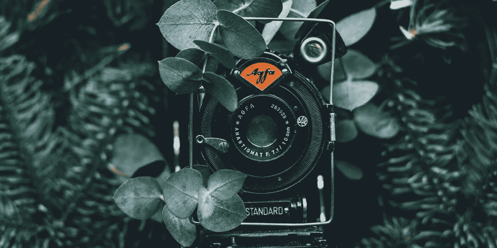

# 现在可以使用的 15 个最好的免费图片网站

> 原文：<https://medium.com/swlh/15-of-the-best-free-stock-image-sites-to-use-now-2d260a5f9749>

摄影是让你的博客或网站看起来最好的一个组成部分。

不幸的是，我们并不总是能够获得美学上令人愉悦的真实图像。事实上，就像许多网页设计师一样，直到最近，我们还不得不满足于那些俗气的照片，这些照片的特点是笨拙的姿势和俗气的微笑。

令人欣慰的是，互联网已经发展起来，库存摄影正在采取一些重大措施来纠正过去的错误。近年来有越来越多的高质量的股票摄影网站，最棒的是…它们是免费的！

所以，戴上眼镜，泡好咖啡，卷起袖子，准备好通过我们的指南发现一些令人难以置信的免费图片，这是 15 个最好的免费图片网站，也是最好的付费网站。

# 1.股票快照

StockSnap 的创始人创建了这个股票图片网站，来解决为你的项目寻找合适图片的难题。他们慷慨地提供比大多数免费网站更多的类别，并每周添加新的真实图片。

面对如此丰富的精彩图片，人们很容易分心！但是为了帮助你集中注意力，他们提供了一个方便的搜索功能，所以很容易浏览。

所有这些图片都可以在一个简单的 CC0 许可下免费使用，你可以对照片做任何你想做的事情，没有署名。

# 2.库存死亡

《股票创始人之死》, Allie 和 David 注意到，对于博客作者、企业和创意人员来说，找到高质量的股票照片极具挑战性。他们把为你的项目提供艺术工具作为自己的使命。

他们的重点是质量，而不是数量，因为他们提供免费的电子邮件捆绑包。只需用您的电子邮件地址注册，每月就可以享受一批 10 张高质量照片。而且都是免费的！

如果你有一点额外的预算，他们还提供两种额外的选择。付费会员可以获得 2000 多张图片。

死亡股票有他们自己的个人许可证，你可以在他们的网页 **上查看[。](https://deathtothestockphoto.com/)**

# 3.驼鹿

Moose**是免费图片空间中相对较新的玩家，他们带来了一些非常独特的东西——一个从奇异到美丽的大型图像库，这些图像被完美地制作在一起。**

**穆斯图书馆由[**图标 8**](https://icons8.com/) 背后的团队创建，包括该服务特有的各种干净、简约和创意的图像。整个图书馆都使用了标准灯，风格和质量一致，非常适合使用。**

**所有图片都打包在一个 940mb 的文件中，使用它们需要一个简单的 [**知识共享署名链接**](https://icons8.com/license) 来表示感谢。这些图像和所有图标 8 文件也可以以每月 19.90 美元的价格获得许可。**

# **4.不溅**

**Unsplash 已经成为免费数码照片的最佳库存网站之一。这个团队只在他们的主页上展示最好的。该网站有一个超过 30 万张图片的巨大图书馆，每天都有新的精选照片上传。**

**如果你正在寻找俗气的照片，你不会在这里找到它们。有了强大的搜索栏，你就能准确地找到你需要的东西。**

**所有照片在自己的 [**Unsplash**](https://unsplash.com/) 许可下都是免费的。用户有修改、复制、分发和使用所有照片的自由，无需署名或许可。**

****

# **5.Kaboompics**

**从食物到时尚到装饰再到风景， [**Kaboompics**](https://kaboompics.com/) 应有尽有。有了强大的搜索引擎，很容易找到你所需要的东西。**

**Kamboompics 是由一个女人组成的军队——来自波兰的卡罗琳娜创建的。她是一名摄影师、图形和网站设计师，她创建了一个网站，为您提供创建精彩内容所需的一切。一个独特的特点是，网站上的每张照片都有一个调色板，可以免费下载图片。**

**她不断增长的数据库拥有最高质量的照片。用户可以自由地以任何方式使用这些照片，无论是商业还是非商业的。唯一的要求是，你包括一个链接到网站的照片信用，以便网站可以扩展和增长。**

# **6.幻想渴望**

**[**花式贪图**](http://fancycrave.com/category/collections/free/) 照片不受任何版权限制。但是它们无论如何都不是通用的！**

**这些令人惊叹的图片是由独立摄影师创作的。Fancy Crave 与这些才华横溢的摄影师合作，每天免费上传两张新照片。**

**你可以使用这个网站来创作 [**令人印象深刻的标志或者时髦的设计**](https://startdigital.com.au/5-best-apps-photo-creatives/) ，即使你的预算有限。他们还提供访问 800 多幅高质量图像的高级包。**

**他们只要求你永远不要宣传这些图片是你自己的，并在可能的情况下注明出处。查看他们的许可证页面，了解更详细的信息。**

# **7.ISO 共和国**

**[**ISO Republic**](https://isorepublic.com/)**为创意专业人士提供免费的营销图片和库存照片。每周都有越来越多的 CC0 授权图片上传。你可以注册他们的时事通讯，将最新的图片直接发送到你的收件箱。****

****ISO Republic 是一个独立的网站，由一小组投稿人管理。该团队的使命是提供最高质量的最佳图像。****

****有了一个简单的类别列表和一个方便的搜索栏，找到完美的点击比以往任何时候都容易。****

# ****8.Pexels****

****[**Pexels**](https://www.pexels.com/) 的使命是帮助世界各地的设计师、作家、程序员和艺术家获得各种美丽的照片，创作出他们令人惊叹的产品。创始人称这一使命为“赋予创造者权力”。****

****超过 40，000 张免费的数码照片都有单独的标签，可以很容易地通过搜索栏找到，你会有很多选择。****

****他们发布的所有图片都获得了 CC0 许可，并且都是经过手工挑选的真实外观。****

# ****9.新老股票****

****如果你无法抗拒一张老照片，那你来对地方了。 [**新老库存**](https://nos.twnsnd.co/) 展示了大量来自公共档案馆的老照片。****

****该团队收集公共领域下的古董和旧复古图像，并将它们全部放在一个方便的地方。****

****大多数图像没有任何已知的版权限制，可以用于商业用途。但为了以防万一，请务必阅读原始提供商的服务条款的细则。****

********

# ****10.Pix 的生命****

****蒙特利尔的 Leeroy 广告公司制作了[**Pix**](https://www.lifeofpix.com/)的生活和[**Vids**](http://www.lifeofvids.com/)**的生活，以提供免费的营销图片和视频。******

******你在这里找不到任何通用的东西，它们只展示了最好中的最好！你可以找到各种各样的时尚营销图片，为你枯燥的博客文章增添趣味。还有时髦的视频！******

******这两个网站都非常免费，没有版权限制。******

# ******11.杰伊·曼特里******

******Jay Mantri 的座右铭是“免费拍照”。做任何事。制造魔法。”******

****创始人杰伦每周四都会发布 7 张新照片。许多照片以自然和大自然为特色。尽管这些照片分辨率很高，但很多都有一种模糊的怀旧感。****

****他的专业照片展示在一个令人印象深刻的画廊里。你可以花上几个小时按照时间顺序浏览这些令人惊叹的图片。****

****他所有的图片都在 CC0 许可下，也就是说你可以把它们用在任何你想用的地方。****

# ****12.经纬照相术****

****Ryan McGuire 是一位异想天开的视觉艺术家，他创建了这个股票图像网站，为网络添加一些古怪的图像。****

****每周都会添加新的精彩图片。所有快照都不受任何个人或商业用途的版权限制。****

****如果你正在为你的项目寻找一些与众不同的东西，****将有合适的令人瞠目结舌的图像给你。在自然、动物、异想天开和都市等类别中，你一定会找到那张照片。********

************

# ******13.美食家饲料******

******随着 [**社交媒体**](https://startdigital.com.au/the-psychology-of-being-liked-on-social/) 风靡全球，美食家们正在崛起！******

****[**美食家 Feed**](https://www.foodiesfeed.com/) 是美食博主和任何需要美食内容的人的库存照片宝库。这个多样化的网站提供了数以千计逼真、美味的高分辨率图像。****

****Jakub Kapusnak 最初将这个网站作为一个附带项目，但它发展成为一个完整的主题股票网站。来自世界各地的美食摄影师使用 CC0 许可证向网站贡献他们的照片。还有三个不同等级的高级套餐，适合认真的美食家！****

# ****14.皮沙贝****

****在所有免费图片网站中， [**Pixabay**](https://pixabay.com/) 可能拥有最大的图片库。****

****他们有大量高质量的照片、矢量和插图，这些都在 CC0 许可之下。该网站是干净的，易于浏览。搜索栏甚至有一个过滤器，让您可以进一步细化您的搜索，这真的很有帮助，因为有超过 78 万张图片可供选择！****

****无论你在做什么，Pixabay 都会有适合你的东西。他们甚至有一个视频图书馆！****

# ****15.爆发****

******是一个由 Shopify 创建和支持的免费数码照片网站。他们庞大的图书馆包括从世界各地收集的数以千计的高质量图像。尽管图片是直接在他们的 [**Shopify 在线商店**](https://startdigital.com.au/ecommerce-platforms/) 中使用，但图片可以在任何你想要的地方免费使用。******

****他们的目标是为设计师、开发人员、博客作者等提供免费的精彩图片。这些高分辨率的图片一点也不无聊，而且可以极大地改善你的普通网页或博客的外观。****

****他们所有的图片都可以免费用于商业用途，不需要署名。但是，照片学分或链接回摄影师的个人资料将不胜感激。****

# ****收入最高的股票网站:Stocksy****

****好的，我们说过我们会覆盖所有免费的股票网站，所以为了更好的衡量，我们将包括我们最喜欢的付费股票图片网站— [**Stocksy**](https://www.stocksy.com/) 。****

****每一位艺术家、照片和视频都是 Stocksy 团队精心挑选的，以确保始终保持高质量。说真的，质量是令人难以置信的，远远不是奶酪股票，因为它可能得到的。从创造性的工艺平面到令人惊叹的肖像，Stocksy 标准很高。此外，他们的许可照顾艺术家——谁不喜欢照顾伟大的艺术家呢！****

****我们尽我们所能，尝试在我们的大部分项目中加入至少一张普通的照片，尤其是当我们的客户可能没有摄影师的预算，但仍然想要高质量的照片时。****

********

# ****最佳免费图片网站****

****如你所见，高质量的免费图片的选择是无限的。通过使用我们的 15 个最佳免费图片网站，你一定会为你的项目找到很棒的图片。值得注意的是，Flickr 也可以是一个很好的资源，只要留意权利许可过滤器。始终确保检查小字，以便您可以合法地自由使用您选择的图像！****

****更多技术建议和支持，请访问我们的博客 。****

****本文原载于 [Start Digital 网站](https://startdigital.com.au/15-best-free-stock-image-sites/)。****

********

## ****这个故事发表在 [The Startup](https://medium.com/swlh) 上，这是 Medium 最大的创业刊物，拥有 327，829+人关注。****

## ****在这里订阅接收[我们的头条新闻](http://growthsupply.com/the-startup-newsletter/)。****

********