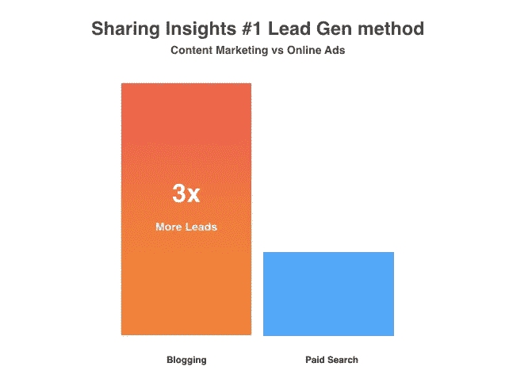
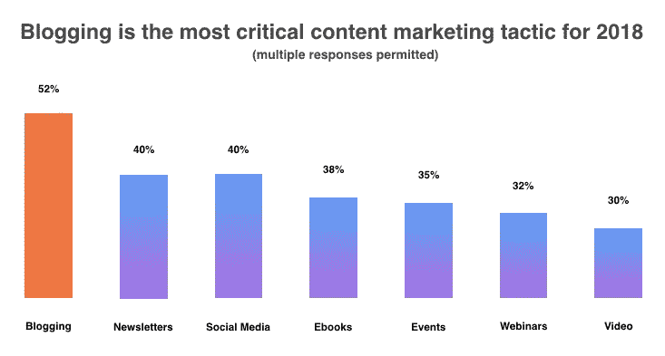
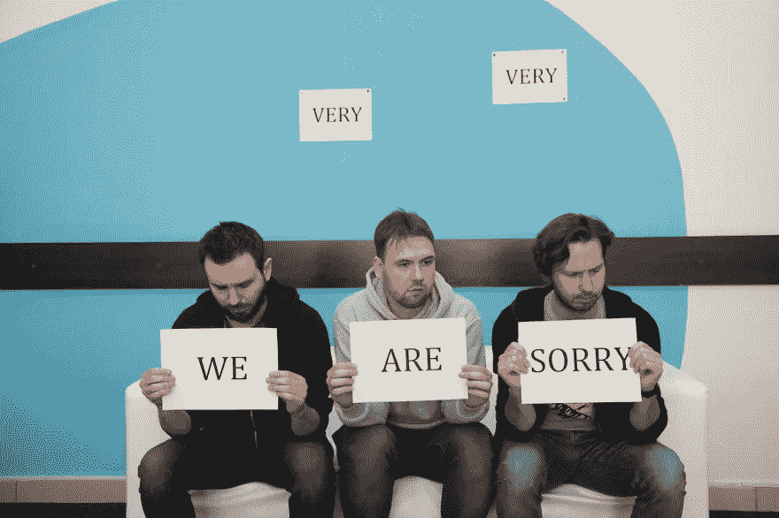
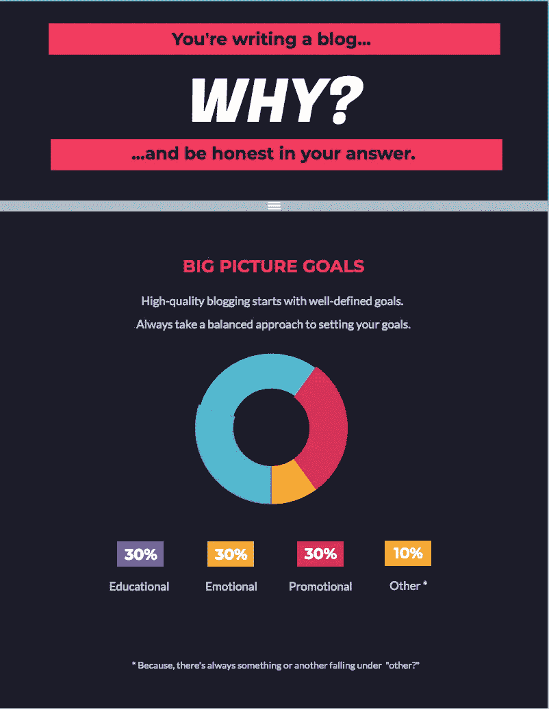
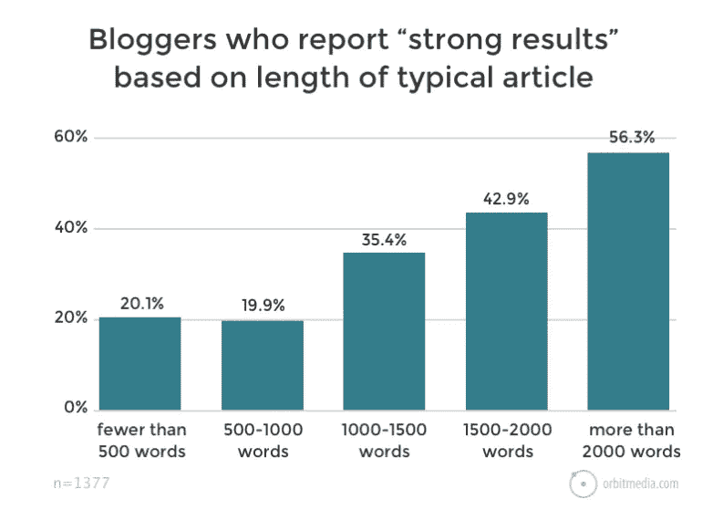

# 为什么博客是你内容营销策略的关键

> 原文：<https://medium.com/swlh/15-reasons-why-blogging-must-be-a-part-of-your-content-marketing-strategy-c417b57c1865>

© Mathias De Wilde | storychief.com

博客超时！

我们都同意内容营销有点失控了吗？

根据最近的统计，谷歌搜索“内容营销的形式类型”产生了 105 种以上的内容。

这意味着这是回到我们讲故事的根源——博客——的最佳时机。

这并不是说你必须放弃你喜欢的视频、播客和网络研讨会，不。事实上，没有人应该把鸡蛋放在一个篮子里。

## TL；速度三角形定位法(dead reckoning)

1.  你通过博客产生的潜在客户将是通过广告的三倍。
2.  博客对于 SEO 来说是完美的。
3.  你将有四倍的可能性在自然搜索结果中被发现。
4.  博客将成就或打破你的 2018 年。
5.  博客是你品牌的声音和名片。
6.  你可以在博客为你工作的时候睡觉。
7.  你的博客是一个透明的机会。
8.  写博客明确了你的原因，让你保持清醒。
9.  谷歌喜欢将博客作为内容营销策略(这是真的)。
10.  长格式，短格式，不要在意。
11.  TL；DR 对你(和你的 SEO)有好处
12.  写博客对你的大脑是一个很好的锻炼！
13.  如果你写出来，他们会通过点击或者口口相传来分享…
14.  你可以免费开一个博客！
15.  博客不会嫉妒其他类型的内容。

现在，如果你还在问，“为什么我需要博客成为我内容营销策略的一部分？”

以下是 15 大原因，更详细地说…

## 1.说到领导一代，博客更好——比付费广告好得多

如果你有一个有效的内容营销策略，那么你从博客中获得的结果将远远超过任何来自临时搜索广告的短期流量。

(Source: [https://www.hubspot.com/marketing-statistics)](https://www.hubspot.com/marketing-statistics))

是的。你通过博客产生的潜在客户将是通过广告的三倍。

那么，当你可以敲敲键盘，在内容创作的道路上灵活运用这些脑细胞时，为什么要倾家荡产呢？！

## 2.写博客能增加你网站的流量，对搜索引擎优化来说是完美的。

甚至已经有了一个[内容写作清单](https://contentwritingchecklist.com/)，旨在帮助你在搜索引擎中优化博客。

## 3.与没有博客的人相比，你有四倍的可能性在有机搜索结果中排名更高([来源:科技客户端](http://www.techclient.com/blogging-statistics/))。

众所周知，微软和 IBM**可能是第一批拥有“企业博客”的公司，但事实是，今天你不能没有它。**

## 4.高达 52%的营销人员将博客定义为“重要的”

在最近对全球 2，562 名营销人员进行的内容营销调查中，博客成为 2018 年最重要的内容营销策略。

(Source: Content Marketing Institute)

事实上，有 105 个记录在案的“内容营销策略”，博客排在第一位是对博客力量的真实证明！

## 5.博客是你品牌建立信任的名片

如果你已经掌握了行业趋势和客户需求的脉搏，那么你已经知道你的公司博客是保持你的品牌的完美平台。

所以让手指动起来。

## 6.博客不睡觉，所以你*可以，*在其他可爱的事情中在你的待办事项上直播

像 [Hubspot 的](http://blog.hubspot.com/)这样的博客仅通过有机搜索引擎结果就获得了超过一百万的访问量，这是有原因的。

他们已经投资于他们的博客，并通过搜索引擎优化驱动的图书馆，现在他们的博客在他们睡觉的时候为他们工作。

## 7.你的博客是一个透明的机会

此外， [Buffer](https://open.buffer.com/transparency-timeline/) 以其透明度和分享最佳实践的意愿而闻名。没有比通过诚实的双向交流更好的方式来展示你公司的核心价值了，博客从一开始就为你提供了这种方式。

如果你是一家初创公司，那么就开始分享，并尽早开始这些对话。

Standuply 是一个很好的例子，说明了卑微的开始和一路上的失败。

The Standuply Team sincerely apologizing for bugs and other mishaps in 2017

错误时有发生，并能帮助建立一个社区。问问格列布·德沃亚特金(Gleb Dvoryatkin)、阿尔特姆·鲍罗丁(Artem Borodin)和亚历克斯·基斯捷涅夫(Alex Kistenev)就知道了(图:从左到右)。

[真实性很重要。](https://blog.storychief.io/advice-for-startup-founders-around-storytelling)这对潜在客户很重要，对您现有的客户群也很重要。

## 8.你更有可能知道你为什么写博客，因为写作确实需要研究和计划。

这就是为什么你会成功或失败。

你知道你为什么写博客吗？每个博客的目的是什么？

[https://contentwritingchecklist.com/](https://contentwritingchecklist.com/)
What is your blog’s goal?

注意:不管“为什么”，你的写作声音永远不应该失去你的品牌个性和个人风格。

## 9.谷歌奖励更长、更有洞察力的阅读

是真的。

**谷歌**几年前就决定，较长的博客帖子应该排名更靠前，因为相关的**反向链接**有机会出现在**常青内容**(作为你博客的基石)。

反过来，读者将不得不在所述页面上停留更长时间，以便阅读深入的内容，从而建立网站的可信度。

难怪博客越来越多地选择长篇内容。

[https://www.orbitmedia.com/blog/blogging-statistics/](https://www.orbitmedia.com/blog/blogging-statistics/)
Source: orbitmedia.com | 2017

## 10.简短形式的内容有其自身的原因

500 字或更少的博客仍然非常有效，这是有原因的:

*   对于移动用户来说，它们看起来更舒服
*   它们更有可能被分享

仅供参考，[故事主管](https://storychief.io/)一直掌握着**谷歌**算法和给你的推荐*，所以你不必如此。只要创造你的故事，并遵循一路上的指导方针。此外， [AMP 和即时文章是一条出路。](https://storychief.io/googleamp)*

故事长永远不会把你引入歧途！

## 11.TL 的出现；博士是一个隐藏的搜索引擎优化奖金

最近,“TLDR”作为博客行业的一个技巧被广泛采用。

就像社交媒体一样，TLDR 不会很快消失。所以你不妨拥抱它。

都市传说讲述了远至 2003 年的 TLDR 起源的故事，对于现代的青少年来说，这是古代。首字母缩写代表“太长时间没有阅读”，被高中学生用作短信回复，表明一个人太忙了，甚至没有理由回复“TLDR”

哦，太滑稽了。

Credit: theverge.com

但是抛开所有的玩笑，TLDR 扮演着双重角色。

*   它有助于将你的博客文章总结成简洁的一行文字，供那些没有时间或注意力来阅读长篇内容的人使用
*   这是一个为你的**页面搜索引擎优化**插入更多**长尾** **关键词**的机会

## **12。写博客是一场马拉松，而不是赛跑**

尽管有相反的传言，人们确实阅读博客。他们总是这样。

从长远来看，你的内容营销劳动的成果是值得的。**思想领导力**需要时间。因此，建立你的可信度，成为每个人心目中最有深度的素材。

他们甚至会链接回你的内容作为一个可信的来源。

**入站链接**是无价的。在你的 SEO 写作中包含一些你自己的超链接是很重要的，你的博客收到的反向链接的数量可能是你博客生存的生命线。

## 13.大使是真实的人，就像你和你的读者一样

有几种方法可以扩大你的影响范围，包括但不限于:

*   在你的个人和职业圈子里发现的金矿。
*   像[托马斯·库克](https://www.thomascook.com/blog/)或[内克曼](https://compagnon.neckermann.be/)一样，向客户的客座博文开放你的博客。
*   [邀请主题专家为您做客博客](https://blog.storychief.io/tips-for-co-founder-relationships)。

正如摇滚 1000 的创始人法比奥·扎法格尼尼(Fabio Zaffagnini)可以证明的那样，摇滚 1000 中的“千”年复一年地增加和放大了他的努力。

对音乐和人民的热爱走到了一起，每位大使都将今年音乐会的部分收入捐给了慈善机构。

[Story Chief 内置了推荐营销系统，可以让你的博客覆盖范围增加 14 倍](https://storychief.io/ambassadors)。

永远不要低估**字** **口** **口**的威力。

## 14.你可以免费开一个博客

是的，不管你是否决定[使用 Story Chief 提供的免费博客，](https://storychief.io/yourblog)在这个时代，在其他平台上免费写博客仍然是可能的。

通过投资高质量的博客来提升你的集客营销游戏。你不仅可以**按照自己的方式**驱动流量，还可以**重新利用你的内容**，这样你就不会不断地重复发明轮子。

## 15.你可以整天写博客，晚上仍然疯狂地进行内容营销

把你所有形式的内容看作投资策略，把你的内容库看作你的投资组合。当然，你必须多样化，但一定要把写博客作为你的主要投资。

通过投资博客，你一定会获得最好的投资回报！

## 这篇文章发表在 [The Startup](https://medium.com/swlh) 上，这是 Medium 最大的创业刊物，拥有+ 370，107 名读者。

## 在这里订阅接收[我们的头条新闻](http://growthsupply.com/the-startup-newsletter/)。

