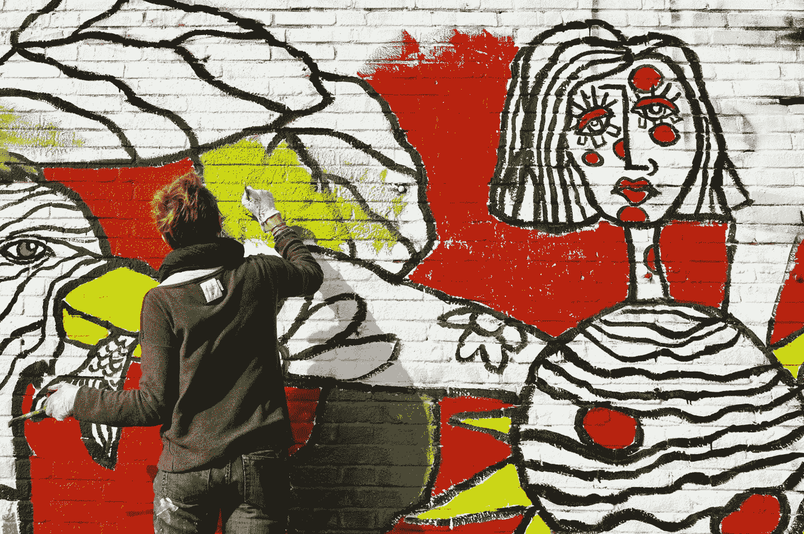
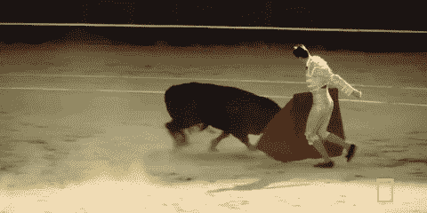
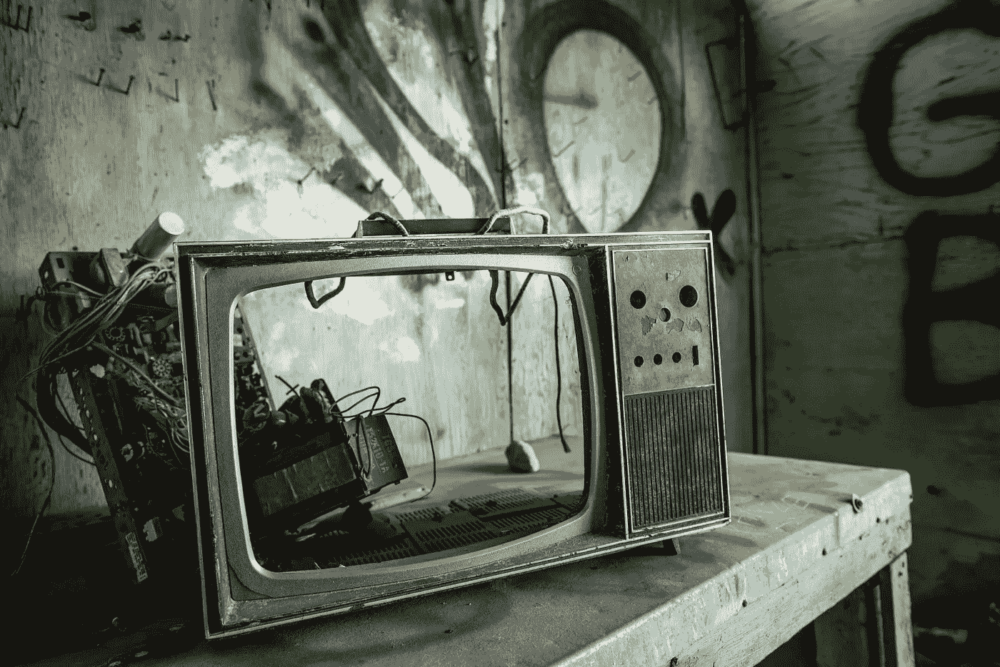

# 我学到的 16 个铁一般的技巧、技术和诀窍帮助我在每天的创作中保持动力。

> 原文：<https://medium.com/swlh/16-iron-clad-tricks-techniques-and-hacks-i-learned-to-help-me-stay-motivated-with-the-daily-4651158a3588>

Photo by [Amandine Cornillon](https://unsplash.com/photos/jrZYRcVCGas?utm_source=unsplash&utm_medium=referral&utm_content=creditCopyText) on [Unsplash](https://unsplash.com/search/photos/creative-person?utm_source=unsplash&utm_medium=referral&utm_content=creditCopyText)

我是一个有创造力的人。

我敢肯定*你*也太…

有时候我觉得说这些话就像一坨屎。当有人说你有创造力时，这说明你已经看到了这一点。你能创造别人不能创造的东西。你被视为社会的正面人物。

当你说自己有创造力时，给人的感觉是傲慢。你把自己置于人和社会之上。

**我试着不为此道歉，因为我知道这不是关于*我*而是关于正在创作的作品。**

从我记事起，我就一直试图将我的生活和工作推向极限。

当我还是个孩子的时候，我会把我在学校的朋友召集在一起，在课间休息时导演戏剧。

我总是写短篇小说和画漫画。

我总是为自己能够倾听周围的人，在他们的谈话中找到一个“按钮”并让他们发笑而自豪。

随着年龄的增长，我毕业了，并在一家网络公司找到了一份销售工作。当我开始的时候，我们刚刚过了创业阶段。大约 18 个月后，我们被投资者收购。因此，我们必须遵循特定的“脚本”和各种指标来帮助衡量我们的增长以及业务的增长。

这不太适合我。

Photo by [Breather](https://unsplash.com/photos/X5Hjlv7nZU4?utm_source=unsplash&utm_medium=referral&utm_content=creditCopyText) on [Unsplash](https://unsplash.com/search/photos/office?utm_source=unsplash&utm_medium=referral&utm_content=creditCopyText)

我被放在一个又冷又暗的盒子里——或者在这种情况下，是一个荧光灯照明的小房间。

不用说，我没有融入他们的体系，后来被解雇了。

成年的现实对我打击很大。

再一次，我知道我是一个有创造力的人，一头扎进了对社会和整个企业界的强烈不满中。我全力以赴*“我们”*对*“他们。”*

这使我陷入了绝望和绝望的境地。

我开始喝酒，我开始抽烟，我开始和不利于成长的女人约会(对我和她们都是如此)，我放弃了过去几年我曾经追求的所有创造性追求。

随着时间的流逝，所有这些自怜像滚雪球一样变成了一个灾难性的时刻，让我看到了我生命的脆弱和现实，以及我生命的目的。

## 我的生活突然发生了天翻地覆的变化，我开始写作，重新开始创作。

伴随着创造力而来的是责任。

伴随着责任而来的是目标。

为了实现这一目的，需要一个指导原则。

我一直认为有创造力意味着我会穿着内衣坐在办公桌前，啧啧有声地吃着拉面，一写就是几个小时。

我想我需要远离社会一段时间。

Photo by [Ali Yahya](https://unsplash.com/photos/nMGoYZI41QY?utm_source=unsplash&utm_medium=referral&utm_content=creditCopyText) on [Unsplash](https://unsplash.com/search/photos/writer?utm_source=unsplash&utm_medium=referral&utm_content=creditCopyText)

我以为我会迸发出创造力，将我从地球带到宇宙中，帮助我引导写作之神，从而帮助我改变我的巨著。

我错了。

我在*服用创意生活的红色药丸*并戴上企业家的帽子完全包围自己的过程中学到的是**这种生活是关于常规、结构和纪律的。**

*   我认识到，创造一些特别和伟大的东西不会在一夜之间发生——事实上，一夜成名只是一个神话。这是规则的例外。
*   我明白了这不是你的选择，而是一种生活方式。
*   我明白了你将要牺牲太多，以至于有时你会感到孤立和孤独。

我也明白了，当你完成牺牲和奋斗时，你会得到精神上、经济上和职业上的回报。

艺术和创造性的努力类似于人类——销售保险则不是(抱歉…不尽然)。

[https://bit.ly/2wN5jfX](https://bit.ly/2wN5jfX)

当我们出生的时候，当我们还是孩子的时候，我们都有这个内在的梦想和目标——当我大约 7 岁的时候，我想成为一名斗牛士。然后，我们受到学术体系的打击，这个体系把我们的梦想打了出去。

通过考验和磨难，我找到了那个深深遗忘在我脑海中的声音，并选择倾听它。

因此，为了充分优化声音，我找到了几个帮助我在这个领域取得成功的原则。

# 1.让自己对人们负责。

当你让人们参与你的投标，并告诉他们你将在 Y 日期前把 X 交付给他们时，你会有动力去完成工作。

# 2.偶尔穿得邋遢一点。

这是一种古老的斯多葛派方法，将你的感知放在适当的位置。

当你穿上单调的衣服，意识到你的虚荣心有多愚蠢时，你会考虑你的购买动机。

# 3.管理你的个人财务。

当你让自己有能力在一笔可观的“储蓄存款”上漂浮时，你就可以激励自己朝着梦想努力。

当你拿着薪水时，那是你浅薄的动机。

# 4.写下你的目标并张贴在显眼的地方。

当你从头脑中取出一个目标并写下来时，它会产生更大的影响。

当这个目标每天都在你卧室的墙上盯着你的时候，你会因为没有尝试去实现它而感到羞耻。

# 5.跟随你的灵感。

除了跟随你灵魂深处的感觉，还有什么比这更好的激励自己的方式呢？

# 6.邀请人们进来。

允许人们为你加油。有希望你赢的人。还有，允许自己去帮助别人，给别人加油。

当你的朋友和家人赢得了他们的战斗，它把一把火放在你下面。

# 7.永远扩展你的思维。

读、写、交谈。尽你所能扩大你对世界的了解。

当你知道得越多，生活中的难题就越容易迎刃而解。

# 8.别想太多了。

我记得我听到的一些最好的建议来自我曾经工作过的公司的第一任 CEO。

他说:“我在寻找我不熟悉的工作，我在你的头上。这将激励我尽最大努力。”

# 9.要极其自律。

如果有机会，大多数人会回复到懒惰和昏睡。

当你用结构和纪律来巩固你的一天时，你唯一的选择就是保持动力去划掉你清单上所有的待办事项。

# 10.扔掉你的电视。

Photo by [Tina Rataj-Berard](https://unsplash.com/photos/0Q33pyk-AXI?utm_source=unsplash&utm_medium=referral&utm_content=creditCopyText) on [Unsplash](https://unsplash.com/search/photos/throw-away-television?utm_source=unsplash&utm_medium=referral&utm_content=creditCopyText)

媒体在这里做一件事——调解。

他们调节你的思想和生活。

媒体影响你应该如何行动，你的动机应该在哪里。扔掉你的电视，重新定义你自己的动机。

# 11.构建一个合理的待办事项列表。

很容易感到不知所措。当你不知所措时，你就没有动力去执行。

它阻止你做工作。

相反，在你的清单上列出 3-5 个待办事项。这些是一个人可以很容易完成的可操作的待办事项。当你这样做的时候，你就建立了成就感和动力。

# 12.管理你的情绪。

嫉妒令人窒息。

仇恨令人窒息。

愤怒令人窒息。

悲伤令人窒息。

为了获得动力，你需要在日常工作中坚定不移。

# 13.养成口头禅。

听起来很俗气。

当我情绪低落、没有动力的时候，我会对自己重复一句咒语。

我在脑子里一遍又一遍地说，“我够了。”我这样说，直到我开始相信它。过不了多久，我的整体情绪开始改变。

我开始坐直了。我的眉毛放松了。我感到一股微弱的动力在我体内流动。

# 14.从身体上挑战自己。

身体紧张和克服身体障碍是一个很好的比喻，比喻你将在思想和生活中经历的战斗。

当你能克服生活中的生理目标时，职业和生活目标就更容易实现。

# 15.每天都有小小的进步。

当我们在项目、业务、关系等方面工作时，有时很难看到全局。

我们认为我们需要在几周内完成整个工程。这是谬论。

关键是当你醒来的时候，要比前一天提前一点。

# 16.忠于自己。

别戴面具了。

当你不得不被别人对你的突发奇想所左右时，你怎么能找到朝着你内心真实的方向努力的动力呢？

创意者的生活是艰难的。

你将会牺牲很多。

你不会每天都有进步。

也许，你最终甚至会失败。没有公式或脚本可以帮助你到达“应许之地”这是一场终极赌博。

我喜欢回味金凯瑞的一句话，

> “你可能会在你不想做的事情上失败，所以你不妨冒险做你喜欢的事情。”
> 
> ―金·凯瑞

为什么不呢？

## 如果你这样做了——确保你为自己配备了合适的工具带以获得成功。

# 准备好接受刺激了吗？

我给你提供了一个经过 6 个部分测试的指南，它将增长你的思维，帮助你设定并达到你的创造性努力的目标。

## [> > >在这里获得免费指南< < <](https://www.tribeloyal.com/free-6-step-course)

## 学到了什么？按住👏说“谢谢！”并帮助他人找到这篇文章。

## 这篇文章发表在《T4》杂志《创业》(The Startup)上，这是 Medium 最大的创业刊物，有 325，962 人关注。

## 在这里订阅接收[我们的头条新闻](http://growthsupply.com/the-startup-newsletter/)。

