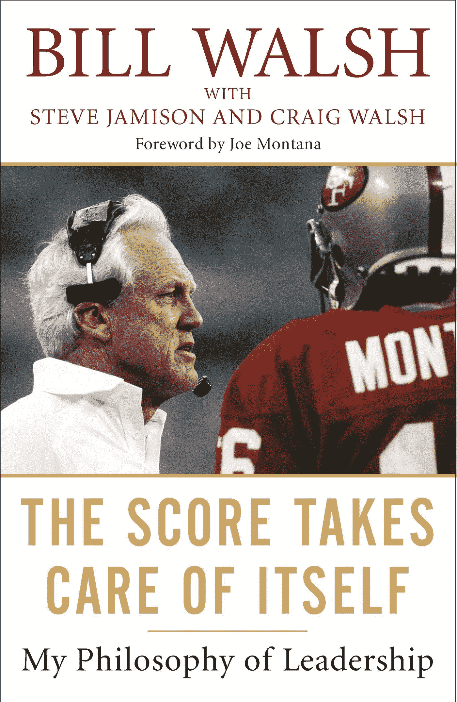

# 每位领导人都应该阅读的 16 句比尔·沃尔什语录

> 原文：<https://medium.com/swlh/16-quotes-from-bill-walsh-that-every-leader-should-read-97dece697571>

当比尔·沃尔什加入三藩市 49 人队时，他们是足球界最差的球队。三年内，他们成为超级碗冠军。该队成为一个王朝，在他的任期内赢得了三次超级碗。众所周知，沃尔什是有史以来最伟大的教练之一，他在《比分不言自明》一书中写下了他的领导哲学。

这里有 16 句名言，你可以用在自己的领导力实践中:

1.  “帮助我周围的人实现自我目标的能力凸显了我能力的一个方面，也是我最看重的一个标签——教师。”
2.  “你怎么知道自己是否在做这份工作？如果你凌晨 3 点起床，对着录音机说话，在纸上记笔记，肚子里有疙瘩，皮肤上有皮疹，失眠，与妻子和孩子失去联系，没有食欲或幽默感，感觉一切都可能出错，你可能正在做这份工作。”
3.  “我把我们的注意力更多地放在改进的过程上，而不是放在胜利的奖赏上——也许是对我们执行的质量和我们思考的内容着迷；也就是我们的行动和态度。我知道如果我这样做了，胜利就会自然而然地到来。”
4.  “胜利者在成为胜利者之前表现得像胜利者……文化先于积极的结果。它不会在你走向胜利的时候被附加上去。冠军在成为冠军之前表现得像冠军；在他们的获胜者面前，他们有一个胜利的表现标准。”
5.  "成功不在乎你走哪条路到达它的家门口."
6.  “很少有什么比表扬更能以更少的投入获得更大的回报——表扬你组织中的某人，他已经站出来完成了工作。”
7.  “优秀领导者的一个典型特征是坚信自己能够做出积极的改变——即使在不利于自己的情况下也能获胜。一个成功的领导者不会轻易动摇这种自信。但它确实发生了。”
8.  “你要清楚自己的立场。然后为它挺身而出。”
9.  “对于团队成员，你决定他们内心的声音。领导者，至少是一个好的领导者，教团队如何与自己对话。一个有效的领导者会对内心的声音产生深远的影响。”
10.  “纪律必须是一种根深蒂固的习惯，它比战斗的刺激或死亡的恐惧更强大。”
11.  “如果你在种植一个花园，你需要拔除杂草，但如果你只知道除草，花就会枯死。他们需要阳光和水。人也一样。”
12.  “有些人是赢家，有些人想成为赢家，但不知道如何去做。如果有人能教他们，那些聪明、有才华、有上进心的人就能学会如何成为赢家。”
13.  “金钱万能。待人接物声音更大。”
14.  “精通需要无止境的再掌握。事实上，我不相信有真正的精通。它是一个过程，而不是终点。这是很少有成功者意识到的，也在某种程度上解释了为什么重复如此困难。获得胜利后，胜利者开始相信掌控的过程已经结束，他们是这一过程的新主人，并为此感到自豪。”
15.  “最有力的四个字是:我相信你。”
16.  “他的人生目标是让我们相信我们可以变得伟大。他做到了，我们也做到了。这就是为什么他是如此伟大的领袖。”—乔·蒙塔纳，关于比尔·沃尔什成为伟大领袖的原因

你最喜欢的领导力名言是什么？请在评论中告诉我！

# 关于作者

汤姆·阿莱莫 *是一名充满激情的 B2B 销售人员。他目前是* [*千禧一代动力播客*](https://soundcloud.com/ryan-warner-799706255) *的主持人，在这里他帮助千禧一代快速跟踪他们的个人发展。Tom 也是 TechTarget 的客户经理，住在旧金山。*

[网站](http://tomalaimo.com/) | [播客](https://soundcloud.com/ryan-warner-799706255) | [邮箱](mailto:thomasalaimo7@gmail.com) | [推特](http://twitter.com/tommytahoe)|[LinkedIn](https://www.linkedin.com/in/tom-alaimo-573a1878/)*|[脸书](https://www.facebook.com/thomas.alaimo.12) | [Instagram](http://instagram.com/tommytahoe) | [媒体](/@TomAlaimo_TTGT) |*

**

## *这篇文章发表在 [The Startup](https://medium.com/swlh) 上，这是 Medium 最大的创业刊物，拥有+ 380，756 名读者。*

## *在这里订阅接收[我们的头条新闻](http://growthsupply.com/the-startup-newsletter/)。*

**