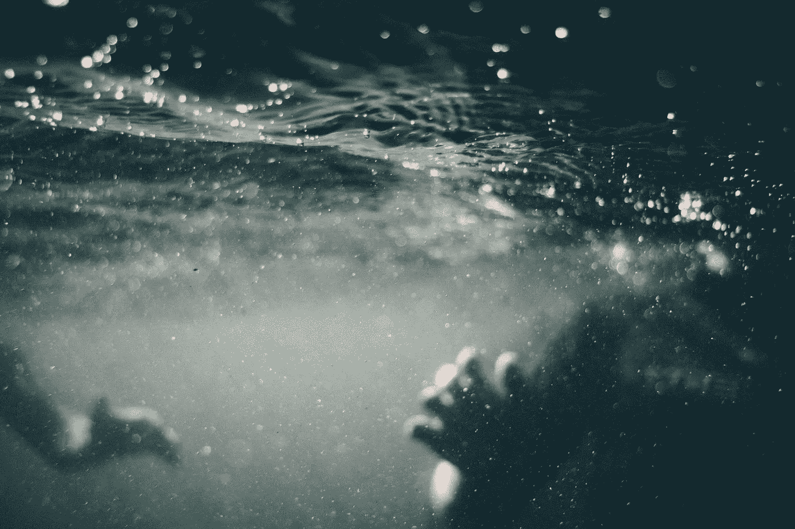
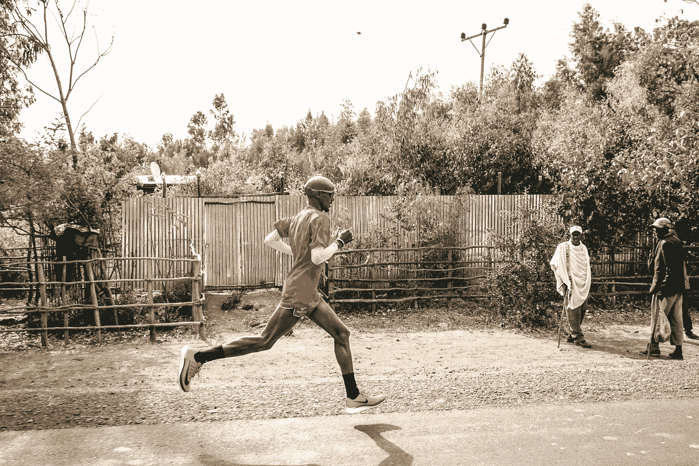
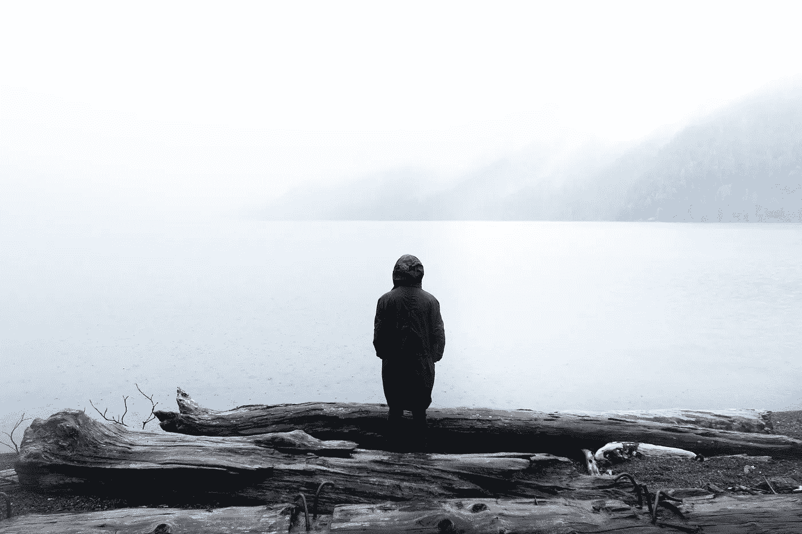
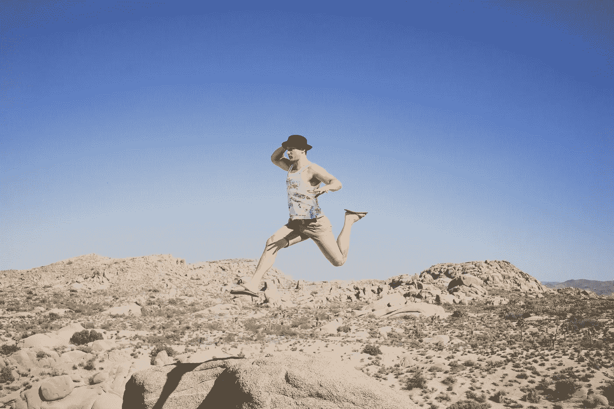
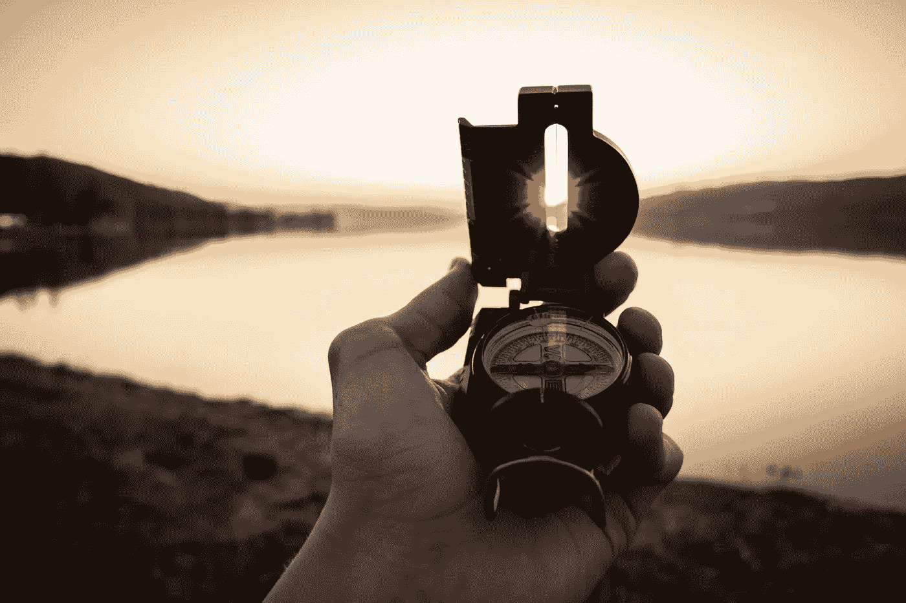
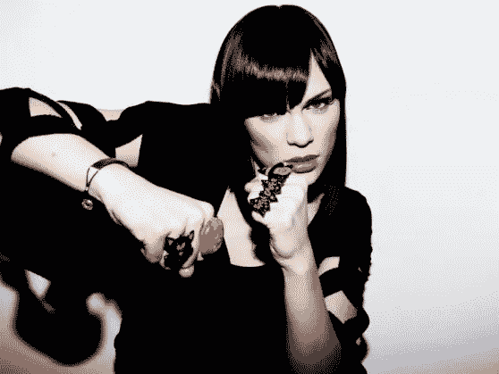

# 16 句名言将帮助你度过自我创业的难关

> 原文：<https://medium.com/swlh/16-quotes-that-will-help-you-pass-through-the-struggle-of-self-employment-501cebe66562>

Photo by [Tim Marshall](https://unsplash.com/photos/T-AOFf2B8Zw?utm_source=unsplash&utm_medium=referral&utm_content=creditCopyText) on [Unsplash](https://unsplash.com/search/photos/struggle?utm_source=unsplash&utm_medium=referral&utm_content=creditCopyText)

奋斗是自主创业不可避免的一部分。当你试图实现你的梦想时，没有什么是容易的。困难和困苦，将是你永远的伴侣。

但是在你之前有人。

有人经历过类似的斗争，就像你现在所做的一样。还有一些人，他们现在正面临着这个问题。你当然不是一个人在奋斗。

> 很多次都会来…
> 
> …当你讨厌旅行时，你已经选择了。
> 
> …当你快要放弃的时候。
> 
> …当你想退出的时候。

正是在那些时刻，你将不得不看向那些已经经历了挣扎的人。正是这些人，会提醒你为什么你现在的奋斗是值得的。

让我们来看看，历史上一些最成功的人对奋斗有什么看法。

## 1."力量和成长只有通过不断的努力和奋斗才能获得."—拿破仑·希尔

Photo by [Scott Webb](https://unsplash.com/photos/JNPvv1u8yRg?utm_source=unsplash&utm_medium=referral&utm_content=creditCopyText) on [Unsplash](https://unsplash.com/search/photos/training?utm_source=unsplash&utm_medium=referral&utm_content=creditCopyText)

奋斗是成长的前提。不经历长时间的努力、汗水和困难，我们就无法超越目前的表现水平。

从某种意义上说，奋斗是一种训练。

它让我们做好准备，并迫使我们为下一步做好准备。

斗争只会变得更加激烈。当我们面临越来越困难的挑战时，我们所面临的困难只会增加。是我们现在的奋斗，为下一步做准备。

我们停止挣扎的那一刻，就是我们停止接受足够大的挑战的那一刻。

## 2.“看我成功了。我不是一夜之间实现的。它是多年奋斗的产物，每一年，我的时代都呈现出逐渐改善的趋势。”—莫·法拉

Photo Credit: Mo Farah’s [Facebook](https://www.facebook.com/MoFarahGold/) page.

奋斗，以及由此带来的相应改善，是一个持续多年的过程的结果。任何事情都不可能很快实现。没有多年的努力，什么也做不成。

每一天，你都会变得更好。

每一年，你都离你的目标更近一步。

然而，这种改善并不总是像跑步那样容易衡量。企业家可能会花数年时间来实现一个目标，但几乎看不到任何明显的改善。

但是要确定的是，你正在进步。只要你不断向前推进。

## 3.你不完美，你生来就要奋斗，但你值得爱和归属——布伦·布朗。

Photo by [Fabrizio Verrecchia](https://unsplash.com/photos/7Ieipcj7lp4?utm_source=unsplash&utm_medium=referral&utm_content=creditCopyText) on [Unsplash](https://unsplash.com/search/photos/imperfect?utm_source=unsplash&utm_medium=referral&utm_content=creditCopyText)

布伦·布朗走得更远，他说斗争是一种自然状态，所有人都处于其中。斗争的类型可能各不相同，但我们都面临着它们。

奋斗是不可避免的。

斗争是事物的自然状态。

你在挣扎的事实并不意味着你有问题。无论你是挣扎着谋生，生活在对未来的持续恐惧中，还是不知道自己在这个世界上的位置，所有这些都是这个过程的正常部分。

你没有任何问题。你和其他人一样值得爱，值得归属，值得成功。

## 4.一旦掌握了所有的斗争，奇迹是可能的。—毛泽东

Photo by [Zoltan Tasi](https://unsplash.com/photos/0khu-rgbjzo?utm_source=unsplash&utm_medium=referral&utm_content=creditCopyText) on [Unsplash](https://unsplash.com/search/photos/miracle?utm_source=unsplash&utm_medium=referral&utm_content=creditCopyText)

你需要直面你的挣扎。你需要理解，并时刻保持警觉，事情将会变得多么困难。你将不得不接受这个事实，你将会挣扎。

一旦你做到了，一切都将成为可能。

因为你不会再抱怨事情有多难。因为你要专注于做最好的工作，你可能会做到。因为你会成为一股不可阻挡的前进力量。

奇迹其实就是这样:

有些人有毅力和力量不断前进，直到他们把看似不可能的事情变成现实。

## 5.不要觉得你有资格得到任何你没有努力争取的东西。—玛丽安·赖特·埃德尔曼

Photo by [Cody Black](https://unsplash.com/photos/lACHYxmRFYA?utm_source=unsplash&utm_medium=referral&utm_content=creditCopyText) on [Unsplash](https://unsplash.com/search/photos/relaxation?utm_source=unsplash&utm_medium=referral&utm_content=creditCopyText)

你不能只是坐以待毙，放松，并期望得到任何特定的结果。经历奋斗是一种方式，在这种方式中，你将获得自己的权利，在你所做的事情上获得成功。

企业家精神中没有权利的位置。

仅仅因为你做了一次，并不意味着你会再做一次。仅仅因为你已经在你的领域建立了声誉，并不意味着从现在开始你所做的一切都会成功。

每一段旅程都是它自己的奋斗。

每一个有意义的项目，都需要自己的汗水。

## 6.我的故事是一首自由的奋斗之歌。这是关于找到一个人的目标，如何克服恐惧，为比自己更伟大的事业挺身而出。—科丽塔·斯科特·金

Photo by [Dawid Zawiła](https://unsplash.com/photos/zb2vBaHYB2I?utm_source=unsplash&utm_medium=referral&utm_content=creditCopyText) on [Unsplash](https://unsplash.com/search/photos/purpose?utm_source=unsplash&utm_medium=referral&utm_content=creditCopyText)

奋斗也与目的密不可分。我们奋斗，因为我们朝着有意义的方向努力。因为我们肩负使命，将超越自我的东西变成现实。

像这样的项目是巨大的。事实上，如此巨大，我们甚至很难想象它们会变成现实。

这就是为什么，恐惧是我们不变的伴侣。

这是对未知的恐惧。害怕不知道我们是否会成功。一种恐惧，我们将永远处于这种挣扎的状态。

## 7.生活本质上是一场骗局，其条件是失败；弥补的东西不是幸福和快乐，而是从奋斗中获得的更深层次的满足。——斯科特·菲茨杰拉德

Photo by [Austin Schmid](https://unsplash.com/photos/hRdVSYpffas?utm_source=unsplash&utm_medium=referral&utm_content=creditCopyText) on [Unsplash](https://unsplash.com/search/photos/win?utm_source=unsplash&utm_medium=referral&utm_content=creditCopyText)

人生没有最后的胜利。

任何承诺都是虚假的承诺。无论你取得了什么成就，总会有更多的东西值得追求。不管你克服了多少困难，总会有更多的困难要面对。

失败是常态。

失败是常态。

但是，满足感并不是来自于生活在一个快乐的天堂，就像你想象的那样。成就感来自于直面斗争，并随着时间的推移慢慢取得小胜利。

成就感来自于回顾你最大的挣扎，并意识到这次并没有那么糟糕。你现在可以为自己感到骄傲，为自己不顾一切坚持下去而骄傲。

## 8.我们可能会在斗争中失败，但这不应该阻止我们支持我们认为是正义的事业。——亚伯拉罕·林肯。

Photo by [Cameron Stow](https://unsplash.com/photos/W0wxbLr67CY?utm_source=unsplash&utm_medium=referral&utm_content=creditCopyText) on [Unsplash](https://unsplash.com/search/photos/failure?utm_source=unsplash&utm_medium=referral&utm_content=creditCopyText)

很有可能，你会失败。

你永远也不会实现你已经开始做的事情。

这没关系。同样的现实存在于每个人身上，每个人都有自己的事业，并为之努力。我们永远无法确定，我们是否会成功。

知道你会挣扎，你可能会徒劳地挣扎，这是一颗难以下咽的药丸。但即使不尝试，也更加痛苦。你将永远活在悔恨中。

你会永远问自己，如果你尝试过，如果你坚持下去，如果你更加努力，会发生什么。

你将永远生活在后悔和失望的世界里。

## 9.不要纠结于挣扎。换句话说，生活充满了起起落落。所以，如果你在挣扎，不要担心，其他人在某个时候都有或将要有。—肖恩·柯维

Photo by [Yanal Tayyem](https://unsplash.com/photos/1h0eUfpaH-g?utm_source=unsplash&utm_medium=referral&utm_content=creditCopyText) on [Unsplash](https://unsplash.com/search/photos/moody?utm_source=unsplash&utm_medium=referral&utm_content=creditCopyText)

挣扎与不挣扎，循环往复。

有一段时间，你在努力实现一个目标。你正在努力，尽你所能。但是事情很艰难，因为你正面临如此多的挑战和困难。

然后，你就成功了。

你觉得自己很平静。

但是在你意识到之前，一些新的东西会出现在你的脑海里。更高的东西。有些事情，更难实现，对你来说更有意义。

作为人类，我们不应该完全满足。我们总是想要更多。我们总是想爬得更高。

这是我们的天性。

因此，如果我们现在正在挣扎，那么总有一天我们会不再挣扎。如果我们现在满足，那么总有一天，我们会再次奋斗。

## 10.我们都需要做的是找到让我们继续前进的源泉，给我们力量和耐心来长期坚持这场斗争。—薇诺娜·拉杜克

Photo by [Joshua Ness](https://unsplash.com/photos/YrssZUm0eF8?utm_source=unsplash&utm_medium=referral&utm_content=creditCopyText) on [Unsplash](https://unsplash.com/search/photos/happiness?utm_source=unsplash&utm_medium=referral&utm_content=creditCopyText)

因为我们知道我们将长期奋斗，我们需要找到一些东西，让我们继续前进。一些东西，将成为我们多年来的能量、灵感和动力的源泉。

我们需要了解自己的需求。

我们需要了解，尽管我们面临着各种困难，我们如何才能满足这些需求。

对一个人来说，这种“源泉”可能是运动。对另一个人来说，可能是支持穷人。另一方面，这可能是一种创造性的激情，是他们兼职追求的。

你的源泉是什么并不重要。但是你需要弄清楚，你需要把什么东西带进你的生活，让你继续前进。

## 11.奋斗，努力，忠于某些理想——仅此一点就值得奋斗。——威廉·奥斯勒

Photo by [Tim Graf](https://unsplash.com/photos/ErO0E8wZaTA?utm_source=unsplash&utm_medium=referral&utm_content=creditCopyText) on [Unsplash](https://unsplash.com/search/photos/hardship?utm_source=unsplash&utm_medium=referral&utm_content=creditCopyText)

尽你所能，即使是在你最困难的挣扎时期，也是你能做的最重要的事情。因为这是你从中获得满足感和自尊的地方。

知道你已经尽力了。

即使在生命的尽头，你仍然没有达到你设定的目标，至少你已经尽了你所能。这就是最终你衡量自我价值的标准。

失败是可以的。

只要你做了，无论你力所能及。

## 12.昨天我敢于斗争。今天我敢赢。— Bernadette Devlin

Photo by [Jude Beck](https://unsplash.com/photos/9WvwJQaKOBM?utm_source=unsplash&utm_medium=referral&utm_content=creditCopyText) on [Unsplash](https://unsplash.com/search/photos/dare?utm_source=unsplash&utm_medium=referral&utm_content=creditCopyText)

斗争是一种准备。在我们将某件事变成现实之前，我们首先需要获得必要的技能、正确的心态和持续前进的精神力量。

今天，你可能会挣扎。

但正是在这一斗争时期，你们为自己未来的成功奠定了基础。

在此期间不要浪费精力。所有的一切都是为了帮助你达到一个地步，在那里你可以向前迈出下一步。关键是，你可以超越目前的束缚，进入下一个阶段。

## 13.生活是一场黑暗中的长期斗争。——卢克莱修

Photo by [Ian Espinosa](https://unsplash.com/photos/SrtIO_uBlVI?utm_source=unsplash&utm_medium=referral&utm_content=creditCopyText) on [Unsplash](https://unsplash.com/search/photos/dark?utm_source=unsplash&utm_medium=referral&utm_content=creditCopyText)

这段引文向我们展示的是，一路上总会有黑暗和不确定的因素。我们永远不知道我们下一步将面临什么样的斗争，也不知道我们是否能成功度过当前的斗争。

这没问题。

这就是生活的全部。

如果生活是可以预测的，那就太无聊了。如果生活是可以预测的，那么它就不会给我们提供成长和学习的机会。它会把我们变成懒惰、满足的生物，整天无所事事。

感谢上帝，事情不是这样。

## 14.为了他们自己，我对激情和爱不感兴趣——没有生活的挣扎，它们只是绒毛。——米拉·奈尔

当然，这个声明本身已经是一个有趣的声明。这种想法，这种激情本身，不会导致任何结果。只有拥抱当地的现实，以及随之而来的斗争，激情和爱才会变得有意义。

但我觉得更有趣的是，作者是如何说激情和爱情为了它们自己而存在，只是一派胡言。

这意味着，激情、爱和斗争之间有着非常强的相互关系。首先，我们需要承认斗争，这是必要的，也是实地的现实。

然后，我们可以用我们对正在进行的项目的热情和热爱，继续向前推进。永远牢记困难和挑战。

## 15.我很高兴我不得不挣扎。这让我成为了现在的艺术家。— Jessie J .

Photo Credit: [celebmafia](http://celebmafia.com/jessie-j-wallpapers-1207073/)

通过每天面对的斗争，我们形成了自己。从某种意义上来说，正是通过我们一生中克服的所有不同障碍的高潮，我们的身份才得以形成。

我们生活中最困难的情况，也是对我们个人发展影响最大的情况。

正是在困难时刻，我们必须做出最有影响力的决定。回想起来，正是这些决定最能告诉我们我们是谁，以及我们有潜力成为什么样的人。

## 16.相信我，没有奋斗，回报不会很大。——威尔玛·鲁道夫

Photo by [Fabrizio Verrecchia](https://unsplash.com/photos/CcqAFQBQV1A?utm_source=unsplash&utm_medium=referral&utm_content=creditCopyText) on [Unspl](https://unsplash.com/search/photos/reward?utm_source=unsplash&utm_medium=referral&utm_content=creditCopyText)

最后，是奋斗本身让我们所有的成功最终都是值得的。如果我们没有先经历所有的艰难困苦，我们就不会欣赏我们已经取得的成就和收获。

想想看:

如果你现在能得到一百万美元，而不需要为它做任何事情，你会感激它很长一段时间吗？或者你会很快认为这是理所当然的？

这同样适用于你可能得到的任何其他奖励。

只有当你为某件事努力工作时，你最终才会真正体会到它的价值。只有这样，你才能真正学到东西，这种学习才会持久。

# 结论:

奋斗在旅途中不可避免的一段。别担心。你所经历的没有什么是奇怪的，或者不寻常的。如果你在挣扎，那么这是世界上最正常的事情。

拥抱它。

接受现实吧。

唯一重要的是，你要不断前进。不要让任何障碍或你面临的任何困难阻止你。继续前进，最终，你会到达目的地。

世界上所有最伟大的人，都面临着他们自己的斗争。正是这种拥抱斗争并坚持到底的能力，让世界级的表演者与众不同。

不要害怕成为一个奋斗者。拥抱它。

*蒂姆·雷蒂格著有《* [*奋力前行:拥抱奋斗。实现你的梦想*](https://www.amazon.com/dp/B07DK6QSLN) *”。这是一本关于奋斗的心理旅程的书，每个(有创造力的)企业家都必须经历这一过程，然后才能将愿景变成现实。*

## 这篇文章发表在 [The Startup](https://medium.com/swlh) 上，这是 Medium 最大的创业刊物，有 334，853+人关注。

## 在这里订阅接收[我们的头条新闻](http://growthsupply.com/the-startup-newsletter/)。

