# 脸书广告成功的 16 种策略

> 原文：<https://medium.com/swlh/16-strategies-to-split-test-your-way-to-facebook-ad-success-a4625e2b316c>

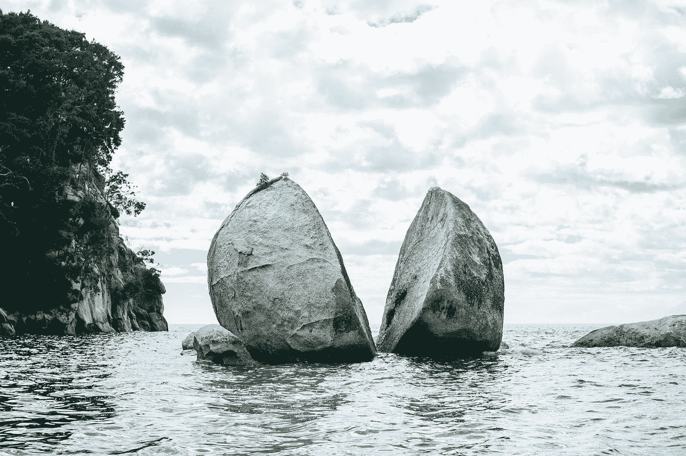

Photo by [Pablo Heimplatz](https://unsplash.com/@pabloheimplatz?utm_source=medium&utm_medium=referral) on [Unsplash](https://unsplash.com?utm_source=medium&utm_medium=referral)

又是一个工作日的结束…

…你通常回家的路线被交通堵塞了。有一个替代方案，但你通常不会选择它，因为它总是很忙…

…哪条路是回家的最快路线？

不管卫星导航怎么说，你永远不会知道确切的答案。

不幸的是，当我们面临分歧的决定时，几乎不可能知道我们是否做出了正确的选择…

…但如果我们这样做了，我们将能够根据这些答案做出**未来的决定**。

数字世界就不一样了。

我们可以**分割测试直到我们变蓝**，跟踪结果**优化**我们的活动。

作为代理商，爱因斯坦每年在脸书广告上花费数百万。除非你花费更多，否则拿起记事本，把这 16 个分开测试的想法记下来。

让我们这样做:

# 头号头条

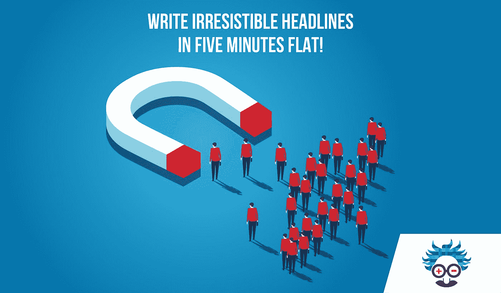

没有比标题更好的起点了。

这是你的读者看到你的帖子时会读到的第一句话。你第一次(有时也是唯一一次)吸引他们点击的机会。

你应该尝试用至少两个不同的标题投放广告，测试其中一个(或全部)特征-

**-长度**

**-力量/情感词汇**

**-数字的使用**

**-正面与负面标题**

**-稀缺性**

**-问题五陈述**

交换标题和描述。

**爱因斯坦时刻**–**拆分测试标题时，不要创建只有细微差别的标题。让他们完全不同，找到最好的，围绕胜者再测试一次。**

# #2 描述

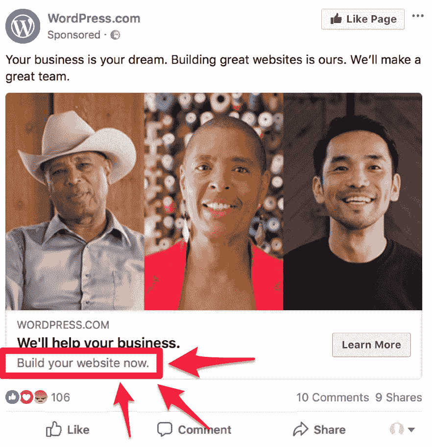

描述是标题下面的文字**(通常以灰色显示)。当标题引起了读者的兴趣，但并没有完全说服他们点击时，它就开始行动了。**

[**爱因斯坦**](http://www.einsteinmarketer.com/about/) 建议用一句话或者最多两句话来描述。

将这些用作**次要标题**。换句话说，你真的很喜欢这个标题，但它并没有达到要求。

# #3 广告图片

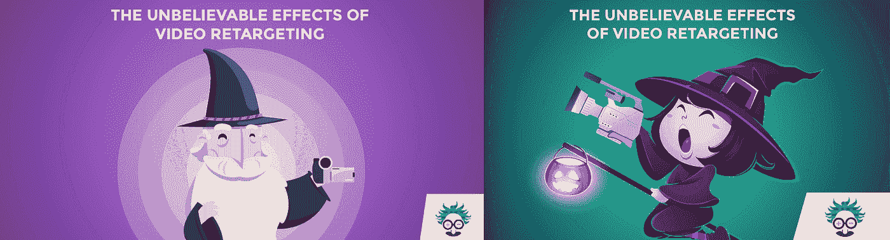

这似乎是显而易见的，但是你会惊讶于有多少企业不进行图像测试。

你广告中的形象是吸引注意力的抓手…

…它可以给你一个**加载更多的点击。**

我们建议使用 3 或 4 个不同的广告图片来投放广告。

**爱因斯坦时刻**——如果你不擅长设计，并且厌倦了为自由职业者支付过高的费用，那就使用像 [DesignPickle](http://mbsy.co/designpickle/29967484) 这样的服务。所有[爱因斯坦的](http://www.einsteinmarketer.com/about/)图像都来自它们！

# #4 主要颜色

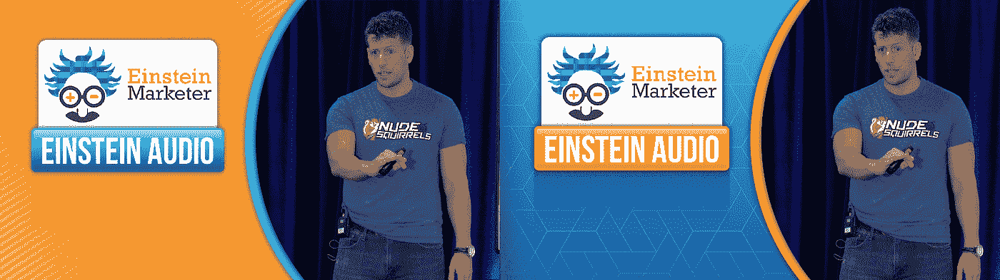

另一件大事…

…颜色**会在观众心中引发**不同的反应。

如果你正在为不同的图片绞尽脑汁，改变背景颜色。

决定广告的目标，研究颜色触发因素(在[谷歌](http://google.com/)上，有很多东西)，测试你的广告中最有希望的。

**爱因斯坦时刻**–**测试图片时，务必确保你的图片以相同的广告格式放置。这会给你一个准确的读数，哪个性能更好。**

# #5 照片与插图

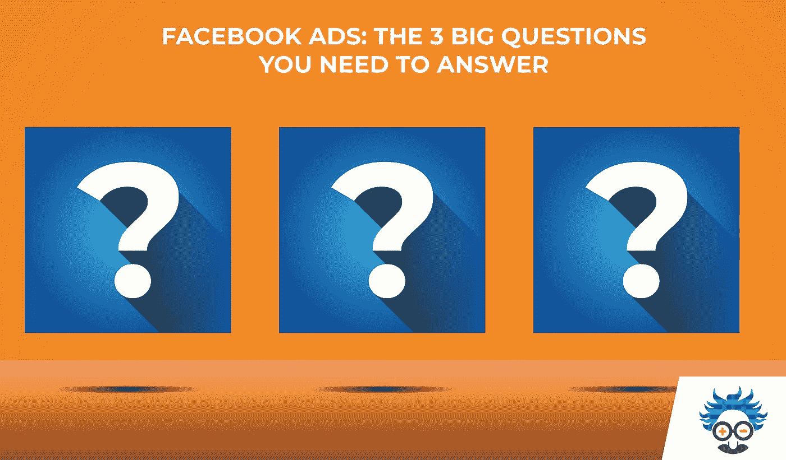

对你的广告创意效果的又一次肯定…

…照片可以激活记忆，让你的产品看起来**真实。**

但是一幅插图可以让你的品牌感觉友好、有趣和令人兴奋。

测试应该在照片和插图上进行，但前提是你已经有了各自的高质量版本。

# #6 图像中的文本与图像中的无文本

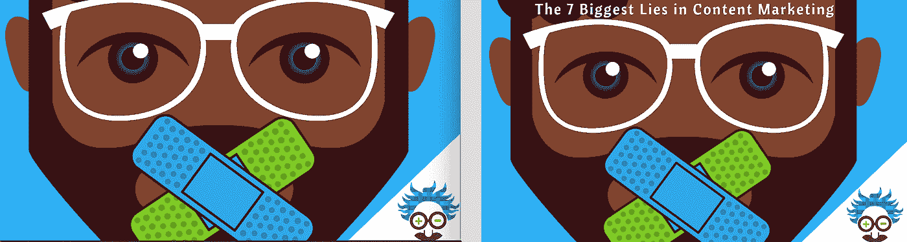

如果你的广告创意中有一些空白空间…

…用文本分割测试同一个图像。

爱因斯坦警告你要小心文本的大小。脸书不喜欢文字占据创作空间超过 20%的图像。

我们建议测试如下文本:

**-标题**

**-描述**

**-问题(包括你)**

**-内容上的超缩短角度**

# #7 CTA 按钮

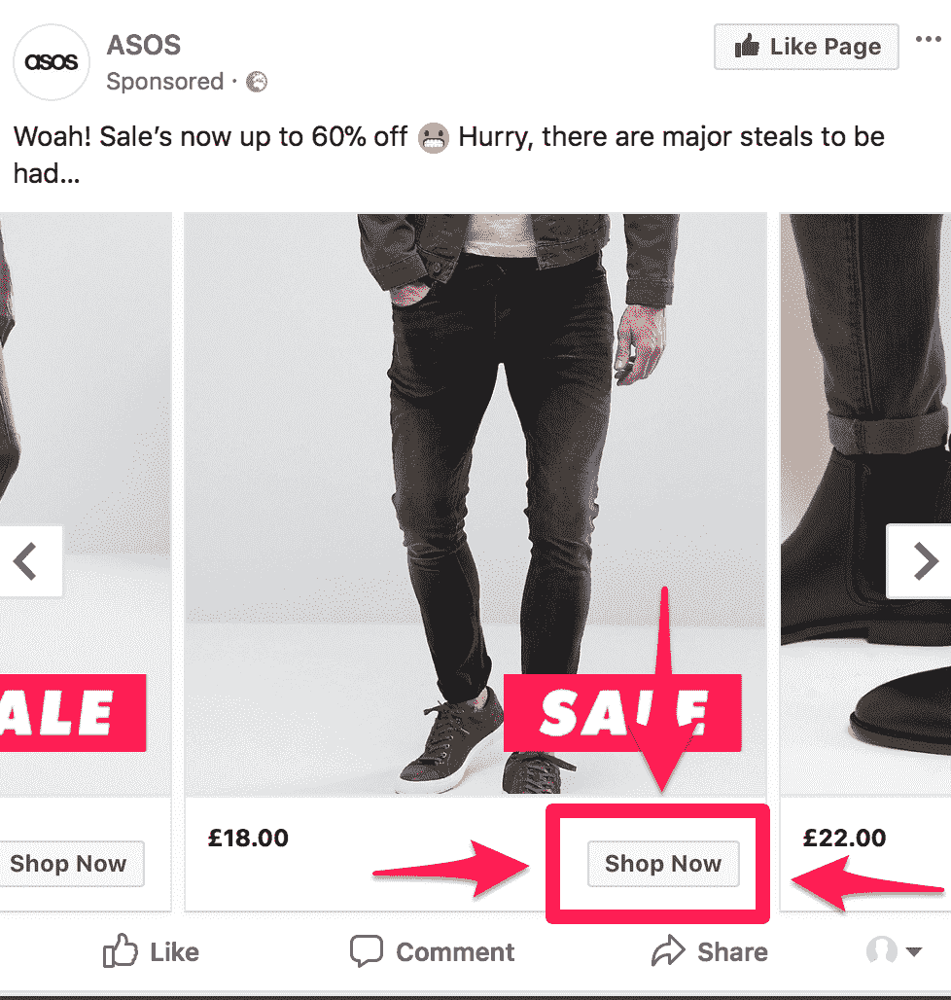

如果你不熟悉脸书的 [**，**](http://www.einsteinmarketer.com/facebook-ads-the-3-big-questions/) (我们都经历过，别担心)，CTA 代表行动号召。

在这种情况下，我们的 CTA 按钮是广告右下角可点击的蓝色按钮。

脸书的业务经理提供了一系列不同的选项，包括:

**-报名**

**-联系我们**

**-了解更多信息**

**-下载**

找到与您的活动目标相匹配的两个最上面的按钮，并测试它们。

# #8 社交证明

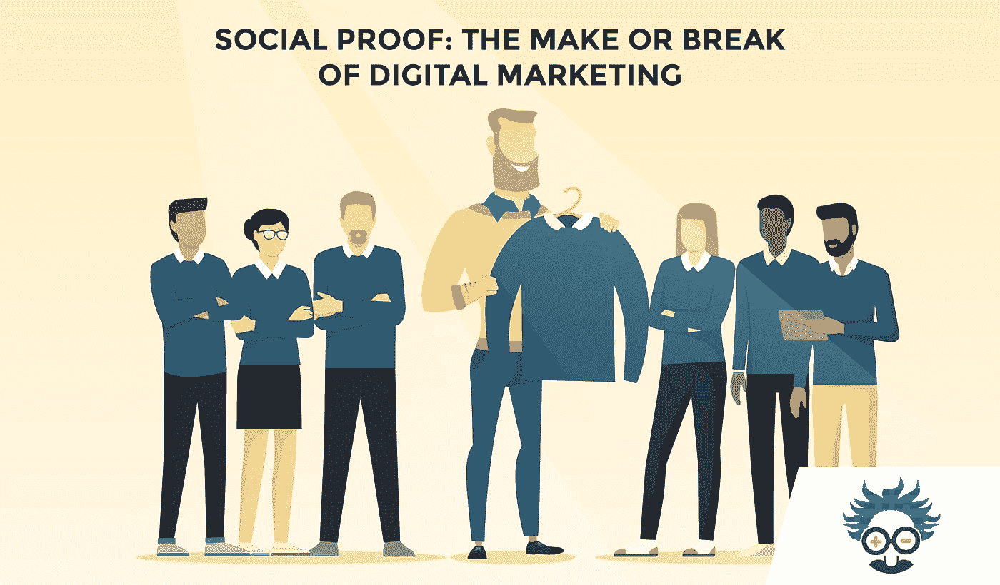

应该利用一切机会使用社会证据。

但是，你应该使用什么类型的社会证明呢？又该如何呈现呢？

对**数字和**百分比进行对比测试。例如，200 人中有 180 人…或 90%的人…

但是不要把你的社交验证测试仅仅局限于此。尝试不同的类型！

社交媒体号码 ***vs*** (快乐的)顾客

评论 ***vs*** (产品效果的量化结果)

*通过我们的* [*指南*](http://www.einsteinmarketer.com/social-proof-marketing/) *了解更多关于社会证明的信息(我们也会在本文底部链接它！)*

# #9 角度

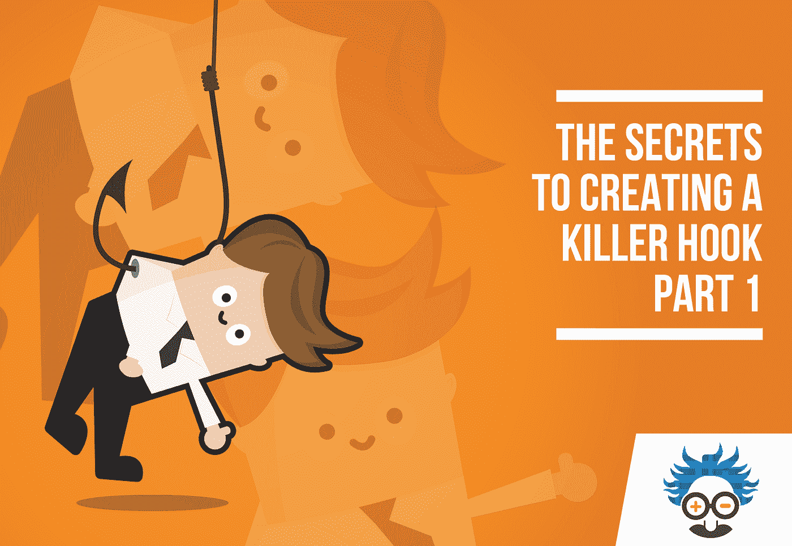

你选择的产品强度是多少？你是如何展示的？

这是你的**角度**，可能是你广告的真正成败。

这个角度应该在你的广告、标题、广告文案等的每一个部分被推动。

为了找到你最有效的角度，使用你的客户形象来发现你的目标市场最大的痛点，并解决这个问题…

… [爱因斯坦](http://www.einsteinmarketer.com/about/)有一些**令人敬畏的**向导，他们用不同的心理暗示保证**吸引**观众。

在这里查看它们[或者等到本文结束。](http://www.einsteinmarketer.com/the-hook/)

# #10 副本长度

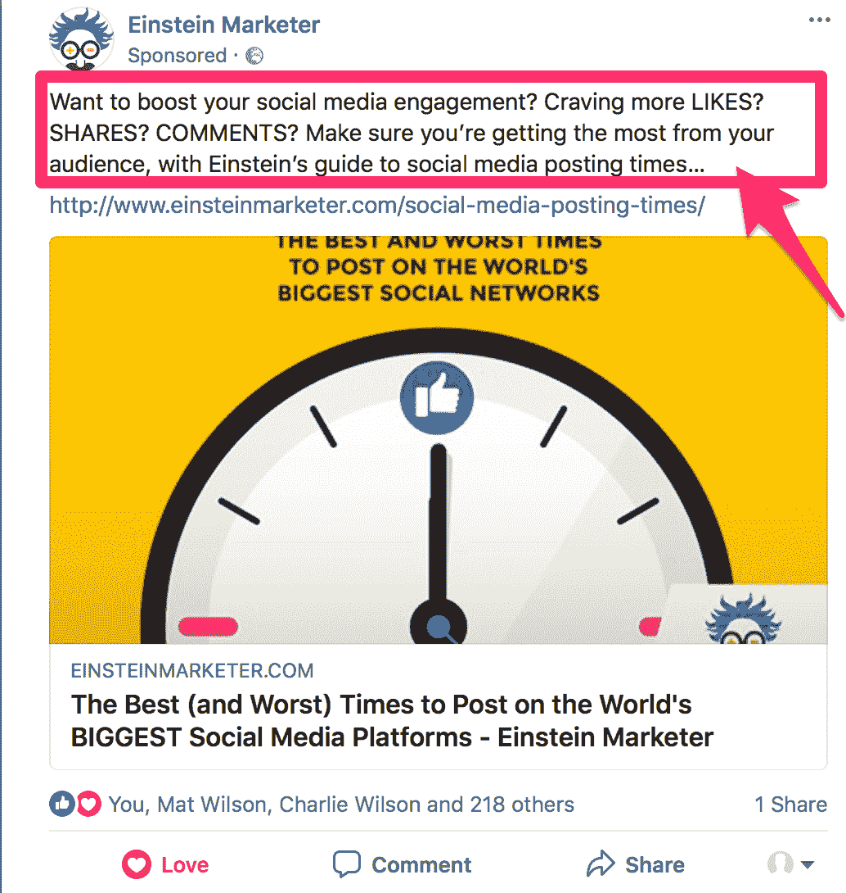

长 v 短？描述性 v 逗？简单的 v 技术？

副本长度**海量**。它可以把持观望态度的观众翻转到你的膝盖上。

爱因斯坦建议在一个句子副本和一个(相当长的)段落副本之间进行分割测试…

…我们发现拷贝长度在很大程度上取决于产品和行业。如果你还没有找到最佳点，测试一下！

# #11 复制样式

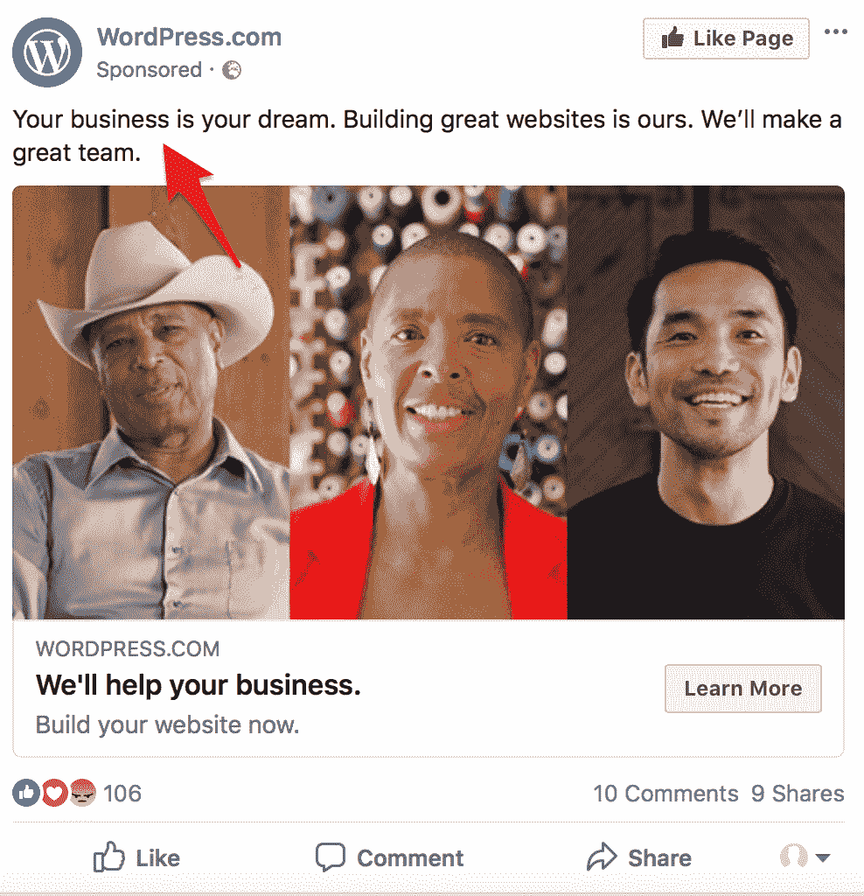

信息丰富？友好？健谈？正式？

你的文案风格应该代表你的品牌，符合你的目标市场，并吸引你的观众点击。

就像我们所有的脸书广告分割测试一样，从**非常不同的**文案风格开始，缩小范围，直到你找到你的完美标记。

# #12 一天中的时间

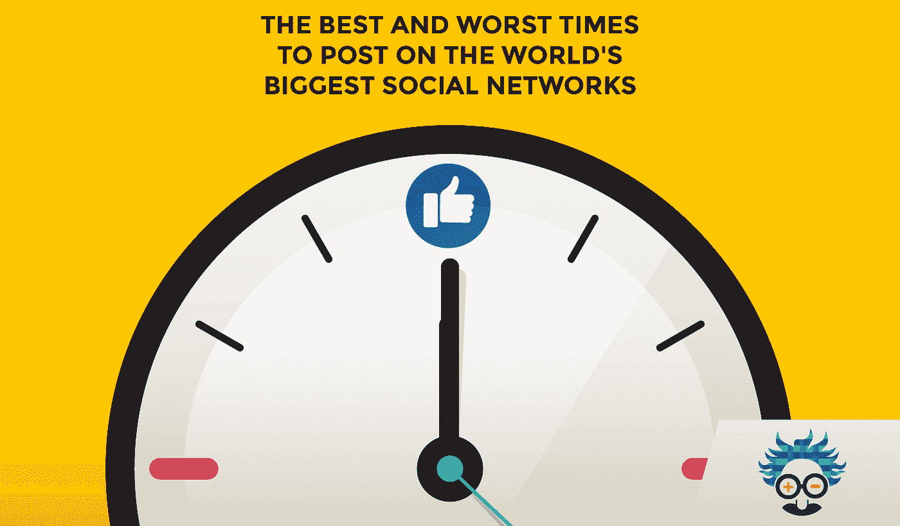

你什么时候做广告？您的预算持续运行吗？

如果你的预算很紧，把你所有的预算放在一天中的特定时间可能是值得的。

但是什么时间呢？

那要看你的行业，产品和目标受众的工作时间和休闲时间…

……所以，**拆分测试！**

查看爱因斯坦的 [*社交媒体发布指南*](http://www.einsteinmarketer.com/social-media-posting-times/) *获取更多帮助。*

# #一周 13 天

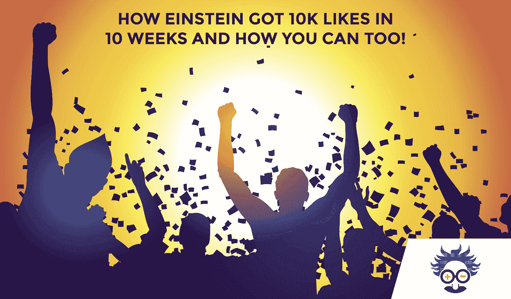

如果你的预算分散在 7 天里，为什么不选择一周中的某几天呢？

你的目标受众的使用在一周内会有所不同，这取决于许多不同的因素…

…尝试将周末与工作日或周一与周五进行对比…

…一天可以有很大的不同。

*查看爱因斯坦的* [*社交媒体发布次数指南*](http://www.einsteinmarketer.com/social-media-posting-times/) *获取更多帮助。*

# #14 视频

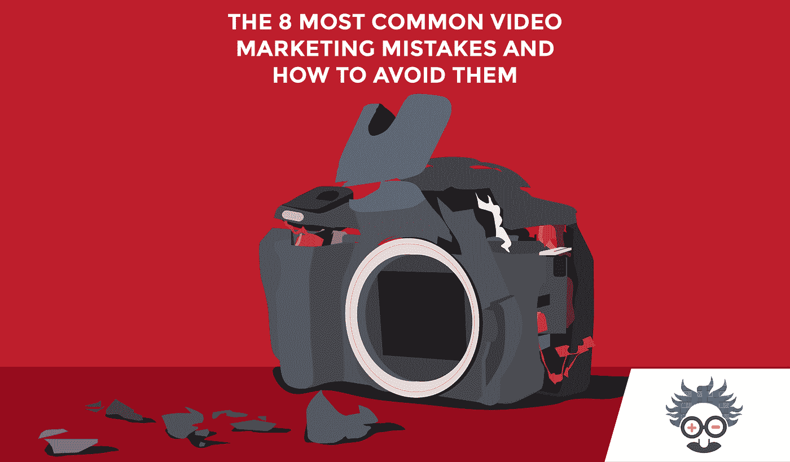

视频营销太大了，不容忽视…

…而且还在增长。

[**脸书**](http://facebook.com/einsteinmarketer) 喜欢视频，因为它在的域名上娱乐他们的用户**。这使得获取视图变得非常便宜。**

听起来很棒，对吧？

差不多了。

获得正确的视频并不容易，尤其是当你在销售产品的时候。

如果你是视频新手，爱因斯坦建议将你的视频和图片广告分开测试。

看看上面会出现什么，然后再来一次。

# #15 表情符号 vs 无表情符号

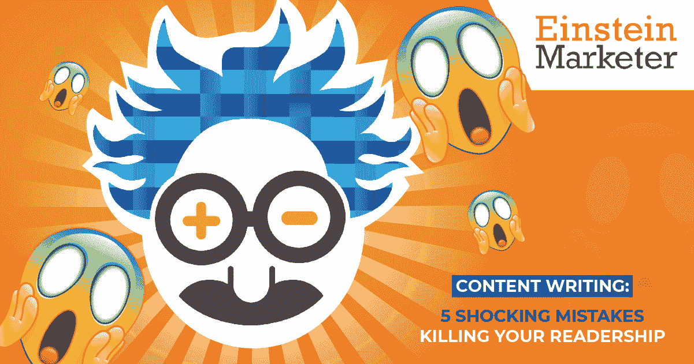

做鬼脸，还是不做鬼脸，这是个问题…

现代的哈姆雷特肯定会问。

你应该照着做。

表情符号变得如此受欢迎，它们已经成为我们语言中至关重要的一部分。

它们是通用的。

表情符号绝对能吸引眼球，并能引发观众的某些情绪反应…

…但它们也可能看起来很廉价，很不正式。

在你的**广告文案**中测试几个，看看效果如何。

# #16 广告类型

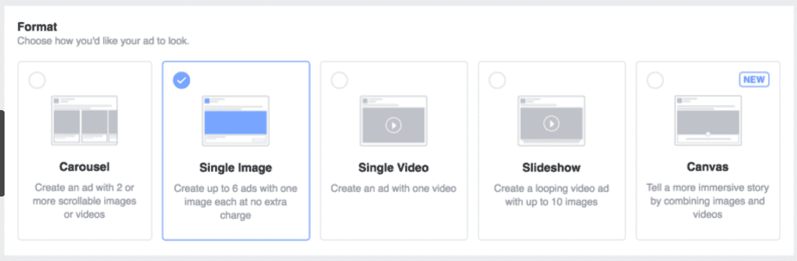

脸书有超过 10 种不同的广告类型。

有很多选择。

如果你运行的是一种类型，仅仅因为它有效，而且你从未尝试过其他类型，**拆分测试广告类型！**

你可能会发现额外的 5%的转化率，这是你从未想过的。

这一点尤其适用于那些运行大量广告并且变得懒惰的人，他们一次又一次地使用相同的广告。

# 脸书广告拆分测试思路

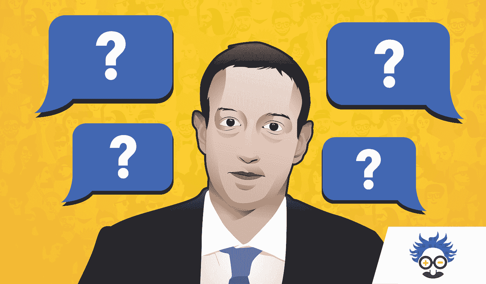

无论你是刚刚开始你的 [**脸书广告**](http://www.einsteinmarketer.com/facebook-ads-the-3-big-questions/) 之旅…

…或者你已经做了很久了…

…进行测试是至关重要的。

我们不建议同时运行所有 16 个分割测试(除非你有太多的时间),但是运行一到三个测试可以给你无价的结果。

当你得到这些答案后，测试你广告的下一部分，直到…

…太完美了。

每个行业、产品和品牌都有自己的**广告最佳点。**

没有适用于所有人的确切指导方针。

**去找你的吧。**

你喜欢这个博客吗？你认为我们脸书广告分割测试的想法怎么样？留下你的评论或者[给我们发信息](http://m.me/einsteinmarketer)，一旦我们的社交媒体经理停止对‘三明治女士’的幻想，我们会尽快回复

# 相关职位

[**吸引更多读者**](http://www.einsteinmarketer.com/the-hook/)

[**社交媒体发布次数**](http://www.einsteinmarketer.com/social-media-posting-times/)

[**脸书观众**](http://www.einsteinmarketer.com/facebook-audiences-in-a-nutshell/)

[**脸书广告:你需要回答的 3 个问题**](http://www.einsteinmarketer.com/facebook-ads-the-3-big-questions/)

[**社会证明**](http://www.einsteinmarketer.com/social-proof-marketing/)

*原载于 2018 年 4 月 24 日*[*www.einsteinmarketer.com*](https://www.einsteinmarketer.com/facebook-ads-split-test-success/)*。*

## 这篇文章发表在 [The Startup](https://medium.com/swlh) 上，这是 Medium 最大的创业刊物，拥有 344，974+人关注。

## 在这里订阅接收[我们的头条新闻](http://growthsupply.com/the-startup-newsletter/)。

