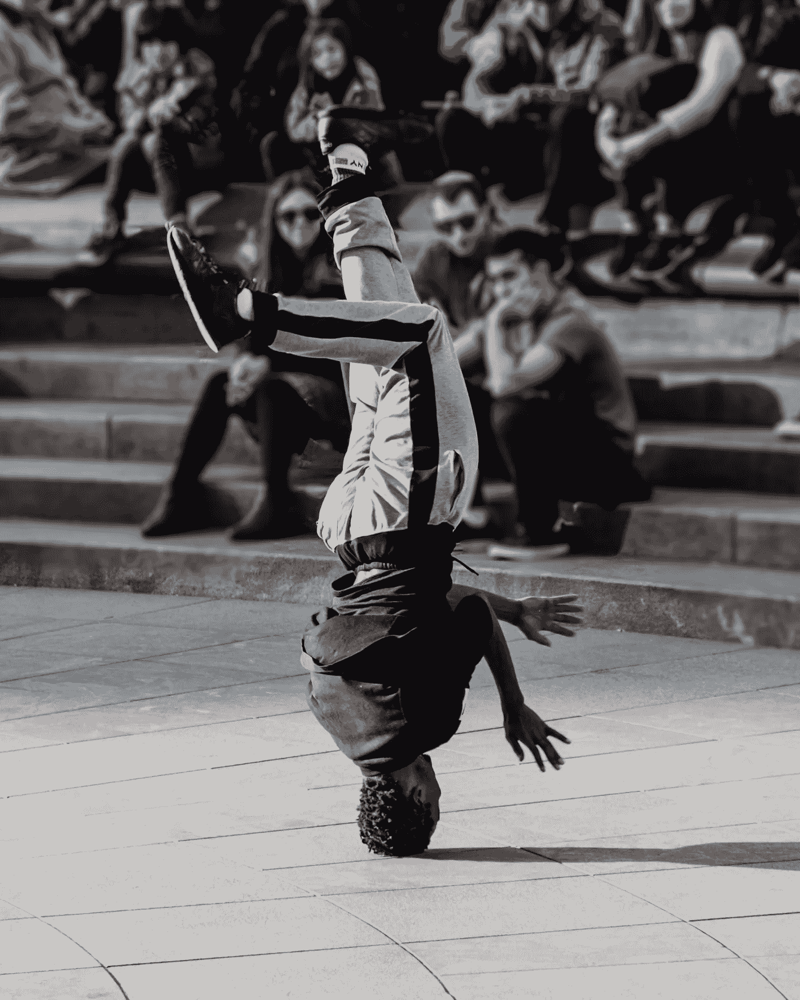
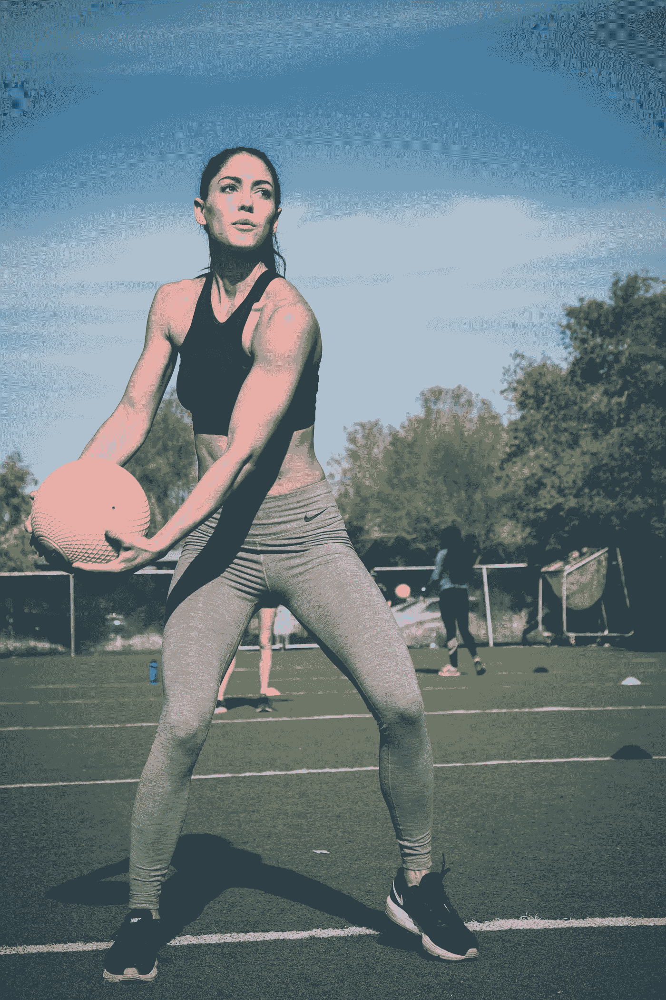

# 6 个月内提升自己的 16 种方法，体验生活中 100 倍的成果

> 原文：<https://medium.com/swlh/16-ways-to-improve-yourself-in-6-months-and-experience-100x-results-in-your-life-55f5be1db49b>

Photo by [Zac Ong](https://unsplash.com/photos/SScwR0i0fdw?utm_source=unsplash&utm_medium=referral&utm_content=creditCopyText) on [Unsplash](https://unsplash.com/search/photos/dancer?utm_source=unsplash&utm_medium=referral&utm_content=creditCopyText)

我会开门见山地说。我们都想变得更好(或者至少我希望我们*都*这样做)。

有时，当我们需要开始时，为了建立动力和提高自己的进步，这可能是极其令人难以承受的。

以下是我在生活中应用的 16 个特点、做法和习惯，在实现自己的目标和克服随之而来的障碍方面，我看到了巨大的进步。

# ***记录你的便便。***

如果你用了几把卫生纸，也许是时候改变你的饮食了。

> 我们都在寻找那些昙花一现的荣耀。

当你的饮食变好了，你也变好了。

# ***每周至少锻炼两次。***

Photo by [Zac Ong](https://unsplash.com/photos/SScwR0i0fdw?utm_source=unsplash&utm_medium=referral&utm_content=creditCopyText) on [Unsplash](https://unsplash.com/search/photos/dancer?utm_source=unsplash&utm_medium=referral&utm_content=creditCopyText)

当你这样做的时候，出一身汗。从小处着手。一周两次很容易。

如果你按照这种常规进行，期望在 5 天的研磨后减掉相当多的体重，你会变得气馁，失去连贯性。

# ***向无数人介绍自己。***

让别人听到你的声音。如果你想在接下来的六个月里成为一个更好的人，你需要让自己面对很多人。

# ***求助。***

你不可能解决生活中的所有问题。事实上，远非如此。如果你想在生活中更快地进步和提高，你需要寻求帮助，并把帮助作为催化剂。

# ***与自己竞争并击败自己。***

就你的财务、健康、关系目标等而言，你现在处于什么位置？

> 6 个月后你想去哪里？
> 
> 三个月后你想去哪里？
> 
> 一个月后？
> 
> 一周之内？
> 
> 明天吗？

打破你每天的战斗，每天战胜自己。

如果你只是简单地预测一年，你可能会不知所措，无法实现目标。然而，今天你有机会战胜这场战斗。

# ***周末停止酗酒。***

如果你想让自己变得更好，你需要把你的休息日当作工作日来利用。

当你周五和同事去当地的酒吧时，你让自己在周六失败了。

这也将有助于第一点(见上文)。当你减少饮酒时，你会减轻体重，获得更好的睡眠，并减少一些焦虑。

***阅读经典文献。***

> 悉达多
> 
> 陌生人
> 
> 百年孤独
> 
> 如何赢得朋友和影响他人
> 
> 沉思
> 
> 给斯多葛派的信
> 
> 一个人对意义的探索
> 
> 本杰明·富兰克林自传
> 
> 炼金术士
> 
> 艺术的战争。

# ***找到你的那套盔甲。***

Photo by [Clem Onojeghuo](https://unsplash.com/photos/7a6ptA97LXA?utm_source=unsplash&utm_medium=referral&utm_content=creditCopyText) on [Unsplash](https://unsplash.com/search/photos/suit?utm_source=unsplash&utm_medium=referral&utm_content=creditCopyText)

有时候，我们需要在内心感受到自信之前，向世界展示我们的自信。

这是什么意思？嗯，你剪什么发型？你穿的是什么衣服？你的卫生状况怎么样？

这不是邀请你虚荣，而是邀请你自我感觉良好。

# ***还清债务。***

或者抗拒它。

我在这里要务实一点——如果你负债累累(比如因为上大学),在 6 个月内还清债务是不可行的。

然而，也许你可以管理债务。如果你有信用卡债务，努力还清。处于起点比负起点好。

# ***记日记。***

以书面形式明确你现在在哪里，你曾经在哪里，你将要去哪。

说“我想在 6 个月内减掉 15 磅”或者“我想在接下来的 6 个月内赚 5000 美元”是很好的，但是如果你没有衡量自己的进步，你会去哪里呢？

很多时候，当我们认为自己在前进的时候，我们真的是在原地踏步。写日志可以让你看到你从哪里来，还会去哪里。

# ***问问你的亲密关系网，你怎样才能变得更好。***

简化你的成长。虽然这很难(我们的自我厌恶这一点)，但问问你的老板，你如何能在[空白]方面做得更好。

问爱人如何才能更好的【空白】。问问你的朋友，问问你的父母，问问你信任的人，他们会给你一个直截了当的答案，而你可能看不到。

# ***追随你的缪斯。***

Photo by [Beata Ratuszniak](https://unsplash.com/photos/-6mZyblCys4?utm_source=unsplash&utm_medium=referral&utm_content=creditCopyText) on [Unsplash](https://unsplash.com/search/photos/artist?utm_source=unsplash&utm_medium=referral&utm_content=creditCopyText)

我们内心都有一个声音让我们滴答作响。有时候声音在梦想成为一名演员。

也许你喜欢写作。

也许你喜欢编写代码。

也许你喜欢帮助别人。

有时我们生活在影子职业中，这通常与我们的声音不一致。培养兴趣爱好或辅助项目，这有助于调整你头脑中的声音。

# ***进行令人不舒服的谈话。***

谈论大赛或你朋友的新衬衫或天气很容易。

**也是蠢。**

你对自己或周围的人一无所知。如果你想在接下来的六个月里成长，就和人们谈谈他们的恐惧和梦想。

询问人们对什么有热情。

# ***明确并坚持一个目标。***

大概是最有深度也是最难坚持的。

这需要明确你想做什么，并制定一个实现目标的时间表。

> 这不是“我想改善我的健康状况”,这是“我想在 6 个月内减掉 15 磅，我会通过每周去两次健身房来达到这个目标。”。在健身房，我会跑 15 分钟，然后做 30 分钟的 HIIT。尽管我非常喜欢辣玉米片多力多滋，但我还是打算把多力多滋从我的饮食中彻底剔除

不是“我想赚更多的钱”,而是“我想每个月努力付房租”。

为了做到这一点，我会去旧货商店买可转售的衣服，我会在易贝和 Etsy 身上“翻翻”。我将确保以至少 40%的加价转售我的翻转服装”

# ***失败时不要自责。***

6 个月是一段很长的时间，也是一段非常短的时间。

当你每天都犯错误时，看起来你永远也不会实现你的 6 个月目标。

一旦你开始在常规训练中磨砺和克服障碍，6 个月就会过去。当你跌倒时，从错误中吸取教训，然后马上回到马背上。不要失去你的动力。

# ***消除生活中的寄生虫。***

你生命中有人会帮助你成长。他们会在这个旅程中推动你，并以他们力所能及的方式提供支持。还有寄生虫。

那些因为反思自己的缺点而拖你后腿的人。这可能是朋友、家人、同事等。

只要有可能，让这些人远离你的生活。有时候，这些人并没有意识到他们在做什么。你有责任看到它并做出必要的改变。

# 还有谁想自己当老板？

## 我提供给你一个经过测试和验证的 6 部分指南，它包含了强大的概念，可以帮助你识别、规划、成长和完成你的创造性追求。

# [> > >在这里获得免费指南< < <](https://mailchi.mp/4b982beed325/free-6-step-course)

## 学到了什么？按住👏说“谢谢！”并帮助他人找到这篇文章。

## 还评论！你喜欢什么？你讨厌什么？你在做什么？

## 这篇文章发表在 [The Startup](https://medium.com/swlh) 上，这是 Medium 最大的创业刊物，拥有 340，876+的读者。

## 在此订阅接收[我们的头条新闻](http://growthsupply.com/the-startup-newsletter/)。

