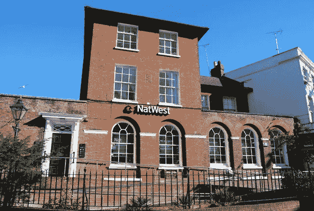

# 2018 年 7 月 17 日:神秘领域最大的故事

> 原文：<https://medium.com/swlh/17-07-2018-biggest-stories-in-the-cryptosphere-5718c73621a6>

通过 BlockEx

**1。IBM 和 Stronghold 推出 StableCoin**

科技公司 IBM 和金融服务提供商 Stronghold [推出了一种与美元挂钩的稳定硬币](https://www.reuters.com/article/us-crypto-currency-ibm/ibm-partners-stronghold-for-new-digital-stable-coin-idUSKBN1K717K)，名为 Stronghold USD。这枚硬币今天在恒星区块链平台上发布。买家可以将资金存入合作银行 Prime Trust，然后以 1:1 的比例获得相应的资金。这一想法是为了在开展业务时使用 Stronghold USD，包括金融机构和资产管理公司之间的交易。然而，零售消费者也可能在未来几个月获得这项服务。IBM 的任务是评估 Stronghold 开发的商业网络的潜在用途。这一消息是在我们的[报道](https://hackernoon.com/10-07-2018-biggest-stories-in-the-cryptosphere-2ccfe896040f)关于加密公司 Stasis 发行一种名为 EURS 的与欧元挂钩的加密货币之后发布的。

**2。英国将成为区块链和加密领域的领导者**

英国将走在区块链和加密技术的最前沿。由大创新中心、DAG Global 和 Deep Knowledge Analytics 进行的一项调查研究[证实，中国具备在 2022 年成为全球中心的条件和态度](https://www.theguardian.com/technology/2018/jul/16/uk-strong-position-leader-crypto-economy-global-hub-blockchain-technology-report-says?CMP=share_btn_tw)。英国已经是公认的全球金融中心，金融科技行业也在蓬勃发展。此外，鉴于目前的局势，区块链和加密也有可能在该国扩张。作者讨论了目前金融业和密码市场之间的差距，他们预计这一差距将在未来几年内缩小。最后，即使还在早期，区块链已经被英国议会承认了。

**3。波音公司与 SparkCognition 合作改善空中飞行跟踪**

波音公司和 SparkCognition 将采用区块链技术和人工智能(AI)来跟踪飞行中的无人驾驶飞行器，并分配交通走廊和路线。这将创造一个更安全和更可靠的运输。诸如包裹递送和工业检测等商业应用也将受益于标准化的编程接口。SparkCognition 的创始人兼首席执行官 Amir Husain 表示，该项目将创造一个估计价值 3 万亿美元的新市场。考虑到波音是全球最大的飞机制造商之一，不难看出这实际上是可能的。

**4。NatWest 加入马可波罗财团**

苏格兰皇家银行集团的 NatWest 已经[加入了马可波罗财团](https://www.coindesk.com/banks-take-sides-as-blockchain-trade-finance-race-heats-up/)。该集团由区块链初创公司 R3 和贸易融资专家 TradeIX 创建。该财团现在包括 10 个机构，并获得了 1600 万美元的融资。其他成员包括法国巴黎银行、德国商业银行、荷兰国际集团、渣打银行、Natixis、曼谷银行、SMBC、DNB 和 OP 金融集团。马可波罗目前正处于试点阶段，并将于第四季度投入生产。“NatWest 特别提到了 Marco Polo 对标准和与其他平台的互操作性的关注，作为其与该财团合作的原因。”

> 本新闻综合报道由 [BlockEx](http://bit.ly/BlockEx_) 为您带来。

> 要想在你的邮箱里收到我们的每日新闻综述，请在这里注册:[*http://bit.ly/BlockExNewsAndUpdates*](http://bit.ly/BlockExNewsAndUpdates)

## 这个故事发表在 [The Startup](https://medium.com/swlh) 上，这是 Medium 最大的企业家出版物，拥有 344，974+人。

## 在这里订阅接收[我们的头条新闻](http://growthsupply.com/the-startup-newsletter/)。

