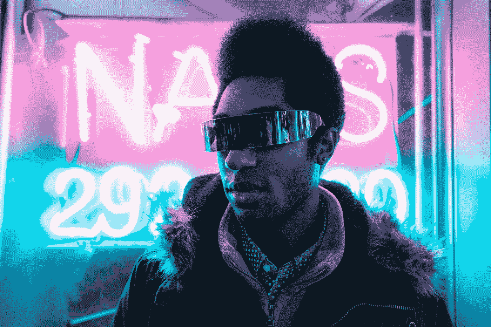
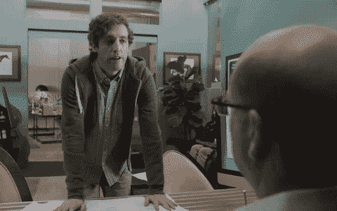
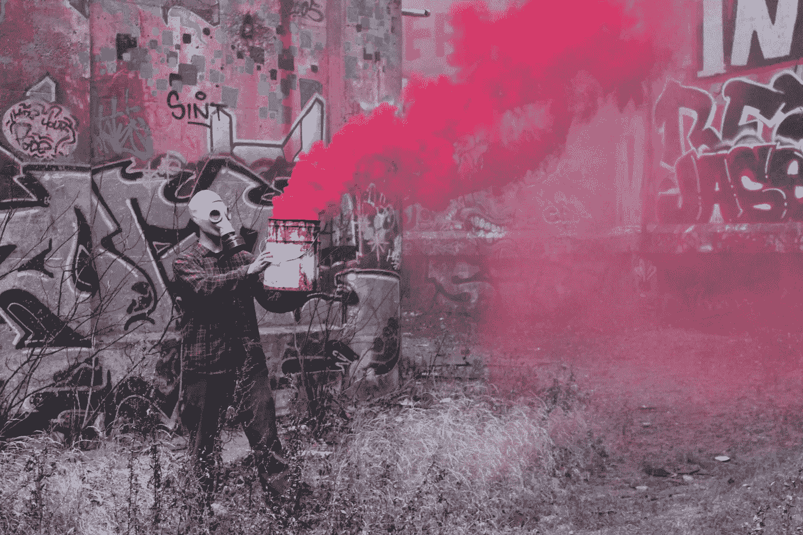

# 17 种定义精神强大的人的特质，这些特质将自己塑造成一股坚定不移的力量。

> 原文：<https://medium.com/swlh/17-defining-traits-of-mentally-strong-people-that-build-oneself-into-an-unwavering-unshakable-ba7a631bc312>

## (11 和 17 是我的最爱……)

Photo by [Alex Iby](https://unsplash.com/photos/9-ZsdNfxfr4?utm_source=unsplash&utm_medium=referral&utm_content=creditCopyText) on [Unsplash](https://unsplash.com/search/photos/astronaut?utm_source=unsplash&utm_medium=referral&utm_content=creditCopyText)

W 怎样才能成为一个*坚定不移&不可动摇的力量*？

人天生如此吗？也就是说，这可能是天赋还是遗传？

肯定不是。

> “永远不要低估梦想的力量和人类精神的影响。在这一点上，我们都是一样的:伟大的潜力存在于我们每个人的内心。”——威尔玛·鲁道夫

伟大的力量和潜力存在于我们每个人心中。

很有可能，如果你没有真正坚持或相信这种说法，你已经错过了一些教育。

**精神韧性**的定义如下:

> **精神韧性:**
> 
> 衡量个人弹性和自信的指标，可以预测在体育、教育和工作中的成功。

此外，弹性和信心的定义是:

> **信任**
> 
> 从困难中迅速恢复的能力；韧性。

和

> **信心**
> 
> 可以依靠某人或某物的感觉或信念；坚定的信任。

**综上所述，这意味着一个人有能力并相信自己能够克服和恢复前进道路上的任何障碍。**

为了建立这种韧性，一个人必须发展和练习各种仪式、品质和技能。

以下是 17 个最重要和最普遍的方法。

# ***1。他们变成了自己的“超人”。***

心理强大的人定义自己的道德。

他们不会被其他人的诱惑和诱人的奇思妙想所吸引。

他们在逆境中屹立不倒。

他们理解将所有人与现实联系起来的原因和内在真理。

他们不关心我们在现代社会中可能会遇到的琐碎小事。

# **②*。他们扑向手榴弹。***

弱者推卸责任。

他们找借口，把矛头指向除了自己以外的所有人。

他们关心自己的形象，并把它放在比可能发生的事实更重要的位置。

另一方面，如果发生的事情是他们疏忽的结果，坚强的人会理解并承担责任。他们知道他们可以从自己的错误中学习，并在必要的时候承担和接受指责，这可以在他们周围的团队中建立谦逊和领导力。

# ***3。他们戴上眼罩。***

Photo by [rawpixel](https://unsplash.com/photos/0pNTUTSmLh8?utm_source=unsplash&utm_medium=referral&utm_content=creditCopyText) on [Unsplash](https://unsplash.com/search/photos/goggle?utm_source=unsplash&utm_medium=referral&utm_content=creditCopyText)

世界上最坚强的人知道他们的目标，他们在开辟道路上勇往直前。

在许多人的生活中，总会有这样一个时刻，他们意识到如果他们真的想变得强大，成为某个特定行业或领域的专家，他们就需要阻挡那些会让他们远离刻意练习、朝着目标努力的外部诱惑。

这些坚强的人戴上了眼罩，这样他们就可以继续向前看，朝着他们的“应许之地”努力。

# **4*。他们淹没了批评的噪音。***

面对逆境坚强是很难的。

当形势对你不利时，精神强大的人知道要“坚持自己的立场”,即使他们会被同伴认为是疯狂、错误或无能。

心理强大的人通常是反其道而行之的。

他们会一次又一次地被告知他们“不能”。为了实现他们灵魂深处的目标，他们需要淹没所有的噪音和批评，继续前进。

# ***5。他们脸朝下摔倒。***

一个人如何在某方面变得更好？

这是个简单的问题。

[https://bit.ly/2KXRVMH](https://bit.ly/2KXRVMH)

最直接的方法是尝试正面克服障碍。如果你失败了，从失败中吸取教训，再试一次。

精神强大的人一次又一次地跌倒，又重新骑上马。想想那些可以把番茄酱卖给一个戴着白手套的女人的人(你认识这个人，他们似乎有能说会道的天赋)。

问问他们怎么变得这么好。我敢打赌，他们会告诉你，他们苦读了成百上千个“不”，并学会了如何克服它们。他们经受了考验，现在他们可以卖任何东西。

# ***6。他们会原谅。***

怨恨让人疲惫不堪。

愤怒和憎恨需要很多能量。

想想吧。

上一次别人冤枉你是什么时候？

可能是老板或者以前的恋人或者家人。你对他们的行为耿耿于怀了多久？也许当你开车时，你对进入你车道的其他司机大喊大叫，并把你的怨恨投射到他们身上。

愤怒需要你的意识投入大量的注意力。精神强大的人会原谅并继续前进。他们把生活中的许多烦恼和挑战放在“后视镜”里他们没有时间溃烂。

# ***7。他们有艰难的对话。***

生活在闲聊和地狱边缘真糟糕。

这是徒劳的，没有任何实质性的东西。

精神强大的人不惜一切代价远离闲聊。当有什么事情困扰他们时，他们会直面这个问题。

他们一头扎进火中，尽管知道这可能会很痛苦，但他们从中吸取了教训。

# ***8。他们抵制诱惑。***

正念是一件美好的事情。它帮助你识别你的大脑何时处于“自动驾驶”状态你的大脑喜欢走捷径。

无论是食物、睡眠或任何形式的快乐。

你的大脑喜欢放松。坚强的人反思他们自己和他们大脑的缺陷。

他们抵制巧克力饼干，即使他们真的很想吃。他们起床，即使他们真的真的很想按下贪睡键。他们起床工作——即使他们不想做。

# ***9。他们问了无数的问题。***

心理强大的人永远是学生。

一个人一生中可能犯的最大的愚蠢行为之一就是让他们的*自我*控制他们，并用他们什么都知道的谬论压倒他们。

这会毁了任何人。

精神强大的人知道他们需要不断学习，为此，他们会问问题。

# ***10。他们笔直而自豪地站着。***

科学表明，当你的背部直立且姿势最佳时，你会比姿势不佳的人释放更多的血清素(负责自信和“感觉良好”的神经递质)。

精神强大的人是一个骄傲自信的人。

他们不怕走进一个房间，成为一个强大的存在。

# ***11。他们首先戴上氧气面罩。***

Photo by [Hailey Oldfield](https://unsplash.com/photos/X3gy8EA4RcA?utm_source=unsplash&utm_medium=referral&utm_content=creditCopyText) on [Unsplash](https://unsplash.com/search/photos/oxygen-mask?utm_source=unsplash&utm_medium=referral&utm_content=creditCopyText)

为了成为一名领导者并变得强大，一个人必须首先在自己身上下功夫。这不是邀请你变得自私和冷酷。

事实上恰恰相反。

当一个人致力于自己并把自己的力量提升三倍时，他们的以太和影响力就会渗透到别人的生活中。

他们在他们的网络中引起连锁反应。精神强大的人在试图改变和改善周围的人之前，会努力改善和完善自己。

# **12*。他们很自信(即使需要骗自己)。***

信心是一头难以捉摸的野兽。

当你拥有它的时候，你就高高在上，没有什么可以阻挡你。

当你没有它的时候，你似乎永远也不能再抓住它了。精神强大的人保持他们的信心，即使他们需要假装和欺骗自己来找回它。

自信的人知道他们“足够了”,即使他们需要对自己撒谎，在脑子里一遍又一遍地说，只是为了让自己记住。

# **13*。他们注意自己的饮食。***

生命吞噬生命。

这是事实。

不管你是肉食者还是素食者，这都是事实。

为了维持生命，你需要消耗生命。精神强大的人注意到这一点，并消耗富含营养和能量的生命来维持和促进物质。

如果精神强大的人一直吃麦当劳和加工食品，他们就无法维持高水平的认知和精力。

# ***14。他们练习。***

精神强大的人知道，也许他们在某种程度上比某些人更有优势。

他们也明白，更重要的是，如果他们想成为自己行业的专家和典范，他们需要练习他们正在做的任何事情。

他们一有空闲时间就练习——即使他们不想做。

# ***15。他们寻求帮助。***

Photo by [Jakob Owens](https://unsplash.com/photos/ae0MPMx5-aU?utm_source=unsplash&utm_medium=referral&utm_content=creditCopyText) on [Unsplash](https://unsplash.com/search/photos/life-saver?utm_source=unsplash&utm_medium=referral&utm_content=creditCopyText)

寻求帮助需要很大的力量。许多人生活在一种谬论中，认为他们可以自己从任何洞里钻出来，或者完成任何壮举。人们会认为，这是一个真正强大的人的标志。

事实上，情况正好相反。

精神强大的人知道人类不是在真空中创造的，我们需要彼此来达到我们努力追求的高度。

如果没有合作和寻求帮助，我们就不会有我们作为一个物种所看到的技术、建筑、智力和艺术进步。

# ***16。他们很谦逊。***

精神强大的人知道世界不是围着他们转的。

他们知道自己是网络中的一个节点，他们的行为会产生超出他们想象的连锁反应。

他们不需要站在肥皂箱上宣扬他们的成就。他们的工作和工作成果不言自明。

# ***17。他们接受生活的打击，并在必要时反击。***

[https://bit.ly/2NdwjIY](https://bit.ly/2NdwjIY)

生活是一场斗争。

这是一场舞蹈，也是一场战斗。

在生活中，不是每件事都会如你所愿。有时远非如此。生活中会出现欺骗、谎言、死亡、诡计和坏运气。

> 你会被打脸的。

精神强大的人知道战斗是漫长的。

一场拳击比赛有 12 个回合。

如果你在第三回合筋疲力尽并放弃，你打败了你自己。谁知道*人生有多少轮。*

精神强大的人知道，你需要继续战斗，继续出拳，当他们看到一个漏洞时，以其人之道还治其人之身。

# 还有谁想自己当老板？

## 我提供给你一个经过测试和验证的 6 部分指南，它包含了强大的概念，可以帮助你识别、规划、成长和完成你的创造性追求。

# [> > >在这里获得免费指南< < <](https://mailchi.mp/4b982beed325/free-6-step-course)

## 学到了什么？按住👏说“谢谢！”并帮助他人找到这篇文章。还评论！

## 这个故事发表在 [The Startup](https://medium.com/swlh) 上，这是 Medium 最大的企业家出版物，拥有 344，974+人。

## 在这里订阅接收[我们的头条新闻](http://growthsupply.com/the-startup-newsletter/)。

