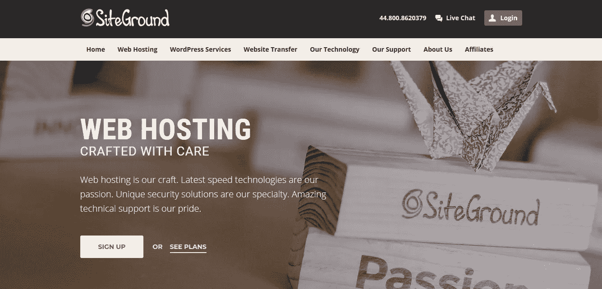
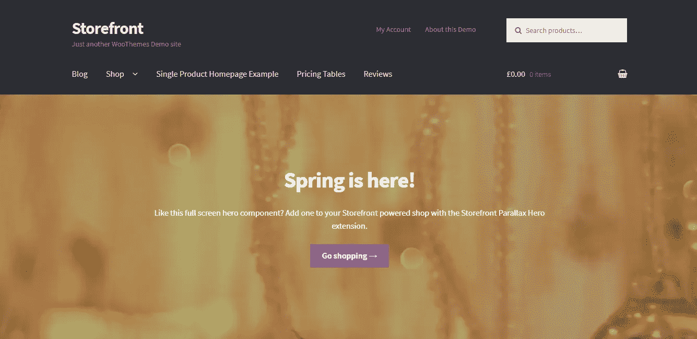
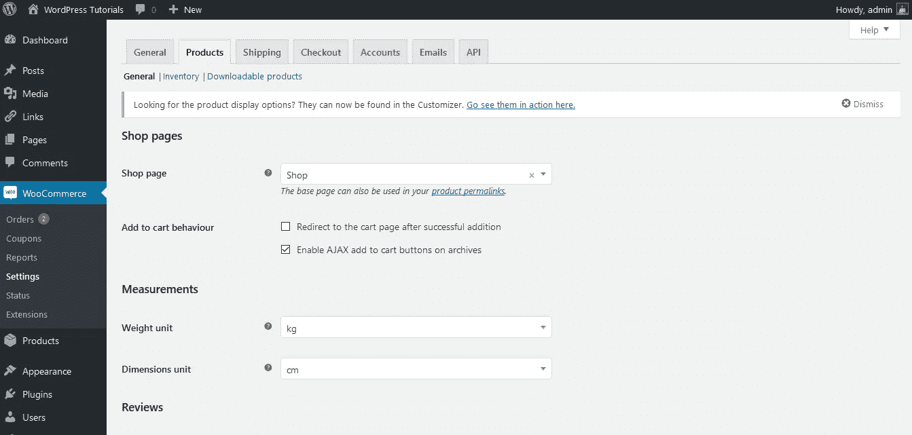

# 17.如何在 10 分钟内建立网上商店——30 天的时间

> 原文：<https://medium.com/swlh/17-how-to-setup-an-online-store-in-10-minutes-30-days-of-medium-a4f955e9b493>

30 Days Of Medium

欢迎回到 **30 天中等。**

感谢迄今为止**一直在阅读、鼓掌和评论**的每一个人！今天的主题是- **如何在 10 分钟内建立一个网上商店。**

如果你错过了下面的我的 30 天中等挑战的前 16 天，你可以补上:

## [0。30 天的培养基](/swlh/30-days-of-medium-c7ab34953c6c)

## [1。建立自己的网站需要什么？— 30 天中值](/swlh/1-what-do-you-need-to-build-your-own-website-30-days-of-medium-1ed1ad4e505c)

## [2。如何找到你热爱的事业——30 天的媒介](/swlh/2-how-to-find-a-business-you-love-30-days-of-medium-cb7a4a702d1b)

## [3。如何建立自己的网站—媒体 30 天](/swlh/3-how-to-build-your-own-website-30-days-of-medium-587f994672ec)

## [4。如何衡量你网站的表现——30 天媒体](/swlh/4-how-to-measure-your-websites-performance-30-days-of-medium-75e650969695)

## [5。如何通过回答他们的问题获得更多的客户-30 天的媒介](/swlh/5-how-to-get-more-customers-by-answering-their-questions-30-days-of-medium-b462d237533e)

## 6。成功的商业网站备忘单——30 天的媒介

## 7。如何衡量成功——30 天介质

## 8。了解在线销售漏斗——30 天媒介

## 9。什么是流量，为什么流量很重要？— 30 天的培养基

## 10。什么是 Google URL Builder，为什么要使用它？— 30 天的培养基

## [11。通过自动化您的社交媒体日程，让您的流量翻倍——30 天中等](/swlh/11-double-your-traffic-by-automating-your-social-media-schedule-30-days-of-medium-ac9aa74f7927)

## [12。如何辨别什么好卖— 30 天介质](/swlh/12-how-to-tell-what-sells-30-days-of-medium-ba3291d029d2)

## [13。我如何在 6，500% — 30 天的培养基中培养我的培养基](/swlh/13-how-i-grew-my-medium-following-6500-30-days-of-medium-c9d2d6f80b51)

## [14。你如何看待事情很重要——30 天中期](/swlh/14-how-you-look-at-things-matters-30-days-of-medium-f641b9733b90)

## [15。如何向小型企业销售服务— 30 天中等](/swlh/15-how-to-sell-services-to-small-businesses-30-days-of-medium-d6604c63b3b7)

## [16。如何通过有效的提案赢得更多交易— 30 天的媒介](/swlh/16-how-to-win-more-deals-with-effective-proposals-30-days-of-medium-481f16bbc86f)

## 17。如何在 10 分钟内建立一个网上商店——30 天的媒介

## [18。如何在任何地方工作— 30 天介质](/swlh/18-how-to-work-from-anywhere-30-days-of-medium-1c9cfa2d662f)

## [19。为什么你的网站会破坏你的销售——30 天媒体](/swlh/19-is-your-website-sabotaging-your-sales-30-days-of-medium-f63bdbdb350)

## [二十。你的流量从哪里来？— 30 天中值](/swlh/20-where-does-your-traffic-come-from-30-days-of-medium-a9b2d2c088bb)

## [21。如何真正识别倦怠——30 天中等水平](/swlh/21-how-to-actually-recognise-burnout-30-days-of-medium-7972a7a7a89e)

## [22。如何修改你的时间表并完成两倍的工作——30 天中等时间](/swlh/how-to-hack-your-schedule-and-get-twice-as-much-done-30-days-of-medium-441a509dc9be)

## [23。不要模仿你的竞争对手——30 天的媒介](/swlh/23-dont-copy-your-competitors-30-days-of-medium-56382b7ba8ed)

## 24。如何 SEO 优化一篇博文——30 天的媒介

## 25。独特或被遗忘——30 天的媒介

## 26。跟着感觉走——30 天中等水平

## 27。人们不支付平均 30 天的中等费用

## 28。如何做关键词研究— 30 天介质

## [29。为什么帕累托原则是世界上最大的诀窍——30 天中期](/swlh/29-why-the-pareto-principle-is-the-worlds-biggest-hack-30-days-of-medium-1c225f5c8aa1)

## 三十岁。你的内容比你的电话更有利可图——30 天的媒介

# 就这么干吧

在 T2，开网店从未如此简单。

有了像 **Shopify、**这样的工具，上网和**开始销售变得超级容易。**

我是**的忠实信徒(感谢耐克)。**

**开始是成功的一半。**

如果你起身去开始，你已经走了一半。

这就是为什么我认为，如果你已经花了几天时间考虑网上商店的想法，并且仍然想继续下去，那就去做吧！

你永远不会第一次就做得完美。目标是开始，然后每天努力提高。

# 网络商务>购物

我以前写过关于 Woocommerce 比 Shopify 更适合网上销售的文章。对于那些不知道的人，Woocommere 是一个通过插件插入 WordPress 的电子商务平台。

你可以在我的文章 [**为什么 WordPress 是在**](http://Why WordPress Is The BEST Platform To Build Your Business or Startup Website On) 上建立你的商业或创业网站的最佳平台中阅读我对为什么会这样的详细**分析**

但是，重点是:

*   WordPress 更加**可扩展**
*   WordPress 更加灵活，为 T30 提供了更好的功能
*   WordPress 有一个简单的可定制的单页结账，Shopify 有一个 5 页的噩梦。

# 先决条件

开始使用 WordPress + Woocommerce 很容易。

首先，您需要以下内容:

*   一个领域
*   主办；主持
*   WordPress 已安装— [如何使用 WordPress](https://www.squareinternet.co/how-to-use-wordpress/)
*   Woocommerce 已安装— [如何安装 Woocommerce](https://www.squareinternet.co/how-to-install-woocommerce/)

对于域名和托管，[**转到**](https://www.siteground.com/index.htm?afcode=6f49dbd215404378e8aa207db253a943) 。

Siteground hosting

# 安装**店面**

[店面是 **Woocommerce 自己的免费电子商务主题。**](https://woocommerce.com/storefront/?aff=6349)

Storefront 是一个免费的兼容 Woocommerce 的主题，你可以用它开始网上销售。

要安装 Storefront，请遵循以下步骤:

1.  [从 Woocommerce 网站下载店面](https://woocommerce.com/storefront/?aff=6349)
2.  单击外观>主题
3.  上传店面
4.  安装店面
5.  选择性地导入演示数据。

Woocommerce storefront

# 设置您的商店、购物车和结账页面

安装 Storefront 后，您需要设置在线销售的基本页面。

Woocommerce 需要一个**商店，购物车&结账页面**供用户在你的商店上浏览和购买产品。

你可以使用**短码**来设置这些页面，这些短码是方便的小代码块(duh)，允许你将一个普通的 **WordPress 页面**变成一个**核心 Woocommerce 页面。**

以下是设置这些页面的简码:

[woocommerce_shop] —指定您的商店页面

[woocommerce_cart] —指定您的购物车页面

[woocommerce_checkout] —指定您的结帐页面

[woocommerce_my_account] —为用户指定“我的帐户”页面

你可以使用 WordPress 页面生成器在每个页面上添加一个简单的文本块。

您还需要使用 **Woocommerce 管理部分来设置这些页面。**

为此，请遵循以下步骤:

1.  点击 Woocommerce >设置
2.  点击产品
3.  点击商店页面下拉菜单并选择您的页面

# 接受信用卡和借记卡

Woocommerce 带有一些内置的支付方式，如 **PayPal** 但是你不希望你的在线商店出现任何摩擦，所以让我们设置 **Stripe，这样我们就可以处理信用卡和借记卡支付。**

要设置**条纹:**

1.  导航到插件市场
2.  安装条带
3.  在[https://stripe.com/at](https://stripe.com/at)创建一个条纹账户
4.  启用测试模式
5.  从您的 Stripe 帐户输入您的测试 API 密钥
6.  处理测试付款，以检查它的工作

# 设置装运区域

Woocommerce 中的运输区域是“适用特定运输方式和费率的地理区域”。

你需要一个**运输区**来销售产品。

要设置发运区域，请执行以下操作:

1.  点击“添加运输区域”
2.  命名您的区域
3.  选择一个区域
4.  添加一种**运输方式**(统一费率、免费运输或当地提货)

一旦你设置了运输方式，你就可以开始了。

# 添加您的产品并开始销售

一旦你有了付款方式、送货区和产品设置，你就可以开始销售了！

我还录制了一个更详细的关于这个过程的一步一步的视频，欢迎你来观看。

## 你可能也喜欢这个:

## [为什么 WordPress 是在](/swlh/why-wordpress-is-the-best-platform-to-build-your-business-or-startup-website-on-df3fe932fad7)上建立业务或创业网站的最佳平台

## [如何建立网站——终极指南](https://www.squareinternet.co/how-to-build-a-website-ultimate-guide/)

## 如果你喜欢这个故事，请点击👏按钮，并跟随我的其他 30 天的媒介。

## 这篇文章发表在《T4》杂志《创业》(The Startup)上，这是 Medium 最大的创业刊物，有 326，962 人关注。

## 在这里订阅接收[我们的头条新闻](http://growthsupply.com/the-startup-newsletter/)。

