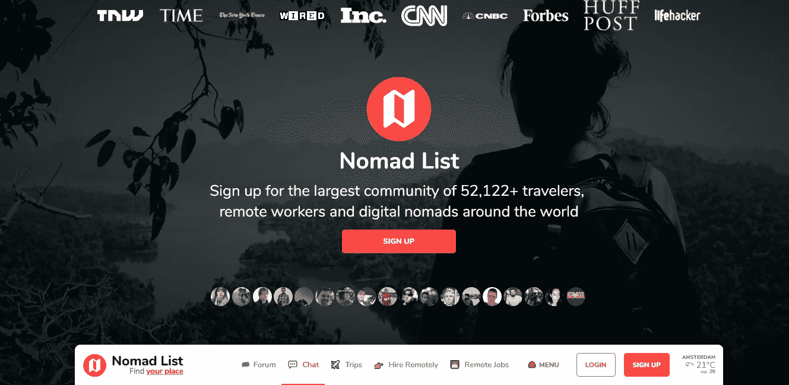

# 18.如何在任何地方工作— 30 天中等

> 原文：<https://medium.com/swlh/18-how-to-work-from-anywhere-30-days-of-medium-1c9cfa2d662f>

欢迎回到 **30 天中等。**

感谢迄今为止**一直在阅读、鼓掌和评论**的每一个人！今天的话题是— **如何在任何地方工作。**

如果你错过了下面的我的 30 天中等挑战的前 18 天，你可以补上:

## [0。30 天的培养基](/swlh/30-days-of-medium-c7ab34953c6c)

## [1。建立自己的网站需要什么？— 30 天中值](/swlh/1-what-do-you-need-to-build-your-own-website-30-days-of-medium-1ed1ad4e505c)

## [2。如何找到你热爱的事业——30 天的媒介](/swlh/2-how-to-find-a-business-you-love-30-days-of-medium-cb7a4a702d1b)

## [3。如何建立自己的网站—媒体 30 天](/swlh/3-how-to-build-your-own-website-30-days-of-medium-587f994672ec)

## [4。如何衡量你网站的表现——30 天媒体](/swlh/4-how-to-measure-your-websites-performance-30-days-of-medium-75e650969695)

## [5。如何通过回答他们的问题获得更多的客户-30 天的媒介](/swlh/5-how-to-get-more-customers-by-answering-their-questions-30-days-of-medium-b462d237533e)

## 6。成功的商业网站备忘单——30 天的媒介

## 7。如何衡量成功——30 天介质

## 8。了解在线销售漏斗——30 天媒介

## 9。什么是流量，为什么流量很重要？— 30 天的培养基

## 10。什么是 Google URL Builder，为什么要使用它？— 30 天的培养基

## [11。通过自动化您的社交媒体日程，让您的流量翻倍——30 天中等](/swlh/11-double-your-traffic-by-automating-your-social-media-schedule-30-days-of-medium-ac9aa74f7927)

## [12。如何辨别什么好卖— 30 天介质](/swlh/12-how-to-tell-what-sells-30-days-of-medium-ba3291d029d2)

## [13。我如何在 6，500% — 30 天的培养基中培养我的培养基](/swlh/13-how-i-grew-my-medium-following-6500-30-days-of-medium-c9d2d6f80b51)

## [14。你如何看待事情很重要——30 天中期](/swlh/14-how-you-look-at-things-matters-30-days-of-medium-f641b9733b90)

## [15。如何向小型企业销售服务— 30 天中等](/swlh/15-how-to-sell-services-to-small-businesses-30-days-of-medium-d6604c63b3b7)

## [16。如何通过有效的提案赢得更多交易— 30 天的媒介](/swlh/16-how-to-win-more-deals-with-effective-proposals-30-days-of-medium-481f16bbc86f)

## 17。如何在 10 分钟内建立一个网上商店——30 天的媒介

## [18。如何在任何地方工作— 30 天介质](/swlh/18-how-to-work-from-anywhere-30-days-of-medium-1c9cfa2d662f)

## [19。为什么你的网站会破坏你的销售——30 天媒体](/swlh/19-is-your-website-sabotaging-your-sales-30-days-of-medium-f63bdbdb350)

## [二十。你的流量从哪里来？— 30 天中值](/swlh/20-where-does-your-traffic-come-from-30-days-of-medium-a9b2d2c088bb)

## [21。如何真正识别倦怠——30 天中等水平](/swlh/21-how-to-actually-recognise-burnout-30-days-of-medium-7972a7a7a89e)

## [22。如何修改你的时间表并完成两倍的工作——30 天中等时间](/swlh/how-to-hack-your-schedule-and-get-twice-as-much-done-30-days-of-medium-441a509dc9be)

## [23。不要模仿你的竞争对手——30 天的媒介](/swlh/23-dont-copy-your-competitors-30-days-of-medium-56382b7ba8ed)

## 24。如何 SEO 优化一篇博文——30 天的媒介

## 25。独特或被遗忘——30 天的媒介

## 26。跟着感觉走——30 天中等水平

## 27。人们不支付平均 30 天的中等费用

## 28。如何做关键词研究— 30 天介质

## [29。为什么帕累托原则是世界上最大的诀窍——30 天中期](/swlh/29-why-the-pareto-principle-is-the-worlds-biggest-hack-30-days-of-medium-1c225f5c8aa1)

## 三十岁。你的内容比你的电话更有利可图——30 天的媒介

# 朝九晚五已经死了

2018 年，我们非常**幸运**，因为我们可以通过做**任何事情来谋生。**

你能想到的任何事情，如果你能想到某人、某地没有报酬的事情，我会非常惊讶。

我们有智能手机，拥有和 30 年前最先进的电脑一样的计算能力。

我们可以与世界另一端的人进行即时视频聊天。

我们有 **Instagram。(好吧，它们不可能都有用)。**

也就是说，朝九晚五正在被淘汰。

随着**软件蚕食世界**和**机器人很快将在未来 10-20 年内打磨掉残羹剩饭**，今天的工作环境与 10 年前有着天壤之别。

“朝九晚五”已经成为过去。

许多公司仍然采用这种工作时间，但是我们有远程工作人员，在家工作的人，跨岗位分担责任，整个业务职能在海外。

10 年后，我们的零售业、酒店业、制造业和建筑业的大量工作岗位将不复存在。但是我们不会因为移民而失去他们，我们会失去机器人！

# 如何在任何地方工作

在任何地方都有无限的工作方式，这取决于你的技能和创造力。

这里有一个简单的方法可以让你解雇你的老板并在任何地方工作:

1.  精通一项技能(设计、开发、移动、营销、UI)
2.  学习集客营销，采用集客模式获取客户
3.  在一年内建立你的业务/现金流
4.  买一台好的笔记本电脑
5.  移动:)

简单。

实际上，有一个庞大的群体在做这项工作，他们被称为**数字游牧者。**

他们有自己的在线社区，所有者甚至创造了这个神奇的工具，叫做**流浪者名单。**

Nomad List

这个超级酷的平台**聚集了**和**你可以远程**生活和工作的所有地点。****

这个社区由**企业家**和**数字工作者**组成，他们在世界各地从一个自由职业项目转移到另一个自由职业项目。

有一个 slack 频道、论坛和聊天室供你与做同样事情的其他**数字游民交流！**

您目前是否正在远程工作和周游世界？如果是这样，我希望收到你的来信。

## 你可能也喜欢这个:

## [为什么 WordPress 是在](/swlh/why-wordpress-is-the-best-platform-to-build-your-business-or-startup-website-on-df3fe932fad7)上建立业务或创业网站的最佳平台

## [如何建立网站——终极指南](https://www.squareinternet.co/how-to-build-a-website-ultimate-guide/)

## 如果你喜欢这个故事，请点击👏按钮，并跟随我的其他 30 天的媒介。

## 这篇文章发表在《T4》杂志《创业》(The Startup)上，这是 Medium 最大的创业刊物，有 329，974 人关注。

## 在这里订阅接收[我们的头条新闻](http://growthsupply.com/the-startup-newsletter/)。

