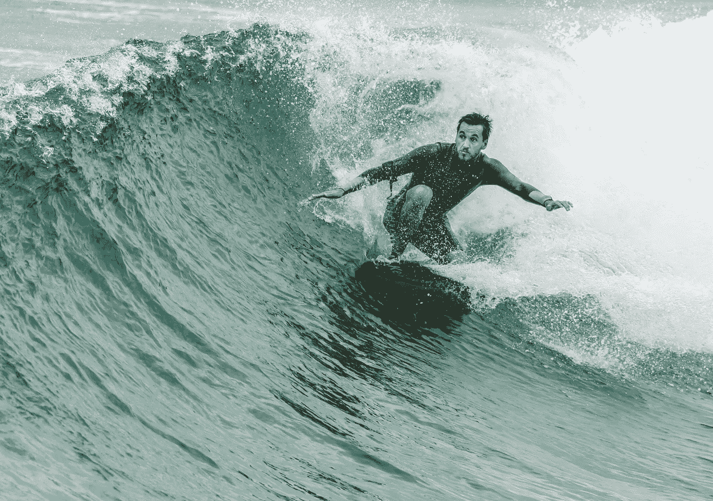

# 立即从你的生活中摒弃的 18 个信念

> 原文：<https://medium.com/swlh/18-things-every-person-must-unlearn-about-life-immediately-fd35c2726dee>

> “未来的文盲不是那些不会读或写的人，而是那些不会学习、忘却和再学习的人。”—阿尔文·托夫勒

学习很容易。忘却是困难的。

忘却需要你放下自我和偏见。它迫使你挑战你的信仰。