# 180 天的成长

> 原文：<https://medium.com/swlh/180-days-of-growth-83374de8c0be>

“你知道什么最糟糕吗？”

"意识到你所相信的一切都是完全荒谬的"

我从电影《夏日 500 天》中偷了这句台词&这篇文章的标题🌈。

完全没有关系，除了我们 180 天的成长之旅是从忘记我们所学的和把我们的偏见和直觉扔进垃圾桶开始的，🗑！！

那是 2017 年 6 月——我们都是偏执狂。我们养育了一个小天使。组建了一个 8 人团队(4 名技术人员、1 名发展人员、1 名设计人员、2 名联合创始人)。有一条平坦的增长线🔙。

> 现在是 2017 年 12 月，180 天后，
> 
> 我们的 MRR 增长了 1319.49%🙏

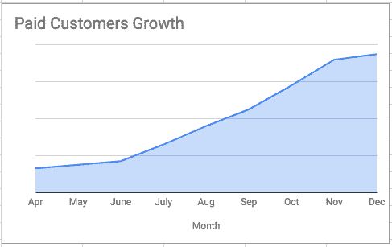

We’ve finally managed to hit the ‘paddle’ 🚴‍♂️!

**TL；博士**

*   [Omnify](https://www.getomnify.com/?utm_source=medium&utm_medium=180_days_of_growth) 是一个为本地&在线商家提供的调度&预订平台。
*   我们的 MRR 在过去的 180 天里上涨了 1319%📊
*   付费客户增长了 581%📈
*   我们已经接触了 80 多个国家🏁

# **180 天的成长历程🎯**

当事情没有按照你预期的方式发展时—

接受。评估。迭代。重复！

还有，你一个人做不到。所以，建立一个团队，即使这意味着两个人的团队。对我的犯罪伙伴最大的呼喊[维克拉姆·托马斯](https://twitter.com/thomanator93)🙌

现在，我们开始吧💪

**#1 正确定价💵**

“你们的定价策略是什么？”

老实说，当我们开始的时候，我们没有考虑清楚。正如我们的直觉所说，我们采用了竞争对手的定价。缺点是我们的定价没有提供任何独特的价值。

我们意识到了这一点，并决定研究一种新的定价模式。在 [Chargebee 博客](https://www.chargebee.com/blog/pricing-experiments-saas-product/)上有一篇精彩的文章，详细讨论了测试你的定价的话题。因此，在推出我们的新定价之前，我们开始进行测试。我们对一些客户进行了 beta 测试，并推出了一些折扣优惠。

我们进行了 3 个月的实验，尝试不同的价格，直到我们最终确定了目前的价格。因此，公平地说，我们目前的定价是由做出购买决定的人决定的，即我们的客户。Patrick Campbell(首席执行官，智能定价)就此写了一篇精彩的博客。

我们还采用了心理定价，并将所有定价都改为以 9 结尾(从 19 美元到 199 美元)🔐

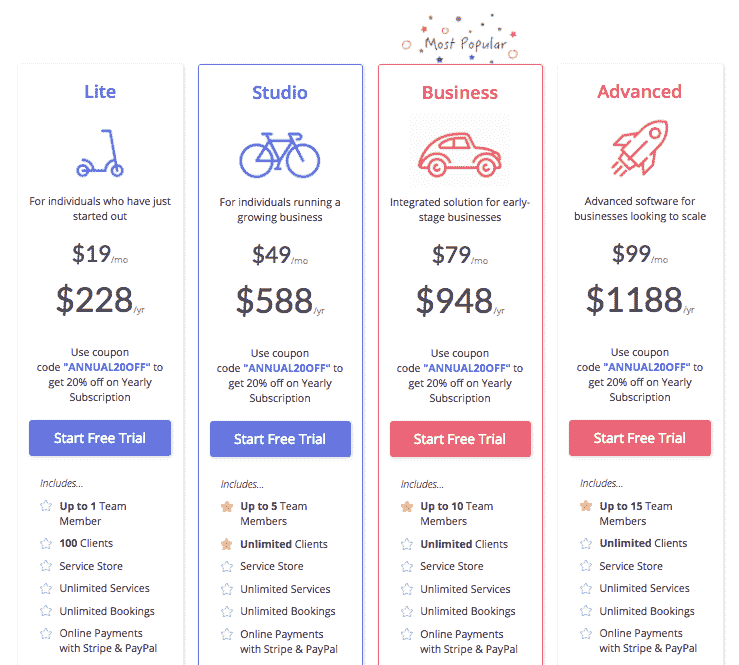

Omnify’s Current Pricing

**#2 销售目标设定🥅**

如果你从事销售，你必须关注 Close.io 博客。在[的一篇博文](http://blog.close.io/setting-sales-goals)中，它写道“如果你真的想成功，**你唯一真正需要增长的是收入，增长可以用用户或会话或一系列其他指标来衡量。”**

更真实的话没说过！

当你们只有两个人的时候，你们如何设定目标。你几乎什么都在做，那么目标设定的想法可行性如何？

相信我，把这当成一个任务清单，给自己一些目标。

我的联合创始人[马尼克](https://twitter.com/manik_me) &我在一家酒吧讨论这个问题，突然他说——让我们在年底达到 10 万美元。这就是我们的目标！那是 2017 年 6 月！

所以我们得到了我们的目标，我们开始向后工作。我们的 ARPU 大约是 34 美元/月。基于此，我们给自己设定了目标。设定目标的第一个月，我们就实现了目标🎯 🙀。尽管只有我们两个人，但目标设定在我们接近客户的方式上起了很大的作用。自 7 月份以来，我们的 M-O-M 增长了 30%。

话虽如此，设定“现实的”目标是非常重要的。否则，它可能会非常消极，可能会适得其反！

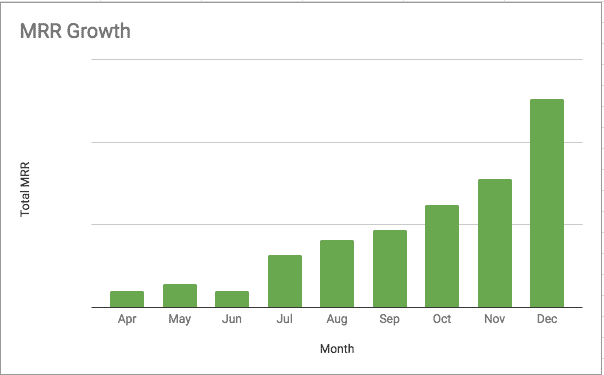

MRR Growth FY 2017–2018

**#3 优化销售漏斗🌈**

在 Omnify，我们完全专注于集客营销。

考虑到发现的过程，在一个单一的策略下培养和结束是一种罪恶，我们对此感到内疚。

我遇到了 Ashwin Ramesh(Synup 的首席执行官)，当我讨论我们的增长挑战时，他向我介绍了以下术语，起初听起来像是晚餐🌮 👇

*   豆腐——漏斗顶端
*   MOFU —漏斗的中间
*   富博——漏斗底部

每个漏斗都有不同的挑战，大多数时候我们都以同样的方式对待。这是不对的！吸引、培养和关闭客户需要不同的策略和方法。我们开始研究每个漏斗，并开始优化它们。我们发现我们的富博转换率还不错，但是 MOFU 很差。我们也需要在漏斗顶端努力。所以我们开始研究同一个。6 个月后，我们的转化率提高了相当多的⬆️

> Q1 对第三季度
> 
> 📩3.09%的⬆️注册转化率(目前为 7%)
> 
> 💳4.06%的⬆️付费客户转化率(目前为 11%)

这是一个渐进的变化，但在底线上仍然有很大的不同。我可能会围绕这个话题写一篇更长的帖子。

**#4 优化产品销售🙇‍!**

*   **🕸:网站优化**我们创建了 90 多个登录页面，包括主页、使用案例页面、专题页面等。我们专注于优化每一项，以推动更多的转换。

> 完美的登录页面清单:
> 
> 🖥简单副本
> 
> 🎥快速视频
> 
> 🌟价值主张
> 
> 💬客户评价
> 
> 👉行动号召(注册+安排演示)

*   **Web💻vs 手机📱:**我们还针对“移动网络”优化了所有登陆页面。

> 在 B2B SaaS，许多用户使用移动设备开始他们的购买之旅。我们可以继续推动移动端的最终销售，但如果销售漏斗没有针对移动端进行优化，我们就有可能永远失去这笔销售。

我们将 CTA 从**注册**改为**为移动网络安排演示**，这帮助我们大幅降低了跳出率💯！

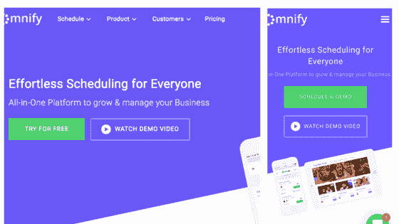

CTAs for Web v/s CTAs for Mobile Web

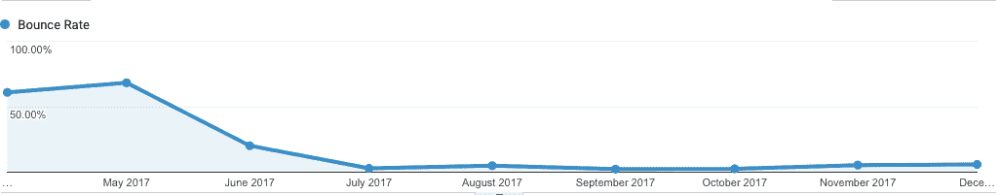

Bounce rate for Mobile Traffic (Apr 2017 to Dec 2017)

*   **销售每一项功能🏷:**销售你开发的每一个新功能非常重要，作为早期初创企业，我们为做得不够而感到内疚。自上几个月以来，我们开始每月发送 2-4 封产品更新电子邮件，通知我们的客户每个大/小功能的发布。每次我们发送产品更新电子邮件，我们都有转换。不要错过这个机会💌 💬

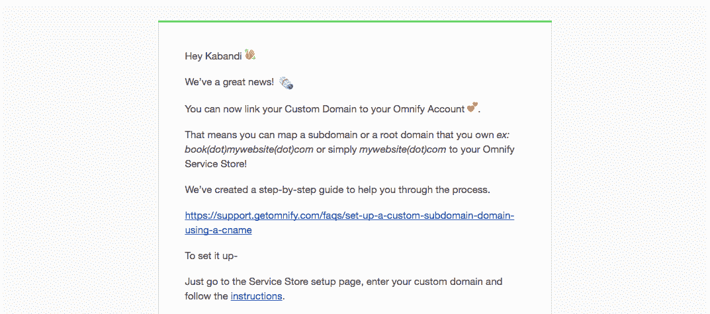

Our last product update email got us 3 conversions, 4 new affiliate sign-ups

**#5 挑选最佳频道📻**

作为早期创业公司，我们受到资源的限制。达到 10 万美元的 ARR 与达到 100 万美元或 1000 万美元的 ARR 是不同的。

我只能说第一个。关注最适合你的少数几个渠道是很重要的，这些渠道能带来最大的投资回报。可能会有一些渠道给你大量的线索，但他们最终不会成为付费客户。此外，将会有一些渠道带来更少的销售线索，但却有最多的转化率。你需要关注后者。

这是来自[pra sanna K](https://twitter.com/prasanna_says)(UPP kha 创始人)的宝石，对我们来说是一个游戏规则的改变者。这迫使我们重新审视我们瞄准的所有渠道。

我分享了目前为我们带来最大投资回报的 3 大渠道📈 👇

*【注意:这些是除了 SEO、出站、内容等常见问题之外的问题】*

*   **脸书重新定位广告:**事实证明，关键词定位广告对我们来说非常昂贵，投资回报率与成本不符。所以我们坚持脸书重新定位运动。我们选择脸书而不是谷歌 Adwords，因为它相对便宜，而且与其他平台相比，B2B 服务企业主在脸书的参与度更高。我们选择重新定位广告仅仅是因为重新定位可以让我们把花费集中在我们知道已经有一定兴趣的客户身上。在这种情况下，投资回报率要高得多。

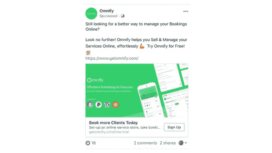

Omnify’s Facebook Retargeting ads

*   **上市网站📍:**上尽可能多的上市网站——Capterra，GetApp，TrustRadius 等等。而且，我会说，如果需要的话，继续他们的保费计划。你会得到更少但高质量的线索。

👉如果你不愿意花钱，请你的客户写评论，这是爬到顶端的有机方法。顺便说一句，这些列表网站很少会给每个发表评论的人提供 10 美元的亚马逊代金券。分享你的客户名单，让这些家伙做艰苦的工作。这是双赢💯！

👉在这些列表网站中，付费列表和免费列表的区别在于 CTA。在 Capterra 中，如果你可以看到(左下方)，我们有一个付费列表，所以 CTA 是**访问网站**，它会直接带你到 [Omnify 的网站](https://www.getomnify.com/?utm_source=medium&utm_medium=180_days_of_growth)。然而，在 GetApp 中，我们有一个免费的列表，CTA 是 **Compare App-** ，它会带你进入他们域名的页面。所以，即使你不能在出价上超过大公司，把你的脚放在门上，也会有很大的不同😎(黑客鸣谢: [Varun Jain](https://twitter.com/thebitmonk) ，SendX 创始人)

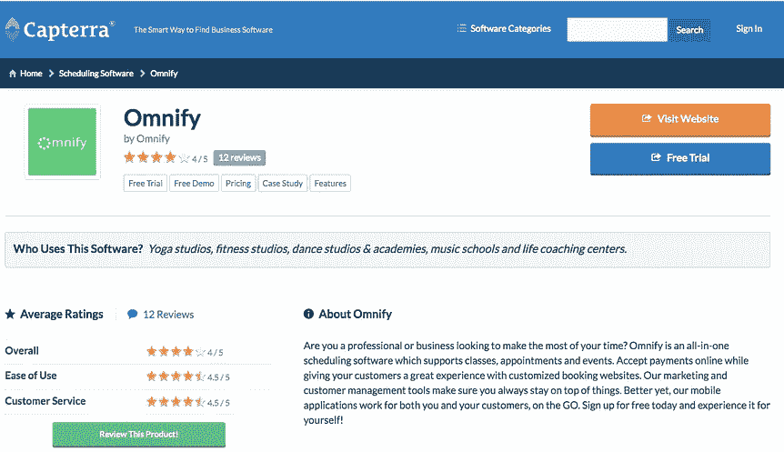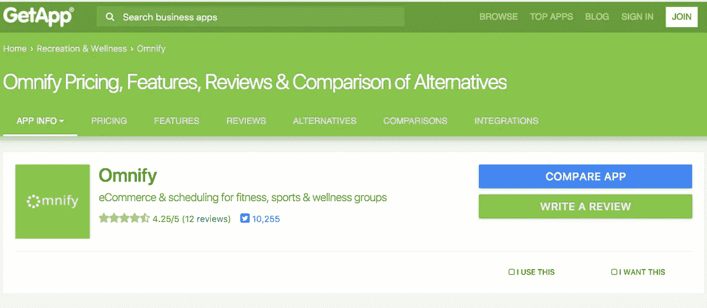

Paid listing v/s Free listing

*   **联盟营销👬:**事实证明，联盟营销是我们最好的渠道之一。这是纯销售。你需要接触附属机构，培养和关闭他们。我们首先研究了一些最好的加盟计划，看看他们是如何构建他们的(一次性支付、重复支付、基于目标的支付等)。一旦我们锁定了我们的代销商计划，我们必须得到一个代销商跟踪软件。我们瞄准了第一个推动者。如果你刚刚起步，这是辉煌的。

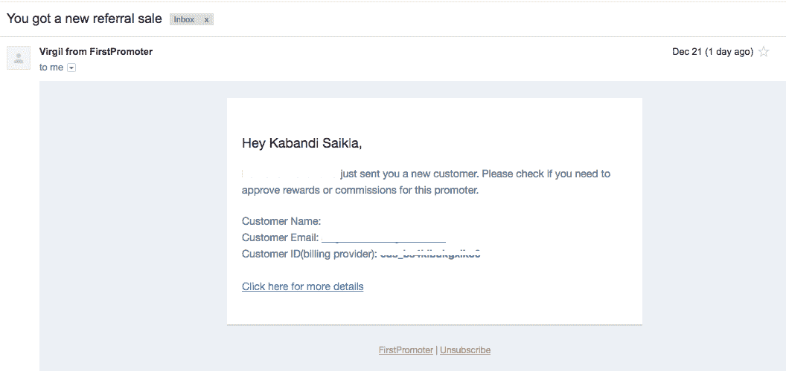

Love waking up to these emails ❤

有很多资源和专家可以帮助你进行联盟营销。我特别感谢[维吉尔](https://twitter.com/virgilci) & [SaaS 成长黑客](https://www.facebook.com/groups/SaaSgrowthhacking/?ref=br_rs)社区帮助我们建立我们的联盟计划🙌

**#6 相扑发布会🌮🌮🌮🌮🌮**

2017 年 8 月，我们与 AppSumo 达成合作伙伴关系，将于 2017 年 11 月发布。AppSumo 每周都会收到 100 份申请，所以我们在制作的时候是不知所措，心存感激。准备&旅程本身就需要一个博客🙏。向 Sampath 发出巨大的呼喊，没有他们，这一切都不可能实现。在过去的 180 天里，他一直在帮助我们实现增长。给你更多的力量！

*关键要点:*

*   Omnify 天售罄！！🍻

*   我们获得了价值超过 150，000 美元的收入🚀。不过，最大的份额都给了 AppSumo。
*   在过去的 30 天里，我们已经有 1400 多家企业开设了账户。是的，我们一直超级忙！！👨‍💻我相信假期结束后会有更多的人。(免责声明:我不会把这个数字加到我上面提到的客户增长指标上)

注意:此次发布不仅给我们带来了收入，还带来了巨大的反馈。我们的产品和技术团队在接下来的两个季度肯定会很忙！

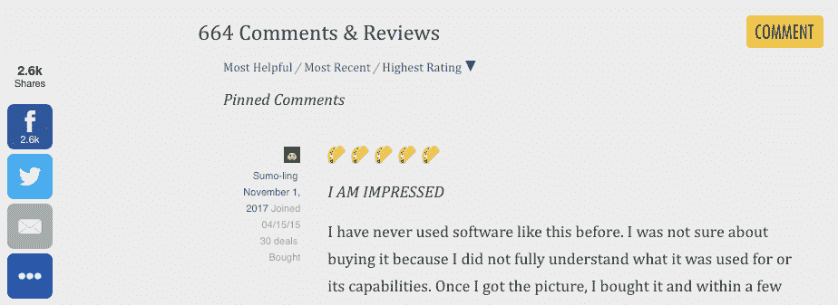

Oh damn, we got a lot of people talking about us!

**#7 产品搜索**😻

我们抵制[产品搜索发布](https://www.producthunt.com/posts/omnify-2)，希望有一天我们会有足够的客户来支持我们。因此，15 个月和 1600 多家活跃企业之后，我们可以继续寻找产品了。它超出了我们的预期——我们是当时的顶级产品之一🏅😻

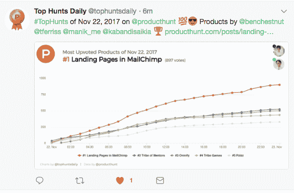

Getting a mention alongside Ben Chestnut and Tim Ferris was the cherry on top 🙀

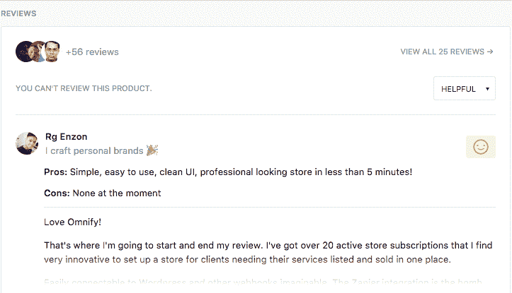

Lots of reviews- few good, few not so good ones.

> 我们从产品搜索中获得了很多流量，但付费客户却很少。

我们推出产品搜索的唯一目的是做一次小型公关，获得大量反馈——我们做到了。我们还设法从世界各地的天使和风投那里获得了相当多的投资兴趣。所以，是的！！*十指交叉*🤞

注意:如果你向小企业销售，很可能你的目标受众不在那里。所以，要清楚你想从产品搜寻活动中得到什么。

**#8 不要错过🛒的大日子**

就在我们的 AppSumo & Product Hunt 发布会之后是**黑色星期五**接着是**网络星期一**。我们累了，真的筋疲力尽了。我们决定不去，但我们在黑色星期五疯狂的几个小时后就放弃了。我们没有那么努力，但即使没有这些，我们还是成功完成了几笔年度交易。太神奇了！👍

注意:标记重要的日子。总是有一个特别为这些日子运行的交易/活动💸。不要错过这个机会。

最后，秘制酱料

**#9 客户成功驱动的增长🏅 💕**

Ventures 在[客户成功推动增长](https://sixteenventures.com/customer-success-driven-growth)上写了很多。在 Omnify，我们没有销售、营销或客户支持团队。我们有一个成长团队。我们只有 4 个人，我们所有人都对客户的成功负责。我们的目标是让每一位顾客满意，我们会努力实现这一目标。

客户成功包括客户升级、追加销售和以可持续的方式留住客户。这是我们作为创始人很早就在公司文化中吸收的核心价值观之一。我觉得这是我们的秘制酱！让你的顾客成为你的拥护者📣。没有什么比口口相传更像病毒了💕

> 我们都准备在接下来的几个月里达到 10 万美元🤞这是🛣最激动人心的阶段
> 
> 成长是会上瘾的。

感谢阅读，我希望它是有用的🙏

PS:如果你有一些建议，或者想让我就我提到的特定主题写完整的帖子，你可以在 [twitter](https://twitter.com/kabandisaikia?lang=en) 上打我。

## 这篇文章发表在[《创业](https://medium.com/swlh)》上，这是 Medium 最大的创业刊物，有 277，446+人关注。

## 在这里订阅接收[我们的头条新闻](http://growthsupply.com/the-startup-newsletter/)。

