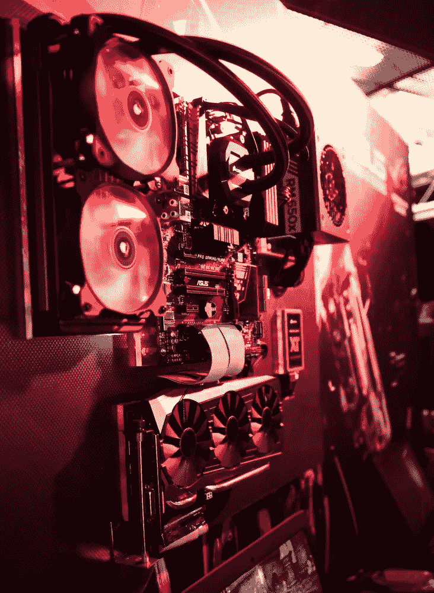

# 2018 年 4 月 19 日:神秘领域最大的故事

> 原文：<https://medium.com/swlh/19-04-2018-biggest-stories-in-the-cryptosphere-730917ffa301>

**1。瑞银支持的 Batavia 的第一笔实时交易**

基于区块链的贸易融资平台 Batavia 刚刚结束了其与企业客户的[首个实时国际交易](https://www.coindesk.com/ubs-backed-blockchain-platform-completes-live-trade-transactions/?utm_content=buffer5a165&utm_medium=social&utm_source=twitter.com&utm_campaign=buffer)。这个平台是由瑞银和 IBM 合作创建的。试点项目由智能合约驱动，交易记录在区块链上。该试验涉及两个“完整的交易周期，自动形成协议和结束支付”，所有这些都在该平台上进行。一条是从德国到西班牙，涉及汽车销售，另一条是从奥地利到西班牙，涉及纺织原料的销售。区块链平台促进了相关各方之间的联系，并创建了一个更高效的流程。巴达维亚是瑞银在 IBM 区块链公司的帮助下于 2016 年成立的。其他银行也加入了这个项目。

**2。ICICI 银行与 250 多家企业签署贸易融资交易区块链协议**

印度 ICICI 银行[发布了一份新闻稿](https://www.icicibank.com/managed-assets/docs/about-us/2018/blockchain-platform-for-trade-finance.pdf)透露已经有超过 250 家公司注册了其国家和国际贸易金融交易区块链平台。该国最大的私营部门银行已经设法登上了该国最高数量的银行。一些公司甚至属于标准普尔 BSE 100 指数。这一成功发生在 ICICI 银行首次尝试这种交易近两年之后。全国第一，世界少数。这是在 NBD 酋长国银行集团的帮助下实现的。区块链技术有助于减少相关的文书工作。这也是节省时间和交易更快。

**3。机构比特币矿工正在接管比特币采矿业务**

尽管比特币价格回到 8000 美元以上，但对一些人来说，仍然很难让比特币采矿成为一项有利可图的活动。此外，价格的进一步下跌可能意味着小型矿商的末日。这将导致机构矿商获得更多市场份额。如果是这样的话，这可能会成为一个问题，因为一小部分人将能够决定价格。硅谷风险投资家比尔·泰(Bill Tai)表示，在不久的将来，只有 5 至 10 家矿业机构将继续运营，而其他机构将被挤出市场。此外，小型矿商的高成本会导致更多的人出售他们开采的硬币，这将影响总体价格。

**4。道琼斯媒体集团与勇敢者结成伙伴关系**

道琼斯媒体集团，一个由金融和奢侈品牌组成的投资组合，已经与隐私网络浏览器勇敢软件[建立了合作伙伴关系，以创建优质内容并调查区块链技术](https://basicattentiontoken.org/dow-jones/)在数字出版业的可能用途。设法下载勇敢浏览器的用户将获得由道琼斯媒体集团创建的优质内容。这是一个先到先得的制度。有问题的内容是完全访问 Barrons.com 或高级市场观察时事通讯。还将对区块链进行测试。例如，通过 Brave 自己位于区块链的数字广告和服务平台传输内容。该浏览器还在开发一个基本的注意力令牌(BAT)平台，道琼斯媒体集团的优质内容将作为经验证的出版商。

> 本新闻综合报道由 [BlockEx](http://bit.ly/BlockEx_) 为您带来。

> 要想在你的邮箱里收到我们的每日新闻综述，请在这里注册:[*http://bit.ly/BlockExNewsRoundup-Updates*](http://bit.ly/BlockExNewsRoundup-Updates)

## 这个故事发表在 [The Startup](https://medium.com/swlh) 上，这是 Medium 最大的创业刊物，拥有 317，629+人关注。

## 在这里订阅接收[我们的头条新闻](http://growthsupply.com/the-startup-newsletter/)。

