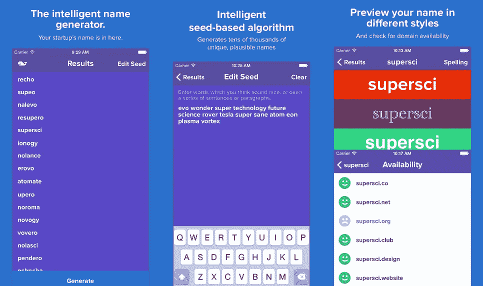
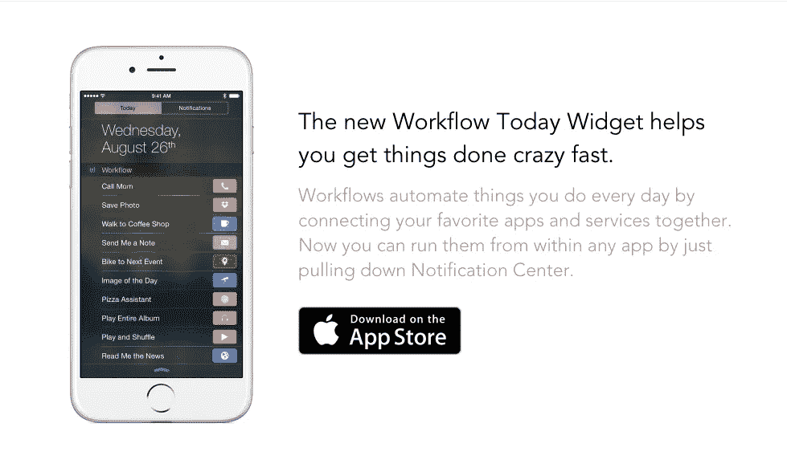
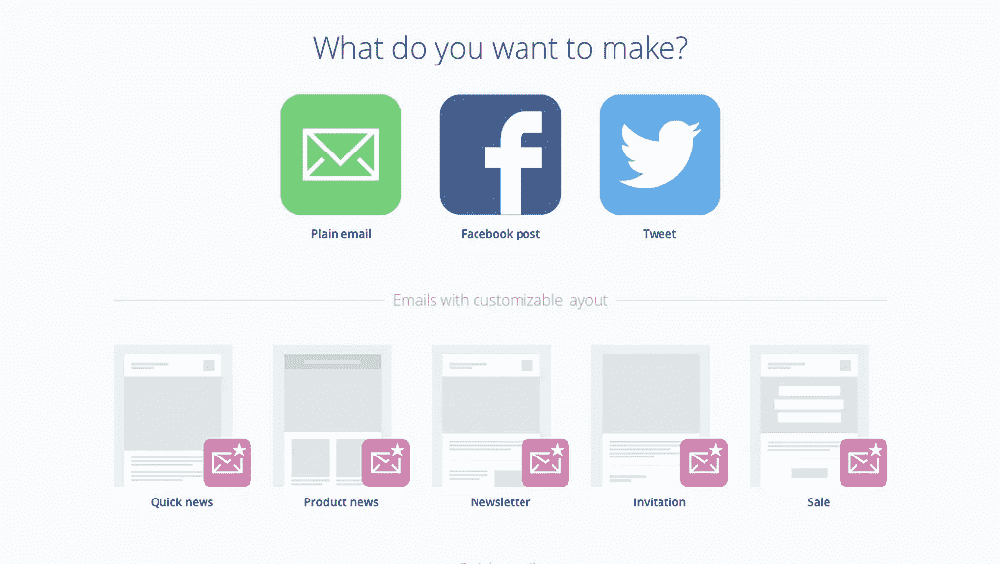
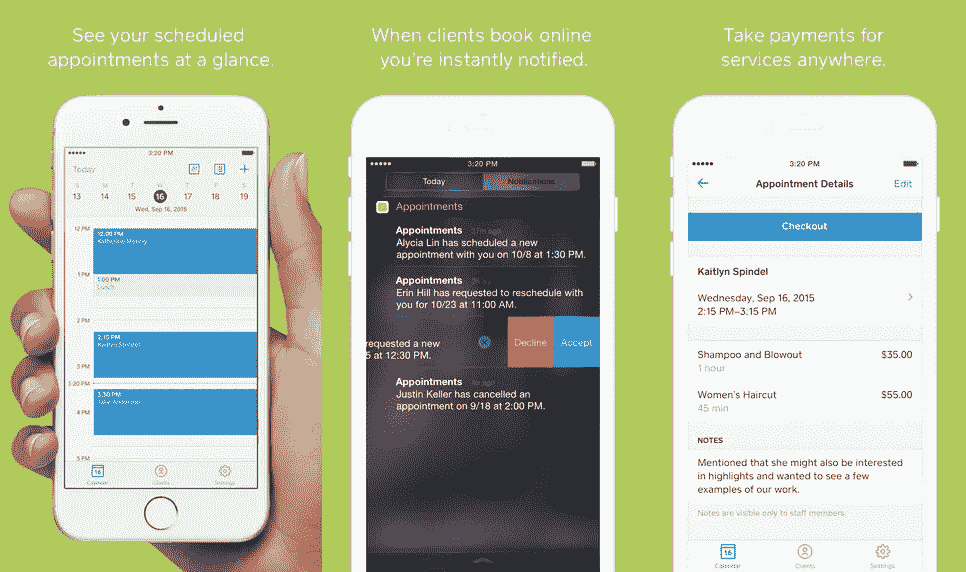
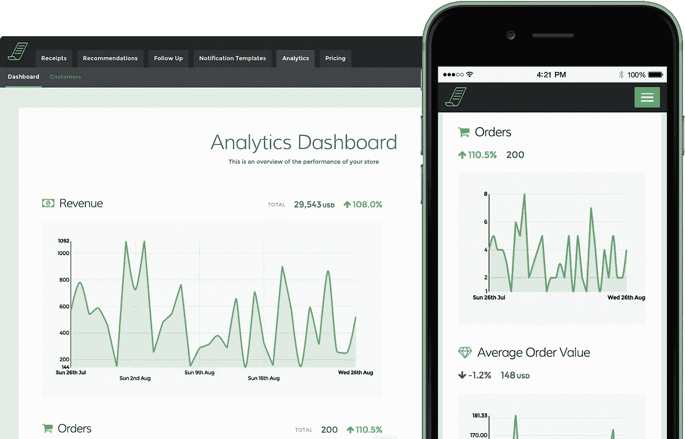
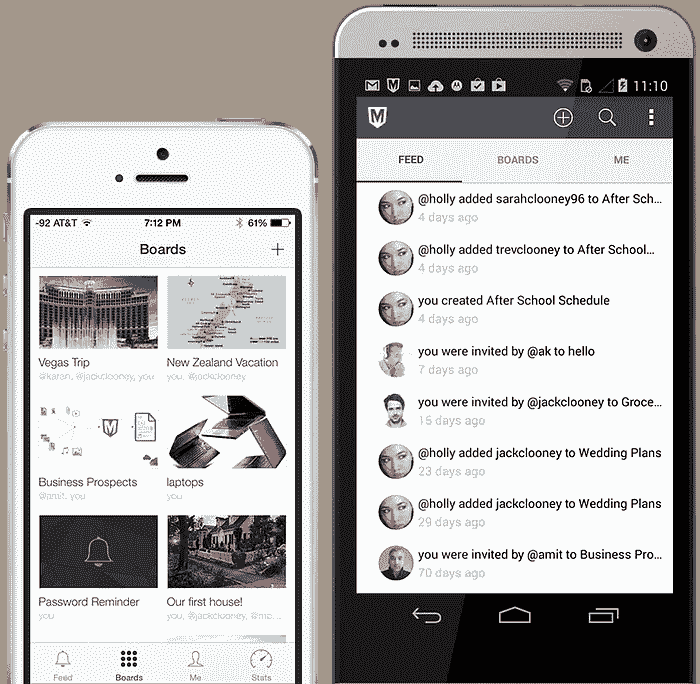
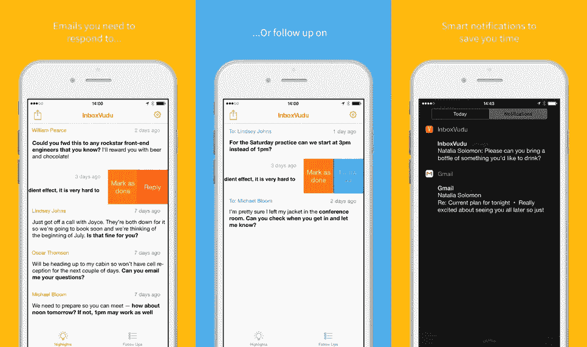
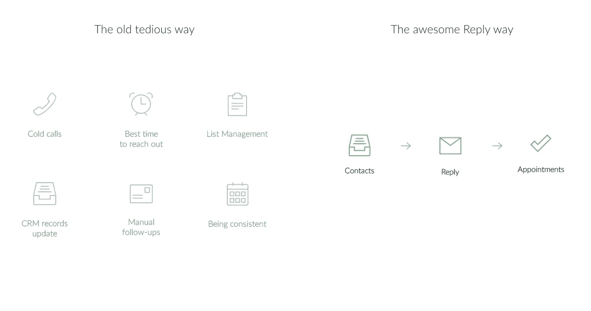
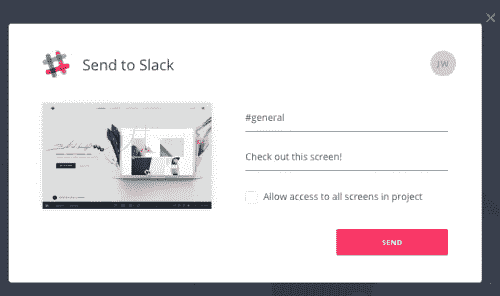

# 企业家和初创公司创始人的 19 个新工具

> 原文：<https://medium.com/swlh/19-fresh-tools-for-entrepreneurs-startup-founders-93dd2814a279>

不久前，我们开始了一个新的 ListHunt 系列，从过去的一周里为初创公司和创始人寻找最好的新工具。这个新系列背后的主要驱动力是我们找到了一堆很棒的工具，但它们不适合我们每天的列表搜索所迎合的人群。

我们的观众由许多创始人和创业社区的人组成，所以开始这个新系列是一个很容易的决定。我们知道创建一家新公司需要大量的时间，你没有时间浏览所有的新工具。这就是我们的用武之地，让你的生活不那么忙乱！请务必查看我们在[ListHunt.co](http://listhunt.co)的主站点，并通过 [@ListHunt](https://twitter.com/ListHunt) 关注我们！哦，这是上周的[名单！](https://blog.growth.supply/21-game-changing-new-tools-for-entrepreneurs-startup-founders-b35cb65f8774)

# [芹菜](https://www.trycelery.com/launch)

用两行代码在自己的网站上主持一个众筹或预购活动。掌控自己的品牌，鹤立鸡群。不受限制地讲述您的故事，并在您自己的网站上直接与您的客户互动。

利用世界上转换效果最好的收银台吸引客户，并通过推荐增加您活动的病毒式传播。轻松跟踪、测量和迭代您的付费渠道。此外，芹菜为您提供了预售、客户和订单管理所需的所有工具。我们与您一起成长，走过您业务的每一个阶段。

[**在此了解更多**](https://www.trycelery.com/launch)

# [构思者](https://www.ideator.com/)

你有一个好主意。现在你需要资源、关系和知识来实现它。Ideator 在这里帮助你分享你的计划，吸引合适的人，并取得成功。根据您希望如何分享、保护和保护您的概念，创建私人或公共圈子。与您自己的团队或我们值得信赖的顾问合作。将你的想法付诸实践。

[**在此了解更多**](https://www.ideator.com/)

# [克莱茨](https://klets.com/hello/)

创建一个 Klets 页面，与客户和业务联系人进行私人聊天。只需要 1 分钟。

[**在此了解更多**](https://klets.com/hello/)

# [工作假期](https://jobbatical.com/)

工作假期。这是一个由“工作”和“休假”组成的词。这意味着职业生涯的中断，人们可以利用他们的技能和知识，在新的环境下，在新的团队中从事令人兴奋的项目。

假期可以激发灵感，但很少能为你的职业生涯提供实用的新技能和经验。另一方面，工作假期让你可以转换环境，但要继续做你最擅长的事情，做一个真正让你兴奋的项目。它们是给你的电池充电、扩展你的世界观和分享新想法之间的结合，而不用动用你一生的积蓄。

[**在此了解更多**](https://jobbatical.com/)

# 名鲸

Namewhale 帮助你为你的创业公司找到一个独特的名字。使用一种智能的、基于种子的算法，根据你选择的种子词的声音、风格和感觉，生成成千上万个名字。生成的名称是随机的，但看似合理且有用！

[**在这里了解更多**](https://itunes.apple.com/us/app/namewhale/id1028881375?mt=8&ref=producthunt)|[**iOS 版下载**](https://itunes.apple.com/us/app/namewhale/id1028881375?mt=8&ref=producthunt)

# [简单地说](http://www.getonsimply.com/)

欢迎来到简单。我们致力于了解您，让您无论身在何处都能体验到量身定制的最佳内容。实时探索娱乐、文化和事件，并从让您快乐的事情中获得灵感。我们的策展团队只选择世界上最好的内容，所以你可以花更多的时间享受你喜欢的东西，而不是花更少的时间去搜索它。

[**在这里了解更多**](http://www.getonsimply.com/)|[**iOS 版下载**](https://itunes.apple.com/en/app/id961282172?mt=8) | [**安卓版下载**](http://www.getonsimply.com/#)

# [今日工作流小工具](https://workflow.is/widget)

新的“今日工作流程”小部件可以帮助您快速完成工作。工作流通过将您最喜爱的应用和服务连接在一起，自动化您每天所做的事情。现在，您可以在任何应用程序中运行它们，只需下拉通知中心。

它包括 200 多个操作，包括联系人、日历、地图、音乐、照片、相机、提醒、Safari、隔空投送、Twitter、脸书、Dropbox、Evernote 和 iCloud 文档等。

[**在这里了解更多**](https://workflow.is/widget)|[**iOS 版下载**](https://itunes.apple.com/app/workflow-powerful-automation/id915249334)

# [LinkedIn 查找](https://itunes.apple.com/us/app/linkedin-lookup-your-company/id1000842861?mt=8)

LinkedIn Lookup 是查找、了解和联系公司任何人的最快方式，即使你没有在 LinkedIn 上与他们联系。几秒钟内，你就可以通过头衔、技能、姓名、专业知识等找到同事。通过查看他们最新的、简化的个人资料来了解他们。当你准备好了，即使你不在座位上，也要立即联系。

[**在此了解更多**](https://itunes.apple.com/us/app/linkedin-lookup-your-company/id1000842861?mt=8)|[**iOS 版下载**](https://itunes.apple.com/us/app/linkedin-lookup-your-company/id1000842861?mt=8)

# [备忘录邮件](https://minutemailer.com/)

通过更好的营销节省时间。使用 Minutemailer，您可以轻松创建、发送和安排令人惊叹的时事通讯、普通电子邮件、脸书帖子和推文。

[**在此了解更多**](https://minutemailer.com/)

# [广场约会](https://squareup.com/appointments/app)

Square Appointments 允许您在任何地方经营业务。客户可以在线预订，并收到自动预约提醒，减少失约。让您的日历触手可及，并使用 Square 无缝付款。

[**在这里了解更多**](https://squareup.com/appointments/app)|[**iOS 版下载**](https://itunes.apple.com/app/id1023050786)

# [通过收据洞察](https://receiptful.com/insights/)

即时了解顾客在你的商店做什么。我们的商店分析仪表板让您可以快速了解您的企业目前的状况。即时了解您最重要的指标(如收入、平均订单价值和客户终身价值)的趋势，并实时做出有助于业务发展的决策。

[**在此了解更多**](https://receiptful.com/insights/)

# [刷卡](https://www.swipe.to/)

Swipe 可帮助您制作快速、美观、响应迅速的演示文稿，并让您通过任何设备向世界任何地方的任何人实时播放这些演示文稿。Swipe 通过将您的内容放在观众手中，将您的演示转化为对话，并让您与实时民意调查互动，获得更现代、更具参与性的双向演示体验。

[**在此了解更多**](https://www.swipe.to/)

# [Codemaster 直播课](https://www.codementor.io/classes)

Codementor 实时课程使您能够与实时导师一起实践学习。提出问题并获得即时反馈。您还可以通过动手练习和与教师或其他学生的结对编程来编写代码。或者在小组互动环境中与同龄人一起学习。在私人 Slack 频道加入社区讨论。

[**在此了解更多**](https://www.codementor.io/classes)

# [猛犸](https://mammothhq.com/)

是时候停止在多个电子邮件、文件夹和存储服务之间跳跃了。每个公告板都为一个主题捕获对话、链接、图片和文档。所有信息都在一个地方，在一个漂亮的包中，您会喜欢回来。从 5 GB 的免费存储空间开始。创建无限的板，与无限的贡献者共享和协作。

[**在这里了解更多**](https://mammothhq.com/)|[**iOS 版下载**](https://itunes.apple.com/us/app/mammothhq/id898069776) | [**安卓版下载**](https://play.google.com/store/apps/details?id=com.mammothhq)

# [Blab.im](http://blab.im/)

采访。偶尔出没的地方。辩论。讨论。现场研讨会。Blab 可以让你观看有趣的人之间的实时视频对话。多达 4 人同时进行现场直播，分屏风格！

[**在这里了解更多**](https://blab.im/)|[**iOS 版下载**](https://itunes.apple.com/us/app/blab/id1023962293)

# [InboxVudu](https://www.inboxvudu.com/)

InboxVudu 是你收件箱最好的朋友。当你有可能错过一封重要的电子邮件或忘记准时跟进某人时，我们会静静地坐在后台让别人知道我们。

它会分析你收到和发出的邮件，找出你需要采取的行动。当重要的请求进入您的收件箱时，使用它来掌握它们，并提醒您需要跟进的已发送邮件。

[**在这里了解更多**](https://www.inboxvudu.com/)|[**iOS 版下载**|](https://itunes.apple.com/us/app/inboxvudu-your-intelligent/id1002147785?mt=8)[**添加到 Chrome**](https://chrome.google.com/webstore/detail/inboxvudu-for-gmail/enjlfmdglkpjpiegaeabakhcfgejpkjc?hl=en-US)

# [回复](http://replyapp.io/)

发送感觉温暖的冰冷邮件！无论是入境客户、出境客户、试用客户还是现有客户，我们都会自动控制您的外联活动，同时保持每次沟通的个性化。回复自动发送个性化的电子邮件和跟进，让您与潜在客户大规模互动。

[**在此了解更多**](http://replyapp.io/)

# [松弛按钮](http://slackhq.com/post/127498327415/addtoslack)

你很快会在许多你喜欢的应用和网站上发现一个按钮，上面写着“添加到空闲时间”。点击这个按钮将会把你带到一个认证页面，在这里你将会选择你想要与这个服务整合的 Slack 团队，以及这个服务将会向哪个频道(或者你自己的@slackbot)报告！

配置完成后，任何向您发送通知或电子邮件的 web 应用或服务都可以开始自动向 Slack 报告这些信息。许多应用程序和服务还会让你无需离开他们的应用程序就能分享东西到 Slack 得心应手！

[**在此了解更多**](http://slackhq.com/post/127498327415/addtoslack)

# [Flinto for Mac](https://www.flinto.com/mac)

Flinto for Mac 是一个全面的应用原型工具，允许您创建任何东西，从简单的点击原型到具有令人印象深刻的交互的全面原型。我们为 Mac 精心设计了 Flinto，以最大限度地降低复杂性。没有计划或时间表。这是设计者一直期待的原型工具。

[**在这里了解更多**](https://www.flinto.com/mac) | [**下载用于 Mac 的**](https://www.flinto.com/mac)

希望你们喜欢这个列表！查看我们在[ListHunt.co](http://listhunt.co)的主站点，并通过 [@ListHunt](https://twitter.com/ListHunt) 关注我们！哦，这是上周的清单！

*发表于* **创业、旅游癖和生活黑客**

-