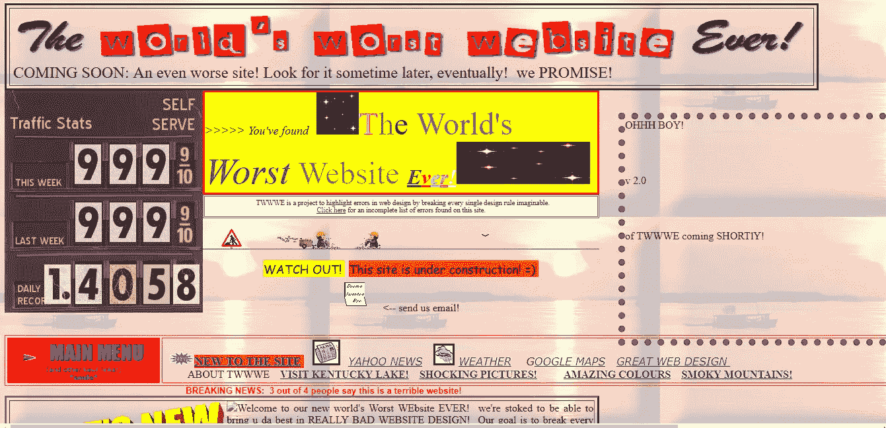
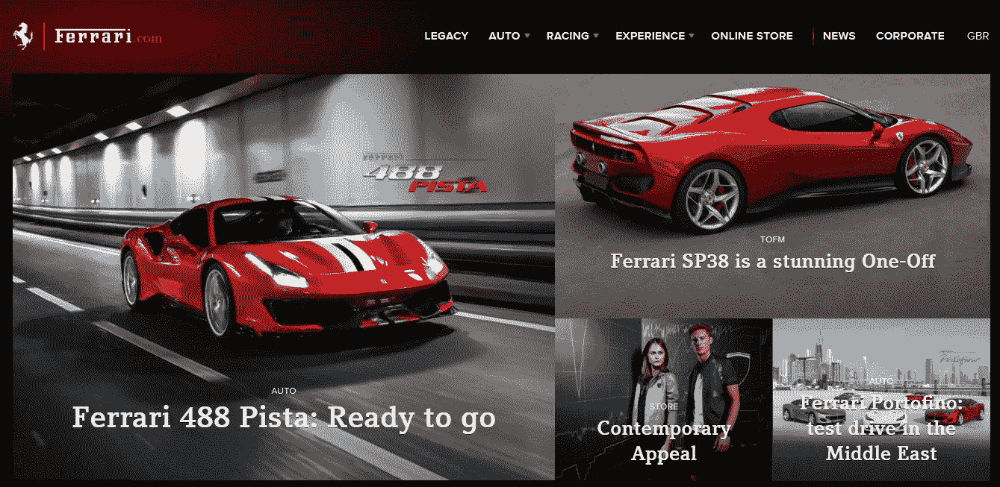
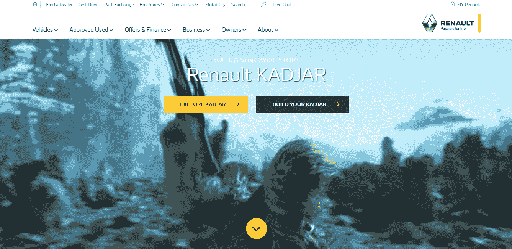
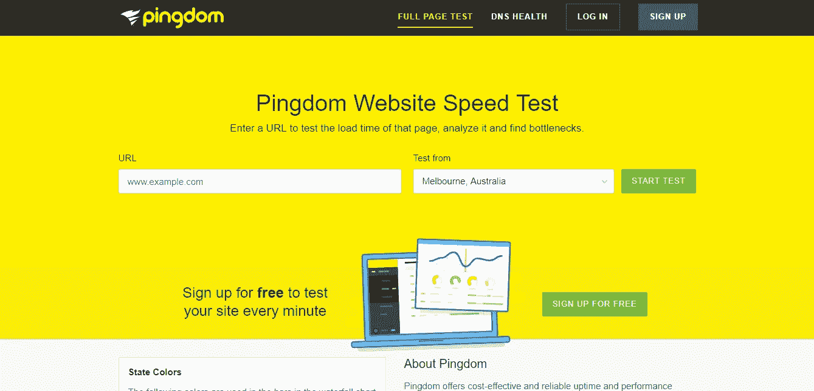
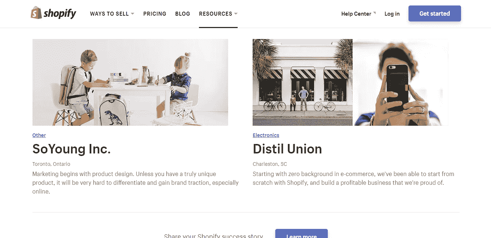
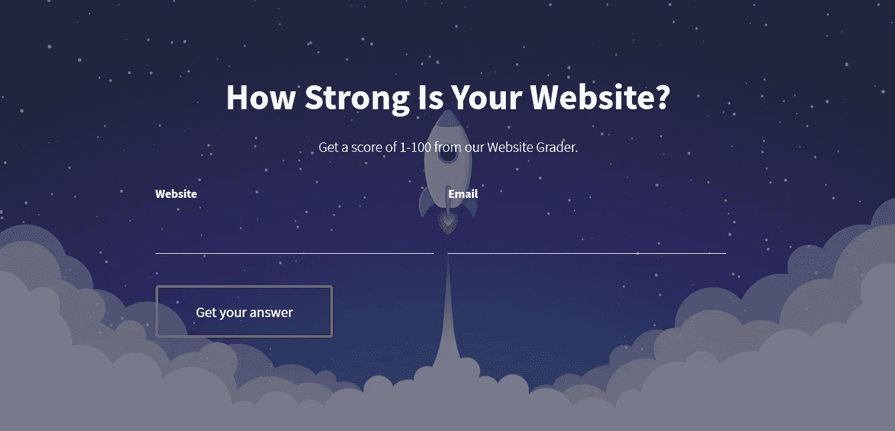

# 19.你的网站破坏了你的销售吗？— 30 天的中等

> 原文：<https://medium.com/swlh/19-is-your-website-sabotaging-your-sales-30-days-of-medium-f63bdbdb350>

30 Days Of Medium

欢迎回到 **30 天中等。**

感谢迄今为止**一直在阅读、鼓掌和评论**的每一个人！今天的话题是— **你的网站在破坏你的销售吗？**

如果你错过了下面的我的 30 天中型挑战的前 19 天，你可以补上:

## [0。30 天的培养基](/swlh/30-days-of-medium-c7ab34953c6c)

## [1。建立自己的网站需要什么？— 30 天中值](/swlh/1-what-do-you-need-to-build-your-own-website-30-days-of-medium-1ed1ad4e505c)

## [2。如何找到你热爱的事业——30 天的媒介](/swlh/2-how-to-find-a-business-you-love-30-days-of-medium-cb7a4a702d1b)

## [3。如何建立自己的网站—媒体 30 天](/swlh/3-how-to-build-your-own-website-30-days-of-medium-587f994672ec)

## [4。如何衡量你网站的表现——30 天媒体](/swlh/4-how-to-measure-your-websites-performance-30-days-of-medium-75e650969695)

## [5。如何通过回答他们的问题获得更多的客户-30 天的媒介](/swlh/5-how-to-get-more-customers-by-answering-their-questions-30-days-of-medium-b462d237533e)

## 6。成功的商业网站备忘单——30 天的媒介

## 7。如何衡量成功——30 天介质

## 8。了解在线销售漏斗——30 天媒介

## 9。什么是流量，为什么流量很重要？— 30 天的培养基

## 10。什么是 Google URL Builder，为什么要使用它？— 30 天的培养基

## [11。通过自动化您的社交媒体日程，让您的流量翻倍——30 天中等](/swlh/11-double-your-traffic-by-automating-your-social-media-schedule-30-days-of-medium-ac9aa74f7927)

## [12。如何辨别什么好卖— 30 天介质](/swlh/12-how-to-tell-what-sells-30-days-of-medium-ba3291d029d2)

## [13。我如何在 6，500% — 30 天的培养基中培养我的培养基](/swlh/13-how-i-grew-my-medium-following-6500-30-days-of-medium-c9d2d6f80b51)

## [14。你如何看待事情很重要——30 天中期](/swlh/14-how-you-look-at-things-matters-30-days-of-medium-f641b9733b90)

## [15。如何向小型企业销售服务— 30 天中等](/swlh/15-how-to-sell-services-to-small-businesses-30-days-of-medium-d6604c63b3b7)

## [16。如何通过有效的提案赢得更多交易— 30 天的媒介](/swlh/16-how-to-win-more-deals-with-effective-proposals-30-days-of-medium-481f16bbc86f)

## 17。如何在 10 分钟内建立一个网上商店——30 天的媒介

## [18。如何在任何地方工作— 30 天介质](/swlh/18-how-to-work-from-anywhere-30-days-of-medium-1c9cfa2d662f)

## [19。为什么你的网站会破坏你的销售——30 天媒体](/swlh/19-is-your-website-sabotaging-your-sales-30-days-of-medium-f63bdbdb350)

## [二十。你的流量从哪里来？— 30 天中值](/swlh/20-where-does-your-traffic-come-from-30-days-of-medium-a9b2d2c088bb)

## [21。如何真正识别倦怠——30 天中等水平](/swlh/21-how-to-actually-recognise-burnout-30-days-of-medium-7972a7a7a89e)

## [22。如何修改你的时间表并完成两倍的工作——30 天中等时间](/swlh/how-to-hack-your-schedule-and-get-twice-as-much-done-30-days-of-medium-441a509dc9be)

## [23。不要模仿你的竞争对手——30 天的媒介](/swlh/23-dont-copy-your-competitors-30-days-of-medium-56382b7ba8ed)

## 24。如何 SEO 优化一篇博文——30 天的媒介

## 25。独特或被遗忘——30 天的媒介

## 26。跟着感觉走——30 天中等水平

## 27。人们不支付平均 30 天的中等费用

## 28。如何做关键词研究— 30 天介质

## [29。为什么帕累托原则是世界上最大的诀窍——30 天中期](/swlh/29-why-the-pareto-principle-is-the-worlds-biggest-hack-30-days-of-medium-1c225f5c8aa1)

## 三十岁。你的内容比你的电话更有利可图——30 天的媒介

# 我的标题破坏了我的文章吗？

我本打算把这篇文章命名为— **你的网站有多重要？**

但是那样的话，我就不会遵循我自己的建议，那就是写 [**引人注目的标题**来推动你的内容的浏览量](/swlh/12-how-to-tell-what-sells-30-days-of-medium-ba3291d029d2)。

那个标题不会卖我的内容。

所以我一直在问——你的网站在破坏你的销售吗？

看到一个小小的变化，会有很大的不同。大家都关心自己的**销量。不是每个人都关心他们的网站。**

当我把这两者联系起来时，感兴趣的人数就上升了。

在这里，我们也有了销售的基础。

通过证明**你所做的**能够**以某种方式影响他们的底线**，让你的读者或潜在客户**关心你要说的话**。

# 我的网站如何连接到我的销售？

你多久从不可靠的来源买东西一次？

如果一家商店看起来不可信，你会去那里购物吗？

如果你第一次去一个新的**商场，你会去哪些商店？**

当然是你知道的品牌。什么会决定你会去哪些新的独立商店(如果有的话)购物？

1.  他们看起来像什么
2.  购物体验
3.  他们有你想要的东西吗
4.  价格
5.  他们看起来可信吗

我将向你展示这个**零售决策过程**如何在互联网和**网站上反映自己。**

# 你的网站看起来像什么

如果你不会去一个看起来不可思议的商店，你会去一个看起来不可思议的网站吗？

不，除非你喜欢大剂量的电脑病毒。

你的网站看起来并不是“全部”和“最终”的，尤其是对小企业而言。**但是。**

你的网站确实需要看起来有信誉，至少保持一定的专业水准。

这对你的销售有什么影响？

网站:

*   不要看起来有信誉
*   载入速度太慢
*   手机不友好吗
*   没有用户友好的布局
*   不要简单地解释他们做什么

一般都有很高的**跳出率。**

Google [将**跳出率**](https://support.google.com/analytics/answer/1009409?hl=en) **定义为:**

> “反弹是您网站上的单页会话。在 Analytics 中，反弹被专门计算为仅触发对 Analytics server 的单个请求的会话，例如当用户在您的网站上打开单个页面，然后在该会话期间退出，而没有触发对 Analytics server 的任何其他请求。”

换句话说。

跳出率决定了有多少访客登陆，然后不要访问你的网站超过 1 页。也就是说，它们着陆后就离开了，没有进一步探索。

你可以使用谷歌分析来检查你的跳出率。

# 网站体验

你的网站体验，或 UX(用户体验)，是你的网站使用起来有多容易。

**有意义吗**？很容易找到东西吗？所有东西都有清晰的路标吗？或者用户坐在那里敲击键盘，或者因为无法在你的网站上找到或做他们想做的事情而感到沮丧。

如果你的网站为用户提供了一个糟糕的体验，你将会有很高的退订率，也可能会有很高的跳出率。

举例来说，如果你的网站很难浏览主页，你可能会发现你的服务页面的下降率很高。或者，如果你的报价表很糟糕，这可能会有很高的**下降率(或很低的转换率)。**

不要像 [**世界上最差的网站**](https://www.theworldsworstwebsiteever.com/) **。**

Hauntingly beautiful.

# 你有顾客想要的东西吗？

这听起来像是常识，但是，你有顾客想要的东西吗？

这里的常见问题:

*   对你所做的事情过于抽象
*   没有列出你做了什么
*   术语太多
*   原稿不清

这些问题会导致你的客户不理解你做的事情，或者你做了他们需要你做的事情。

抽象、含糊不清的语言并不高端，否则你将收取更多费用。

你可以表现得很高端，但你的语言仍然非常简单和谨慎。

看 [**法拉利网站**](https://www.ferrari.com/en-GB) **举例。没有臃肿、技术上令人困惑的语言或谈论驾驶法拉利就像是一次外体体验或一些废话。**

法拉利的起价约为 180，000 美元，并且仍然设法保持简单。

有趣的是，为了比较去年 [**失去市场份额的品牌**](https://www.autocar.co.uk/car-news/industry/winners-and-losers-2017s-uk-car-market) **，**，我发现**雷诺**的网站使用起来更令人困惑，我花了一些时间才弄明白发生了什么。我也不太喜欢他们新的 **Kadjar 的声音(这只是我的看法)。**

所以，保持简单愚蠢！

# 加载太慢了吗？

页面速度不是一切，但它是你网站表现的一个因素，并最终决定你在网上获得多少业务。

你的网站不一定要非常快，但一定不能慢得让人恼火。

当网站慢得令人恼火时，人们就会去别处。

你可以使用 Pingdom 中的这个 [**免费工具来评估你的网站有多快或多慢。**](https://tools.pingdom.com/)

Pingdom Page Speed Test

**页面速度慢=跳出率高**

# 你信任这个网站吗？

销售在很大程度上与信任有关。

你是否足够信任这个人/组织会拿出你辛苦赚来的钱？

**越大**越采购，**越需要**的信任。

我们可以毫不犹豫地去街角的杂货店买巧克力棒或报纸。

我们不能为一辆新车或昂贵的奢侈品做同样的事情。

如果一个网站看起来不错，易于导航，并提供你所寻找的东西，我们如何越过信任的桥梁进入下一步，并从访问者那里引出一笔**购买(或为 B2B 产生一个线索)。**

这里有一些东西，你可以看看，以确定你的网站是否“值得信赖”，足以有效:

*   它有 SSL 证书吗？
*   是否有社会证明(证明、评论)
*   我能找到该公司的联系方式或足够的信息，让我确信它是一个合法的组织吗？
*   有社交媒体简介的链接吗？

人们想知道他们在和其他人类打交道。

让你的网站更人性化。包含社交媒体链接。建立一个关于页面。共享您的联系信息。建立客户评价和案例研究。

你可以有一个设计精美、易于使用的网站，但是如果人们不信任它，它就不会工作！

仅仅扔出一个**漂亮的模板**然后等着线索滚滚而来是不够的，他们不会的！

我以前写过关于 **Shopify 网站**如何绝对钉**社会证明和信任。**

对于像样的网上商店来说，Woocommerce 是一个更好的选择，然而 **Shopify** 在小型网上商店市场占有巨大的市场份额，因为他们的营销**超级好**并且他们以自己的**案例研究领先。**

企业主**信任 Shopify。**

# 这一切如何转化为破坏我的销售？

有一个非常简单的石蕊测试你可以使用。

你会从你的网站上获得**线索或销售额吗？**

如果你不这样做，你的网站可能会破坏你的销售。

如果你在网上营销中**始终如一**但没有任何线索，这肯定意味着你的网上销售漏斗中的某个地方出现了问题，很可能是你的网站。

如果流量在，要么流量不对，要么网站不对。

# 使用我们的网站分类器

如果你不确定你的网站，请随意使用我们的 [**免费网站评分工具**](https://www.squareinternet.co/website-grader/) **来获得一份关于你网站的免费定制报告。**

Website Grader

## 你可能也喜欢这个:

## [为什么 WordPress 是在](/swlh/why-wordpress-is-the-best-platform-to-build-your-business-or-startup-website-on-df3fe932fad7)上建立业务或创业网站的最佳平台

## 如何建立一个网站——终极指南

## 如果你喜欢这个故事，请点击👏按钮，并跟随我的其他 30 天的媒介。

## 这个故事发表在 [The Startup](https://medium.com/swlh) 上，这是 Medium 最大的创业刊物，拥有 331，853+人关注。

## 在这里订阅接收[我们的头条新闻](http://growthsupply.com/the-startup-newsletter/)。

