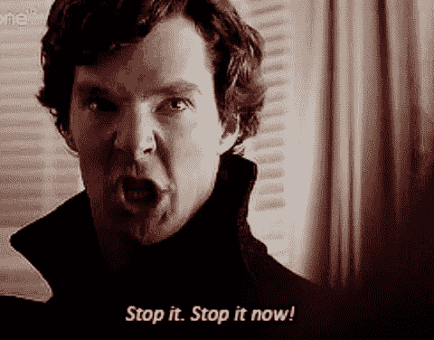
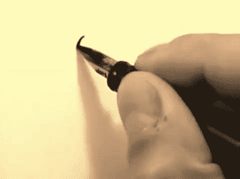

# 你浪费时间的两个原因

> 原文：<https://medium.com/swlh/2-reasons-why-youre-wasting-your-time-e78b9fda49fe>

## 如果时间是最宝贵的东西，那么浪费时间就是最大的浪费

> "如果时间是最宝贵的东西，那么浪费时间就是最大的浪费."本杰明·富兰克林

输入法是我们拥有的最宝贵的资源。与金钱不同，我们花费的每一秒或每一分钟都无法赚回来。
那么，为什么我们最终会浪费这么多水呢？

最近几年我读了几十本关于时间管理的书和文章。最近，这是一个 18 岁女孩的博客帖子，分享了她防止自己睡着的尝试。她详细介绍了自己的方法，并解释了自己是如何在不睡觉的情况下应对的。这位博主建议我们都应该尽可能地减少睡眠，因为据她所说，睡眠是浪费时间。

事实是，我们一生中三分之一的时间，平均 26 年，都在睡觉。但这真的是浪费时间吗？睡眠是生活的必需品之一，就像食物和水一样。就像呼吸一样。一次又一次的事实证明，一个人没有睡眠是无法生存的。纵观历史，剥夺睡眠被广泛用作一种酷刑形式，甚至被美国军方使用。虽然还不确定人们是否会死于睡眠不足，但很明显睡眠不足的副作用是致命的。简而言之，睡眠对我们的生存至关重要。

这个博主的帖子让我开始思考——**到底什么是‘浪费时间’，**？

# 注意力持续时间短？

当今世界上的每一件事都必须只花几秒钟，否则，我们简直无法忍受。即使是我们跳过 Youtube 上一个广告所必须等待的五秒钟，似乎也是永远。我们变成那样是有原因的。“我们的注意力持续时间变得越来越短，”大多数人都这么说。但这是真的吗？吉玛·布里格斯博士可不这么认为。她解释说，我们的注意力持续时间取决于我们执行的任务。这也是一种习惯的力量。例如，如果你跳过视频中的某些部分，你就不太可能在以后的任何时候专注于完整的视频。

因此，有了这些富有成效的文章和时间管理应用程序，我们浪费的时间肯定比以前少了，对吗？

**这里是交易。**
对于什么是“浪费时间”没有绝对的定义，也不应该有。他们说，早上 5 点醒来并冥想。他们说，不要看电视。他们说，关掉脸书。没有人能够或者应该告诉你如何利用你的时间。没有时间委员会决定什么是重要的，什么是不重要的。当然，道德准则是存在的。你或许应该帮助有紧急需要的人而不是看电视，但是你应该工作而不是看电视吗？这完全取决于你。时间不是我们共享的东西。这是个人的事情。
**你的时间属于你。我的时间是我的。你可能会发现早上 5 点起床，晚上 10 点睡觉很有用。我更喜欢凌晨 2 点睡觉，早上 10 点醒来。如果有人暗示你在浪费时间，就告诉他们:“我如何度过我的时间，不关你的事。”**

我是认真的。谁来决定你应该或者不应该如何度过你的时间？不要整天坐在电脑前，你在浪费时间你以前听过或说过这个短语吗？现在请允许我再重复一遍这句话，让它更清楚些:“不要整天坐在电脑前，你在浪费你的时间！”

# 你明白我的意思吗？

在电脑前唱歌是放松的好方法。它能让你开怀大笑。这是学习、获得灵感、社交等等的好方法。关键是，就像你做的其他事情一样，它可能对你来说非常有价值。这也可能是浪费时间。但是这取决于你。

我给你举个例子。我妹妹年轻时痴迷地看一部西班牙肥皂剧。*“这是胡说，”*我们经常对她说。我们没有意识到的是，她西班牙语变得很流利。仅仅五年后，当我们错过航班被困在马德里时，我姐姐用她从电视节目中学到的西班牙语救了我们。多么讽刺。每个人都应该根据自己不同于我的价值观来决定如何利用自己的时间。这就是生活的美妙之处之一——一些人可能认为有价值和值得做的事情在别人的世界里可能完全是浪费时间。

这里有一个小故事解释了为什么我们应该决定如何支配 T2 的时间:当史蒂夫·乔布斯从大学退学时，很多人告诉他，他犯了一个错误。他决定参加他感兴趣的课程，避开他不感兴趣的课程。事实是，在我们的世界里，纯粹出于兴趣而没有能力从中赚钱的学习是被禁止的。完全是浪费时间。当乔布斯参加一个书法课程时，人们不禁侧目。他们想:*“这将如何成为未来实用的技能？”*

乔布斯的思想流派恰恰相反。他觉得传统的大学学习并没有如他所愿地帮助他塑造自己的生活。通过退学，他终于能够专注于他感兴趣的课程，而不管这些课程对他的未来有多大的实用价值。因此，正如这个人自己分享的那样，在他参加书法课程 10 年后，他在 Mac 电脑中实现了奇妙的字体，改变了我们今天使用电脑的方式。

# 一套准则

记住这一点，有一套正确利用时间的指导方针。这是一套适用于所有人的“规则”。我们必须有目的地度过时间。就像乔布斯一样，我们必须把时间花在我们觉得有意义的事情上。

但是“有意义”的含义是无限的。
玩电子游戏。和孩子们一起闲逛。弹吉他。写吧。笑吧。做饭。快跑。坐下。躺在床上。参加书法课程。看一部西班牙肥皂剧。

如果你觉得有意义，就去做。别管别人怎么想。对其他人来说这是浪费时间，但是，毕竟，这是你的时间。不是他们的。

# 为什么你浪费了 20 多岁

阿文说过，唯一真正被浪费的时间是那些没有真正目的或意义的时间。例如，如果你做某件事只是因为其他人都认为你应该做。

我经常从家人朋友那里听到下面这句话:*“我浪费了两年的生命”*甚至*“我浪费了 20 多岁！”*
说起来很可怕。没有人愿意浪费自己的时间。我的意思是，这就是为什么我们阅读关于生产力的文章，对吗？重要的问题是——为什么你浪费了两年的生命？

有两个原因会让你浪费时间:
1。做事没有目的，比如随大流，或者做别人期望你做的事情，或者做别人要求你做的事情。
2。你*认为*你在浪费时间，因为别人是这么告诉你的，尽管事实并非如此。就像我姐姐最喜欢的肥皂剧一样，如果你觉得它有意义，那就去做吧。

# 生活大学

过去的每一天都是你自己的小大学里的又一个上学日。很难承认，但即使是糟糕的日子在我们的生活中也有很大的价值。我们是选择倾听、学习和珍惜那些时光，还是想忽略和忘记这些，这取决于我们自己。我们都有后悔浪费时间的时候。是我们无法挽回的时候了。但这真的是浪费时间吗？你能从中学到什么吗？

就是那个你约会过但并不真正喜欢的家伙。这是因为你的父母告诉你要去上的那门课，或者是你真的不想去但又觉得不得不去的那次旅行。你是要吸取教训，还是要把这些时刻放进你的“浪费时间”抽屉里？

一旦我们能够意识到我们的意图，我们就会充分珍惜我们的时间。这样，我们就不需要再去读另一篇文章了，比如“如何通过 5 个步骤提高工作效率”。记住:你的时间是你自己的。让它对你有价值。

# 感谢您的阅读！[跟我来](/@saaroron)这里:

 [## 萨尔·oron⁦⁦👈—中等

### 阅读萨尔·oron⁦⁦写的最新故事👈在介质上。我是萨尔。大多对音乐和人充满热情。在…

medium.com](https://medium.com/@saaroron/latest) 

## 阅读更多信息:

 [## 为什么我的生活秘密比你的好

### 就像你一样，在我的生命中，有很多次我发现自己在为自己的选择辩护。不管是否…

medium.com](/swlh/why-my-secret-of-life-is-better-than-yours-ae740d75a335)  [## 我已经过了人生中最美好的时光了吗？

### 我如此努力，走了这么远

medium.com](/swlh/am-i-past-the-best-years-of-my-life-304e2f9f5971) 

## 这篇文章发表在 [The Startup](https://medium.com/swlh) 上，这是 Medium 最大的创业刊物，拥有+364，117 名读者。

## 在这里订阅接收[我们的头条新闻](http://growthsupply.com/the-startup-newsletter/)。

