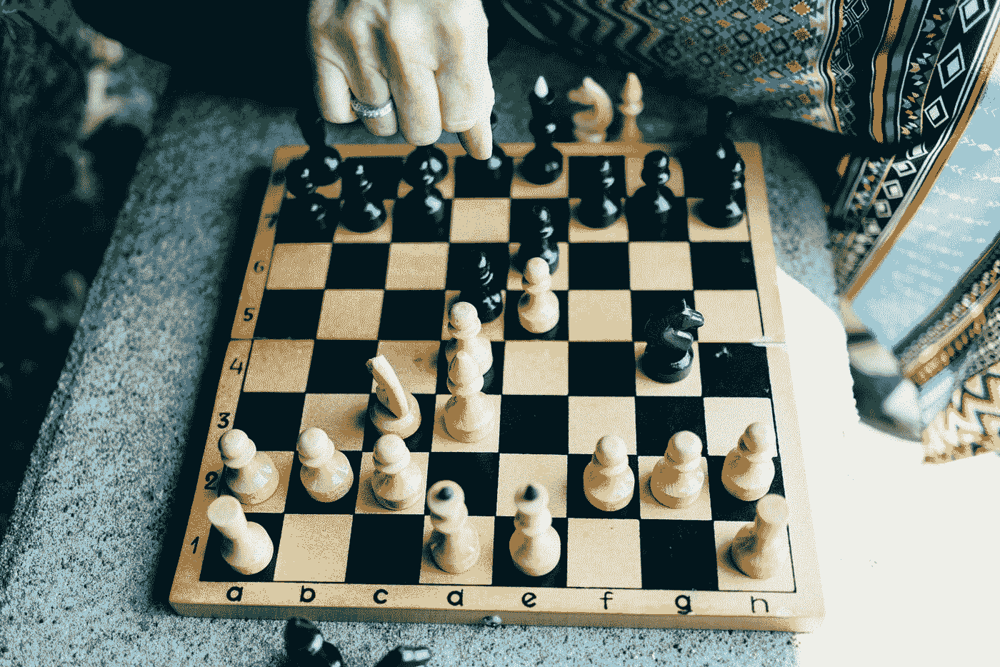

# 每次都有两个赢得胜利的策略

> 原文：<https://medium.com/swlh/2-strategies-to-win-the-day-every-single-time-1cf20aa37ddf>

Photo by [Chase Clark](https://unsplash.com/@chaseelliottclark?utm_source=medium&utm_medium=referral) on [Unsplash](https://unsplash.com?utm_source=medium&utm_medium=referral)

## 策略 1——你需要多样化和扩展你的活动，让自己有机会赢。

以下是我在热情的人身上看到的一些事情。无论他们正在做什么，正在写的书，正在建立的创业公司，正在投资的事业——他们都将其中的起起落落与自己的快乐和成就感联系在一起。

当然，这几乎总是会发生；这毕竟是你的激情所在。但事实是。如果这是你唯一拥有的东西，你会让自己难以置信地容易受到冒险中不可避免的低谷的伤害。

如果这是你唯一拥有的东西，那么在好的时候你会像风筝一样高，在不好的时候你会像泰坦尼克号一样低。这不仅会对你的心理健康造成极大的压力，而且对于你的项目的整个生命周期来说，这也是一个糟糕的策略。

*那么有什么解决办法呢？*

你今天找了 6 个投资者，他们都说不。你的生意是你唯一在做的事情。今天过得不太好是因为你的生意不太好。你感觉很糟。

这个人今天也投了 6 个投资者，不幸的是，投资者也说没有。这个人那天也去了健身房，增加了深蹲。然后他们第一次做了新的食谱，没有搞砸。这个人赢了。

关键是不要把你的自我价值完全束缚在你的工作上。拥有其他的东西，小东西，对于外行人来说几乎可以忽略不计——将是你赢得一天的方法。

很容易陷入“主要的事情”中，但是你可以同时追求的宠物项目、健身目标和学习目标将是你低谷时期的生命线。

*与一些利益相关者的会议不欢而散？加倍努力跑步，打破你的最好成绩。赢得胜利。*

*画了 6 个小时的创意空白？延长你每天的冥想时间，增加几章额外的阅读。赢得胜利。*

今天无法解决的问题可以留到明天，你不必感到内疚或精神疲劳。

## 策略 2——你需要为每天定义一个单一的实质性目标

[以下是我之前一篇热门文章的摘录:](/swlh/8-tiny-things-you-can-do-to-immediately-improve-your-life-in-less-than-3-minutes-81baa9f59276)

*每晚睡觉前，写下 1 个第二天非常可操作但很实质的目标。如果其他的都失败了，你仍然需要实现那个目标。无论是下班后去跑步，在你的博客上多写 3 段，还是完成你一直在做的项目的一部分。*

养成这个习惯是让我赢得胜利的唯一最好的事情。一切都可能出错。只要我能完成我前一天晚上设定的任务，我就赢了。

设定这样的目标需要注意的重要一点是，要保持简单、可行、可实现、充实但相对较小。如果你在过去的三个月里一直在尝试这样做，不要设定像“获得资金”这样的目标…这是关于在你的待办事项清单上获得几个最重要的任务，并对它们进行优先排序。

掌握这两个策略，你将永远赢得胜利。生活中有其他事情会让你有机会把自己从工作中分离出来。定义工作的优先顺序会让你更有效地完成任务。

如果你喜欢这篇文章或觉得它有用，我真的很欣赏这个可爱的数字拍手，它似乎是作者在这里的可卡因等价物。

这是另一篇我想你会喜欢的文章——这是你可以在不到 3 分钟的时间里做的 8 件小事

我也看了你可能感兴趣的时事通讯。我每隔几个周末就发一封小小的电子邮件(如果有的话),里面有一些我发现/制作的有用或很酷的东西。别担心，我和你一样讨厌垃圾邮件。随意订阅:)

出来吧。

## 这个故事发表在[的创业](https://medium.com/swlh)上，这是 Medium 最大的创业刊物，有 320，131+人关注。

## 订阅接收[我们的头条新闻](http://growthsupply.com/the-startup-newsletter/)。

