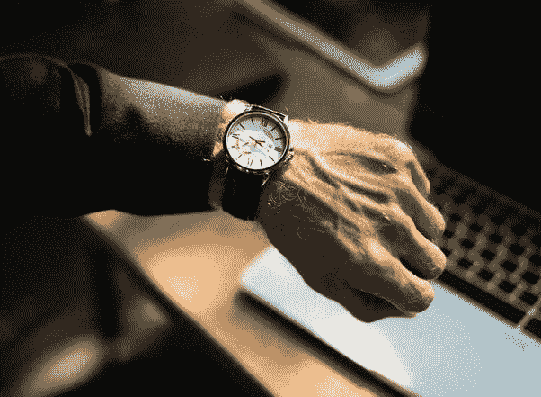

# 开始“赢回”时间的两种方法

> 原文：<https://medium.com/swlh/2-ways-to-start-winning-back-your-time-b6d856f1c48d>

## 争夺你注意力的战斗从你早上醒来的那一刻开始，直到你再次入睡。

> 赢回你的时间，赢回你的生活。

# 有两种方法可以降低你的时间效率:

## **提前一小时醒来**

通过早起一个小时，你每年可以节省大约 336 个小时来完成任何目标或项目。利用这段时间制定一个计划，告诉你如何改善生活的各个方面&利用这段时间努力。

只要比你的正常时间表提前 1 小时，你就有足够的时间来完成你的目标。这个简单的习惯可以让你的工作效率提高 10 倍。

这不会对你的睡眠造成太大影响，确保你仍然有 6-8 小时的睡眠时间。你也可以提前一个小时睡觉，这样你就可以补偿早上的时间。

许多成功人士已经养成了某种晨间惯例来启动他们一天的工作效率。通过养成这个习惯，你增加了在更短时间内实现目标的机会。

## **划出“生产力”时间:**

对每个人来说，提前一个小时起床并不容易，但这并不意味着你不能留出 1-2 个小时来实现你的目标。

你必须把这段时间留给自己，以确保你 100%专注于你的项目或目标。每 30 分钟休息 5 分钟，让你的大脑有机会处理你已经完成的事情，并寻找需要改进的地方。

告诉所有试图在这段“封锁”时间联系你的人，只有在紧急情况下或绝对必要时才这么做。通过给人们提这个醒，你可以帮助减少你的分心。

## 结论

你的时间是你拥有的最有价值的资产。浪费的每一天都是一去不复返的一天。充分利用你的*时间* &把它花在能给你的生活带来最大价值的事情上。

当你在做你的项目或目标时，留意什么是最分散注意力的。记住，留出时间投资自己，你会自信地培养出你想要的结果。

## 感谢您的阅读！请在下面留下你的想法！

## 这篇文章发表在 [The Startup](https://medium.com/swlh) 上，这是媒体最大的创业刊物，拥有 295，232+人关注。

## 在这里订阅接收[我们的头条新闻](http://growthsupply.com/the-startup-newsletter/)。

