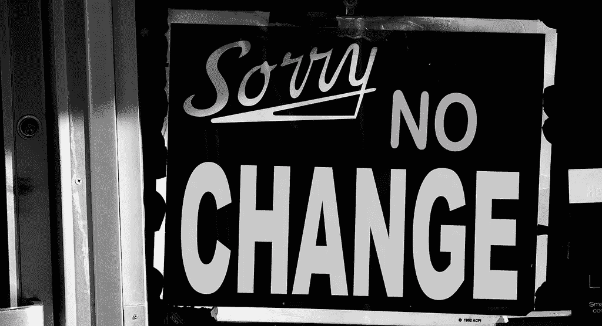

# 20 个不改变的理由

> 原文：<https://medium.com/swlh/20-reasons-not-to-change-737a660c0eeb>

在最近一次拜访前客户的工作场所时，我注意到一张海报，标题是“我不会改变！”我在别的地方见过，我相信你也见过，或者类似的东西。这一次它让我停顿了一下，也许是因为我们现在开始了新的一年，日历上的里程碑往往会引发“重新开始”效应。我们[停下来，喘口气，反思，](/swlh/hansei-the-art-of-reflection-20c9e8dfa287)然后重新开始。

所以这一次，我开始思考改变，以及在任何层面上的改变，无论是个人的还是职业的，总是很困难的。这是无数书籍和文章的主题，包括这本书。

我已经做了 25 年的零钱生意了。每年我似乎都会收集另一个原因，无论多么微妙，来解释为什么我们和我们的企业经历了如此艰难的变革。

阻力和抵制有许多不同的味道，但我现在已经听得够多了，可以将它们分类，以及它们如何在人们的言行中发挥作用。

所以…

以下是你和/或你的公司不愿改变的二十大原因。

1.**恐惧。我们对未知事物有一种天生的恐惧。“我害怕会发生什么。”**

2.**近视。我们看不到变化符合我们更广泛的自身利益。“这对我们没有帮助。”**

3.**自私自利。除非改变能立即给我们带来回报，否则我们会抵制它。“我有什么好处？”**

4.**体内平衡。**均衡更舒服，变化更难受。“等一切正常了，我会感觉好一些。”

5.**自我。那些有权力的人必须承认他们错了。"我觉得我已经为我们的未来做好了准备。"**

6.**梦游。太多人过着未经审视的生活。“我就是不明白。”**

7.**缺乏自信。变化威胁着我们的自我价值。“这将揭示真实的我。”**

8.**计时。必须满足某些先决条件，变革才会发生。“时机成熟我会改的。”**

9.**人性。**我们天生以自我为中心，改变需要一些无私。“别人会比我受益更多。”

10.**惯性。运动中的物体需要相当大的力来改变方向。“我们已经走上了另一条道路。”**

11.**短期思维。人们很难看到和支持长期愿景。“我不认为会发生这种事。”**

12.**变态。人们只察觉到改变目标的反面或负面结果。“那会让事情变得更糟。”**

13.**自满。我们喜欢阻力最小的道路，我们不是天生的最大化者或优化者。"我对现状感到满意。"**

14.**没有选区。维持现状的力量基础大于试图带来改变的力量基础。“我们身后没有临界质量。”**

15.**群体思维。**社会从众限制了我们的思维。“小组想做什么？”

16.**卖空。**感觉缺乏知识、技能、工具和经验。“我们从来没有这样做过；我们不知道该怎么做。”

17.例外论。人们无法客观地看待形势。“这在其他地方可能行得通，但我们不同。”

18.**徒劳无功。改变被认为是肤浅的，不值得努力。“为什么要经历这么多痛苦来换取这么少的收获？”**

19.**冷嘲热讽。**人们不信任变革的意图、动机或跟踪记录。“又来了。”

20.**未来冲击。大规模的变化让人们蹲下身子，感觉自己可能无法适应。“我嗅到了灾难。”**

在某些方面，你或你的公司有没有成为其中一个或多个的牺牲品？我知道我有。这是一个好消息，因为简单地认识到自我审查或自我挫败的反应就像上面那些是一个伟大的第一步。

如果你和我一样，把一月看作是一个重新评估、重新启动和重新思考你自己和你的公司的目标和方向的机会，你可能要留意什么时候(因为他们会！)伪装成这二十个理由中的一个或多个理由的抵制和推诿表现出来了。

当这种情况发生时，消灭这种想法。(注:[下面是如何](/swlh/how-to-avoid-abandoning-new-years-resolutions-fc9a997674a2)。)

## 这个故事发表在 [The Startup](https://medium.com/swlh) 上，这是 Medium 最大的企业家出版物，拥有 287，184+人。

## 在这里订阅接收[我们的头条新闻](http://growthsupply.com/the-startup-newsletter/)。

