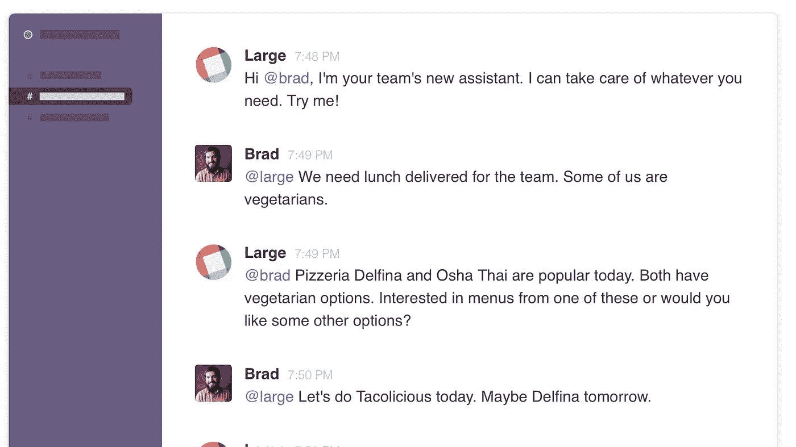
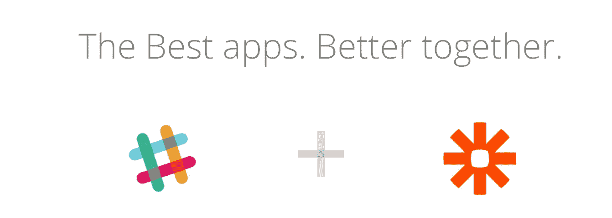
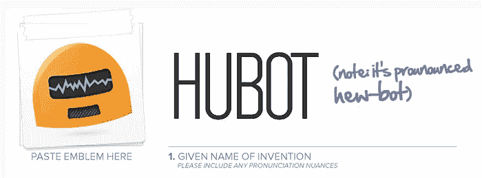
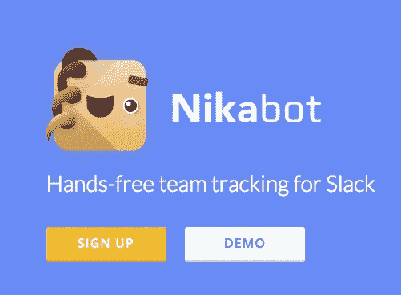

# 将改变你生活的 20 个松散集成和机器人

> 原文：<https://medium.com/swlh/20-slack-integrations-and-bots-that-will-change-your-life-61b5f2a3c9f4>

> 由团队在[大](http://hirelarge.com)

> 此外，请查看我们的最新帖子:

# [提高团队注意力和工作效率的六种方法](/@HireLarge/six-ways-to-increase-your-team-s-focus-and-productivity-today-c9aa1571122c)

## **支持**

[**chat lio**](https://chatlio.com/)**:**在空闲时直接处理实时客户支持。

[**Zendesk**](https://hipsterstartup.slack.com/services/new/zendesk)**:**当帮助单被创建、更新为“打开”或“待定”、已解决和已关闭时，接收松弛通知。

[**办公桌**](https://support.desk.com/customer/portal/articles/1792871-integrate-Slack-with-desk-com) **:** 如果用 desk.com 做支撑，这就是一个超级强大的整合。

## 按需

[**大号**](http://hirelarge.com) **:** 通过 Slack 中的一条消息为您的团队或办公室获取任何东西。免费聊天，按需，快速，简单。

## 沟通

[**Screen hero**](https://slack.com/screenhero)**:**团队协作的屏幕共享。使用 quick /username 命令启动屏幕共享。

[**Google Hangouts**](https://hipsterstartup.slack.com/services/new/hangouts):快速推出一个团队中任何人都可以加入的 Hangouts。

[**原子套件**](https://atomickit.com/) **:** 在预定的电子邮件摘要中汇总并发送的时差消息

## 一般

[**Zapier**](https://zapier.com/zapbook/slack/)**:**和 IFTTT 一样，za pier 是连接 app 和自动化任务最简单的方式。Slack Zaps 的清单是巨大而全面的。

[**Hubot**](https://hubot.github.com/)**:**Hubot 是 GitHub 制作的著名的可定制 bot。它可以做很多很棒的事情。

[**IFTTT**](https://ifttt.com/slack) :如果这样的话，那就让互联网为你工作，从一个应用程序到下一个应用程序，它们有大量令人敬畏的松弛食谱。

## 发展

[**Jenkins**](https://wiki.jenkins-ci.org/display/JENKINS/Slack+Plugin) :将 Jenkins 与 Slack 集成在一起，以保持您的测试状态。

[**pager bot**](https://github.com/stripe-contrib/pagerbot)**:**在您的空闲渠道内管理寻呼机值班待命时间表。

[**运行范围**](https://www.runscope.com/docs/api-testing/slack) : API 监控

[**Datadog**](http://docs.datadoghq.com/integrations/slack/) :跟踪您的动态基础设施的监控。

## 生产力

任务机器人(Taskbot):任务机器人(task bot)有助于组织你的任务，在你的松散团队中有一个简单的基于文本的任务管理界面。

[**奥斯卡**](http://oskar.hanno.co/) **:** 一个团队幸福追踪器。

[**米肯**](https://meekan.com/slack/) :一个调度机器人。

[**Asana**](https://hipsterstartup.slack.com/services/new/asana) :当任务被创建、完成或评论时，在 Slack 中接收更新。还可以使用斜杠命令 **/asana** 来列出任务、创建任务(并将其分配给某人)、完成任务、评论任务。

[**Nikabot**](http://www.nikabot.com/) :免提团队跟踪空闲时间

[**Wunderlist**](https://www.wunderlist.com/blog/a-more-productive-way-to-chat-with-wunderlist-and-slack/)**:**Wunderlist 是一个强大的团队追踪 app，这是他们令人敬畏的 Slack 集成。

## 营销

[**对讲机**](http://docs.intercom.io/Integrations/Slack-integration) **:** 如果使用对讲机，这个 Slack 集成是必须的。

[**launch kit**](https://launchkit.io/reviews)**:**App 评论发送至 Slack

## 销售

[**让它下雨**](https://github.com/fitztrev/make-it-rain) :每次通过 Stripe 领工资，随机获得一张“让它下雨”gif。

## 食物

[**eat . ai**](http://www.eat.ai)**:**为您的团队轻松送餐

*大号是通过 Slack 中的一条消息为您的团队或办公室获取任何东西的最简单方式。免费聊天，按需，快速，简单。*

> [**免费试大**](http://hirelarge.com)

> 如果你喜欢 Slack 的这个令人敬畏的机器人和集成列表，你会登录到 Medium 并点击“推荐”按钮，让你的朋友看到它吗？

## 😎

*发表于* **创业、旅游癖和生活黑客**

-