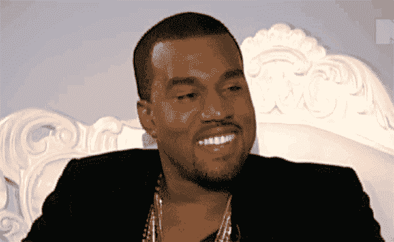
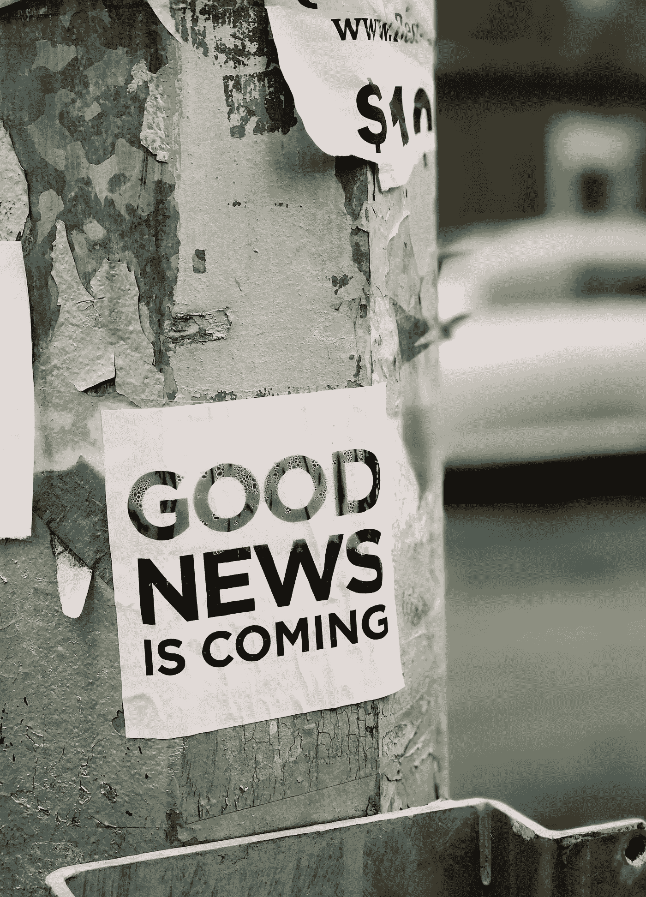

# 生活中不重要的 20 件事。

> 原文：<https://medium.com/swlh/20-things-that-dont-matter-in-life-499d83be034a>

## (以及为什么拒绝它们会有助于加速你的人生目标。)

[http://bit.ly/2Hv3iWQ](http://bit.ly/2Hv3iWQ)

有时候，我发现很难选择一个特定话题的立场并坚持下去。

似乎当我们听到一位权威人士说一些有价值的东西，或者阅读一套给定原则的综合观点时，我们经常在几个小时内就接触到相反的东西。

信息的即时传播彻底改变了人类集体——这是毫无疑问的。**一般来说，随着积极的进步，随之而来的往往是消极的抑制。**

见鬼，我感觉自己就像一个受害者，被拉向各种各样的方向，解释“正确”的做事方式。

我需要承认…我不是圣人，我不是救世主，我甚至不知道所有的答案。**然而，作为一个在我短暂的一生中不得不在泥泞中艰难跋涉的人，我犯了很多错误，这些错误帮助我成长为今天的我(以及我仍在努力成为的那个人)。**

我相信有些事情是一个好的人应该在生活中采纳的:

*   他们应该有一套指导他们生活的价值观。
*   他们应该总是向前看，并试图以这样或那样的方式改善自己。
*   他们应该意识到他们的身体健康，以及这会如何影响他们的心理健康。
*   他们应该意识到自己在世界上的地位。
*   他们应该勤劳，为这个世界奉献也许曾经不存在的礼物。

生活中还有一些无关紧要的事情…

我倾向于认为这些事情在我们作为个体的生活中更加明显。

这些东西:想法、欲望、仪式和行为往往会给我们的生活蒙上一层面纱，欺骗我们认为实现它们会让我们更好、更快、更强、更快乐、更充实。我完全相信他们不会。

## 事实上，我相信它们只会让你处于平庸的状态，或者让你远离你内心深处真正了解的那个人，那个你可以成为并且有能力成为的人。

# 1.Yeezy 的最新款。

[https://bit.ly/2LlfcEE](https://bit.ly/2LlfcEE)

或者任何其他时髦的高价时装。

它被创造出来是为了让你感到自己的不足和低人一等。

# 2.八卦。

> 少管闲事。

说闲话的人这样做是因为他们在寻找填补自己生活中的空白。可笑的是，再多的流言蜚语也无法填补这一空白。

# 3.帮助你减掉 X 磅的新潮新饮食。

一切都要适度。

大多数饮食都是以消除某些食物组为框架的。

没有什么是应该完全消除的。适当的饮食是良好的睡眠，适度的消费和定期锻炼。

# 4.你会死。

生命中唯一的保证就是死亡。

无论你相信生命的重复，来世，虚无等等，你都会死。

T2:重要的是，在你生命终结之前，你如何利用你所拥有的时间。

# 5.谁是总统(在当前美国气候下)。

你人生的成功不会取决于谁是总统。

世界将继续转动。你可以决定自己人生的成功，你应该意识到并履行这一责任。

没有*半神*会进入政治舞台，清洗你的悲哀。那是你的责任。

# 6.学士学位。

我们生活在一个自我教育为王的当今世界。

只要有适当的时间和纪律，你可以自学任何东西。如果你的职业道路是成为一名律师或宇航员或医生或某种专业人士，你肯定需要学位。

然而，对我们大多数人来说，建立你自己的技能，并与世界分享。

# 7.你在社交媒体上的表现。

你有 5 万粉丝。

太好了。

然而，你提供了什么价值？社交媒体不是凭空产生的。有很多工具可以帮助产生追随者。然而，这些观众的财富是什么呢？你向他们提供了什么，他们又向你提供了什么？

# 8.观点。

有观点才有真相。

一个很容易宣称，另一个有时难以置信的困难。

> 观点就像风中的树叶，真理就像支撑大树的树根。

Photo by [Jon Tyson](https://unsplash.com/photos/XmMsdtiGSfo?utm_source=unsplash&utm_medium=referral&utm_content=creditCopyText) on [Unsplash](https://unsplash.com/search/photos/news?utm_source=unsplash&utm_medium=referral&utm_content=creditCopyText)

# 9.24 小时新闻报道。

除非你的国家遭到袭击，你附近发生自然灾害，或者任何客观上改变你生活的事情，否则新闻是无用的。

他们被制造成灌输恐惧和不足的机器。

大多数当前正在发生的事件对你的日常生活和逐渐的成功几乎没有影响。关掉电视。

# 10.身体的热量输入。

不要误解我，卡路里很重要——它们是我们的燃料来源。

不重要的是热量输入本身。100 卡路里的杏仁等于 100 卡路里的可口可乐吗？

> 我认为不是。

再说一次，它是关于输入到你身体的*丰富度*的，这导致了燃料的来源。

# 11.你有多受欢迎。

生命将是你做过的最长的事情。

你会有兴奋的时候，也会有低落的时候。会有你受到同龄人青睐的时候，也会有你失宠的时候。

> 自尊来自内心，而不是别人对你的看法。

# 12.社会对你职业的看法。

你怎么做就怎么做。

你从事的职业或工作让你感到快乐吗？

如果是这样，恭喜你。你是服务员不是律师没关系。

只要你享受为他人服务的难忘用餐体验，并尽你所能完成任务，谁会在乎呢？

# 13.你的浪漫伴侣的社会经济地位。

年轻爱情的美妙之处在于你们可以一起创造一些东西。

我永远不会忘记我父亲告诉我的关于我母亲的事，

> “儿子，我和你妈妈结婚时，她没有很多钱。但如果她不帮我赚钱，我会被诅咒的。我们一起做到了。”

这也是真的，我的母亲是一个了不起的人，她从 12 岁开始就帮助抚养她的两个兄弟。她自己的母亲偷了她的东西。她帮助我父亲成为了现在这样的人。

# 14.你知道多少。

你可以通过有记录的人类历史了解一切。

除非你与世界分享，否则它对你没有任何好处。

还是那句话，人不是凭空产生的。谦逊和建立关系是人生进步的最佳催化剂。

# 15.仅仅跟随美元符号。

如果你试图建立你的银行账户，只是为了建立你的银行账户，你将永远不会到达终点。

## 数字是无限的。

这是徒劳的追求。

影响人们并为他们提供价值。

当你提供价值时，他们会回报以报酬。追求为人们的生活增加价值。

# 16.思索着过去。

Photo by [Nik Shuliahin](https://unsplash.com/photos/BuNWp1bL0nc?utm_source=unsplash&utm_medium=referral&utm_content=creditCopyText) on [Unsplash](https://unsplash.com/search/photos/crazy?utm_source=unsplash&utm_medium=referral&utm_content=creditCopyText)

你过去的决定造就了今天的你。

如果它们是有利的，用这些过去的决定作为燃料，让你更进一步。

如果它们是不利的，把它们作为改变你人生道路的教训。把它们留在原地:过去，然后继续前进。

# 17.你的老二有多大。

> 这真的是海洋的运动。

从男人的角度来说，取悦女人有很多方法。

这才是伟大的性体验，确保你们两个都得到“你的”如果你有困难，尝试不同的方法——除了纯粹的性交——来达到高潮。

# 18.你有多少朋友。

你有 1 个朋友还是 100 个朋友真的不重要。

> 那些友谊的*丰富性*是什么？
> 
> 你们一起经历过哪些奋斗？
> 
> 什么胜利？
> 
> 你们彼此分享过生活中哪些神圣的部分？

那些是真正友谊的标志。

# 19.你早上醒来的时候。

许多“自助大师”一直在宣扬，

> “你需要在早上 5 点醒来才能成功！”

坦白地说，我觉得那是废话。

你如何利用你的时间？你花了 3 个小时去完成一个应该花 1 个小时的项目吗？当你应该写书的时候，你会看《橙色是新的黑色》吗？

花时间的深度比你什么时候醒来更重要。

# 20.你选择相信什么。

地球上有 70 亿人。

有 70 亿个视角。

相信你想要的(尽管我建议完全放弃科学方法是非常不明智的，并且有一个固有的*善*和*恶*)。

只要你的信仰不伤害或侵犯他人的信仰和权利，那就努力吧。这就是生活。

# 准备好接受刺激了吗？

我提供给你一个经过测试和验证的 6 部分指南，它包含了强大的概念，可以帮助你识别、规划、成长和完成你的创造性追求。

## [> > >在这里获得免费指南< < <](https://www.tribeloyal.com/free-6-step-course)

## 学到了什么？按住👏说“谢谢！”并帮助他人找到这篇文章。

## 还评论！

## 这个故事发表在[的创业](https://medium.com/swlh)上，这是 Medium 最大的创业刊物，有 327，829+人关注。

## 订阅接收[我们的头条新闻](http://growthsupply.com/the-startup-newsletter/)。

