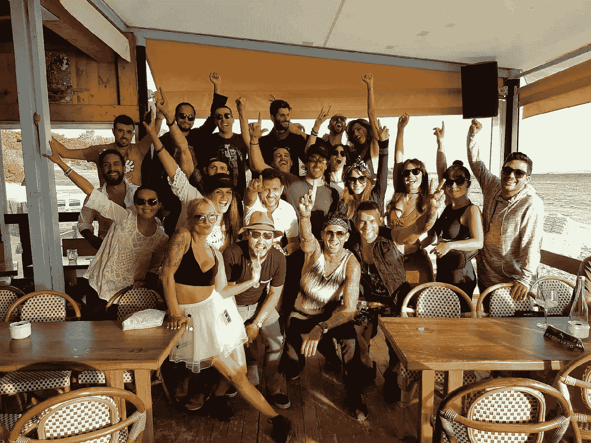

# 20 个简单易行的方法，让你每天都有好的表现

> 原文：<https://medium.com/swlh/20-top-and-simple-practices-to-reach-your-daily-high-performance-ea81c5cdb300>

## 如何充分利用你的一天，优化你的生活和工作

实现你每天的高绩效应该是你的困扰，或者可能是我的困扰，我想说服你让它也成为你的困扰，让我感觉更好。尽管如此，在现代社会中，一个人所能追求的最好和最完整的状态就是在智力、身体、情感和精神方面达到最大的成就。

# 日常高性能

这里有 20 个你可以每天进行的简单练习，它们肯定会对你的日常高效表现产生实质性的影响:

1.  回避任何无聊的观点。更好的是，避免任何意见。
2.  除非有人要求，否则不要建议。
3.  除非你要求，否则不要提出建议。
4.  远离电视，新闻，报纸，博客，社会，潮流，时尚，任何有趣的，重复的，没有灵魂的信息来源。
5.  每天指导自己学习艺术，看到事物的本来面目，而不是你想看到的样子。
6.  每天花三分钟接受你不喜欢自己的地方。
7.  另外三分钟接受痛苦、沮丧或苦恼的经历。这个想法是叫他们的名字。
8.  少说话，在生活中嵌入更多的沉默。如果你不能改善沉默，就不要说话。多听，所以你会学到更多。
9.  学会问对自己和他人有益的问题。避免轻松闲聊，避免客套。
10.  让 15 个和你一样的人围绕在你身边，并在他们周围建立你的影响圈。
11.  找一些你认为比你高级得多的人一起工作、练习、训练或学习。寻找擅长自己专业的人，形成合作。
12.  用心做决定，而不是用头脑。
13.  在一天开始和结束的时候，为你奉献一段神圣的时光。任何人任何事都不应该打断那个时间。这段时间可以单独分享，也可以和伴侣或家人一起分享。其余的应该排除。
14.  永远不要跟随任何破坏性的批评。不要根据人们做了什么或他们是什么来判断他们。毫无疑问，认为他们是他们自己，或者做他们所做的事情是为了一个很好的理由。这种脱节是因为你不知道原因。
15.  每天花 15-30 分钟写下你最想写的东西。你需要从你的头脑中得到的，既不是好的也不是坏的，只是让它出来。不带偏见。
16.  找到并面对一天中的小小恐惧。
17.  有胃口的时候才吃。吃你身体喜欢的食物。
18.  找出四件你觉得幸运的事情，大声对自己说出来。
19.  每天和一个人联系。
20.  反复思考:什么会让你生气，什么可能不起作用，你不喜欢别人的什么。然后计划可能发生的事情。

# 几乎任何人的日常高性能

如果你觉得高绩效引起了你的共鸣，你必须实现它。如果你认为你愿意走必要的路去达到它，那么你会超越。迟早的事。这种生活和工作哲学不仅仅是少数运动员、艺术家或伟大人物的专利。这就是 [**为什么**](http://standout.es/en/) 我们创建了 [**脱颖而出计划**](http://standout.es/en/) ，让几乎任何有能力向前迈出这一步的人都可以参加。

每日性能最高的是发电机发动机。

【*本文首发于*[***【isragarcia.com】***](https://isragarcia.com/daily-high-performance-practices)

# *只有当你觉得值得的时候，才让这个故事震撼吧！如果你发现任何有价值的东西，请鼓掌。*

> *Isra Garcia = 53 个客户，48 家企业，398 次演讲，3.454 篇帖子，24 个项目，6 本书，380 场讲座，6 家公司，16 次冒险，25 次实验，∞失败。到目前为止…*
> 
> *[营销人员](https://isragarcia.com/wp/marketer)。顾问。扬声器。作家。教育家。经理。IG 的负责人。博主。企业家。颠覆性创新。数字化转型。高绩效者和生活方式实验者。*

# *行动号召>>点击[此处](http://feeds.feedburner.com/isragarcia)订阅更多类似的文章！*

**

## *这个故事发表在 [The Startup](https://medium.com/swlh) 上，这是 Medium 最大的企业家出版物，拥有 314，785+人。*

## *在这里订阅接收[我们的头条新闻](http://growthsupply.com/the-startup-newsletter/)。*

**